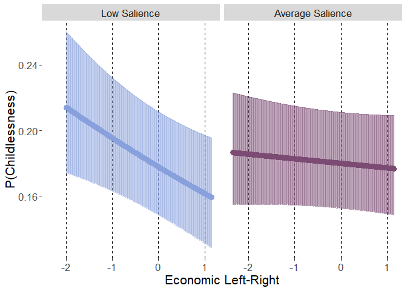

Preregistration available From: https://osf.io/er4v5?view_only=edf4718aa62947dc9277c4a4749e4628


Exploratory research questions

ERQ1. If childlessness is associated with the economic left-right position of the party for which one has voted, are those associations stronger if this dimension is salient in the party’s public stance (i.e., is there a boundary condition to these associations, such that the ideology needs to be salient in order for the association to exist)?


# Preparations

## Packages


```r
library(lme4)
```

```
## Loading required package: Matrix
```

```r
library(emmeans)
library(rio)
```

```
## The following rio suggested packages are not installed: 'arrow', 'feather', 'fst', 'hexView', 'pzfx', 'readODS', 'rmatio'
## Use 'install_formats()' to install them
```

```
## 
## Attaching package: 'rio'
```

```
## The following object is masked from 'package:lme4':
## 
##     factorize
```

```r
library(dplyr)
```

```
## 
## Attaching package: 'dplyr'
```

```
## The following objects are masked from 'package:stats':
## 
##     filter, lag
```

```
## The following objects are masked from 'package:base':
## 
##     intersect, setdiff, setequal, union
```

```r
library(vjihelpers)
library(ggplot2)
library(MetBrewer)
library(tibble)
library(Hmisc)
```

```
## Loading required package: lattice
```

```
## Loading required package: survival
```

```
## Loading required package: Formula
```

```
## 
## Attaching package: 'Hmisc'
```

```
## The following objects are masked from 'package:dplyr':
## 
##     src, summarize
```

```
## The following objects are masked from 'package:base':
## 
##     format.pval, units
```

## Custom functions


```r
source("../custom_functions.R")
```

## Data


```r
fdat<-import("../../data/processed/fdat.xlsx")
```

## Data exclusions


```r
exdat<-fdat %>%
  dplyr::select(childlessness,
                gndr.f,agea,minority,
                gndr.c,age10.c,minority.c,
                lrecon.z,
                lrecon_salience.z,
                cntry,
                anweight) %>%
  na.omit()
```

## Variable centering


```r
exdat<-
  group_mean_center(
    data=exdat,group.var="cntry",
    vars=c("lrecon.z",
           "lrecon_salience.z"),
    grand.init = F)
```

# ERQ1 Analysis 

### Fixed


```r
mod2.lrecon<-
  glmer(childlessness~gndr.c+age10.c+minority.c+
          lrecon.z.gmc+
          (1|cntry),
        data=exdat,
        family=binomial(link="logit"),
        weights = anweight,
        control = glmerControl(optimizer="bobyqa",
                               optCtrl=list(maxfun=2e6)))
```

```
## Warning in eval(family$initialize, rho): non-integer #successes in a binomial glm!
```

```r
summary(mod2.lrecon)
```

```
## Generalized linear mixed model fit by maximum likelihood (Laplace  Approximation)
##  [glmerMod]
##  Family: binomial  ( logit )
## Formula: childlessness ~ gndr.c + age10.c + minority.c + lrecon.z.gmc +  
##     (1 | cntry)
##    Data: exdat
## Weights: anweight
## Control: glmerControl(optimizer = "bobyqa", optCtrl = list(maxfun = 2e+06))
## 
##      AIC      BIC   logLik deviance df.resid 
##  15074.0  15121.8  -7531.0  15062.0    21368 
## 
## Scaled residuals: 
##     Min      1Q  Median      3Q     Max 
## -3.7080 -0.4382 -0.2246  0.2410 12.9028 
## 
## Random effects:
##  Groups Name        Variance Std.Dev.
##  cntry  (Intercept) 0.1158   0.3403  
## Number of obs: 21374, groups:  cntry, 20
## 
## Fixed effects:
##              Estimate Std. Error z value Pr(>|z|)    
## (Intercept)  -1.28880    0.10001 -12.886  < 2e-16 ***
## gndr.c       -0.30994    0.04046  -7.661 1.85e-14 ***
## age10.c      -0.55466    0.01346 -41.200  < 2e-16 ***
## minority.c   -0.28506    0.10419  -2.736  0.00622 ** 
## lrecon.z.gmc -0.01473    0.02332  -0.632  0.52743    
## ---
## Signif. codes:  0 '***' 0.001 '**' 0.01 '*' 0.05 '.' 0.1 ' ' 1
## 
## Correlation of Fixed Effects:
##             (Intr) gndr.c ag10.c mnrty.
## gndr.c       0.016                     
## age10.c      0.105  0.009              
## minority.c   0.490  0.003  0.090       
## lrecn.z.gmc  0.039  0.020 -0.025  0.077
```

```r
getFE_glmer(mod2.lrecon)
```

```
##               Est.   SE      z     p    LL    UL
## (Intercept)  -1.29 0.10 -12.89 0.000 -1.48 -1.09
## gndr.c       -0.31 0.04  -7.66 0.000 -0.39 -0.23
## age10.c      -0.55 0.01 -41.20 0.000 -0.58 -0.53
## minority.c   -0.29 0.10  -2.74 0.006 -0.49 -0.08
## lrecon.z.gmc -0.01 0.02  -0.63 0.527 -0.06  0.03
```

```r
getVC(mod2.lrecon)
```

```
##     grp        var1 var2 sdcor vcov
## 1 cntry (Intercept) <NA>  0.34 0.12
```

### Random


```r
mod3.lrecon<-
  glmer(childlessness~gndr.c+age10.c+minority.c+
          lrecon.z.gmc+
          (lrecon.z.gmc|cntry),
        data=exdat,
        family=binomial(link="logit"),weights = anweight,
        control = glmerControl(optimizer="bobyqa",
                               optCtrl=list(maxfun=2e6)))
```

```
## Warning in eval(family$initialize, rho): non-integer #successes in a binomial glm!
```

```
## boundary (singular) fit: see help('isSingular')
```

```r
summary(mod3.lrecon)
```

```
## Generalized linear mixed model fit by maximum likelihood (Laplace  Approximation)
##  [glmerMod]
##  Family: binomial  ( logit )
## Formula: childlessness ~ gndr.c + age10.c + minority.c + lrecon.z.gmc +  
##     (lrecon.z.gmc | cntry)
##    Data: exdat
## Weights: anweight
## Control: glmerControl(optimizer = "bobyqa", optCtrl = list(maxfun = 2e+06))
## 
##      AIC      BIC   logLik deviance df.resid 
##  15074.4  15138.2  -7529.2  15058.4    21366 
## 
## Scaled residuals: 
##     Min      1Q  Median      3Q     Max 
## -3.7112 -0.4395 -0.2254  0.2382 13.3925 
## 
## Random effects:
##  Groups Name         Variance Std.Dev. Corr 
##  cntry  (Intercept)  0.113285 0.33658       
##         lrecon.z.gmc 0.001825 0.04272  -1.00
## Number of obs: 21374, groups:  cntry, 20
## 
## Fixed effects:
##               Estimate Std. Error z value Pr(>|z|)    
## (Intercept)  -1.283323   0.099331 -12.920  < 2e-16 ***
## gndr.c       -0.308098   0.040478  -7.612 2.71e-14 ***
## age10.c      -0.553815   0.013465 -41.131  < 2e-16 ***
## minority.c   -0.284343   0.104371  -2.724  0.00644 ** 
## lrecon.z.gmc -0.006025   0.025959  -0.232  0.81646    
## ---
## Signif. codes:  0 '***' 0.001 '**' 0.01 '*' 0.05 '.' 0.1 ' ' 1
## 
## Correlation of Fixed Effects:
##             (Intr) gndr.c ag10.c mnrty.
## gndr.c       0.016                     
## age10.c      0.106  0.010              
## minority.c   0.495  0.003  0.090       
## lrecn.z.gmc -0.304  0.022 -0.021  0.065
## optimizer (bobyqa) convergence code: 0 (OK)
## boundary (singular) fit: see help('isSingular')
```

```r
getFE_glmer(mod3.lrecon)
```

```
##               Est.   SE      z     p    LL    UL
## (Intercept)  -1.28 0.10 -12.92 0.000 -1.48 -1.09
## gndr.c       -0.31 0.04  -7.61 0.000 -0.39 -0.23
## age10.c      -0.55 0.01 -41.13 0.000 -0.58 -0.53
## minority.c   -0.28 0.10  -2.72 0.006 -0.49 -0.08
## lrecon.z.gmc -0.01 0.03  -0.23 0.816 -0.06  0.04
```

```r
getVC(mod3.lrecon)
```

```
##     grp         var1         var2 sdcor  vcov
## 1 cntry  (Intercept)         <NA>  0.34  0.11
## 2 cntry lrecon.z.gmc         <NA>  0.04  0.00
## 3 cntry  (Intercept) lrecon.z.gmc -1.00 -0.01
```


### Random without random effect correlation


```r
mod4.lrecon<-
  glmer(childlessness~gndr.c+age10.c+minority.c+
          lrecon.z.gmc+
          (lrecon.z.gmc||cntry),
        data=exdat,
        family=binomial(link="logit"),weights = anweight,
        control = glmerControl(optimizer="bobyqa",
                               optCtrl=list(maxfun=2e6)))
```

```
## Warning in eval(family$initialize, rho): non-integer #successes in a binomial glm!
```

```
## boundary (singular) fit: see help('isSingular')
```

```r
summary(mod4.lrecon)
```

```
## Generalized linear mixed model fit by maximum likelihood (Laplace  Approximation)
##  [glmerMod]
##  Family: binomial  ( logit )
## Formula: childlessness ~ gndr.c + age10.c + minority.c + lrecon.z.gmc +  
##     (lrecon.z.gmc || cntry)
##    Data: exdat
## Weights: anweight
## Control: glmerControl(optimizer = "bobyqa", optCtrl = list(maxfun = 2e+06))
## 
##      AIC      BIC   logLik deviance df.resid 
##  15076.0  15131.8  -7531.0  15062.0    21367 
## 
## Scaled residuals: 
##     Min      1Q  Median      3Q     Max 
## -3.7080 -0.4382 -0.2246  0.2410 12.9028 
## 
## Random effects:
##  Groups  Name         Variance  Std.Dev. 
##  cntry   (Intercept)  1.158e-01 3.403e-01
##  cntry.1 lrecon.z.gmc 1.198e-09 3.461e-05
## Number of obs: 21374, groups:  cntry, 20
## 
## Fixed effects:
##              Estimate Std. Error z value Pr(>|z|)    
## (Intercept)  -1.28880    0.10002 -12.885  < 2e-16 ***
## gndr.c       -0.30994    0.04046  -7.661 1.85e-14 ***
## age10.c      -0.55466    0.01346 -41.200  < 2e-16 ***
## minority.c   -0.28507    0.10420  -2.736  0.00622 ** 
## lrecon.z.gmc -0.01473    0.02332  -0.632  0.52743    
## ---
## Signif. codes:  0 '***' 0.001 '**' 0.01 '*' 0.05 '.' 0.1 ' ' 1
## 
## Correlation of Fixed Effects:
##             (Intr) gndr.c ag10.c mnrty.
## gndr.c       0.016                     
## age10.c      0.105  0.009              
## minority.c   0.490  0.003  0.090       
## lrecn.z.gmc  0.039  0.020 -0.025  0.077
## optimizer (bobyqa) convergence code: 0 (OK)
## boundary (singular) fit: see help('isSingular')
```

```r
getFE_glmer(mod4.lrecon)
```

```
##               Est.   SE      z     p    LL    UL
## (Intercept)  -1.29 0.10 -12.89 0.000 -1.48 -1.09
## gndr.c       -0.31 0.04  -7.66 0.000 -0.39 -0.23
## age10.c      -0.55 0.01 -41.20 0.000 -0.58 -0.53
## minority.c   -0.29 0.10  -2.74 0.006 -0.49 -0.08
## lrecon.z.gmc -0.01 0.02  -0.63 0.527 -0.06  0.03
```

```r
getVC(mod4.lrecon)
```

```
##       grp         var1 var2 sdcor vcov
## 1   cntry  (Intercept) <NA>  0.34 0.12
## 2 cntry.1 lrecon.z.gmc <NA>  0.00 0.00
```

```r
anova(mod2.lrecon,mod4.lrecon)
```

```
## Data: exdat
## Models:
## mod2.lrecon: childlessness ~ gndr.c + age10.c + minority.c + lrecon.z.gmc + (1 | cntry)
## mod4.lrecon: childlessness ~ gndr.c + age10.c + minority.c + lrecon.z.gmc + (lrecon.z.gmc || cntry)
##             npar   AIC   BIC logLik deviance Chisq Df Pr(>Chisq)
## mod2.lrecon    6 15074 15122  -7531    15062                    
## mod4.lrecon    7 15076 15132  -7531    15062     0  1          1
```

```r
anova(mod4.lrecon,mod3.lrecon)
```

```
## Data: exdat
## Models:
## mod4.lrecon: childlessness ~ gndr.c + age10.c + minority.c + lrecon.z.gmc + (lrecon.z.gmc || cntry)
## mod3.lrecon: childlessness ~ gndr.c + age10.c + minority.c + lrecon.z.gmc + (lrecon.z.gmc | cntry)
##             npar   AIC   BIC  logLik deviance  Chisq Df Pr(>Chisq)  
## mod4.lrecon    7 15076 15132 -7531.0    15062                       
## mod3.lrecon    8 15074 15138 -7529.2    15058 3.5463  1    0.05968 .
## ---
## Signif. codes:  0 '***' 0.001 '**' 0.01 '*' 0.05 '.' 0.1 ' ' 1
```


## lrecon salience fixed main effect


```r
mod5.lrecon<-
  glmer(childlessness~gndr.c+age10.c+minority.c+
          lrecon.z.gmc+lrecon_salience.z.gmc+
          (1|cntry),
        data=exdat,
        family=binomial(link="logit"),weights = anweight,
        control = glmerControl(optimizer="bobyqa",
                               optCtrl=list(maxfun=2e6)))
```

```
## Warning in eval(family$initialize, rho): non-integer #successes in a binomial glm!
```

```r
summary(mod5.lrecon)
```

```
## Generalized linear mixed model fit by maximum likelihood (Laplace  Approximation)
##  [glmerMod]
##  Family: binomial  ( logit )
## Formula: childlessness ~ gndr.c + age10.c + minority.c + lrecon.z.gmc +  
##     lrecon_salience.z.gmc + (1 | cntry)
##    Data: exdat
## Weights: anweight
## Control: glmerControl(optimizer = "bobyqa", optCtrl = list(maxfun = 2e+06))
## 
##      AIC      BIC   logLik deviance df.resid 
##  15075.7  15131.5  -7530.8  15061.7    21367 
## 
## Scaled residuals: 
##     Min      1Q  Median      3Q     Max 
## -3.7291 -0.4382 -0.2246  0.2410 12.8622 
## 
## Random effects:
##  Groups Name        Variance Std.Dev.
##  cntry  (Intercept) 0.1159   0.3404  
## Number of obs: 21374, groups:  cntry, 20
## 
## Fixed effects:
##                       Estimate Std. Error z value Pr(>|z|)    
## (Intercept)           -1.28921    0.10004 -12.887  < 2e-16 ***
## gndr.c                -0.31017    0.04046  -7.666 1.78e-14 ***
## age10.c               -0.55518    0.01350 -41.127  < 2e-16 ***
## minority.c            -0.28605    0.10420  -2.745  0.00605 ** 
## lrecon.z.gmc          -0.01847    0.02437  -0.758  0.44852    
## lrecon_salience.z.gmc  0.01774    0.03369   0.527  0.59838    
## ---
## Signif. codes:  0 '***' 0.001 '**' 0.01 '*' 0.05 '.' 0.1 ' ' 1
## 
## Correlation of Fixed Effects:
##             (Intr) gndr.c ag10.c mnrty. lrcn..
## gndr.c       0.016                            
## age10.c      0.106  0.010                     
## minority.c   0.490  0.003  0.092              
## lrecn.z.gmc  0.040  0.022 -0.002  0.079       
## lrcn_slnc.. -0.008 -0.011 -0.074 -0.018 -0.292
```

```r
getFE_glmer(mod5.lrecon)
```

```
##                        Est.   SE      z     p    LL    UL
## (Intercept)           -1.29 0.10 -12.89 0.000 -1.49 -1.09
## gndr.c                -0.31 0.04  -7.67 0.000 -0.39 -0.23
## age10.c               -0.56 0.01 -41.13 0.000 -0.58 -0.53
## minority.c            -0.29 0.10  -2.75 0.006 -0.49 -0.08
## lrecon.z.gmc          -0.02 0.02  -0.76 0.449 -0.07  0.03
## lrecon_salience.z.gmc  0.02 0.03   0.53 0.598 -0.05  0.08
```

```r
getVC(mod5.lrecon)
```

```
##     grp        var1 var2 sdcor vcov
## 1 cntry (Intercept) <NA>  0.34 0.12
```

## lrecon salience random main effect


```r
mod6.lrecon<-
  glmer(childlessness~gndr.c+age10.c+minority.c+
          lrecon.z.gmc+lrecon_salience.z.gmc+
          (lrecon_salience.z.gmc|cntry),
        data=exdat,
        family=binomial(link="logit"),weights = anweight,
        control = glmerControl(optimizer="bobyqa",
                               optCtrl=list(maxfun=2e6)))
```

```
## Warning in eval(family$initialize, rho): non-integer #successes in a binomial glm!
```

```r
summary(mod6.lrecon)
```

```
## Generalized linear mixed model fit by maximum likelihood (Laplace  Approximation)
##  [glmerMod]
##  Family: binomial  ( logit )
## Formula: childlessness ~ gndr.c + age10.c + minority.c + lrecon.z.gmc +  
##     lrecon_salience.z.gmc + (lrecon_salience.z.gmc | cntry)
##    Data: exdat
## Weights: anweight
## Control: glmerControl(optimizer = "bobyqa", optCtrl = list(maxfun = 2e+06))
## 
##      AIC      BIC   logLik deviance df.resid 
##  15078.6  15150.3  -7530.3  15060.6    21365 
## 
## Scaled residuals: 
##     Min      1Q  Median      3Q     Max 
## -3.7935 -0.4396 -0.2243  0.2409 12.8637 
## 
## Random effects:
##  Groups Name                  Variance Std.Dev. Corr
##  cntry  (Intercept)           0.115859 0.34038      
##         lrecon_salience.z.gmc 0.003752 0.06125  0.17
## Number of obs: 21374, groups:  cntry, 20
## 
## Fixed effects:
##                         Estimate Std. Error z value Pr(>|z|)    
## (Intercept)           -1.2896839  0.1001228 -12.881  < 2e-16 ***
## gndr.c                -0.3080910  0.0405104  -7.605 2.84e-14 ***
## age10.c               -0.5560995  0.0135490 -41.044  < 2e-16 ***
## minority.c            -0.2833591  0.1042895  -2.717  0.00659 ** 
## lrecon.z.gmc          -0.0183063  0.0245565  -0.745  0.45598    
## lrecon_salience.z.gmc  0.0009871  0.0424910   0.023  0.98147    
## ---
## Signif. codes:  0 '***' 0.001 '**' 0.01 '*' 0.05 '.' 0.1 ' ' 1
## 
## Correlation of Fixed Effects:
##             (Intr) gndr.c ag10.c mnrty. lrcn..
## gndr.c       0.015                            
## age10.c      0.107  0.007                     
## minority.c   0.491  0.004  0.090              
## lrecn.z.gmc  0.041  0.023 -0.002  0.080       
## lrcn_slnc..  0.043 -0.022 -0.043 -0.023 -0.223
```

```r
getFE_glmer(mod6.lrecon)
```

```
##                        Est.   SE      z     p    LL    UL
## (Intercept)           -1.29 0.10 -12.88 0.000 -1.49 -1.09
## gndr.c                -0.31 0.04  -7.61 0.000 -0.39 -0.23
## age10.c               -0.56 0.01 -41.04 0.000 -0.58 -0.53
## minority.c            -0.28 0.10  -2.72 0.007 -0.49 -0.08
## lrecon.z.gmc          -0.02 0.02  -0.75 0.456 -0.07  0.03
## lrecon_salience.z.gmc  0.00 0.04   0.02 0.981 -0.08  0.08
```

```r
getVC(mod6.lrecon)
```

```
##     grp                  var1                  var2 sdcor vcov
## 1 cntry           (Intercept)                  <NA>  0.34 0.12
## 2 cntry lrecon_salience.z.gmc                  <NA>  0.06 0.00
## 3 cntry           (Intercept) lrecon_salience.z.gmc  0.17 0.00
```


## fixed interaction between lrecon and lrecon salience


```r
mod8.lrecon<-
  glmer(childlessness~gndr.c+age10.c+minority.c+
          lrecon.z.gmc+lrecon_salience.z.gmc+
          lrecon.z.gmc:lrecon_salience.z.gmc+
          (lrecon_salience.z.gmc|cntry),
        data=exdat,
        family=binomial(link="logit"),weights = anweight,
        control = glmerControl(optimizer="bobyqa",
                               optCtrl=list(maxfun=2e6)))
```

```
## Warning in eval(family$initialize, rho): non-integer #successes in a binomial glm!
```

```
## boundary (singular) fit: see help('isSingular')
```

```r
summary(mod8.lrecon)
```

```
## Generalized linear mixed model fit by maximum likelihood (Laplace  Approximation)
##  [glmerMod]
##  Family: binomial  ( logit )
## Formula: childlessness ~ gndr.c + age10.c + minority.c + lrecon.z.gmc +  
##     lrecon_salience.z.gmc + lrecon.z.gmc:lrecon_salience.z.gmc +  
##     (lrecon_salience.z.gmc | cntry)
##    Data: exdat
## Weights: anweight
## Control: glmerControl(optimizer = "bobyqa", optCtrl = list(maxfun = 2e+06))
## 
##      AIC      BIC   logLik deviance df.resid 
##  15073.0  15152.7  -7526.5  15053.0    21364 
## 
## Scaled residuals: 
##     Min      1Q  Median      3Q     Max 
## -3.8057 -0.4394 -0.2241  0.2410 13.0438 
## 
## Random effects:
##  Groups Name                  Variance  Std.Dev. Corr
##  cntry  (Intercept)           0.1160061 0.34060      
##         lrecon_salience.z.gmc 0.0008485 0.02913  1.00
## Number of obs: 21374, groups:  cntry, 20
## 
## Fixed effects:
##                                    Estimate Std. Error z value Pr(>|z|)    
## (Intercept)                        -1.30474    0.10027 -13.012  < 2e-16 ***
## gndr.c                             -0.30634    0.04050  -7.564 3.91e-14 ***
## age10.c                            -0.55375    0.01355 -40.860  < 2e-16 ***
## minority.c                         -0.28337    0.10435  -2.716  0.00661 ** 
## lrecon.z.gmc                       -0.01889    0.02458  -0.769  0.44211    
## lrecon_salience.z.gmc               0.01974    0.03525   0.560  0.57546    
## lrecon.z.gmc:lrecon_salience.z.gmc  0.10223    0.03572   2.862  0.00421 ** 
## ---
## Signif. codes:  0 '***' 0.001 '**' 0.01 '*' 0.05 '.' 0.1 ' ' 1
## 
## Correlation of Fixed Effects:
##             (Intr) gndr.c ag10.c mnrty. lrcn.. lrc_..
## gndr.c       0.013                                   
## age10.c      0.106  0.008                            
## minority.c   0.489  0.003  0.092                     
## lrecn.z.gmc  0.039  0.022 -0.001  0.077              
## lrcn_slnc..  0.167 -0.013 -0.061 -0.013 -0.305       
## lrcn.z.:_.. -0.047  0.025  0.044  0.014 -0.011  0.065
## optimizer (bobyqa) convergence code: 0 (OK)
## boundary (singular) fit: see help('isSingular')
```

```r
getFE_glmer(mod8.lrecon)
```

```
##                                     Est.   SE      z     p    LL    UL
## (Intercept)                        -1.30 0.10 -13.01 0.000 -1.50 -1.11
## gndr.c                             -0.31 0.04  -7.56 0.000 -0.39 -0.23
## age10.c                            -0.55 0.01 -40.86 0.000 -0.58 -0.53
## minority.c                         -0.28 0.10  -2.72 0.007 -0.49 -0.08
## lrecon.z.gmc                       -0.02 0.02  -0.77 0.442 -0.07  0.03
## lrecon_salience.z.gmc               0.02 0.04   0.56 0.575 -0.05  0.09
## lrecon.z.gmc:lrecon_salience.z.gmc  0.10 0.04   2.86 0.004  0.03  0.17
```

```r
getVC(mod8.lrecon)
```

```
##     grp                  var1                  var2 sdcor vcov
## 1 cntry           (Intercept)                  <NA>  0.34 0.12
## 2 cntry lrecon_salience.z.gmc                  <NA>  0.03 0.00
## 3 cntry           (Intercept) lrecon_salience.z.gmc  1.00 0.01
```


## fixed interaction between lrecon and lrecon salience without random effect correlation


```r
mod9.lrecon<-
  glmer(childlessness~gndr.c+age10.c+minority.c+
          lrecon.z.gmc+lrecon_salience.z.gmc+
          lrecon.z.gmc:lrecon_salience.z.gmc+
          (lrecon_salience.z.gmc||cntry),
        data=exdat,
        family=binomial(link="logit"),weights = anweight,
        control = glmerControl(optimizer="bobyqa",
                               optCtrl=list(maxfun=2e6)))
```

```
## Warning in eval(family$initialize, rho): non-integer #successes in a binomial glm!
```

```r
summary(mod9.lrecon)
```

```
## Generalized linear mixed model fit by maximum likelihood (Laplace  Approximation)
##  [glmerMod]
##  Family: binomial  ( logit )
## Formula: childlessness ~ gndr.c + age10.c + minority.c + lrecon.z.gmc +  
##     lrecon_salience.z.gmc + lrecon.z.gmc:lrecon_salience.z.gmc +  
##     (lrecon_salience.z.gmc || cntry)
##    Data: exdat
## Weights: anweight
## Control: glmerControl(optimizer = "bobyqa", optCtrl = list(maxfun = 2e+06))
## 
##      AIC      BIC   logLik deviance df.resid 
##  15071.5  15143.3  -7526.8  15053.5    21365 
## 
## Scaled residuals: 
##     Min      1Q  Median      3Q     Max 
## -3.8199 -0.4402 -0.2241  0.2408 12.9084 
## 
## Random effects:
##  Groups  Name                  Variance Std.Dev.
##  cntry   (Intercept)           0.115818 0.3403  
##  cntry.1 lrecon_salience.z.gmc 0.001919 0.0438  
## Number of obs: 21374, groups:  cntry, 20
## 
## Fixed effects:
##                                    Estimate Std. Error z value Pr(>|z|)    
## (Intercept)                        -1.30082    0.10016 -12.987  < 2e-16 ***
## gndr.c                             -0.30638    0.04053  -7.559 4.07e-14 ***
## age10.c                            -0.55357    0.01357 -40.782  < 2e-16 ***
## minority.c                         -0.28135    0.10441  -2.695  0.00705 ** 
## lrecon.z.gmc                       -0.01878    0.02465  -0.762  0.44610    
## lrecon_salience.z.gmc               0.01469    0.04084   0.360  0.71904    
## lrecon.z.gmc:lrecon_salience.z.gmc  0.09679    0.03625   2.670  0.00758 ** 
## ---
## Signif. codes:  0 '***' 0.001 '**' 0.01 '*' 0.05 '.' 0.1 ' ' 1
## 
## Correlation of Fixed Effects:
##             (Intr) gndr.c ag10.c mnrty. lrcn.. lrc_..
## gndr.c       0.015                                   
## age10.c      0.102  0.006                            
## minority.c   0.490  0.005  0.088                     
## lrecn.z.gmc  0.039  0.023 -0.003  0.078              
## lrcn_slnc.. -0.013 -0.025 -0.027 -0.026 -0.258       
## lrcn.z.:_.. -0.047  0.016  0.059  0.007 -0.015  0.120
```

```r
getFE_glmer(mod9.lrecon)
```

```
##                                     Est.   SE      z     p    LL    UL
## (Intercept)                        -1.30 0.10 -12.99 0.000 -1.50 -1.10
## gndr.c                             -0.31 0.04  -7.56 0.000 -0.39 -0.23
## age10.c                            -0.55 0.01 -40.78 0.000 -0.58 -0.53
## minority.c                         -0.28 0.10  -2.69 0.007 -0.49 -0.08
## lrecon.z.gmc                       -0.02 0.02  -0.76 0.446 -0.07  0.03
## lrecon_salience.z.gmc               0.01 0.04   0.36 0.719 -0.07  0.09
## lrecon.z.gmc:lrecon_salience.z.gmc  0.10 0.04   2.67 0.008  0.03  0.17
```

```r
getVC(mod9.lrecon)
```

```
##       grp                  var1 var2 sdcor vcov
## 1   cntry           (Intercept) <NA>  0.34 0.12
## 2 cntry.1 lrecon_salience.z.gmc <NA>  0.04 0.00
```

## random interaction between lrecon and lrecon salience without random effect correlations


```r
mod10.lrecon<-
  glmer(childlessness~gndr.c+age10.c+minority.c+
          lrecon.z.gmc+lrecon_salience.z.gmc+
          lrecon.z.gmc:lrecon_salience.z.gmc+
          (lrecon.z.gmc:lrecon_salience.z.gmc+
             lrecon_salience.z.gmc||cntry),
        data=exdat,
        family=binomial(link="logit"),weights = anweight,
        control = glmerControl(optimizer="bobyqa",
                               optCtrl=list(maxfun=2e6)))
```

```
## Warning in eval(family$initialize, rho): non-integer #successes in a binomial glm!
```

```
## boundary (singular) fit: see help('isSingular')
```

```r
summary(mod10.lrecon)
```

```
## Generalized linear mixed model fit by maximum likelihood (Laplace  Approximation)
##  [glmerMod]
##  Family: binomial  ( logit )
## Formula: childlessness ~ gndr.c + age10.c + minority.c + lrecon.z.gmc +  
##     lrecon_salience.z.gmc + lrecon.z.gmc:lrecon_salience.z.gmc +  
##     (lrecon.z.gmc:lrecon_salience.z.gmc + lrecon_salience.z.gmc ||  
##         cntry)
##    Data: exdat
## Weights: anweight
## Control: glmerControl(optimizer = "bobyqa", optCtrl = list(maxfun = 2e+06))
## 
##      AIC      BIC   logLik deviance df.resid 
##  15073.5  15153.2  -7526.8  15053.5    21364 
## 
## Scaled residuals: 
##     Min      1Q  Median      3Q     Max 
## -3.8199 -0.4402 -0.2241  0.2408 12.9084 
## 
## Random effects:
##  Groups  Name                               Variance Std.Dev.
##  cntry   (Intercept)                        0.115818 0.3403  
##  cntry.1 lrecon_salience.z.gmc              0.001919 0.0438  
##  cntry.2 lrecon.z.gmc:lrecon_salience.z.gmc 0.000000 0.0000  
## Number of obs: 21374, groups:  cntry, 20
## 
## Fixed effects:
##                                    Estimate Std. Error z value Pr(>|z|)    
## (Intercept)                        -1.30083    0.10016 -12.988  < 2e-16 ***
## gndr.c                             -0.30638    0.04053  -7.559 4.06e-14 ***
## age10.c                            -0.55357    0.01357 -40.782  < 2e-16 ***
## minority.c                         -0.28135    0.10441  -2.695  0.00704 ** 
## lrecon.z.gmc                       -0.01878    0.02465  -0.762  0.44610    
## lrecon_salience.z.gmc               0.01469    0.04084   0.360  0.71905    
## lrecon.z.gmc:lrecon_salience.z.gmc  0.09679    0.03625   2.670  0.00758 ** 
## ---
## Signif. codes:  0 '***' 0.001 '**' 0.01 '*' 0.05 '.' 0.1 ' ' 1
## 
## Correlation of Fixed Effects:
##             (Intr) gndr.c ag10.c mnrty. lrcn.. lrc_..
## gndr.c       0.015                                   
## age10.c      0.102  0.006                            
## minority.c   0.490  0.005  0.088                     
## lrecn.z.gmc  0.039  0.023 -0.003  0.078              
## lrcn_slnc.. -0.013 -0.025 -0.027 -0.026 -0.258       
## lrcn.z.:_.. -0.047  0.016  0.059  0.007 -0.015  0.120
## optimizer (bobyqa) convergence code: 0 (OK)
## boundary (singular) fit: see help('isSingular')
```

```r
getFE_glmer(mod10.lrecon)
```

```
##                                     Est.   SE      z     p    LL    UL
## (Intercept)                        -1.30 0.10 -12.99 0.000 -1.50 -1.10
## gndr.c                             -0.31 0.04  -7.56 0.000 -0.39 -0.23
## age10.c                            -0.55 0.01 -40.78 0.000 -0.58 -0.53
## minority.c                         -0.28 0.10  -2.69 0.007 -0.49 -0.08
## lrecon.z.gmc                       -0.02 0.02  -0.76 0.446 -0.07  0.03
## lrecon_salience.z.gmc               0.01 0.04   0.36 0.719 -0.07  0.09
## lrecon.z.gmc:lrecon_salience.z.gmc  0.10 0.04   2.67 0.008  0.03  0.17
```

```r
getVC(mod10.lrecon)
```

```
##       grp                               var1 var2 sdcor vcov
## 1   cntry                        (Intercept) <NA>  0.34 0.12
## 2 cntry.1              lrecon_salience.z.gmc <NA>  0.04 0.00
## 3 cntry.2 lrecon.z.gmc:lrecon_salience.z.gmc <NA>  0.00 0.00
```

```r
anova(mod9.lrecon,mod10.lrecon)
```

```
## Data: exdat
## Models:
## mod9.lrecon: childlessness ~ gndr.c + age10.c + minority.c + lrecon.z.gmc + lrecon_salience.z.gmc + lrecon.z.gmc:lrecon_salience.z.gmc + (lrecon_salience.z.gmc || cntry)
## mod10.lrecon: childlessness ~ gndr.c + age10.c + minority.c + lrecon.z.gmc + lrecon_salience.z.gmc + lrecon.z.gmc:lrecon_salience.z.gmc + (lrecon.z.gmc:lrecon_salience.z.gmc + lrecon_salience.z.gmc || cntry)
##              npar   AIC   BIC  logLik deviance Chisq Df Pr(>Chisq)
## mod9.lrecon     9 15072 15143 -7526.8    15054                    
## mod10.lrecon   10 15074 15153 -7526.8    15054     0  1          1
```

### marginal effects


```r
emtrends(mod9.lrecon,
         var="lrecon.z.gmc",
         specs="lrecon_salience.z.gmc",
         at=list(lrecon_salience.z.gmc=c(-1,0,1)),
         infer=c(T,T))
```

```
##  lrecon_salience.z.gmc lrecon.z.gmc.trend     SE  df asymp.LCL asymp.UCL z.ratio
##                     -1            -0.1156 0.0441 Inf  -0.20207   -0.0291  -2.619
##                      0            -0.0188 0.0246 Inf  -0.06709    0.0295  -0.762
##                      1             0.0780 0.0435 Inf  -0.00731    0.1633   1.792
##  p.value
##   0.0088
##   0.4461
##   0.0731
## 
## Results are averaged over the levels of: gndr.c, minority.c 
## Confidence level used: 0.95
```

```r
emtrends(mod9.lrecon,
         var="lrecon.z.gmc",
         specs="lrecon_salience.z.gmc",
         at=list(lrecon_salience.z.gmc=c(-1,0,1)),
         infer=c(T,T),regrid="response")
```

```
##  lrecon_salience.z.gmc lrecon.z.gmc.trend      SE  df asymp.LCL asymp.UCL z.ratio
##                     -1           -0.01694 0.00641 Inf  -0.02950  -0.00439  -2.645
##                      0           -0.00278 0.00365 Inf  -0.00992   0.00437  -0.762
##                      1            0.01165 0.00653 Inf  -0.00114   0.02444   1.786
##  p.value
##   0.0082
##   0.4458
##   0.0741
## 
## Results are averaged over the levels of: gndr.c, minority.c 
## Confidence level used: 0.95
```


### Plot


```r
range(exdat$lrecon_salience.z.gmc)
```

```
## [1] -3.057393  1.155400
```

```r
hist(exdat$lrecon_salience.z.gmc)
```

<!-- -->

```r
quantile(exdat$lrecon_salience.z.gmc,c(.25,.50,.75))
```

```
##        25%        50%        75% 
## -0.2066584  0.1163767  0.3783110
```

```r
p<-
  emmip(mod9.lrecon, lrecon_salience.z.gmc ~ lrecon.z.gmc,
        at=list(lrecon_salience.z.gmc = c(-1,0,1),
                #minority.c = c(-0.5,0.5),
                lrecon.z.gmc=seq(from=-3.05,to=1.15,by=0.01)),
        plotit=F,CIs=TRUE,type="response")

head(p)
```

```
##   lrecon_salience.z.gmc lrecon.z.gmc      yvar         SE  df       LCL       UCL
## 1                    -1        -3.05 0.2354330 0.02894078 Inf 0.1834714 0.2967623
## 2                     0        -3.05 0.1887128 0.01889644 Inf 0.1544254 0.2285553
## 3                     1        -3.05 0.1494516 0.02209901 Inf 0.1110908 0.1981067
## 4                    -1        -3.04 0.2352250 0.02886440 Inf 0.1833941 0.2963878
## 5                     0        -3.04 0.1886840 0.01887246 Inf 0.1544373 0.2284731
## 6                     1        -3.04 0.1495508 0.02206780 Inf 0.1112338 0.1981246
##   tvar  xvar
## 1   -1 -3.05
## 2    0 -3.05
## 3    1 -3.05
## 4   -1 -3.04
## 5    0 -3.04
## 6    1 -3.04
```

```r
#p$ethnic_minority=
#  ifelse(p$minority.c==(-0.5),
#         "Ethnic majority","Ethnic minority")
p$lrecon_salience<-p$tvar
levels(p$lrecon_salience)<-
  c("Low Salience","Average Salience","High Salience")


min.low<-
  min(exdat[exdat$lrecon_salience.z.gmc<=(-1),
            "lrecon.z.gmc"])
max.low<-
  max(exdat[exdat$lrecon_salience.z.gmc<=(-1),
            "lrecon.z.gmc"])


p$filter.low<-
  ifelse(p$lrecon_salience.z.gmc==(-1) &
           (p$lrecon.z.gmc<min.low | 
              p$lrecon.z.gmc>max.low),0,1)

table(p$filter.low)
```

```
## 
##    0    1 
##  106 1157
```

```r
min.mid<-
  min(exdat[exdat$lrecon_salience.z.gmc>(-1) |
              exdat$lrecon_salience.z.gmc<(1),
            "lrecon.z.gmc"])
max.mid<-
  max(exdat[exdat$lrecon_salience.z.gmc>(-1) |
              exdat$lrecon_salience.z.gmc<(1),
            "lrecon.z.gmc"])


p$filter.mid<-
  ifelse(p$lrecon_salience.z.gmc==(0) &
           (p$lrecon.z.gmc<min.mid | 
              p$lrecon.z.gmc>max.mid),0,1)

table(p$filter.mid)
```

```
## 
##    0    1 
##   71 1192
```

```r
min.high<-
  min(exdat[exdat$lrecon_salience.z.gmc>=(1) ,
            "lrecon.z.gmc"])
max.high<-
  max(exdat[exdat$lrecon_salience.z.gmc>=(1) ,
            "lrecon.z.gmc"])

p$filter.high<-
  ifelse(p$lrecon_salience.z.gmc==(1) &
           (p$lrecon.z.gmc<min.high | 
              p$lrecon.z.gmc>max.high),0,1)

table(p$filter.high)
```

```
## 
##   0   1 
## 421 842
```

```r
p.ex<-p[p$filter.low!=0 & p$filter.mid!=0 & p$filter.high!=0,]

met.brewer("Archambault")
```

<!-- -->

```r
met.brewer("Archambault")[c(1,3,2)]
```

```
## [1] "#88a0dc" "#7c4b73" "#381a61"
```

```r
p1<-ggplot(p.ex,aes(y=yvar,x=xvar,color=lrecon_salience))+
  geom_point(size=3)+
  geom_errorbar(aes(ymin=LCL, ymax=UCL),alpha=0.5)+
  xlab("Economic Left-Right")+
  ylab("P(Childlessness)")+
  scale_color_manual(values=met.brewer("Archambault")[c(1,3,2)])+
  facet_wrap(~lrecon_salience,ncol=3)+
  theme(legend.position = "none",
        text=element_text(size=16,  family="sans"),
        panel.background = element_rect(fill = "white",
                                        #colour = "black",
                                        #size = 0.5, linetype = "solid"
                                        ),
        panel.grid.major.x = element_line(size = 0.5, linetype = 2,
                                        colour = "black"))
p1
```

<!-- -->

```r
png(filename = 
      "../../results/figures/lrecon_lrecon_salience_nonextrp.png",
    units = "cm",
    width = 29.7,height=21.0,res = 600)
p1
dev.off()
```

```
## png 
##   2
```


```r
sinf<-sessionInfo()
print(sinf,locale=F)
```

```
## R version 4.2.0 (2022-04-22 ucrt)
## Platform: x86_64-w64-mingw32/x64 (64-bit)
## Running under: Windows 10 x64 (build 19043)
## 
## Matrix products: default
## 
## attached base packages:
## [1] stats     graphics  grDevices utils     datasets  methods   base     
## 
## other attached packages:
##  [1] Hmisc_4.7-0           Formula_1.2-4         survival_3.3-1       
##  [4] lattice_0.20-45       tibble_3.1.6          MetBrewer_0.2.0      
##  [7] ggplot2_3.3.5         vjihelpers_0.0.0.9000 dplyr_1.0.9          
## [10] rio_0.5.29            emmeans_1.7.3         lme4_1.1-29          
## [13] Matrix_1.4-1          knitr_1.39            rmarkdown_2.14       
## 
## loaded via a namespace (and not attached):
##  [1] sass_0.4.1          jsonlite_1.8.0      splines_4.2.0      
##  [4] bslib_0.3.1         highr_0.9           latticeExtra_0.6-29
##  [7] cellranger_1.1.0    yaml_2.3.5          pillar_1.7.0       
## [10] backports_1.4.1     glue_1.6.2          digest_0.6.29      
## [13] RColorBrewer_1.1-3  checkmate_2.1.0     minqa_1.2.4        
## [16] colorspace_2.0-3    htmltools_0.5.2     pkgconfig_2.0.3    
## [19] haven_2.5.0         purrr_0.3.4         xtable_1.8-4       
## [22] mvtnorm_1.1-3       scales_1.2.0        jpeg_0.1-9         
## [25] openxlsx_4.2.5      htmlTable_2.4.0     farver_2.1.0       
## [28] generics_0.1.2      ellipsis_0.3.2      withr_2.5.0        
## [31] nnet_7.3-17         cli_3.3.0           magrittr_2.0.3     
## [34] crayon_1.5.1        readxl_1.4.0        estimability_1.3   
## [37] evaluate_0.15       fansi_1.0.3         nlme_3.1-157       
## [40] MASS_7.3-56         forcats_0.5.1       foreign_0.8-82     
## [43] tools_4.2.0         data.table_1.14.2   hms_1.1.1          
## [46] lifecycle_1.0.1     stringr_1.4.0       munsell_0.5.0      
## [49] cluster_2.1.3       zip_2.2.0           compiler_4.2.0     
## [52] jquerylib_0.1.4     rlang_1.0.2         grid_4.2.0         
## [55] nloptr_2.0.0        rstudioapi_0.13     htmlwidgets_1.5.4  
## [58] labeling_0.4.2      base64enc_0.1-3     boot_1.3-28        
## [61] gtable_0.3.0        curl_4.3.2          R6_2.5.1           
## [64] gridExtra_2.3       fastmap_1.1.0       utf8_1.2.2         
## [67] stringi_1.7.6       Rcpp_1.0.8.3        vctrs_0.4.1        
## [70] rpart_4.1.16        png_0.1-7           tidyselect_1.1.2   
## [73] xfun_0.30           coda_0.19-4
```
