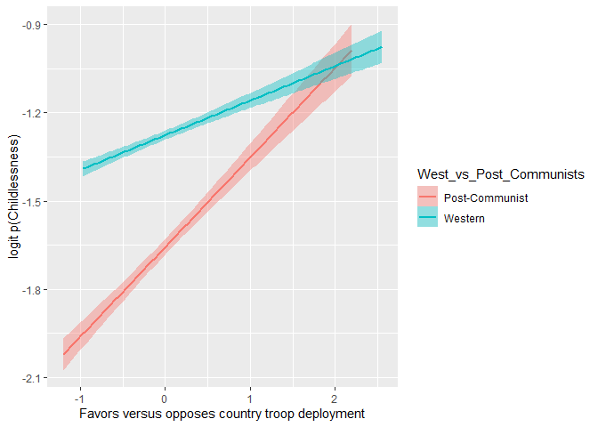
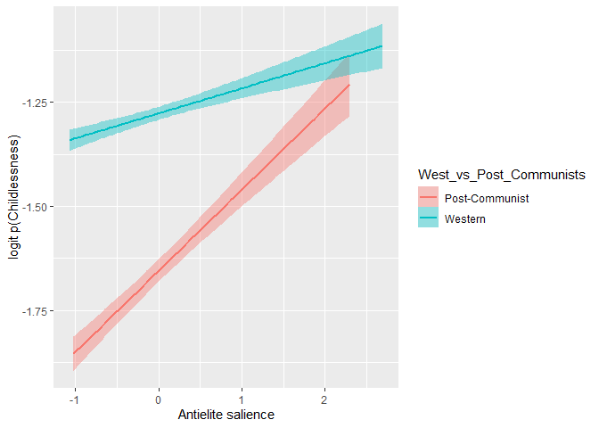

ERQ5. Are the associations between childlessness and the ideology positions, salience of anti-elitism and (anti-)corruption, and policy positions of the party for which one has voted different in Western Europe and in post-communist countries?

Random slopes were detected for international_security and antielite_salience.


# Preparations

## Packages


```r
library(lme4)
```

```
## Loading required package: Matrix
```

```r
library(emmeans)
library(rio)
```

```
## 
## Attaching package: 'rio'
```

```
## The following object is masked from 'package:lme4':
## 
##     factorize
```

```r
library(dplyr)
```

```
## 
## Attaching package: 'dplyr'
```

```
## The following objects are masked from 'package:stats':
## 
##     filter, lag
```

```
## The following objects are masked from 'package:base':
## 
##     intersect, setdiff, setequal, union
```

```r
library(vjihelpers)
library(ggplot2)
```

## Custom functions


```r
source("../custom_functions.R")
source("../modglmer_logit.R")
```

## Data


```r
fdat<-import("../../data/processed/fdat.xlsx")
```

## Code West and post-communist countries


```r
table(fdat$cntry)
```

```
## 
##   AT   BE   CH   CZ   DE   DK   EE   ES   FI   FR   GB   HU   IE   IL   LT   NL 
## 1795 1769 1532 2148 3045 1502 2051 1925 2087 1917 2264 1698 2390 2562 2250 1919 
##   NO   PL   PT   SE   SI 
## 1436 1615 1265 1791 1224
```

```r
fdat$West_vs_post_comm<-
  case_when(fdat$cntry == "AT" |
              fdat$cntry == "BE" |
              fdat$cntry == "CH" |
              fdat$cntry == "DE" |
              fdat$cntry == "DK" |
              fdat$cntry == "ES" |
              fdat$cntry == "FI" |
              fdat$cntry == "FR" |
              fdat$cntry == "GB" |
              fdat$cntry == "IE" |
              fdat$cntry == "IL" |
              fdat$cntry == "NL" |
              fdat$cntry == "NO" |
              fdat$cntry == "PT" |
              fdat$cntry == "SE" ~ -0.5,
            TRUE~0.5)

table(fdat$West_vs_post_comm,useNA="always")
```

```
## 
##  -0.5   0.5  <NA> 
## 29199 10986     0
```

## Data exclusions


```r
exdat<-fdat %>%
  dplyr::select(childlessness,
                gndr.c,age10.c,
                minority.c,
                West_vs_post_comm,
                international_security.z,
                antielite_salience.z,
                cntry,anweight) %>%
  na.omit()
```

## Variable centering


```r
exdat<-
  group_mean_center(
    data=exdat,group.var="cntry",
    vars=c("international_security.z",
           "antielite_salience.z"),
    grand.init = F)
```


# Analysis 

## international_security

### Fixed main effect


```r
mod2.international_security<-
  glmer(childlessness~gndr.c+age10.c+minority.c+
          international_security.z.gmc+
          (1|cntry),
        data=exdat,
        family=binomial(link="logit"),weights = anweight)
```

```
## Warning in eval(family$initialize, rho): non-integer #successes in a binomial
## glm!
```

```r
summary(mod2.international_security)
```

```
## Generalized linear mixed model fit by maximum likelihood (Laplace
##   Approximation) [glmerMod]
##  Family: binomial  ( logit )
## Formula: 
## childlessness ~ gndr.c + age10.c + minority.c + international_security.z.gmc +  
##     (1 | cntry)
##    Data: exdat
## Weights: anweight
## 
##      AIC      BIC   logLik deviance df.resid 
##  15071.6  15119.4  -7529.8  15059.6    21341 
## 
## Scaled residuals: 
##     Min      1Q  Median      3Q     Max 
## -3.7022 -0.4388 -0.2244  0.2358 12.9952 
## 
## Random effects:
##  Groups Name        Variance Std.Dev.
##  cntry  (Intercept) 0.1173   0.3425  
## Number of obs: 21347, groups:  cntry, 20
## 
## Fixed effects:
##                              Estimate Std. Error z value Pr(>|z|)    
## (Intercept)                  -1.29013    0.10038 -12.852  < 2e-16 ***
## gndr.c                       -0.30761    0.04047  -7.601 2.95e-14 ***
## age10.c                      -0.55355    0.01349 -41.023  < 2e-16 ***
## minority.c                   -0.28211    0.10390  -2.715  0.00663 ** 
## international_security.z.gmc  0.03733    0.02903   1.286  0.19839    
## ---
## Signif. codes:  0 '***' 0.001 '**' 0.01 '*' 0.05 '.' 0.1 ' ' 1
## 
## Correlation of Fixed Effects:
##             (Intr) gndr.c ag10.c mnrty.
## gndr.c       0.014                     
## age10.c      0.105  0.012              
## minority.c   0.487  0.001  0.091       
## intrntnl_.. -0.015  0.030  0.071 -0.017
```

### Random main effect


```r
mod3.international_security<-
  glmer(childlessness~gndr.c+age10.c+minority.c+
          international_security.z.gmc+
          (international_security.z.gmc||cntry),
        data=exdat,
        family=binomial(link="logit"),weights = anweight,
        control = glmerControl(optimizer="bobyqa"))
```

```
## Warning in eval(family$initialize, rho): non-integer #successes in a binomial
## glm!
```

```r
summary(mod3.international_security)
```

```
## Generalized linear mixed model fit by maximum likelihood (Laplace
##   Approximation) [glmerMod]
##  Family: binomial  ( logit )
## Formula: 
## childlessness ~ gndr.c + age10.c + minority.c + international_security.z.gmc +  
##     (international_security.z.gmc || cntry)
##    Data: exdat
## Weights: anweight
## Control: glmerControl(optimizer = "bobyqa")
## 
##      AIC      BIC   logLik deviance df.resid 
##  15068.5  15124.3  -7527.2  15054.5    21340 
## 
## Scaled residuals: 
##     Min      1Q  Median      3Q     Max 
## -3.6898 -0.4394 -0.2240  0.2363 12.8401 
## 
## Random effects:
##  Groups  Name                         Variance Std.Dev.
##  cntry   (Intercept)                  0.116878 0.34187 
##  cntry.1 international_security.z.gmc 0.008725 0.09341 
## Number of obs: 21347, groups:  cntry, 20
## 
## Fixed effects:
##                              Estimate Std. Error z value Pr(>|z|)    
## (Intercept)                  -1.28958    0.10030 -12.857  < 2e-16 ***
## gndr.c                       -0.30496    0.04055  -7.521 5.44e-14 ***
## age10.c                      -0.55281    0.01350 -40.941  < 2e-16 ***
## minority.c                   -0.27427    0.10401  -2.637  0.00836 ** 
## international_security.z.gmc  0.06093    0.04309   1.414  0.15738    
## ---
## Signif. codes:  0 '***' 0.001 '**' 0.01 '*' 0.05 '.' 0.1 ' ' 1
## 
## Correlation of Fixed Effects:
##             (Intr) gndr.c ag10.c mnrty.
## gndr.c       0.015                     
## age10.c      0.105  0.012              
## minority.c   0.488  0.003  0.092       
## intrntnl_.. -0.014  0.017  0.049 -0.007
```

```r
anova(mod2.international_security,mod3.international_security)
```

```
## Data: exdat
## Models:
## mod2.international_security: childlessness ~ gndr.c + age10.c + minority.c + international_security.z.gmc + (1 | cntry)
## mod3.international_security: childlessness ~ gndr.c + age10.c + minority.c + international_security.z.gmc + (international_security.z.gmc || cntry)
##                             npar   AIC   BIC  logLik deviance  Chisq Df
## mod2.international_security    6 15072 15119 -7529.8    15060          
## mod3.international_security    7 15068 15124 -7527.2    15054 5.0783  1
##                             Pr(>Chisq)  
## mod2.international_security             
## mod3.international_security    0.02423 *
## ---
## Signif. codes:  0 '***' 0.001 '**' 0.01 '*' 0.05 '.' 0.1 ' ' 1
```

### West vs. post-communist main effect


```r
mod4.international_security<-
  glmer(childlessness~gndr.c+age10.c+minority.c+
          West_vs_post_comm+
          international_security.z.gmc+
          (international_security.z.gmc||cntry),
        data=exdat,
        family=binomial(link="logit"),weights = anweight,
        control = glmerControl(optimizer="bobyqa"))
```

```
## Warning in eval(family$initialize, rho): non-integer #successes in a binomial
## glm!
```

```r
summary(mod4.international_security)
```

```
## Generalized linear mixed model fit by maximum likelihood (Laplace
##   Approximation) [glmerMod]
##  Family: binomial  ( logit )
## Formula: childlessness ~ gndr.c + age10.c + minority.c + West_vs_post_comm +  
##     international_security.z.gmc + (international_security.z.gmc ||      cntry)
##    Data: exdat
## Weights: anweight
## Control: glmerControl(optimizer = "bobyqa")
## 
##      AIC      BIC   logLik deviance df.resid 
##  15068.6  15132.3  -7526.3  15052.6    21339 
## 
## Scaled residuals: 
##     Min      1Q  Median      3Q     Max 
## -3.6936 -0.4388 -0.2233  0.2491 12.8227 
## 
## Random effects:
##  Groups  Name                         Variance Std.Dev.
##  cntry   (Intercept)                  0.111291 0.33360 
##  cntry.1 international_security.z.gmc 0.008842 0.09403 
## Number of obs: 21347, groups:  cntry, 20
## 
## Fixed effects:
##                              Estimate Std. Error z value Pr(>|z|)    
## (Intercept)                  -1.36461    0.11350 -12.023  < 2e-16 ***
## gndr.c                       -0.30545    0.04055  -7.532 4.99e-14 ***
## age10.c                      -0.55296    0.01350 -40.949  < 2e-16 ***
## minority.c                   -0.27394    0.10401  -2.634  0.00845 ** 
## West_vs_post_comm            -0.28096    0.20461  -1.373  0.16972    
## international_security.z.gmc  0.06089    0.04321   1.409  0.15871    
## ---
## Signif. codes:  0 '***' 0.001 '**' 0.01 '*' 0.05 '.' 0.1 ' ' 1
## 
## Correlation of Fixed Effects:
##             (Intr) gndr.c ag10.c mnrty. Wst___
## gndr.c       0.017                            
## age10.c      0.099  0.012                     
## minority.c   0.430  0.003  0.092              
## Wst_vs_pst_  0.493  0.009  0.014 -0.001       
## intrntnl_.. -0.013  0.017  0.049 -0.006 -0.001
```

```r
anova(mod3.international_security,mod4.international_security)
```

```
## Data: exdat
## Models:
## mod3.international_security: childlessness ~ gndr.c + age10.c + minority.c + international_security.z.gmc + (international_security.z.gmc || cntry)
## mod4.international_security: childlessness ~ gndr.c + age10.c + minority.c + West_vs_post_comm + international_security.z.gmc + (international_security.z.gmc || cntry)
##                             npar   AIC   BIC  logLik deviance  Chisq Df
## mod3.international_security    7 15068 15124 -7527.2    15054          
## mod4.international_security    8 15069 15132 -7526.3    15053 1.8917  1
##                             Pr(>Chisq)
## mod3.international_security           
## mod4.international_security      0.169
```

### West vs. post-communist x international_security interaction


```r
mod5.international_security<-
  glmer(childlessness~gndr.c+age10.c+minority.c+
          West_vs_post_comm+
          international_security.z.gmc+
          West_vs_post_comm:international_security.z.gmc+
          (international_security.z.gmc||cntry),
        data=exdat,
        family=binomial(link="logit"),weights = anweight,
        control = glmerControl(optimizer="bobyqa"))
```

```
## Warning in eval(family$initialize, rho): non-integer #successes in a binomial
## glm!
```

```r
summary(mod5.international_security)
```

```
## Generalized linear mixed model fit by maximum likelihood (Laplace
##   Approximation) [glmerMod]
##  Family: binomial  ( logit )
## Formula: childlessness ~ gndr.c + age10.c + minority.c + West_vs_post_comm +  
##     international_security.z.gmc + West_vs_post_comm:international_security.z.gmc +  
##     (international_security.z.gmc || cntry)
##    Data: exdat
## Weights: anweight
## Control: glmerControl(optimizer = "bobyqa")
## 
##      AIC      BIC   logLik deviance df.resid 
##  15062.5  15134.2  -7522.3  15044.5    21338 
## 
## Scaled residuals: 
##     Min      1Q  Median      3Q     Max 
## -3.7143 -0.4379 -0.2232  0.2535 12.8573 
## 
## Random effects:
##  Groups  Name                         Variance Std.Dev.
##  cntry   (Intercept)                  0.109318 0.3306  
##  cntry.1 international_security.z.gmc 0.001954 0.0442  
## Number of obs: 21347, groups:  cntry, 20
## 
## Fixed effects:
##                                                Estimate Std. Error z value
## (Intercept)                                    -1.36701    0.11295 -12.103
## gndr.c                                         -0.30207    0.04054  -7.451
## age10.c                                        -0.55332    0.01350 -40.979
## minority.c                                     -0.27188    0.10398  -2.615
## West_vs_post_comm                              -0.29344    0.20353  -1.442
## international_security.z.gmc                    0.16443    0.04993   3.293
## West_vs_post_comm:international_security.z.gmc  0.31405    0.10120   3.103
##                                                Pr(>|z|)    
## (Intercept)                                     < 2e-16 ***
## gndr.c                                         9.25e-14 ***
## age10.c                                         < 2e-16 ***
## minority.c                                      0.00893 ** 
## West_vs_post_comm                               0.14939    
## international_security.z.gmc                    0.00099 ***
## West_vs_post_comm:international_security.z.gmc  0.00191 ** 
## ---
## Signif. codes:  0 '***' 0.001 '**' 0.01 '*' 0.05 '.' 0.1 ' ' 1
## 
## Correlation of Fixed Effects:
##             (Intr) gndr.c ag10.c mnrty. Wst___ int_..
## gndr.c       0.016                                   
## age10.c      0.099  0.011                            
## minority.c   0.432  0.002  0.092                     
## Wst_vs_pst_  0.494  0.008  0.014 -0.001              
## intrntnl_.. -0.026  0.041  0.033  0.002 -0.029       
## Wst_v__:_.. -0.019  0.036 -0.013  0.014 -0.033  0.735
```

```r
anova(mod4.international_security,mod5.international_security)
```

```
## Data: exdat
## Models:
## mod4.international_security: childlessness ~ gndr.c + age10.c + minority.c + West_vs_post_comm + international_security.z.gmc + (international_security.z.gmc || cntry)
## mod5.international_security: childlessness ~ gndr.c + age10.c + minority.c + West_vs_post_comm + international_security.z.gmc + West_vs_post_comm:international_security.z.gmc + (international_security.z.gmc || cntry)
##                             npar   AIC   BIC  logLik deviance  Chisq Df
## mod4.international_security    8 15069 15132 -7526.3    15053          
## mod5.international_security    9 15062 15134 -7522.3    15044 8.0725  1
##                             Pr(>Chisq)   
## mod4.international_security              
## mod5.international_security   0.004494 **
## ---
## Signif. codes:  0 '***' 0.001 '**' 0.01 '*' 0.05 '.' 0.1 ' ' 1
```

#### Marginal effects


```r
emtrends(mod5.international_security,
         var="international_security.z.gmc",
         specs="West_vs_post_comm",
         at=list(West_vs_post_comm=c(-0.5,0.5)),infer=c(T,T))
```

```
##  West_vs_post_comm international_security.z.gmc.trend     SE  df asymp.LCL
##               -0.5                            0.00741 0.0366 Inf   -0.0644
##                0.5                            0.32145 0.0936 Inf    0.1380
##  asymp.UCL z.ratio p.value
##     0.0792   0.202  0.8397
##     0.5050   3.433  0.0006
## 
## Results are averaged over the levels of: gndr.c, minority.c 
## Confidence level used: 0.95
```

```r
emtrends(mod5.international_security,
         var="international_security.z.gmc",
         specs="West_vs_post_comm",
         at=list(West_vs_post_comm=c(-0.5,0.5)),infer=c(T,T),
         regrid="response")
```

```
##  West_vs_post_comm international_security.z.gmc.trend      SE  df asymp.LCL
##               -0.5                            0.00115 0.00569 Inf   -0.0100
##                0.5                            0.04135 0.01299 Inf    0.0159
##  asymp.UCL z.ratio p.value
##     0.0123   0.202  0.8397
##     0.0668   3.183  0.0015
## 
## Results are averaged over the levels of: gndr.c, minority.c 
## Confidence level used: 0.95
```

#### Plot


```r
preds.mod5.international_security<-
  predict(mod5.international_security,re.form=NULL)

plot.dat<-
  data.frame('logit_childlessness'=preds.mod5.international_security,
             'West_vs_Post_Communists'=
               ifelse(exdat$West_vs_post_comm==-0.5,"Western","Post-Communist"),
             'international_security'=exdat$international_security.z.gmc,
             'Country'=exdat$cntry,
             'Childlessness'=exdat$childlessness)

ggplot(plot.dat,aes(y=logit_childlessness,
                    x=international_security,
                    color=West_vs_Post_Communists,
                    fill=West_vs_Post_Communists))+
  geom_smooth(method="lm")+
  ylab("logit p(Childlessness)")+
  xlab("Favors versus opposes country troop deployment")
```

```
## `geom_smooth()` using formula 'y ~ x'
```

<!-- -->

## antielite_salience

### Fixed main effect


```r
mod2.antielite_salience<-
  glmer(childlessness~gndr.c+age10.c+minority.c+
          antielite_salience.z.gmc+
          (1|cntry),
        data=exdat,
        family=binomial(link="logit"),weights = anweight)
```

```
## Warning in eval(family$initialize, rho): non-integer #successes in a binomial
## glm!
```

```r
summary(mod2.antielite_salience)
```

```
## Generalized linear mixed model fit by maximum likelihood (Laplace
##   Approximation) [glmerMod]
##  Family: binomial  ( logit )
## Formula: 
## childlessness ~ gndr.c + age10.c + minority.c + antielite_salience.z.gmc +  
##     (1 | cntry)
##    Data: exdat
## Weights: anweight
## 
##      AIC      BIC   logLik deviance df.resid 
##  15073.2  15121.0  -7530.6  15061.2    21341 
## 
## Scaled residuals: 
##     Min      1Q  Median      3Q     Max 
## -3.7324 -0.4389 -0.2242  0.2357 12.9786 
## 
## Random effects:
##  Groups Name        Variance Std.Dev.
##  cntry  (Intercept) 0.1169   0.342   
## Number of obs: 21347, groups:  cntry, 20
## 
## Fixed effects:
##                            Estimate Std. Error z value Pr(>|z|)    
## (Intercept)              -1.2884322  0.1002836 -12.848  < 2e-16 ***
## gndr.c                   -0.3091262  0.0404725  -7.638 2.21e-14 ***
## age10.c                  -0.5548092  0.0134939 -41.116  < 2e-16 ***
## minority.c               -0.2798674  0.1038782  -2.694  0.00706 ** 
## antielite_salience.z.gmc  0.0009857  0.0251900   0.039  0.96879    
## ---
## Signif. codes:  0 '***' 0.001 '**' 0.01 '*' 0.05 '.' 0.1 ' ' 1
## 
## Correlation of Fixed Effects:
##             (Intr) gndr.c ag10.c mnrty.
## gndr.c       0.015                     
## age10.c      0.105  0.012              
## minority.c   0.487  0.002  0.093       
## antlt_sln.. -0.005  0.032  0.074  0.003
```

### Random main effect


```r
mod3.antielite_salience<-
  glmer(childlessness~gndr.c+age10.c+minority.c+
          antielite_salience.z.gmc+
          (antielite_salience.z.gmc||cntry),
        data=exdat,
        family=binomial(link="logit"),weights = anweight,
        control = glmerControl(optimizer="bobyqa"))
```

```
## Warning in eval(family$initialize, rho): non-integer #successes in a binomial
## glm!
```

```r
summary(mod3.antielite_salience)
```

```
## Generalized linear mixed model fit by maximum likelihood (Laplace
##   Approximation) [glmerMod]
##  Family: binomial  ( logit )
## Formula: 
## childlessness ~ gndr.c + age10.c + minority.c + antielite_salience.z.gmc +  
##     (antielite_salience.z.gmc || cntry)
##    Data: exdat
## Weights: anweight
## Control: glmerControl(optimizer = "bobyqa")
## 
##      AIC      BIC   logLik deviance df.resid 
##  15069.6  15125.4  -7527.8  15055.6    21340 
## 
## Scaled residuals: 
##     Min      1Q  Median      3Q     Max 
## -3.8118 -0.4393 -0.2243  0.2359 12.6707 
## 
## Random effects:
##  Groups  Name                     Variance Std.Dev.
##  cntry   (Intercept)              0.116489 0.34130 
##  cntry.1 antielite_salience.z.gmc 0.005871 0.07662 
## Number of obs: 21347, groups:  cntry, 20
## 
## Fixed effects:
##                          Estimate Std. Error z value Pr(>|z|)    
## (Intercept)              -1.28549    0.10017 -12.833  < 2e-16 ***
## gndr.c                   -0.30720    0.04051  -7.583 3.38e-14 ***
## age10.c                  -0.55454    0.01351 -41.054  < 2e-16 ***
## minority.c               -0.27008    0.10397  -2.598  0.00939 ** 
## antielite_salience.z.gmc  0.01058    0.03629   0.292  0.77059    
## ---
## Signif. codes:  0 '***' 0.001 '**' 0.01 '*' 0.05 '.' 0.1 ' ' 1
## 
## Correlation of Fixed Effects:
##             (Intr) gndr.c ag10.c mnrty.
## gndr.c       0.014                     
## age10.c      0.105  0.012              
## minority.c   0.488  0.002  0.093       
## antlt_sln.. -0.007  0.022  0.057  0.008
```

```r
anova(mod2.antielite_salience,mod3.antielite_salience)
```

```
## Data: exdat
## Models:
## mod2.antielite_salience: childlessness ~ gndr.c + age10.c + minority.c + antielite_salience.z.gmc + (1 | cntry)
## mod3.antielite_salience: childlessness ~ gndr.c + age10.c + minority.c + antielite_salience.z.gmc + (antielite_salience.z.gmc || cntry)
##                         npar   AIC   BIC  logLik deviance  Chisq Df Pr(>Chisq)
## mod2.antielite_salience    6 15073 15121 -7530.6    15061                     
## mod3.antielite_salience    7 15070 15125 -7527.8    15056 5.5756  1    0.01821
##                          
## mod2.antielite_salience  
## mod3.antielite_salience *
## ---
## Signif. codes:  0 '***' 0.001 '**' 0.01 '*' 0.05 '.' 0.1 ' ' 1
```

### West vs. post-communist main effect


```r
mod4.antielite_salience<-
  glmer(childlessness~gndr.c+age10.c+minority.c+
          West_vs_post_comm+
          antielite_salience.z.gmc+
          (antielite_salience.z.gmc||cntry),
        data=exdat,
        family=binomial(link="logit"),weights = anweight,
        control = glmerControl(optimizer="bobyqa"))
```

```
## Warning in eval(family$initialize, rho): non-integer #successes in a binomial
## glm!
```

```r
summary(mod4.antielite_salience)
```

```
## Generalized linear mixed model fit by maximum likelihood (Laplace
##   Approximation) [glmerMod]
##  Family: binomial  ( logit )
## Formula: childlessness ~ gndr.c + age10.c + minority.c + West_vs_post_comm +  
##     antielite_salience.z.gmc + (antielite_salience.z.gmc || cntry)
##    Data: exdat
## Weights: anweight
## Control: glmerControl(optimizer = "bobyqa")
## 
##      AIC      BIC   logLik deviance df.resid 
##  15069.8  15133.5  -7526.9  15053.8    21339 
## 
## Scaled residuals: 
##     Min      1Q  Median      3Q     Max 
## -3.8156 -0.4385 -0.2235  0.2479 12.6547 
## 
## Random effects:
##  Groups  Name                     Variance Std.Dev.
##  cntry   (Intercept)              0.111096 0.33331 
##  cntry.1 antielite_salience.z.gmc 0.005896 0.07678 
## Number of obs: 21347, groups:  cntry, 20
## 
## Fixed effects:
##                          Estimate Std. Error z value Pr(>|z|)    
## (Intercept)              -1.36030    0.11343 -11.992  < 2e-16 ***
## gndr.c                   -0.30772    0.04052  -7.595 3.08e-14 ***
## age10.c                  -0.55469    0.01351 -41.062  < 2e-16 ***
## minority.c               -0.26981    0.10399  -2.595  0.00947 ** 
## West_vs_post_comm        -0.27993    0.20450  -1.369  0.17103    
## antielite_salience.z.gmc  0.01075    0.03633   0.296  0.76726    
## ---
## Signif. codes:  0 '***' 0.001 '**' 0.01 '*' 0.05 '.' 0.1 ' ' 1
## 
## Correlation of Fixed Effects:
##             (Intr) gndr.c ag10.c mnrty. Wst___
## gndr.c       0.017                            
## age10.c      0.099  0.012                     
## minority.c   0.431  0.002  0.093              
## Wst_vs_pst_  0.493  0.009  0.014 -0.001       
## antlt_sln.. -0.008  0.022  0.057  0.008 -0.004
```

```r
anova(mod3.antielite_salience,mod4.antielite_salience)
```

```
## Data: exdat
## Models:
## mod3.antielite_salience: childlessness ~ gndr.c + age10.c + minority.c + antielite_salience.z.gmc + (antielite_salience.z.gmc || cntry)
## mod4.antielite_salience: childlessness ~ gndr.c + age10.c + minority.c + West_vs_post_comm + antielite_salience.z.gmc + (antielite_salience.z.gmc || cntry)
##                         npar   AIC   BIC  logLik deviance Chisq Df Pr(>Chisq)
## mod3.antielite_salience    7 15070 15125 -7527.8    15056                    
## mod4.antielite_salience    8 15070 15134 -7526.9    15054 1.882  1     0.1701
```

### West vs. post-communist x antielite_salience interaction


```r
mod5.antielite_salience<-
  glmer(childlessness~gndr.c+age10.c+minority.c+
          West_vs_post_comm+
          antielite_salience.z.gmc+
          West_vs_post_comm:antielite_salience.z.gmc+
          (antielite_salience.z.gmc||cntry),
        data=exdat,
        family=binomial(link="logit"),weights = anweight,
        control = glmerControl(optimizer="bobyqa"))
```

```
## Warning in eval(family$initialize, rho): non-integer #successes in a binomial
## glm!
```

```r
summary(mod5.antielite_salience)
```

```
## Generalized linear mixed model fit by maximum likelihood (Laplace
##   Approximation) [glmerMod]
##  Family: binomial  ( logit )
## Formula: childlessness ~ gndr.c + age10.c + minority.c + West_vs_post_comm +  
##     antielite_salience.z.gmc + West_vs_post_comm:antielite_salience.z.gmc +  
##     (antielite_salience.z.gmc || cntry)
##    Data: exdat
## Weights: anweight
## Control: glmerControl(optimizer = "bobyqa")
## 
##      AIC      BIC   logLik deviance df.resid 
##  15066.9  15138.7  -7524.5  15048.9    21338 
## 
## Scaled residuals: 
##     Min      1Q  Median      3Q     Max 
## -3.8074 -0.4387 -0.2229  0.2528 12.7410 
## 
## Random effects:
##  Groups  Name                     Variance Std.Dev.
##  cntry   (Intercept)              0.11075  0.33279 
##  cntry.1 antielite_salience.z.gmc 0.00143  0.03781 
## Number of obs: 21347, groups:  cntry, 20
## 
## Fixed effects:
##                                            Estimate Std. Error z value Pr(>|z|)
## (Intercept)                                -1.36386    0.11337 -12.030  < 2e-16
## gndr.c                                     -0.30629    0.04051  -7.560 4.02e-14
## age10.c                                    -0.55544    0.01352 -41.086  < 2e-16
## minority.c                                 -0.27006    0.10405  -2.596  0.00944
## West_vs_post_comm                          -0.29120    0.20441  -1.425  0.15427
## antielite_salience.z.gmc                    0.05401    0.03462   1.560  0.11881
## West_vs_post_comm:antielite_salience.z.gmc  0.18183    0.07001   2.597  0.00940
##                                               
## (Intercept)                                ***
## gndr.c                                     ***
## age10.c                                    ***
## minority.c                                 ** 
## West_vs_post_comm                             
## antielite_salience.z.gmc                      
## West_vs_post_comm:antielite_salience.z.gmc ** 
## ---
## Signif. codes:  0 '***' 0.001 '**' 0.01 '*' 0.05 '.' 0.1 ' ' 1
## 
## Correlation of Fixed Effects:
##             (Intr) gndr.c ag10.c mnrty. Wst___ ant_..
## gndr.c       0.017                                   
## age10.c      0.100  0.011                            
## minority.c   0.431  0.002  0.094                     
## Wst_vs_pst_  0.493  0.008  0.015 -0.001              
## antlt_sln.. -0.014  0.034  0.051  0.017 -0.021       
## Wst_v__:_.. -0.015  0.020 -0.031  0.011 -0.028  0.495
```

```r
anova(mod4.antielite_salience,mod5.antielite_salience)
```

```
## Data: exdat
## Models:
## mod4.antielite_salience: childlessness ~ gndr.c + age10.c + minority.c + West_vs_post_comm + antielite_salience.z.gmc + (antielite_salience.z.gmc || cntry)
## mod5.antielite_salience: childlessness ~ gndr.c + age10.c + minority.c + West_vs_post_comm + antielite_salience.z.gmc + West_vs_post_comm:antielite_salience.z.gmc + (antielite_salience.z.gmc || cntry)
##                         npar   AIC   BIC  logLik deviance  Chisq Df Pr(>Chisq)
## mod4.antielite_salience    8 15070 15134 -7526.9    15054                     
## mod5.antielite_salience    9 15067 15139 -7524.5    15049 4.8031  1    0.02841
##                          
## mod4.antielite_salience  
## mod5.antielite_salience *
## ---
## Signif. codes:  0 '***' 0.001 '**' 0.01 '*' 0.05 '.' 0.1 ' ' 1
```

#### Marginal effects


```r
emtrends(mod5.antielite_salience,
         var="antielite_salience.z.gmc",
         specs="West_vs_post_comm",
         at=list(West_vs_post_comm=c(-0.5,0.5)),infer=c(T,T))
```

```
##  West_vs_post_comm antielite_salience.z.gmc.trend     SE  df asymp.LCL
##               -0.5                        -0.0369 0.0350 Inf   -0.1055
##                0.5                         0.1449 0.0602 Inf    0.0269
##  asymp.UCL z.ratio p.value
##     0.0316  -1.055  0.2913
##     0.2629   2.407  0.0161
## 
## Results are averaged over the levels of: gndr.c, minority.c 
## Confidence level used: 0.95
```

```r
emtrends(mod5.antielite_salience,
         var="antielite_salience.z.gmc",
         specs="West_vs_post_comm",
         at=list(West_vs_post_comm=c(-0.5,0.5)),infer=c(T,T),
         regrid="response")
```

```
##  West_vs_post_comm antielite_salience.z.gmc.trend      SE  df asymp.LCL
##               -0.5                       -0.00574 0.00545 Inf  -0.01643
##                0.5                        0.01868 0.00806 Inf   0.00288
##  asymp.UCL z.ratio p.value
##    0.00495  -1.053  0.2925
##    0.03448   2.317  0.0205
## 
## Results are averaged over the levels of: gndr.c, minority.c 
## Confidence level used: 0.95
```


#### Plot


```r
preds.mod5.antielite_salience<-
  predict(mod5.antielite_salience,re.form=NULL)

plot.dat<-
  data.frame('logit_childlessness'=preds.mod5.antielite_salience,
             'West_vs_Post_Communists'=
               ifelse(exdat$West_vs_post_comm==-0.5,"Western","Post-Communist"),
             'antielite_salience'=exdat$antielite_salience.z.gmc,
             'Country'=exdat$cntry,
             'Childlessness'=exdat$childlessness)

ggplot(plot.dat,aes(y=logit_childlessness,
                    x=antielite_salience,
                    color=West_vs_Post_Communists,
                    fill=West_vs_Post_Communists))+
  geom_smooth(method="lm")+
  ylab("logit p(Childlessness)")+
  xlab("Antielite salience")
```

```
## `geom_smooth()` using formula 'y ~ x'
```

<!-- -->


```r
sinf<-sessionInfo()
print(sinf,locale=F)
```

```
## R version 4.2.0 (2022-04-22 ucrt)
## Platform: x86_64-w64-mingw32/x64 (64-bit)
## Running under: Windows 10 x64 (build 19043)
## 
## Matrix products: default
## 
## attached base packages:
## [1] stats     graphics  grDevices utils     datasets  methods   base     
## 
## other attached packages:
## [1] ggplot2_3.3.5         vjihelpers_0.0.0.9000 dplyr_1.0.9          
## [4] rio_0.5.29            emmeans_1.7.3         lme4_1.1-29          
## [7] Matrix_1.4-1         
## 
## loaded via a namespace (and not attached):
##  [1] Rcpp_1.0.8.3      mvtnorm_1.1-3     lattice_0.20-45   digest_0.6.29    
##  [5] utf8_1.2.2        R6_2.5.1          cellranger_1.1.0  evaluate_0.15    
##  [9] highr_0.9         pillar_1.7.0      rlang_1.0.2       curl_4.3.2       
## [13] readxl_1.4.0      rstudioapi_0.13   minqa_1.2.4       data.table_1.14.2
## [17] nloptr_2.0.0      jquerylib_0.1.4   rmarkdown_2.14    labeling_0.4.2   
## [21] splines_4.2.0     stringr_1.4.0     foreign_0.8-82    munsell_0.5.0    
## [25] compiler_4.2.0    xfun_0.30         pkgconfig_2.0.3   mgcv_1.8-40      
## [29] htmltools_0.5.2   tidyselect_1.1.2  tibble_3.1.6      fansi_1.0.3      
## [33] crayon_1.5.1      withr_2.5.0       MASS_7.3-56       grid_4.2.0       
## [37] nlme_3.1-157      jsonlite_1.8.0    xtable_1.8-4      gtable_0.3.0     
## [41] lifecycle_1.0.1   magrittr_2.0.3    scales_1.2.0      zip_2.2.0        
## [45] estimability_1.3  cli_3.3.0         stringi_1.7.6     farver_2.1.0     
## [49] bslib_0.3.1       ellipsis_0.3.2    vctrs_0.4.1       generics_0.1.2   
## [53] boot_1.3-28       openxlsx_4.2.5    tools_4.2.0       forcats_0.5.1    
## [57] glue_1.6.2        purrr_0.3.4       hms_1.1.1         fastmap_1.1.0    
## [61] yaml_2.3.5        colorspace_2.0-3  knitr_1.39        haven_2.5.0      
## [65] sass_0.4.1
```
