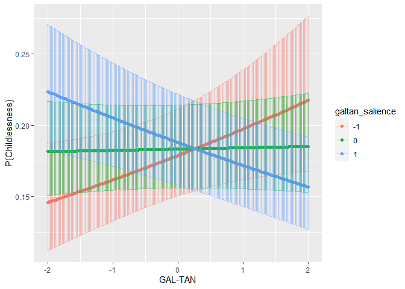
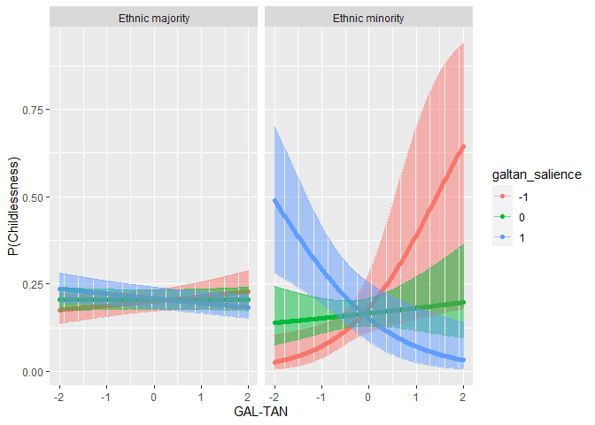
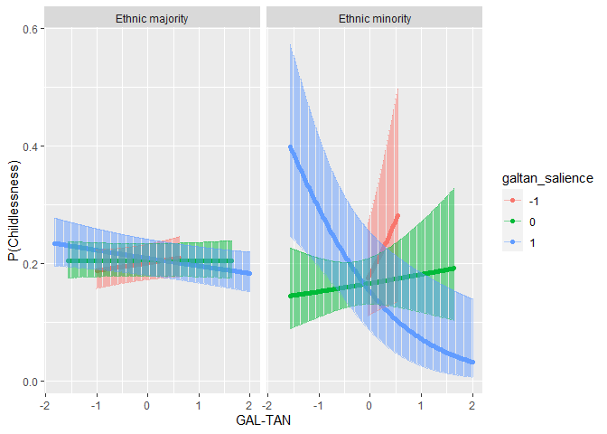
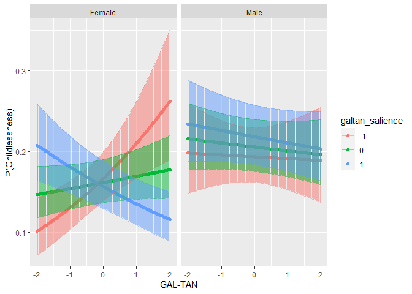
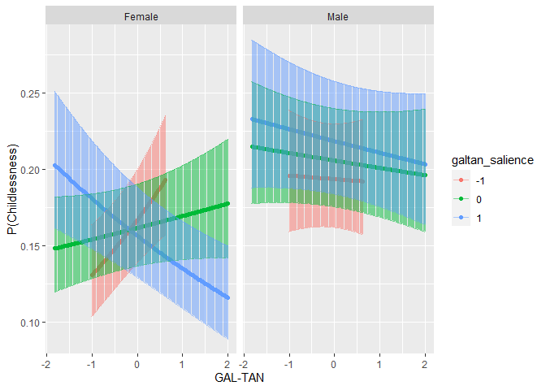
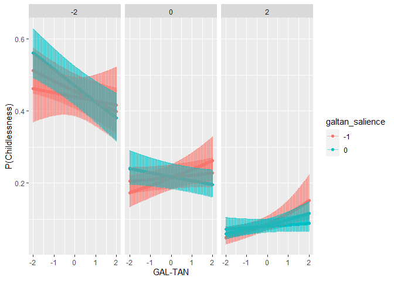

# Preparations

## Packages


```r
library(lme4)
```

```
## Loading required package: Matrix
```

```r
library(emmeans)
library(rio)
```

```
## 
## Attaching package: 'rio'
```

```
## The following object is masked from 'package:lme4':
## 
##     factorize
```

```r
library(dplyr)
```

```
## 
## Attaching package: 'dplyr'
```

```
## The following objects are masked from 'package:stats':
## 
##     filter, lag
```

```
## The following objects are masked from 'package:base':
## 
##     intersect, setdiff, setequal, union
```

```r
library(vjihelpers)
library(ggplot2)
```

## Custom functions


```r
source("../custom_functions.R")
source("../modglmer_logit.R")
```

## Data


```r
fdat<-import("../../data/processed/fdat.xlsx")
CHES<-
  import("../../data/processed/CHES_2014.vote.keys.combined.xlsx")
```

## Code galtan as categorical


```r
m.galtan<-mean(CHES$galtan,na.rm=T)
sd.galtan<-sd(CHES$galtan,na.rm=T)

m.galtan_salience<-mean(CHES$galtan_salience,na.rm=T)
sd.galtan_salience<-sd(CHES$galtan_salience,na.rm=T)

fdat$galtan.cat<-
  case_when(fdat$galtan>(m.galtan+sd.galtan)~"TAN",
            fdat$galtan<(m.galtan-sd.galtan)~"GAL",
            is.na(fdat$galtan)~NA_character_,
            TRUE~"MID")
table(fdat$galtan.cat,useNA="always")
```

```
## 
##   GAL   MID   TAN  <NA> 
##  2474 16034  3176 18501
```

```r
fdat$galtan_salience.cat<-
  case_when(fdat$galtan_salience>
              (m.galtan_salience+sd.galtan_salience)~"3.High_Salience",
            fdat$galtan_salience<
              (m.galtan_salience-sd.galtan_salience)~"1.Low_Salience",
            is.na(fdat$galtan_salience)~NA_character_,
            TRUE~"2.Mid_Salience")

table(fdat$galtan_salience.cat,useNA="always")
```

```
## 
##  1.Low_Salience  2.Mid_Salience 3.High_Salience            <NA> 
##            4716           14296            2672           18501
```

```r
table(fdat$galtan.cat,
      fdat$galtan_salience.cat,useNA="always")
```

```
##       
##        1.Low_Salience 2.Mid_Salience 3.High_Salience  <NA>
##   GAL               0           1647             827     0
##   MID            4716          10826             492     0
##   TAN               0           1823            1353     0
##   <NA>              0              0               0 18501
```

```r
fdat$galtan_salience.bin<-
  case_when(fdat$galtan_salience>
              (m.galtan_salience+sd.galtan_salience)~"Salient",
            is.na(fdat$galtan_salience)~NA_character_,
            TRUE~"Non_Salient")

table(fdat$galtan_salience.bin,useNA="always")
```

```
## 
## Non_Salient     Salient        <NA> 
##       19012        2672       18501
```

```r
table(fdat$galtan.cat,
      fdat$galtan_salience.bin,useNA="always")
```

```
##       
##        Non_Salient Salient  <NA>
##   GAL         1647     827     0
##   MID        15542     492     0
##   TAN         1823    1353     0
##   <NA>           0       0 18501
```

```r
prop.table(
  table(fdat$galtan.cat,
      fdat$galtan_salience.bin,useNA="always"),1)
```

```
##       
##        Non_Salient    Salient       <NA>
##   GAL   0.66572352 0.33427648 0.00000000
##   MID   0.96931521 0.03068479 0.00000000
##   TAN   0.57399244 0.42600756 0.00000000
##   <NA>  0.00000000 0.00000000 1.00000000
```

## Data exclusions


```r
exdat<-fdat %>%
  dplyr::select(childlessness,
                gndr.c,age10.c,
                minority.c,lrgen.z,
                lrecon.z,galtan.z,
                lrecon_salience.z,galtan_salience.z,
                galtan.cat,
                galtan_salience.cat,
                galtan_salience.bin,
                galtan,
                galtan_salience,
                cntry,anweight) %>%
  na.omit()
```

## Variable centering


```r
exdat<-
  group_mean_center(
    data=exdat,group.var="cntry",
    vars=c("lrgen.z","lrecon.z","galtan.z",
           "lrecon_salience.z","galtan_salience.z"),
    grand.init = F)
```


# Three-way interaction between GAL-TAN, GAL-TAN -salience and minority/gender/age

## Fixed


```r
mod2.galtan<-
  glmer(childlessness~gndr.c+age10.c+minority.c+
          galtan.z.gmc+
          (1|cntry),
        data=exdat,
        family=binomial(link="logit"),weights = anweight)
```

```
## Warning in eval(family$initialize, rho): non-integer #successes in a binomial
## glm!
```

```r
summary(mod2.galtan)
```

```
## Generalized linear mixed model fit by maximum likelihood (Laplace
##   Approximation) [glmerMod]
##  Family: binomial  ( logit )
## Formula: childlessness ~ gndr.c + age10.c + minority.c + galtan.z.gmc +  
##     (1 | cntry)
##    Data: exdat
## Weights: anweight
## 
##      AIC      BIC   logLik deviance df.resid 
##  15072.0  15119.8  -7530.0  15060.0    21368 
## 
## Scaled residuals: 
##     Min      1Q  Median      3Q     Max 
## -3.7183 -0.4386 -0.2245  0.2419 12.7554 
## 
## Random effects:
##  Groups Name        Variance Std.Dev.
##  cntry  (Intercept) 0.1151   0.3393  
## Number of obs: 21374, groups:  cntry, 20
## 
## Fixed effects:
##              Estimate Std. Error z value Pr(>|z|)    
## (Intercept)  -1.29044    0.09981 -12.929  < 2e-16 ***
## gndr.c       -0.31056    0.04046  -7.676 1.65e-14 ***
## age10.c      -0.55355    0.01348 -41.050  < 2e-16 ***
## minority.c   -0.28770    0.10399  -2.767  0.00566 ** 
## galtan.z.gmc -0.03717    0.02421  -1.535  0.12471    
## ---
## Signif. codes:  0 '***' 0.001 '**' 0.01 '*' 0.05 '.' 0.1 ' ' 1
## 
## Correlation of Fixed Effects:
##             (Intr) gndr.c ag10.c mnrty.
## gndr.c       0.015                     
## age10.c      0.105  0.008              
## minority.c   0.491  0.003  0.089       
## galtn.z.gmc  0.028  0.019 -0.061  0.048
```

## Random


```r
mod3.galtan<-
  glmer(childlessness~gndr.c+age10.c+minority.c+
          galtan.z.gmc+
          (galtan.z.gmc|cntry),
        data=exdat,
        family=binomial(link="logit"),weights = anweight,
        control = 
          glmerControl(optimizer="bobyqa",
                       optCtrl = list(maxfun = 1000000)))
```

```
## Warning in eval(family$initialize, rho): non-integer #successes in a binomial
## glm!
```

```
## boundary (singular) fit: see help('isSingular')
```

```r
summary(mod3.galtan)
```

```
## Generalized linear mixed model fit by maximum likelihood (Laplace
##   Approximation) [glmerMod]
##  Family: binomial  ( logit )
## Formula: childlessness ~ gndr.c + age10.c + minority.c + galtan.z.gmc +  
##     (galtan.z.gmc | cntry)
##    Data: exdat
## Weights: anweight
## Control: glmerControl(optimizer = "bobyqa", optCtrl = list(maxfun = 1e+06))
## 
##      AIC      BIC   logLik deviance df.resid 
##  15075.8  15139.5  -7529.9  15059.8    21366 
## 
## Scaled residuals: 
##     Min      1Q  Median      3Q     Max 
## -3.7418 -0.4384 -0.2246  0.2421 12.8668 
## 
## Random effects:
##  Groups Name         Variance  Std.Dev. Corr 
##  cntry  (Intercept)  1.143e-01 0.338015      
##         galtan.z.gmc 9.991e-05 0.009996 -1.00
## Number of obs: 21374, groups:  cntry, 20
## 
## Fixed effects:
##              Estimate Std. Error z value Pr(>|z|)    
## (Intercept)  -1.28982    0.09957 -12.954  < 2e-16 ***
## gndr.c       -0.31048    0.04046  -7.673 1.68e-14 ***
## age10.c      -0.55332    0.01349 -41.012  < 2e-16 ***
## minority.c   -0.28780    0.10401  -2.767  0.00566 ** 
## galtan.z.gmc -0.03534    0.02464  -1.434  0.15153    
## ---
## Signif. codes:  0 '***' 0.001 '**' 0.01 '*' 0.05 '.' 0.1 ' ' 1
## 
## Correlation of Fixed Effects:
##             (Intr) gndr.c ag10.c mnrty.
## gndr.c       0.015                     
## age10.c      0.105  0.008              
## minority.c   0.492  0.003  0.089       
## galtn.z.gmc -0.056  0.020 -0.055  0.047
## optimizer (bobyqa) convergence code: 0 (OK)
## boundary (singular) fit: see help('isSingular')
```

```r
anova(mod2.galtan,mod3.galtan)
```

```
## Data: exdat
## Models:
## mod2.galtan: childlessness ~ gndr.c + age10.c + minority.c + galtan.z.gmc + (1 | cntry)
## mod3.galtan: childlessness ~ gndr.c + age10.c + minority.c + galtan.z.gmc + (galtan.z.gmc | cntry)
##             npar   AIC   BIC  logLik deviance  Chisq Df Pr(>Chisq)
## mod2.galtan    6 15072 15120 -7530.0    15060                     
## mod3.galtan    8 15076 15140 -7529.9    15060 0.2211  2     0.8953
```

## Random no random effect correlation


```r
mod3.no.recov.galtan<-
  glmer(childlessness~gndr.c+age10.c+minority.c+
          galtan.z.gmc+
          (galtan.z.gmc||cntry),
        data=exdat,
        family=binomial(link="logit"),
        weights = anweight,
        control = 
          glmerControl(optimizer="bobyqa",
                       optCtrl = list(maxfun = 1000000)))
```

```
## Warning in eval(family$initialize, rho): non-integer #successes in a binomial
## glm!
```

```
## boundary (singular) fit: see help('isSingular')
```

```r
summary(mod3.no.recov.galtan)
```

```
## Generalized linear mixed model fit by maximum likelihood (Laplace
##   Approximation) [glmerMod]
##  Family: binomial  ( logit )
## Formula: childlessness ~ gndr.c + age10.c + minority.c + galtan.z.gmc +  
##     (galtan.z.gmc || cntry)
##    Data: exdat
## Weights: anweight
## Control: glmerControl(optimizer = "bobyqa", optCtrl = list(maxfun = 1e+06))
## 
##      AIC      BIC   logLik deviance df.resid 
##  15074.0  15129.8  -7530.0  15060.0    21367 
## 
## Scaled residuals: 
##     Min      1Q  Median      3Q     Max 
## -3.7183 -0.4386 -0.2245  0.2419 12.7554 
## 
## Random effects:
##  Groups  Name         Variance Std.Dev.
##  cntry   (Intercept)  0.1151   0.3393  
##  cntry.1 galtan.z.gmc 0.0000   0.0000  
## Number of obs: 21374, groups:  cntry, 20
## 
## Fixed effects:
##              Estimate Std. Error z value Pr(>|z|)    
## (Intercept)  -1.29044    0.09981 -12.929  < 2e-16 ***
## gndr.c       -0.31057    0.04046  -7.676 1.64e-14 ***
## age10.c      -0.55355    0.01348 -41.050  < 2e-16 ***
## minority.c   -0.28770    0.10399  -2.767  0.00566 ** 
## galtan.z.gmc -0.03717    0.02421  -1.535  0.12468    
## ---
## Signif. codes:  0 '***' 0.001 '**' 0.01 '*' 0.05 '.' 0.1 ' ' 1
## 
## Correlation of Fixed Effects:
##             (Intr) gndr.c ag10.c mnrty.
## gndr.c       0.015                     
## age10.c      0.105  0.008              
## minority.c   0.490  0.003  0.089       
## galtn.z.gmc  0.028  0.019 -0.061  0.048
## optimizer (bobyqa) convergence code: 0 (OK)
## boundary (singular) fit: see help('isSingular')
```

```r
anova(mod2.galtan,mod3.no.recov.galtan)
```

```
## Data: exdat
## Models:
## mod2.galtan: childlessness ~ gndr.c + age10.c + minority.c + galtan.z.gmc + (1 | cntry)
## mod3.no.recov.galtan: childlessness ~ gndr.c + age10.c + minority.c + galtan.z.gmc + (galtan.z.gmc || cntry)
##                      npar   AIC   BIC logLik deviance Chisq Df Pr(>Chisq)
## mod2.galtan             6 15072 15120  -7530    15060                    
## mod3.no.recov.galtan    7 15074 15130  -7530    15060     0  1     0.9998
```
Model without random effect seems to be sufficient

## galtan salience fixed main effect


```r
mod4.galtan<-
  glmer(childlessness~gndr.c+age10.c+minority.c+
          galtan.z.gmc+galtan_salience.z.gmc+
          (1|cntry),
        data=exdat,
        family=binomial(link="logit"),
        weights = anweight,
        control = 
          glmerControl(optimizer="bobyqa",
                       optCtrl = list(maxfun = 1000000)))
```

```
## Warning in eval(family$initialize, rho): non-integer #successes in a binomial
## glm!
```

```r
summary(mod4.galtan)
```

```
## Generalized linear mixed model fit by maximum likelihood (Laplace
##   Approximation) [glmerMod]
##  Family: binomial  ( logit )
## Formula: childlessness ~ gndr.c + age10.c + minority.c + galtan.z.gmc +  
##     galtan_salience.z.gmc + (1 | cntry)
##    Data: exdat
## Weights: anweight
## Control: glmerControl(optimizer = "bobyqa", optCtrl = list(maxfun = 1e+06))
## 
##      AIC      BIC   logLik deviance df.resid 
##  15073.2  15129.0  -7529.6  15059.2    21367 
## 
## Scaled residuals: 
##     Min      1Q  Median      3Q     Max 
## -3.7931 -0.4381 -0.2244  0.2411 12.7627 
## 
## Random effects:
##  Groups Name        Variance Std.Dev.
##  cntry  (Intercept) 0.1146   0.3385  
## Number of obs: 21374, groups:  cntry, 20
## 
## Fixed effects:
##                       Estimate Std. Error z value Pr(>|z|)    
## (Intercept)           -1.28945    0.09967 -12.937  < 2e-16 ***
## gndr.c                -0.31103    0.04047  -7.686 1.52e-14 ***
## age10.c               -0.55274    0.01351 -40.909  < 2e-16 ***
## minority.c            -0.28428    0.10406  -2.732   0.0063 ** 
## galtan.z.gmc          -0.04012    0.02437  -1.646   0.0997 .  
## galtan_salience.z.gmc  0.03033    0.03317   0.914   0.3606    
## ---
## Signif. codes:  0 '***' 0.001 '**' 0.01 '*' 0.05 '.' 0.1 ' ' 1
## 
## Correlation of Fixed Effects:
##             (Intr) gndr.c ag10.c mnrty. gltn..
## gndr.c       0.015                            
## age10.c      0.105  0.007                     
## minority.c   0.491  0.002  0.091              
## galtn.z.gmc  0.026  0.021 -0.069  0.043       
## gltn_slnc..  0.010 -0.013  0.063  0.036 -0.134
```

## galtan salience random main effect


```r
mod5.galtan<-
  glmer(childlessness~gndr.c+age10.c+minority.c+
          galtan.z.gmc+galtan_salience.z.gmc+
          (galtan_salience.z.gmc|cntry),
        data=exdat,
        family=binomial(link="logit"),
        weights = anweight,
        control = 
          glmerControl(optimizer="bobyqa",
                       optCtrl = list(maxfun = 1000000)))
```

```
## Warning in eval(family$initialize, rho): non-integer #successes in a binomial
## glm!
```

```
## boundary (singular) fit: see help('isSingular')
```

```r
summary(mod5.galtan)
```

```
## Generalized linear mixed model fit by maximum likelihood (Laplace
##   Approximation) [glmerMod]
##  Family: binomial  ( logit )
## Formula: childlessness ~ gndr.c + age10.c + minority.c + galtan.z.gmc +  
##     galtan_salience.z.gmc + (galtan_salience.z.gmc | cntry)
##    Data: exdat
## Weights: anweight
## Control: glmerControl(optimizer = "bobyqa", optCtrl = list(maxfun = 1e+06))
## 
##      AIC      BIC   logLik deviance df.resid 
##  15072.9  15144.6  -7527.5  15054.9    21365 
## 
## Scaled residuals: 
##     Min      1Q  Median      3Q     Max 
## -3.6812 -0.4380 -0.2244  0.2381 12.8887 
## 
## Random effects:
##  Groups Name                  Variance Std.Dev. Corr 
##  cntry  (Intercept)           0.114741 0.33873       
##         galtan_salience.z.gmc 0.004498 0.06707  -1.00
## Number of obs: 21374, groups:  cntry, 20
## 
## Fixed effects:
##                       Estimate Std. Error z value Pr(>|z|)    
## (Intercept)           -1.29691    0.09983 -12.991  < 2e-16 ***
## gndr.c                -0.30766    0.04050  -7.597 3.03e-14 ***
## age10.c               -0.55372    0.01352 -40.947  < 2e-16 ***
## minority.c            -0.29182    0.10424  -2.799  0.00512 ** 
## galtan.z.gmc          -0.05366    0.02521  -2.128  0.03331 *  
## galtan_salience.z.gmc  0.03637    0.03727   0.976  0.32906    
## ---
## Signif. codes:  0 '***' 0.001 '**' 0.01 '*' 0.05 '.' 0.1 ' ' 1
## 
## Correlation of Fixed Effects:
##             (Intr) gndr.c ag10.c mnrty. gltn..
## gndr.c       0.013                            
## age10.c      0.106  0.005                     
## minority.c   0.492  0.001  0.092              
## galtn.z.gmc  0.032  0.010 -0.056  0.047       
## gltn_slnc.. -0.371 -0.008  0.050  0.023 -0.136
## optimizer (bobyqa) convergence code: 0 (OK)
## boundary (singular) fit: see help('isSingular')
```

## galtan salience random main effect, no re correlation


```r
mod5.no.recov.galtan<-
  glmer(childlessness~gndr.c+age10.c+minority.c+
          galtan.z.gmc+galtan_salience.z.gmc+
          (galtan_salience.z.gmc||cntry),
        data=exdat,
        family=binomial(link="logit"),
        weights = anweight,
        control = 
          glmerControl(optimizer="bobyqa",
                       optCtrl = list(maxfun = 1000000)))
```

```
## Warning in eval(family$initialize, rho): non-integer #successes in a binomial
## glm!
```

```r
summary(mod5.no.recov.galtan)
```

```
## Generalized linear mixed model fit by maximum likelihood (Laplace
##   Approximation) [glmerMod]
##  Family: binomial  ( logit )
## Formula: childlessness ~ gndr.c + age10.c + minority.c + galtan.z.gmc +  
##     galtan_salience.z.gmc + (galtan_salience.z.gmc || cntry)
##    Data: exdat
## Weights: anweight
## Control: glmerControl(optimizer = "bobyqa", optCtrl = list(maxfun = 1e+06))
## 
##      AIC      BIC   logLik deviance df.resid 
##  15075.0  15138.8  -7529.5  15059.0    21366 
## 
## Scaled residuals: 
##     Min      1Q  Median      3Q     Max 
## -3.7704 -0.4383 -0.2243  0.2409 12.7582 
## 
## Random effects:
##  Groups  Name                  Variance Std.Dev.
##  cntry   (Intercept)           0.114632 0.33857 
##  cntry.1 galtan_salience.z.gmc 0.001105 0.03325 
## Number of obs: 21374, groups:  cntry, 20
## 
## Fixed effects:
##                       Estimate Std. Error z value Pr(>|z|)    
## (Intercept)           -1.29034    0.09971 -12.941  < 2e-16 ***
## gndr.c                -0.31008    0.04054  -7.649 2.02e-14 ***
## age10.c               -0.55282    0.01352 -40.897  < 2e-16 ***
## minority.c            -0.28570    0.10413  -2.744  0.00608 ** 
## galtan.z.gmc          -0.04191    0.02495  -1.680  0.09305 .  
## galtan_salience.z.gmc  0.03240    0.03600   0.900  0.36817    
## ---
## Signif. codes:  0 '***' 0.001 '**' 0.01 '*' 0.05 '.' 0.1 ' ' 1
## 
## Correlation of Fixed Effects:
##             (Intr) gndr.c ag10.c mnrty. gltn..
## gndr.c       0.014                            
## age10.c      0.105  0.006                     
## minority.c   0.492  0.000  0.092              
## galtn.z.gmc  0.029  0.009 -0.062  0.047       
## gltn_slnc..  0.003 -0.003  0.056  0.026 -0.143
```

```r
anova(mod4.galtan,mod5.no.recov.galtan)
```

```
## Data: exdat
## Models:
## mod4.galtan: childlessness ~ gndr.c + age10.c + minority.c + galtan.z.gmc + galtan_salience.z.gmc + (1 | cntry)
## mod5.no.recov.galtan: childlessness ~ gndr.c + age10.c + minority.c + galtan.z.gmc + galtan_salience.z.gmc + (galtan_salience.z.gmc || cntry)
##                      npar   AIC   BIC  logLik deviance  Chisq Df Pr(>Chisq)
## mod4.galtan             7 15073 15129 -7529.6    15059                     
## mod5.no.recov.galtan    8 15075 15139 -7529.5    15059 0.1623  1     0.6871
```

## fixed interaction between galtan and galtan salience


```r
mod6.galtan<-
  glmer(childlessness~gndr.c+age10.c+minority.c+
          galtan.z.gmc+galtan_salience.z.gmc+
          galtan.z.gmc:galtan_salience.z.gmc+
          (galtan_salience.z.gmc||cntry),
        data=exdat,
        family=binomial(link="logit"),
        weights = anweight,
        control = 
          glmerControl(optimizer="bobyqa",
                       optCtrl = list(maxfun = 1000000)))
```

```
## Warning in eval(family$initialize, rho): non-integer #successes in a binomial
## glm!
```

```r
summary(mod6.galtan)
```

```
## Generalized linear mixed model fit by maximum likelihood (Laplace
##   Approximation) [glmerMod]
##  Family: binomial  ( logit )
## Formula: childlessness ~ gndr.c + age10.c + minority.c + galtan.z.gmc +  
##     galtan_salience.z.gmc + galtan.z.gmc:galtan_salience.z.gmc +  
##     (galtan_salience.z.gmc || cntry)
##    Data: exdat
## Weights: anweight
## Control: glmerControl(optimizer = "bobyqa", optCtrl = list(maxfun = 1e+06))
## 
##      AIC      BIC   logLik deviance df.resid 
##  15067.4  15139.1  -7524.7  15049.4    21365 
## 
## Scaled residuals: 
##     Min      1Q  Median      3Q     Max 
## -3.9013 -0.4388 -0.2244  0.2404 12.9714 
## 
## Random effects:
##  Groups  Name                  Variance Std.Dev.
##  cntry   (Intercept)           0.108198 0.32893 
##  cntry.1 galtan_salience.z.gmc 0.001882 0.04339 
## Number of obs: 21374, groups:  cntry, 20
## 
## Fixed effects:
##                                     Estimate Std. Error z value Pr(>|z|)    
## (Intercept)                        -1.279440   0.098058 -13.048  < 2e-16 ***
## gndr.c                             -0.308860   0.040574  -7.612 2.69e-14 ***
## age10.c                            -0.551562   0.013528 -40.772  < 2e-16 ***
## minority.c                         -0.281063   0.104248  -2.696  0.00702 ** 
## galtan.z.gmc                        0.006075   0.029571   0.205  0.83722    
## galtan_salience.z.gmc               0.030058   0.037990   0.791  0.42882    
## galtan.z.gmc:galtan_salience.z.gmc -0.115440   0.038348  -3.010  0.00261 ** 
## ---
## Signif. codes:  0 '***' 0.001 '**' 0.01 '*' 0.05 '.' 0.1 ' ' 1
## 
## Correlation of Fixed Effects:
##             (Intr) gndr.c ag10.c mnrty. gltn.. glt_..
## gndr.c       0.015                                   
## age10.c      0.108  0.005                            
## minority.c   0.501  0.001  0.092                     
## galtn.z.gmc  0.042  0.008 -0.038  0.046              
## gltn_slnc..  0.003  0.000  0.049  0.024 -0.127       
## gltn.z.:_.. -0.032 -0.018 -0.016 -0.013 -0.486  0.004
```

```r
anova(mod5.no.recov.galtan,mod6.galtan)
```

```
## Data: exdat
## Models:
## mod5.no.recov.galtan: childlessness ~ gndr.c + age10.c + minority.c + galtan.z.gmc + galtan_salience.z.gmc + (galtan_salience.z.gmc || cntry)
## mod6.galtan: childlessness ~ gndr.c + age10.c + minority.c + galtan.z.gmc + galtan_salience.z.gmc + galtan.z.gmc:galtan_salience.z.gmc + (galtan_salience.z.gmc || cntry)
##                      npar   AIC   BIC  logLik deviance  Chisq Df Pr(>Chisq)   
## mod5.no.recov.galtan    8 15075 15139 -7529.5    15059                        
## mod6.galtan             9 15067 15139 -7524.7    15049 9.5923  1   0.001954 **
## ---
## Signif. codes:  0 '***' 0.001 '**' 0.01 '*' 0.05 '.' 0.1 ' ' 1
```

### marginal effects


```r
emtrends(mod6.galtan,
         var="galtan.z.gmc",
         specs="galtan_salience.z.gmc",
         at=list(galtan_salience.z.gmc=c(-1,0,1)),infer=c(T,T))
```

```
##  galtan_salience.z.gmc galtan.z.gmc.trend     SE  df asymp.LCL asymp.UCL
##                     -1            0.12152 0.0587 Inf   0.00645    0.2366
##                      0            0.00608 0.0296 Inf  -0.05188    0.0640
##                      1           -0.10936 0.0353 Inf  -0.17848   -0.0402
##  z.ratio p.value
##    2.070  0.0385
##    0.205  0.8372
##   -3.101  0.0019
## 
## Results are averaged over the levels of: gndr.c, minority.c 
## Confidence level used: 0.95
```


### Plot


```r
p<-
  emmip(mod6.galtan, galtan_salience.z.gmc ~ galtan.z.gmc,
        at=list(galtan_salience.z.gmc = c(-1,0,1),
                #minority.c = c(-0.5,0.5),
                galtan.z.gmc=seq(from=-2,to=2,by=0.02)),
        plotit=F,CIs=TRUE,type="response")

head(p)
```

```
##   galtan_salience.z.gmc galtan.z.gmc      yvar         SE  df       LCL
## 1                    -1        -2.00 0.1459655 0.01906726 Inf 0.1124071
## 2                     0        -2.00 0.1815824 0.01680786 Inf 0.1509287
## 3                     1        -2.00 0.2236144 0.02249747 Inf 0.1826182
## 4                    -1        -1.98 0.1462688 0.01899410 Inf 0.1128161
## 5                     0        -1.98 0.1816004 0.01676639 Inf 0.1510165
## 6                     1        -1.98 0.2232349 0.02240007 Inf 0.1824102
##         UCL tvar  xvar
## 1 0.1874271   -1 -2.00
## 2 0.2168716    0 -2.00
## 3 0.2707653    1 -2.00
## 4 0.1875439   -1 -1.98
## 5 0.2167965    0 -1.98
## 6 0.2701772    1 -1.98
```

```r
#p$ethnic_minority=
#  ifelse(p$minority.c==(-0.5),
#         "Ethnic majority","Ethnic minority")
p$galtan_salience<-p$tvar
levels(p$galtan_salience)
```

```
## [1] "-1" "0"  "1"
```

```r
p2<-ggplot(p,aes(y=yvar,x=xvar,color=galtan_salience))+
  geom_point()+
  geom_errorbar(aes(ymin=LCL, ymax=UCL),alpha=0.5)+
  xlab("GAL-TAN")+
  ylab("P(Childlessness)")
p2
```

<!-- -->

```r
png(filename = 
      "../../results/figures/galtan_galtan_salience.png",
    units = "cm",
    width = 20.0,height=10.0,res = 300)
p2
dev.off()
```

```
## png 
##   2
```

### Non-extrapolated plot


```r
min.low<-
  min(exdat[exdat$galtan_salience.z.gmc<=(-1),
            "galtan.z.gmc"])
max.low<-
  max(exdat[exdat$galtan_salience.z.gmc<=(-1),
            "galtan.z.gmc"])


p$filter.low<-
  ifelse(p$galtan_salience.z.gmc==(-1) &
           (p$galtan.z.gmc<min.low | 
              p$galtan.z.gmc>max.low),0,1)

table(p$filter.low)
```

```
## 
##   0   1 
## 119 484
```

```r
min.mid<-
  min(exdat[exdat$galtan_salience.z.gmc>(-1) |
              exdat$galtan_salience.z.gmc<(1),
            "galtan.z.gmc"])
max.mid<-
  max(exdat[exdat$galtan_salience.z.gmc>(-1) |
              exdat$galtan_salience.z.gmc<(1),
            "galtan.z.gmc"])


p$filter.mid<-
  ifelse(p$galtan_salience.z.gmc==(0) &
           (p$galtan.z.gmc<min.mid | 
              p$galtan.z.gmc>max.mid),0,1)

table(p$filter.mid)
```

```
## 
##   0   1 
##   9 594
```

```r
min.high<-
  min(exdat[exdat$galtan_salience.z.gmc>=(1) ,
            "galtan.z.gmc"])
max.high<-
  max(exdat[exdat$galtan_salience.z.gmc>=(1) ,
            "galtan.z.gmc"])


p$filter.high<-
  ifelse(p$galtan_salience.z.gmc==(1) &
           (p$galtan.z.gmc<min.high | 
              p$galtan.z.gmc>max.high),0,1)

table(p$filter.high)
```

```
## 
##   0   1 
##   9 594
```

```r
p.ex<-p[p$filter.low!=0 & p$filter.mid!=0 & p$filter.high!=0,]


p1<-ggplot(p.ex,aes(y=yvar,x=xvar,color=galtan_salience))+
  geom_point()+
  geom_errorbar(aes(ymin=LCL, ymax=UCL),alpha=0.5)+
  xlab("GAL-TAN")+
  ylab("P(Childlessness)")
p1
```

<!-- -->

```r
png(filename = 
      "../../results/figures/galtan_galtan_salience_nonextrp.png",
    units = "cm",
    width = 20.0,height=10.0,res = 300)
p1
dev.off()
```

```
## png 
##   2
```

## random interaction between galtan and galtan salience


```r
mod7.galtan<-
  glmer(childlessness~gndr.c+age10.c+minority.c+
          galtan.z.gmc+galtan_salience.z.gmc+
          galtan.z.gmc:galtan_salience.z.gmc+
          (galtan_salience.z.gmc+
             galtan.z.gmc:galtan_salience.z.gmc||cntry),
        data=exdat,
        family=binomial(link="logit"),
        weights = anweight,
        control = 
          glmerControl(optimizer="bobyqa",
                       optCtrl = list(maxfun = 1000000)))
```

```
## Warning in eval(family$initialize, rho): non-integer #successes in a binomial
## glm!
```

```
## boundary (singular) fit: see help('isSingular')
```

```r
summary(mod7.galtan)
```

```
## Generalized linear mixed model fit by maximum likelihood (Laplace
##   Approximation) [glmerMod]
##  Family: binomial  ( logit )
## Formula: childlessness ~ gndr.c + age10.c + minority.c + galtan.z.gmc +  
##     galtan_salience.z.gmc + galtan.z.gmc:galtan_salience.z.gmc +  
##     (galtan_salience.z.gmc + galtan.z.gmc:galtan_salience.z.gmc ||  
##         cntry)
##    Data: exdat
## Weights: anweight
## Control: glmerControl(optimizer = "bobyqa", optCtrl = list(maxfun = 1e+06))
## 
##      AIC      BIC   logLik deviance df.resid 
##  15069.4  15149.1  -7524.7  15049.4    21364 
## 
## Scaled residuals: 
##     Min      1Q  Median      3Q     Max 
## -3.9013 -0.4388 -0.2244  0.2404 12.9714 
## 
## Random effects:
##  Groups  Name                               Variance Std.Dev.
##  cntry   (Intercept)                        0.108198 0.32893 
##  cntry.1 galtan_salience.z.gmc              0.001882 0.04339 
##  cntry.2 galtan_salience.z.gmc:galtan.z.gmc 0.000000 0.00000 
## Number of obs: 21374, groups:  cntry, 20
## 
## Fixed effects:
##                                     Estimate Std. Error z value Pr(>|z|)    
## (Intercept)                        -1.279443   0.098062 -13.047  < 2e-16 ***
## gndr.c                             -0.308860   0.040574  -7.612 2.69e-14 ***
## age10.c                            -0.551562   0.013528 -40.772  < 2e-16 ***
## minority.c                         -0.281071   0.104250  -2.696  0.00702 ** 
## galtan.z.gmc                        0.006074   0.029571   0.205  0.83725    
## galtan_salience.z.gmc               0.030059   0.037990   0.791  0.42881    
## galtan.z.gmc:galtan_salience.z.gmc -0.115439   0.038348  -3.010  0.00261 ** 
## ---
## Signif. codes:  0 '***' 0.001 '**' 0.01 '*' 0.05 '.' 0.1 ' ' 1
## 
## Correlation of Fixed Effects:
##             (Intr) gndr.c ag10.c mnrty. gltn.. glt_..
## gndr.c       0.015                                   
## age10.c      0.108  0.005                            
## minority.c   0.501  0.001  0.092                     
## galtn.z.gmc  0.042  0.008 -0.038  0.046              
## gltn_slnc..  0.003  0.000  0.049  0.024 -0.127       
## gltn.z.:_.. -0.032 -0.018 -0.016 -0.013 -0.486  0.004
## optimizer (bobyqa) convergence code: 0 (OK)
## boundary (singular) fit: see help('isSingular')
```

```r
anova(mod6.galtan,mod7.galtan)
```

```
## Data: exdat
## Models:
## mod6.galtan: childlessness ~ gndr.c + age10.c + minority.c + galtan.z.gmc + galtan_salience.z.gmc + galtan.z.gmc:galtan_salience.z.gmc + (galtan_salience.z.gmc || cntry)
## mod7.galtan: childlessness ~ gndr.c + age10.c + minority.c + galtan.z.gmc + galtan_salience.z.gmc + galtan.z.gmc:galtan_salience.z.gmc + (galtan_salience.z.gmc + galtan.z.gmc:galtan_salience.z.gmc || cntry)
##             npar   AIC   BIC  logLik deviance Chisq Df Pr(>Chisq)
## mod6.galtan    9 15067 15139 -7524.7    15049                    
## mod7.galtan   10 15069 15149 -7524.7    15049     0  1          1
```

No support for random interaction effect

### marginal effects


```r
emtrends(mod7.galtan,
         var="galtan.z.gmc",
         specs="galtan_salience.z.gmc",
         at=list(galtan_salience.z.gmc=c(-1,0,1)),infer=c(T,T))
```

```
##  galtan_salience.z.gmc galtan.z.gmc.trend     SE  df asymp.LCL asymp.UCL
##                     -1            0.12151 0.0587 Inf   0.00645    0.2366
##                      0            0.00607 0.0296 Inf  -0.05188    0.0640
##                      1           -0.10936 0.0353 Inf  -0.17848   -0.0402
##  z.ratio p.value
##    2.070  0.0385
##    0.205  0.8372
##   -3.101  0.0019
## 
## Results are averaged over the levels of: gndr.c, minority.c 
## Confidence level used: 0.95
```

## Three-way with minority.c

### Random effect for minority.c


```r
mod8.galtan<-
  glmer(childlessness~gndr.c+age10.c+minority.c+
          galtan.z.gmc+galtan_salience.z.gmc+
          galtan.z.gmc:galtan_salience.z.gmc+
          (minority.c+galtan_salience.z.gmc||cntry),
        data=exdat,
        family=binomial(link="logit"),
        weights = anweight,
        control = 
          glmerControl(optimizer="bobyqa",
                       optCtrl = list(maxfun = 1000000)))
```

```
## Warning in eval(family$initialize, rho): non-integer #successes in a binomial
## glm!
```

```
## boundary (singular) fit: see help('isSingular')
```

```r
summary(mod8.galtan)
```

```
## Generalized linear mixed model fit by maximum likelihood (Laplace
##   Approximation) [glmerMod]
##  Family: binomial  ( logit )
## Formula: childlessness ~ gndr.c + age10.c + minority.c + galtan.z.gmc +  
##     galtan_salience.z.gmc + galtan.z.gmc:galtan_salience.z.gmc +  
##     (minority.c + galtan_salience.z.gmc || cntry)
##    Data: exdat
## Weights: anweight
## Control: glmerControl(optimizer = "bobyqa", optCtrl = list(maxfun = 1e+06))
## 
##      AIC      BIC   logLik deviance df.resid 
##  15069.4  15149.1  -7524.7  15049.4    21364 
## 
## Scaled residuals: 
##     Min      1Q  Median      3Q     Max 
## -3.9013 -0.4388 -0.2244  0.2404 12.9714 
## 
## Random effects:
##  Groups  Name                  Variance Std.Dev.
##  cntry   (Intercept)           0.108199 0.32894 
##  cntry.1 minority.c            0.000000 0.00000 
##  cntry.2 galtan_salience.z.gmc 0.001882 0.04339 
## Number of obs: 21374, groups:  cntry, 20
## 
## Fixed effects:
##                                     Estimate Std. Error z value Pr(>|z|)    
## (Intercept)                        -1.279436   0.098057 -13.048  < 2e-16 ***
## gndr.c                             -0.308859   0.040573  -7.612 2.69e-14 ***
## age10.c                            -0.551562   0.013528 -40.772  < 2e-16 ***
## minority.c                         -0.281062   0.104243  -2.696  0.00701 ** 
## galtan.z.gmc                        0.006075   0.029571   0.205  0.83722    
## galtan_salience.z.gmc               0.030058   0.037990   0.791  0.42882    
## galtan.z.gmc:galtan_salience.z.gmc -0.115440   0.038348  -3.010  0.00261 ** 
## ---
## Signif. codes:  0 '***' 0.001 '**' 0.01 '*' 0.05 '.' 0.1 ' ' 1
## 
## Correlation of Fixed Effects:
##             (Intr) gndr.c ag10.c mnrty. gltn.. glt_..
## gndr.c       0.015                                   
## age10.c      0.108  0.005                            
## minority.c   0.501  0.001  0.092                     
## galtn.z.gmc  0.042  0.008 -0.038  0.046              
## gltn_slnc..  0.003  0.000  0.049  0.024 -0.127       
## gltn.z.:_.. -0.032 -0.018 -0.016 -0.013 -0.486  0.004
## optimizer (bobyqa) convergence code: 0 (OK)
## boundary (singular) fit: see help('isSingular')
```

```r
anova(mod6.galtan,mod8.galtan)
```

```
## Data: exdat
## Models:
## mod6.galtan: childlessness ~ gndr.c + age10.c + minority.c + galtan.z.gmc + galtan_salience.z.gmc + galtan.z.gmc:galtan_salience.z.gmc + (galtan_salience.z.gmc || cntry)
## mod8.galtan: childlessness ~ gndr.c + age10.c + minority.c + galtan.z.gmc + galtan_salience.z.gmc + galtan.z.gmc:galtan_salience.z.gmc + (minority.c + galtan_salience.z.gmc || cntry)
##             npar   AIC   BIC  logLik deviance Chisq Df Pr(>Chisq)
## mod6.galtan    9 15067 15139 -7524.7    15049                    
## mod8.galtan   10 15069 15149 -7524.7    15049     0  1          1
```

### Fixed Two-way interactions with minority.c


```r
mod9.galtan<-
  glmer(childlessness~gndr.c+age10.c+minority.c+
          galtan.z.gmc+galtan_salience.z.gmc+
          galtan.z.gmc:galtan_salience.z.gmc+
          galtan.z.gmc:minority.c+
          galtan_salience.z.gmc:minority.c+
          (galtan_salience.z.gmc||cntry),
        data=exdat,
        family=binomial(link="logit"),
        weights = anweight,
        control = 
          glmerControl(optimizer="bobyqa",
                       optCtrl = list(maxfun = 1000000)))
```

```
## Warning in eval(family$initialize, rho): non-integer #successes in a binomial
## glm!
```

```r
summary(mod9.galtan)
```

```
## Generalized linear mixed model fit by maximum likelihood (Laplace
##   Approximation) [glmerMod]
##  Family: binomial  ( logit )
## Formula: childlessness ~ gndr.c + age10.c + minority.c + galtan.z.gmc +  
##     galtan_salience.z.gmc + galtan.z.gmc:galtan_salience.z.gmc +  
##     galtan.z.gmc:minority.c + galtan_salience.z.gmc:minority.c +  
##     (galtan_salience.z.gmc || cntry)
##    Data: exdat
## Weights: anweight
## Control: glmerControl(optimizer = "bobyqa", optCtrl = list(maxfun = 1e+06))
## 
##      AIC      BIC   logLik deviance df.resid 
##  15066.9  15154.5  -7522.4  15044.9    21363 
## 
## Scaled residuals: 
##     Min      1Q  Median      3Q     Max 
## -3.8517 -0.4390 -0.2246  0.2402 12.9891 
## 
## Random effects:
##  Groups  Name                  Variance Std.Dev.
##  cntry   (Intercept)           0.108593 0.32953 
##  cntry.1 galtan_salience.z.gmc 0.002037 0.04513 
## Number of obs: 21374, groups:  cntry, 20
## 
## Fixed effects:
##                                    Estimate Std. Error z value Pr(>|z|)    
## (Intercept)                        -1.30010    0.10046 -12.941  < 2e-16 ***
## gndr.c                             -0.30694    0.04059  -7.562 3.98e-14 ***
## age10.c                            -0.55221    0.01353 -40.800  < 2e-16 ***
## minority.c                         -0.32246    0.11289  -2.857  0.00428 ** 
## galtan.z.gmc                       -0.10704    0.07558  -1.416  0.15669    
## galtan_salience.z.gmc               0.14704    0.08935   1.646  0.09981 .  
## galtan.z.gmc:galtan_salience.z.gmc -0.11257    0.03825  -2.943  0.00325 ** 
## minority.c:galtan.z.gmc            -0.23799    0.14678  -1.621  0.10493    
## minority.c:galtan_salience.z.gmc    0.25340    0.17379   1.458  0.14483    
## ---
## Signif. codes:  0 '***' 0.001 '**' 0.01 '*' 0.05 '.' 0.1 ' ' 1
## 
## Correlation of Fixed Effects:
##             (Intr) gndr.c ag10.c mnrty. gltn.. glt_.. g..:_. mn.:..
## gndr.c       0.014                                                 
## age10.c      0.109  0.004                                          
## minority.c   0.533  0.001  0.091                                   
## galtn.z.gmc  0.195 -0.006  0.008  0.339                            
## gltn_slnc..  0.050  0.020  0.007  0.103 -0.060                     
## gltn.z.:_.. -0.036 -0.015 -0.017 -0.022 -0.218  0.022              
## mnrty.c:g..  0.193 -0.009  0.025  0.349  0.920 -0.038 -0.028       
## mnrty.c:_..  0.054  0.022 -0.015  0.104 -0.047  0.903  0.021 -0.047
```

```r
anova(mod6.galtan,mod9.galtan)
```

```
## Data: exdat
## Models:
## mod6.galtan: childlessness ~ gndr.c + age10.c + minority.c + galtan.z.gmc + galtan_salience.z.gmc + galtan.z.gmc:galtan_salience.z.gmc + (galtan_salience.z.gmc || cntry)
## mod9.galtan: childlessness ~ gndr.c + age10.c + minority.c + galtan.z.gmc + galtan_salience.z.gmc + galtan.z.gmc:galtan_salience.z.gmc + galtan.z.gmc:minority.c + galtan_salience.z.gmc:minority.c + (galtan_salience.z.gmc || cntry)
##             npar   AIC   BIC  logLik deviance Chisq Df Pr(>Chisq)
## mod6.galtan    9 15067 15139 -7524.7    15049                    
## mod9.galtan   11 15067 15154 -7522.4    15045  4.56  2     0.1023
```

### Random Two-way interactions with minority.c


```r
mod10.galtan<-
  glmer(childlessness~gndr.c+age10.c+minority.c+
          galtan.z.gmc+galtan_salience.z.gmc+
          galtan.z.gmc:galtan_salience.z.gmc+
          galtan.z.gmc:minority.c+
          galtan_salience.z.gmc:minority.c+
          (galtan_salience.z.gmc+
             galtan.z.gmc:minority.c+
          galtan_salience.z.gmc:minority.c||cntry),
        data=exdat,
        family=binomial(link="logit"),
        weights = anweight,
        control = 
          glmerControl(optimizer="bobyqa",
                       optCtrl = list(maxfun = 1000000)))
```

```
## Warning in eval(family$initialize, rho): non-integer #successes in a binomial
## glm!
```

```
## boundary (singular) fit: see help('isSingular')
```

```r
summary(mod10.galtan)
```

```
## Generalized linear mixed model fit by maximum likelihood (Laplace
##   Approximation) [glmerMod]
##  Family: binomial  ( logit )
## Formula: childlessness ~ gndr.c + age10.c + minority.c + galtan.z.gmc +  
##     galtan_salience.z.gmc + galtan.z.gmc:galtan_salience.z.gmc +  
##     galtan.z.gmc:minority.c + galtan_salience.z.gmc:minority.c +  
##     (galtan_salience.z.gmc + galtan.z.gmc:minority.c + galtan_salience.z.gmc:minority.c ||  
##         cntry)
##    Data: exdat
## Weights: anweight
## Control: glmerControl(optimizer = "bobyqa", optCtrl = list(maxfun = 1e+06))
## 
##      AIC      BIC   logLik deviance df.resid 
##  15067.8  15171.4  -7520.9  15041.8    21361 
## 
## Scaled residuals: 
##     Min      1Q  Median      3Q     Max 
## -3.8544 -0.4380 -0.2245  0.2403 13.3124 
## 
## Random effects:
##  Groups  Name                             Variance Std.Dev.
##  cntry   (Intercept)                      0.108126 0.32883 
##  cntry.1 galtan_salience.z.gmc            0.000000 0.00000 
##  cntry.2 galtan.z.gmc:minority.c          0.012496 0.11179 
##  cntry.3 galtan_salience.z.gmc:minority.c 0.007941 0.08911 
## Number of obs: 21374, groups:  cntry, 20
## 
## Fixed effects:
##                                    Estimate Std. Error z value Pr(>|z|)    
## (Intercept)                        -1.29806    0.10037 -12.933  < 2e-16 ***
## gndr.c                             -0.30608    0.04062  -7.536 4.85e-14 ***
## age10.c                            -0.55153    0.01354 -40.727  < 2e-16 ***
## minority.c                         -0.31920    0.11303  -2.824  0.00474 ** 
## galtan.z.gmc                       -0.09186    0.07691  -1.194  0.23234    
## galtan_salience.z.gmc               0.12795    0.08740   1.464  0.14323    
## galtan.z.gmc:galtan_salience.z.gmc -0.12160    0.03978  -3.057  0.00224 ** 
## minority.c:galtan.z.gmc            -0.23729    0.15314  -1.549  0.12126    
## minority.c:galtan_salience.z.gmc    0.23409    0.18345   1.276  0.20196    
## ---
## Signif. codes:  0 '***' 0.001 '**' 0.01 '*' 0.05 '.' 0.1 ' ' 1
## 
## Correlation of Fixed Effects:
##             (Intr) gndr.c ag10.c mnrty. gltn.. glt_.. g..:_. mn.:..
## gndr.c       0.014                                                 
## age10.c      0.109  0.004                                          
## minority.c   0.534  0.000  0.091                                   
## galtn.z.gmc  0.195 -0.004  0.010  0.335                            
## gltn_slnc..  0.057  0.002  0.015  0.109 -0.046                     
## gltn.z.:_.. -0.039  0.002 -0.030 -0.021 -0.283  0.019              
## mnrty.c:g..  0.185 -0.007  0.021  0.335  0.875 -0.041 -0.031       
## mnrty.c:_..  0.057  0.000 -0.003  0.101 -0.012  0.894 -0.043 -0.049
## optimizer (bobyqa) convergence code: 0 (OK)
## boundary (singular) fit: see help('isSingular')
```

```r
anova(mod9.galtan,mod10.galtan)
```

```
## Data: exdat
## Models:
## mod9.galtan: childlessness ~ gndr.c + age10.c + minority.c + galtan.z.gmc + galtan_salience.z.gmc + galtan.z.gmc:galtan_salience.z.gmc + galtan.z.gmc:minority.c + galtan_salience.z.gmc:minority.c + (galtan_salience.z.gmc || cntry)
## mod10.galtan: childlessness ~ gndr.c + age10.c + minority.c + galtan.z.gmc + galtan_salience.z.gmc + galtan.z.gmc:galtan_salience.z.gmc + galtan.z.gmc:minority.c + galtan_salience.z.gmc:minority.c + (galtan_salience.z.gmc + galtan.z.gmc:minority.c + galtan_salience.z.gmc:minority.c || cntry)
##              npar   AIC   BIC  logLik deviance Chisq Df Pr(>Chisq)
## mod9.galtan    11 15067 15154 -7522.4    15045                    
## mod10.galtan   13 15068 15171 -7520.9    15042 3.026  2     0.2203
```

### Fixed Three-way interaction with minority.c


```r
mod11.galtan<-
  glmer(childlessness~gndr.c+age10.c+minority.c+
          galtan.z.gmc+galtan_salience.z.gmc+
          galtan.z.gmc:galtan_salience.z.gmc+
          galtan.z.gmc:minority.c+
          galtan_salience.z.gmc:minority.c+
          galtan.z.gmc:galtan_salience.z.gmc:minority.c+
          (galtan_salience.z.gmc:minority.c||cntry),
        data=exdat,
        family=binomial(link="logit"),
        weights = anweight,
        control = 
          glmerControl(optimizer="bobyqa",
                       optCtrl = list(maxfun = 1000000)))
```

```
## Warning in eval(family$initialize, rho): non-integer #successes in a binomial
## glm!
```

```r
summary(mod11.galtan)
```

```
## Generalized linear mixed model fit by maximum likelihood (Laplace
##   Approximation) [glmerMod]
##  Family: binomial  ( logit )
## Formula: childlessness ~ gndr.c + age10.c + minority.c + galtan.z.gmc +  
##     galtan_salience.z.gmc + galtan.z.gmc:galtan_salience.z.gmc +  
##     galtan.z.gmc:minority.c + galtan_salience.z.gmc:minority.c +  
##     galtan.z.gmc:galtan_salience.z.gmc:minority.c + (galtan_salience.z.gmc:minority.c ||  
##     cntry)
##    Data: exdat
## Weights: anweight
## Control: glmerControl(optimizer = "bobyqa", optCtrl = list(maxfun = 1e+06))
## 
##      AIC      BIC   logLik deviance df.resid 
##  15057.3  15152.9  -7516.6  15033.3    21362 
## 
## Scaled residuals: 
##     Min      1Q  Median      3Q     Max 
## -3.8312 -0.4392 -0.2246  0.2372 12.9021 
## 
## Random effects:
##  Groups  Name                             Variance Std.Dev.
##  cntry   (Intercept)                      0.10917  0.3304  
##  cntry.1 galtan_salience.z.gmc:minority.c 0.01386  0.1177  
## Number of obs: 21374, groups:  cntry, 20
## 
## Fixed effects:
##                                               Estimate Std. Error z value
## (Intercept)                                   -1.27036    0.10234 -12.414
## gndr.c                                        -0.30762    0.04059  -7.578
## age10.c                                       -0.55182    0.01353 -40.775
## minority.c                                    -0.25544    0.11935  -2.140
## galtan.z.gmc                                   0.05290    0.09201   0.575
## galtan_salience.z.gmc                         -0.04310    0.13600  -0.317
## galtan.z.gmc:galtan_salience.z.gmc            -0.51270    0.16237  -3.158
## minority.c:galtan.z.gmc                        0.10422    0.18365   0.568
## minority.c:galtan_salience.z.gmc              -0.13427    0.27617  -0.486
## minority.c:galtan.z.gmc:galtan_salience.z.gmc -0.86186    0.32375  -2.662
##                                               Pr(>|z|)    
## (Intercept)                                    < 2e-16 ***
## gndr.c                                         3.5e-14 ***
## age10.c                                        < 2e-16 ***
## minority.c                                     0.03233 *  
## galtan.z.gmc                                   0.56535    
## galtan_salience.z.gmc                          0.75130    
## galtan.z.gmc:galtan_salience.z.gmc             0.00159 ** 
## minority.c:galtan.z.gmc                        0.57037    
## minority.c:galtan_salience.z.gmc               0.62683    
## minority.c:galtan.z.gmc:galtan_salience.z.gmc  0.00777 ** 
## ---
## Signif. codes:  0 '***' 0.001 '**' 0.01 '*' 0.05 '.' 0.1 ' ' 1
## 
## Correlation of Fixed Effects:
##             (Intr) gndr.c ag10.c mnrty. gltn.. glt_.. g..:_. mn.:.. m.:_..
## gndr.c       0.014                                                        
## age10.c      0.106  0.005                                                 
## minority.c   0.554  0.001  0.086                                          
## galtn.z.gmc  0.194 -0.013  0.005  0.337                                   
## gltn_slnc..  0.113  0.017  0.013  0.187 -0.238                            
## gltn.z.:_..  0.016  0.018 -0.002  0.020 -0.484  0.670                     
## mnrty.c:g..  0.193 -0.017  0.019  0.347  0.947 -0.238 -0.461              
## mnrty.c:_..  0.111  0.018 -0.003  0.179 -0.226  0.955  0.654 -0.238       
## mnr.:..:_..  0.017  0.018  0.003  0.010 -0.461  0.674  0.971 -0.480  0.662
```

```r
anova(mod9.galtan,mod11.galtan)
```

```
## Data: exdat
## Models:
## mod9.galtan: childlessness ~ gndr.c + age10.c + minority.c + galtan.z.gmc + galtan_salience.z.gmc + galtan.z.gmc:galtan_salience.z.gmc + galtan.z.gmc:minority.c + galtan_salience.z.gmc:minority.c + (galtan_salience.z.gmc || cntry)
## mod11.galtan: childlessness ~ gndr.c + age10.c + minority.c + galtan.z.gmc + galtan_salience.z.gmc + galtan.z.gmc:galtan_salience.z.gmc + galtan.z.gmc:minority.c + galtan_salience.z.gmc:minority.c + galtan.z.gmc:galtan_salience.z.gmc:minority.c + (galtan_salience.z.gmc:minority.c || cntry)
##              npar   AIC   BIC  logLik deviance  Chisq Df Pr(>Chisq)    
## mod9.galtan    11 15067 15154 -7522.4    15045                         
## mod11.galtan   12 15057 15153 -7516.6    15033 11.572  1  0.0006694 ***
## ---
## Signif. codes:  0 '***' 0.001 '**' 0.01 '*' 0.05 '.' 0.1 ' ' 1
```

There is a three-way interaction


#### marginal effects


```r
emtrends(mod11.galtan,
         var="galtan.z.gmc",
         specs=c("galtan_salience.z.gmc",
                 "minority.c"),
         at=list(galtan_salience.z.gmc=c(-1,0,1),
                 minority.c=c(-0.5,0.5)),
         infer=c(T,T))
```

```
##  galtan_salience.z.gmc minority.c galtan.z.gmc.trend     SE  df asymp.LCL
##                     -1       -0.5           0.082562 0.0607 Inf   -0.0364
##                      0       -0.5           0.000787 0.0300 Inf   -0.0581
##                      1       -0.5          -0.080989 0.0341 Inf   -0.1479
##                     -1        0.5           1.048643 0.4390 Inf    0.1883
##                      0        0.5           0.105010 0.1814 Inf   -0.2505
##                      1        0.5          -0.838622 0.2834 Inf   -1.3942
##  asymp.UCL z.ratio p.value
##     0.2015   1.361  0.1736
##     0.0597   0.026  0.9791
##    -0.0141  -2.373  0.0177
##     1.9090   2.389  0.0169
##     0.4605   0.579  0.5626
##    -0.2831  -2.959  0.0031
## 
## Results are averaged over the levels of: gndr.c 
## Confidence level used: 0.95
```


### Random Three-way interaction with minority.c


```r
mod12.galtan<-
  glmer(childlessness~gndr.c+age10.c+minority.c+
          galtan.z.gmc+galtan_salience.z.gmc+
          galtan.z.gmc:galtan_salience.z.gmc+
          galtan.z.gmc:minority.c+
          galtan_salience.z.gmc:minority.c+
          galtan.z.gmc:galtan_salience.z.gmc:minority.c+
          (galtan_salience.z.gmc:minority.c+
             galtan.z.gmc:galtan_salience.z.gmc:minority.c||cntry),
        data=exdat,
        family=binomial(link="logit"),
        weights = anweight,
        control = 
          glmerControl(optimizer="bobyqa",
                       optCtrl = list(maxfun = 1000000)))
```

```
## Warning in eval(family$initialize, rho): non-integer #successes in a binomial
## glm!
```

```
## boundary (singular) fit: see help('isSingular')
```

```r
summary(mod12.galtan)
```

```
## Generalized linear mixed model fit by maximum likelihood (Laplace
##   Approximation) [glmerMod]
##  Family: binomial  ( logit )
## Formula: childlessness ~ gndr.c + age10.c + minority.c + galtan.z.gmc +  
##     galtan_salience.z.gmc + galtan.z.gmc:galtan_salience.z.gmc +  
##     galtan.z.gmc:minority.c + galtan_salience.z.gmc:minority.c +  
##     galtan.z.gmc:galtan_salience.z.gmc:minority.c + (galtan_salience.z.gmc:minority.c +  
##     galtan.z.gmc:galtan_salience.z.gmc:minority.c || cntry)
##    Data: exdat
## Weights: anweight
## Control: glmerControl(optimizer = "bobyqa", optCtrl = list(maxfun = 1e+06))
## 
##      AIC      BIC   logLik deviance df.resid 
##  15059.3  15162.9  -7516.6  15033.3    21361 
## 
## Scaled residuals: 
##     Min      1Q  Median      3Q     Max 
## -3.8312 -0.4392 -0.2246  0.2372 12.9021 
## 
## Random effects:
##  Groups  Name                                          Variance Std.Dev.
##  cntry   (Intercept)                                   0.10917  0.3304  
##  cntry.1 galtan_salience.z.gmc:minority.c              0.01386  0.1177  
##  cntry.2 galtan_salience.z.gmc:minority.c:galtan.z.gmc 0.00000  0.0000  
## Number of obs: 21374, groups:  cntry, 20
## 
## Fixed effects:
##                                               Estimate Std. Error z value
## (Intercept)                                   -1.27035    0.10233 -12.414
## gndr.c                                        -0.30762    0.04059  -7.579
## age10.c                                       -0.55182    0.01353 -40.775
## minority.c                                    -0.25544    0.11934  -2.140
## galtan.z.gmc                                   0.05289    0.09197   0.575
## galtan_salience.z.gmc                         -0.04307    0.13587  -0.317
## galtan.z.gmc:galtan_salience.z.gmc            -0.51267    0.16218  -3.161
## minority.c:galtan.z.gmc                        0.10421    0.18357   0.568
## minority.c:galtan_salience.z.gmc              -0.13421    0.27592  -0.486
## minority.c:galtan.z.gmc:galtan_salience.z.gmc -0.86179    0.32335  -2.665
##                                               Pr(>|z|)    
## (Intercept)                                    < 2e-16 ***
## gndr.c                                        3.49e-14 ***
## age10.c                                        < 2e-16 ***
## minority.c                                     0.03232 *  
## galtan.z.gmc                                   0.56523    
## galtan_salience.z.gmc                          0.75125    
## galtan.z.gmc:galtan_salience.z.gmc             0.00157 ** 
## minority.c:galtan.z.gmc                        0.57025    
## minority.c:galtan_salience.z.gmc               0.62668    
## minority.c:galtan.z.gmc:galtan_salience.z.gmc  0.00769 ** 
## ---
## Signif. codes:  0 '***' 0.001 '**' 0.01 '*' 0.05 '.' 0.1 ' ' 1
## 
## Correlation of Fixed Effects:
##             (Intr) gndr.c ag10.c mnrty. gltn.. glt_.. g..:_. mn.:.. m.:_..
## gndr.c       0.014                                                        
## age10.c      0.106  0.005                                                 
## minority.c   0.554  0.001  0.086                                          
## galtn.z.gmc  0.194 -0.013  0.005  0.337                                   
## gltn_slnc..  0.113  0.017  0.013  0.187 -0.237                            
## gltn.z.:_..  0.016  0.018 -0.002  0.019 -0.483  0.669                     
## mnrty.c:g..  0.193 -0.017  0.019  0.348  0.947 -0.237 -0.460              
## mnrty.c:_..  0.112  0.018 -0.003  0.179 -0.226  0.955  0.654 -0.237       
## mnr.:..:_..  0.017  0.018  0.003  0.010 -0.460  0.674  0.971 -0.479  0.662
## optimizer (bobyqa) convergence code: 0 (OK)
## boundary (singular) fit: see help('isSingular')
```

```r
anova(mod11.galtan,mod12.galtan)
```

```
## Data: exdat
## Models:
## mod11.galtan: childlessness ~ gndr.c + age10.c + minority.c + galtan.z.gmc + galtan_salience.z.gmc + galtan.z.gmc:galtan_salience.z.gmc + galtan.z.gmc:minority.c + galtan_salience.z.gmc:minority.c + galtan.z.gmc:galtan_salience.z.gmc:minority.c + (galtan_salience.z.gmc:minority.c || cntry)
## mod12.galtan: childlessness ~ gndr.c + age10.c + minority.c + galtan.z.gmc + galtan_salience.z.gmc + galtan.z.gmc:galtan_salience.z.gmc + galtan.z.gmc:minority.c + galtan_salience.z.gmc:minority.c + galtan.z.gmc:galtan_salience.z.gmc:minority.c + (galtan_salience.z.gmc:minority.c + galtan.z.gmc:galtan_salience.z.gmc:minority.c || cntry)
##              npar   AIC   BIC  logLik deviance Chisq Df Pr(>Chisq)
## mod11.galtan   12 15057 15153 -7516.6    15033                    
## mod12.galtan   13 15059 15163 -7516.6    15033     0  1     0.9998
```

### Remove all random slopes from the final model


```r
mod13.galtan<-
  glmer(childlessness~gndr.c+age10.c+minority.c+
          galtan.z.gmc+galtan_salience.z.gmc+
          galtan.z.gmc:galtan_salience.z.gmc+
          galtan.z.gmc:minority.c+
          galtan_salience.z.gmc:minority.c+
          galtan.z.gmc:galtan_salience.z.gmc:minority.c+
          (1|cntry),
        data=exdat,
        family=binomial(link="logit"),
        weights = anweight,
        control = 
          glmerControl(optimizer="bobyqa",
                       optCtrl = list(maxfun = 1000000)))
```

```
## Warning in eval(family$initialize, rho): non-integer #successes in a binomial
## glm!
```

```r
summary(mod13.galtan)
```

```
## Generalized linear mixed model fit by maximum likelihood (Laplace
##   Approximation) [glmerMod]
##  Family: binomial  ( logit )
## Formula: childlessness ~ gndr.c + age10.c + minority.c + galtan.z.gmc +  
##     galtan_salience.z.gmc + galtan.z.gmc:galtan_salience.z.gmc +  
##     galtan.z.gmc:minority.c + galtan_salience.z.gmc:minority.c +  
##     galtan.z.gmc:galtan_salience.z.gmc:minority.c + (1 | cntry)
##    Data: exdat
## Weights: anweight
## Control: glmerControl(optimizer = "bobyqa", optCtrl = list(maxfun = 1e+06))
## 
##      AIC      BIC   logLik deviance df.resid 
##  15056.5  15144.2  -7517.2  15034.5    21363 
## 
## Scaled residuals: 
##     Min      1Q  Median      3Q     Max 
## -3.8851 -0.4391 -0.2249  0.2370 12.9318 
## 
## Random effects:
##  Groups Name        Variance Std.Dev.
##  cntry  (Intercept) 0.1086   0.3296  
## Number of obs: 21374, groups:  cntry, 20
## 
## Fixed effects:
##                                               Estimate Std. Error z value
## (Intercept)                                   -1.27073    0.10218 -12.437
## gndr.c                                        -0.31015    0.04052  -7.654
## age10.c                                       -0.55158    0.01352 -40.784
## minority.c                                    -0.25846    0.11922  -2.168
## galtan.z.gmc                                   0.05776    0.09190   0.629
## galtan_salience.z.gmc                         -0.03375    0.13644  -0.247
## galtan.z.gmc:galtan_salience.z.gmc            -0.51974    0.16297  -3.189
## minority.c:galtan.z.gmc                        0.10167    0.18361   0.554
## minority.c:galtan_salience.z.gmc              -0.10213    0.27289  -0.374
## minority.c:galtan.z.gmc:galtan_salience.z.gmc -0.86219    0.32514  -2.652
##                                               Pr(>|z|)    
## (Intercept)                                    < 2e-16 ***
## gndr.c                                        1.95e-14 ***
## age10.c                                        < 2e-16 ***
## minority.c                                     0.03017 *  
## galtan.z.gmc                                   0.52965    
## galtan_salience.z.gmc                          0.80463    
## galtan.z.gmc:galtan_salience.z.gmc             0.00143 ** 
## minority.c:galtan.z.gmc                        0.57978    
## minority.c:galtan_salience.z.gmc               0.70822    
## minority.c:galtan.z.gmc:galtan_salience.z.gmc  0.00801 ** 
## ---
## Signif. codes:  0 '***' 0.001 '**' 0.01 '*' 0.05 '.' 0.1 ' ' 1
## 
## Correlation of Fixed Effects:
##             (Intr) gndr.c ag10.c mnrty. gltn.. glt_.. g..:_. mn.:.. m.:_..
## gndr.c       0.014                                                        
## age10.c      0.106  0.007                                                 
## minority.c   0.554  0.000  0.085                                          
## galtn.z.gmc  0.194 -0.011  0.004  0.339                                   
## gltn_slnc..  0.114  0.021  0.011  0.190 -0.243                            
## gltn.z.:_..  0.017  0.017 -0.002  0.021 -0.484  0.679                     
## mnrty.c:g..  0.193 -0.018  0.019  0.347  0.948 -0.240 -0.463              
## mnrty.c:_..  0.114  0.025 -0.005  0.187 -0.238  0.969  0.677 -0.245       
## mnr.:..:_..  0.019  0.017  0.004  0.014 -0.463  0.680  0.975 -0.482  0.681
```

```r
anova(mod13.galtan,mod11.galtan)
```

```
## Data: exdat
## Models:
## mod13.galtan: childlessness ~ gndr.c + age10.c + minority.c + galtan.z.gmc + galtan_salience.z.gmc + galtan.z.gmc:galtan_salience.z.gmc + galtan.z.gmc:minority.c + galtan_salience.z.gmc:minority.c + galtan.z.gmc:galtan_salience.z.gmc:minority.c + (1 | cntry)
## mod11.galtan: childlessness ~ gndr.c + age10.c + minority.c + galtan.z.gmc + galtan_salience.z.gmc + galtan.z.gmc:galtan_salience.z.gmc + galtan.z.gmc:minority.c + galtan_salience.z.gmc:minority.c + galtan.z.gmc:galtan_salience.z.gmc:minority.c + (galtan_salience.z.gmc:minority.c || cntry)
##              npar   AIC   BIC  logLik deviance  Chisq Df Pr(>Chisq)
## mod13.galtan   11 15056 15144 -7517.2    15034                     
## mod11.galtan   12 15057 15153 -7516.6    15033 1.2128  1     0.2708
```

#### marginal effects


```r
emtrends(mod13.galtan,
         var="galtan.z.gmc",
         specs=c("galtan_salience.z.gmc",
                 "minority.c"),
         at=list(galtan_salience.z.gmc=c(-1,0,1),
                 minority.c=c(-0.5,0.5)),
         infer=c(T,T))
```

```
##  galtan_salience.z.gmc minority.c galtan.z.gmc.trend     SE  df asymp.LCL
##                     -1       -0.5            0.09558 0.0584 Inf   -0.0188
##                      0       -0.5            0.00693 0.0295 Inf   -0.0510
##                      1       -0.5           -0.08172 0.0322 Inf   -0.1449
##                     -1        0.5            1.05944 0.4405 Inf    0.1960
##                      0        0.5            0.10860 0.1813 Inf   -0.2468
##                      1        0.5           -0.84224 0.2845 Inf   -1.3998
##  asymp.UCL z.ratio p.value
##     0.2099   1.638  0.1014
##     0.0648   0.235  0.8145
##    -0.0186  -2.536  0.0112
##     1.9229   2.405  0.0162
##     0.4640   0.599  0.5492
##    -0.2846  -2.960  0.0031
## 
## Results are averaged over the levels of: gndr.c 
## Confidence level used: 0.95
```

#### Plot


```r
p<-
  emmip(mod11.galtan, minority.c|galtan_salience.z.gmc ~ galtan.z.gmc,
        at=list(galtan_salience.z.gmc = c(-1,0,1),
                minority.c = c(-0.5,0.5),
                galtan.z.gmc=seq(from=-2,to=2,by=0.02)),
        plotit=F,CIs=TRUE,type="response")

head(p)
```

```
##   minority.c galtan_salience.z.gmc galtan.z.gmc       yvar         SE  df
## 1       -0.5                    -1           -2 0.17566964 0.02160648 Inf
## 2        0.5                    -1           -2 0.02661523 0.01908817 Inf
## 3       -0.5                     0           -2 0.20450394 0.01687713 Inf
## 4        0.5                     0           -2 0.13916186 0.04200390 Inf
## 5       -0.5                     1           -2 0.23671201 0.02149774 Inf
## 6        0.5                     1           -2 0.48869155 0.11343306 Inf
##           LCL       UCL    tvar xvar
## 1 0.137240119 0.2220900 -0.5 -1   -2
## 2 0.006410435 0.1038468  0.5 -1   -2
## 3 0.173401238 0.2395686  -0.5 0   -2
## 4 0.075195630 0.2432306   0.5 0   -2
## 5 0.197183221 0.2813876  -0.5 1   -2
## 6 0.281912342 0.6994147   0.5 1   -2
```

```r
p$ethnic_minority=
  ifelse(p$minority.c==(-0.5),
         "Ethnic majority","Ethnic minority")
p$galtan_salience<-p$tvar
levels(p$galtan_salience)
```

```
## [1] "-0.5 -1" "0.5 -1"  "-0.5 0"  "0.5 0"   "-0.5 1"  "0.5 1"
```

```r
levels(p$galtan_salience)<-c("-1","-1","0","0","1","1")


p1<-ggplot(p,aes(y=yvar,x=xvar,color=galtan_salience))+
  geom_point()+
  geom_errorbar(aes(ymin=LCL, ymax=UCL),alpha=0.5)+
  xlab("GAL-TAN")+
  ylab("P(Childlessness)")+
  #scale_color_manual(values=rep(c("red","yellow","green"),2))+
  facet_grid(~ethnic_minority)
p1
```

<!-- -->

```r
png(filename = 
      "../../results/figures/galtan_galtan_salience_minority.png",
    units = "cm",
    width = 20.0,height=10.0,res = 300)
p1
dev.off()
```

```
## png 
##   2
```

#### Non-extrapolated plot


```r
min.low.eth<-
  min(exdat[exdat$galtan_salience.z.gmc<=(-1) &
              exdat$minority.c==0.5,
            "galtan.z.gmc"])
max.low.eth<-
  max(exdat[exdat$galtan_salience.z.gmc<=(-1) &
              exdat$minority.c==0.5,
            "galtan.z.gmc"])

min.low.non.eth<-
  min(exdat[exdat$galtan_salience.z.gmc<=(-1) &
              exdat$minority.c==-0.5,
            "galtan.z.gmc"])
max.low.non.eth<-
  max(exdat[exdat$galtan_salience.z.gmc<=(-1) &
              exdat$minority.c==-0.5,
            "galtan.z.gmc"])

head(p)
```

```
##   minority.c galtan_salience.z.gmc galtan.z.gmc       yvar         SE  df
## 1       -0.5                    -1           -2 0.17566964 0.02160648 Inf
## 2        0.5                    -1           -2 0.02661523 0.01908817 Inf
## 3       -0.5                     0           -2 0.20450394 0.01687713 Inf
## 4        0.5                     0           -2 0.13916186 0.04200390 Inf
## 5       -0.5                     1           -2 0.23671201 0.02149774 Inf
## 6        0.5                     1           -2 0.48869155 0.11343306 Inf
##           LCL       UCL    tvar xvar ethnic_minority galtan_salience
## 1 0.137240119 0.2220900 -0.5 -1   -2 Ethnic majority              -1
## 2 0.006410435 0.1038468  0.5 -1   -2 Ethnic minority              -1
## 3 0.173401238 0.2395686  -0.5 0   -2 Ethnic majority               0
## 4 0.075195630 0.2432306   0.5 0   -2 Ethnic minority               0
## 5 0.197183221 0.2813876  -0.5 1   -2 Ethnic majority               1
## 6 0.281912342 0.6994147   0.5 1   -2 Ethnic minority               1
```

```r
p$filter.low<-
  ifelse(
    ((p$galtan_salience.z.gmc==(-1) & p$minority.c==0.5) &
       (p$galtan.z.gmc<min.low.eth | 
          p$galtan.z.gmc>max.low.eth)) |
      ((p$galtan_salience.z.gmc==(-1) & p$minority.c==-0.5) &
         (p$galtan.z.gmc<min.low.non.eth | 
            p$galtan.z.gmc>max.low.non.eth))
    ,0,1)

table(p$filter.low)
```

```
## 
##   0   1 
## 290 916
```

```r
min.mid.eth<-
  min(exdat[exdat$galtan_salience.z.gmc>(-1) &
              exdat$galtan_salience.z.gmc<(1)
              &
              exdat$minority.c==0.5,
            "galtan.z.gmc"])

max.mid.eth<-
  max(exdat[exdat$galtan_salience.z.gmc>(-1) &
              exdat$galtan_salience.z.gmc<(1)
            &
              exdat$minority.c==0.5,
            "galtan.z.gmc"])

min.mid.non.eth<-
  min(exdat[exdat$galtan_salience.z.gmc>(-1) &
              exdat$galtan_salience.z.gmc<(1)
            &
              exdat$minority.c==-0.5,
            "galtan.z.gmc"])
max.mid.non.eth<-
  max(exdat[exdat$galtan_salience.z.gmc>(-1) &
              exdat$galtan_salience.z.gmc<(1)
            &
              exdat$minority.c==-0.5,
            "galtan.z.gmc"])

p$filter.mid<-
  ifelse(
    ((p$galtan_salience.z.gmc==(0) & p$minority.c==0.5) &
       (p$galtan.z.gmc<min.mid.eth | 
          p$galtan.z.gmc>max.mid.eth)) |
      ((p$galtan_salience.z.gmc==(0) & p$minority.c==-0.5) &
         (p$galtan.z.gmc<min.mid.non.eth | 
            p$galtan.z.gmc>max.mid.non.eth))
    ,0,1)

table(p$filter.mid)
```

```
## 
##    0    1 
##   80 1126
```

```r
min.high.eth<-
  min(exdat[exdat$galtan_salience.z.gmc>=(1) &
              exdat$minority.c==0.5,
            "galtan.z.gmc"])
max.high.eth<-
  max(exdat[exdat$galtan_salience.z.gmc>=(1) &
              exdat$minority.c==0.5,
            "galtan.z.gmc"])

min.high.non.eth<-
  min(exdat[exdat$galtan_salience.z.gmc>=(1) &
              exdat$minority.c==-0.5,
            "galtan.z.gmc"])
max.high.non.eth<-
  max(exdat[exdat$galtan_salience.z.gmc>=(1) &
              exdat$minority.c==-0.5,
            "galtan.z.gmc"])

head(p)
```

```
##   minority.c galtan_salience.z.gmc galtan.z.gmc       yvar         SE  df
## 1       -0.5                    -1           -2 0.17566964 0.02160648 Inf
## 2        0.5                    -1           -2 0.02661523 0.01908817 Inf
## 3       -0.5                     0           -2 0.20450394 0.01687713 Inf
## 4        0.5                     0           -2 0.13916186 0.04200390 Inf
## 5       -0.5                     1           -2 0.23671201 0.02149774 Inf
## 6        0.5                     1           -2 0.48869155 0.11343306 Inf
##           LCL       UCL    tvar xvar ethnic_minority galtan_salience filter.low
## 1 0.137240119 0.2220900 -0.5 -1   -2 Ethnic majority              -1          0
## 2 0.006410435 0.1038468  0.5 -1   -2 Ethnic minority              -1          0
## 3 0.173401238 0.2395686  -0.5 0   -2 Ethnic majority               0          1
## 4 0.075195630 0.2432306   0.5 0   -2 Ethnic minority               0          1
## 5 0.197183221 0.2813876  -0.5 1   -2 Ethnic majority               1          1
## 6 0.281912342 0.6994147   0.5 1   -2 Ethnic minority               1          1
##   filter.mid
## 1          1
## 2          1
## 3          0
## 4          0
## 5          1
## 6          1
```

```r
p$filter.high<-
  ifelse(
    ((p$galtan_salience.z.gmc==(1) & p$minority.c==0.5) &
       (p$galtan.z.gmc<min.high.eth | 
          p$galtan.z.gmc>max.high.eth)) |
      ((p$galtan_salience.z.gmc==(1) & p$minority.c==-0.5) &
         (p$galtan.z.gmc<min.high.non.eth | 
            p$galtan.z.gmc>max.high.non.eth))
    ,0,1)

table(p$filter.high)
```

```
## 
##    0    1 
##   31 1175
```

```r
p.ex<-p[p$filter.low!=0 & p$filter.mid!=0 & p$filter.high!=0,]
names(p.ex)
```

```
##  [1] "minority.c"            "galtan_salience.z.gmc" "galtan.z.gmc"         
##  [4] "yvar"                  "SE"                    "df"                   
##  [7] "LCL"                   "UCL"                   "tvar"                 
## [10] "xvar"                  "ethnic_minority"       "galtan_salience"      
## [13] "filter.low"            "filter.mid"            "filter.high"
```

```r
p1<-ggplot(p.ex,aes(y=yvar,x=xvar,color=galtan_salience))+
  geom_point()+
  geom_errorbar(aes(ymin=LCL, ymax=UCL),alpha=0.5)+
  xlab("GAL-TAN")+
  ylab("P(Childlessness)")+
  #scale_color_manual(values=rep(c("red","yellow","green"),2))+
  facet_grid(~ethnic_minority)
p1
```

<!-- -->

```r
png(filename = 
      "../../results/figures/galtan_galtan_salience_minority_nonextrp.png",
    units = "cm",
    width = 20.0,height=10.0,res = 300)
p1
dev.off()
```

```
## png 
##   2
```

### Add cntry-level minority.c main effect


```r
mincntry<-exdat %>%
  group_by(cntry) %>%
  summarise(minority.c.gm=100*mean(minority.c+0.5))
mincntry
```

```
## # A tibble: 20 × 2
##    cntry minority.c.gm
##    <chr>         <dbl>
##  1 AT            2.46 
##  2 BE            2.59 
##  3 CH            3.91 
##  4 CZ            1.68 
##  5 DE            2.25 
##  6 DK            2.52 
##  7 EE           15.1  
##  8 ES            1.11 
##  9 FI            0.832
## 10 FR            2.68 
## 11 GB            7.51 
## 12 HU            4.50 
## 13 IE            0.947
## 14 LT            7.59 
## 15 NL            2.99 
## 16 NO            2.56 
## 17 PL            1.06 
## 18 PT            1.08 
## 19 SE            3.12 
## 20 SI            1.66
```

```r
mincntry$minority.lvl2<-
  mincntry$minority.c.gm-mean(mincntry$minority.c.gm)

exdat<-left_join(
  x=exdat,
  y=mincntry,
  by="cntry"
)

mod14.galtan<-
  glmer(childlessness~gndr.c+age10.c+minority.c+
          minority.lvl2+
          galtan.z.gmc+galtan_salience.z.gmc+
          galtan.z.gmc:galtan_salience.z.gmc+
          galtan.z.gmc:minority.c+
          galtan_salience.z.gmc:minority.c+
          galtan.z.gmc:galtan_salience.z.gmc:minority.c+
          (1|cntry),
        data=exdat,
        family=binomial(link="logit"),
        weights = anweight,
        control = 
          glmerControl(optimizer="bobyqa",
                       optCtrl = list(maxfun = 1000000)))
```

```
## Warning in eval(family$initialize, rho): non-integer #successes in a binomial
## glm!
```

```r
summary(mod14.galtan)
```

```
## Generalized linear mixed model fit by maximum likelihood (Laplace
##   Approximation) [glmerMod]
##  Family: binomial  ( logit )
## Formula: childlessness ~ gndr.c + age10.c + minority.c + minority.lvl2 +  
##     galtan.z.gmc + galtan_salience.z.gmc + galtan.z.gmc:galtan_salience.z.gmc +  
##     galtan.z.gmc:minority.c + galtan_salience.z.gmc:minority.c +  
##     galtan.z.gmc:galtan_salience.z.gmc:minority.c + (1 | cntry)
##    Data: exdat
## Weights: anweight
## Control: glmerControl(optimizer = "bobyqa", optCtrl = list(maxfun = 1e+06))
## 
##      AIC      BIC   logLik deviance df.resid 
##  15058.3  15153.9  -7517.1  15034.3    21362 
## 
## Scaled residuals: 
##     Min      1Q  Median      3Q     Max 
## -3.8850 -0.4392 -0.2246  0.2515 12.9349 
## 
## Random effects:
##  Groups Name        Variance Std.Dev.
##  cntry  (Intercept) 0.1119   0.3345  
## Number of obs: 21374, groups:  cntry, 20
## 
## Fixed effects:
##                                               Estimate Std. Error z value
## (Intercept)                                   -1.27932    0.10462 -12.228
## gndr.c                                        -0.31015    0.04052  -7.654
## age10.c                                       -0.55157    0.01352 -40.782
## minority.c                                    -0.25640    0.11934  -2.148
## minority.lvl2                                 -0.01854    0.03809  -0.487
## galtan.z.gmc                                   0.05941    0.09208   0.645
## galtan_salience.z.gmc                         -0.03636    0.13730  -0.265
## galtan.z.gmc:galtan_salience.z.gmc            -0.52297    0.16413  -3.186
## minority.c:galtan.z.gmc                        0.10517    0.18399   0.572
## minority.c:galtan_salience.z.gmc              -0.10740    0.27462  -0.391
## minority.c:galtan.z.gmc:galtan_salience.z.gmc -0.86923    0.32753  -2.654
##                                               Pr(>|z|)    
## (Intercept)                                    < 2e-16 ***
## gndr.c                                        1.95e-14 ***
## age10.c                                        < 2e-16 ***
## minority.c                                     0.03168 *  
## minority.lvl2                                  0.62650    
## galtan.z.gmc                                   0.51882    
## galtan_salience.z.gmc                          0.79113    
## galtan.z.gmc:galtan_salience.z.gmc             0.00144 ** 
## minority.c:galtan.z.gmc                        0.56757    
## minority.c:galtan_salience.z.gmc               0.69573    
## minority.c:galtan.z.gmc:galtan_salience.z.gmc  0.00796 ** 
## ---
## Signif. codes:  0 '***' 0.001 '**' 0.01 '*' 0.05 '.' 0.1 ' ' 1
## 
## Correlation of Fixed Effects:
##             (Intr) gndr.c ag10.c mnrty. mnrt.2 gltn.. glt_.. g..:_. mn.:..
## gndr.c       0.014                                                        
## age10.c      0.104  0.007                                                 
## minority.c   0.536  0.000  0.085                                          
## minrty.lvl2  0.173  0.000  0.001 -0.034                                   
## galtn.z.gmc  0.183 -0.011  0.004  0.339 -0.036                            
## gltn_slnc..  0.118  0.021  0.011  0.189  0.038 -0.247                     
## gltn.z.:_..  0.025  0.017 -0.002  0.021  0.039 -0.485  0.683              
## mnrty.c:g..  0.182 -0.018  0.019  0.347 -0.038  0.948 -0.244 -0.465       
## mnrty.c:_..  0.118  0.025 -0.004  0.186  0.038 -0.242  0.969  0.682 -0.249
## mnr.:..:_..  0.027  0.018  0.004  0.014  0.043 -0.465  0.684  0.975 -0.484
##             m.:_..
## gndr.c            
## age10.c           
## minority.c        
## minrty.lvl2       
## galtn.z.gmc       
## gltn_slnc..       
## gltn.z.:_..       
## mnrty.c:g..       
## mnrty.c:_..       
## mnr.:..:_..  0.686
```

```r
anova(mod13.galtan,mod14.galtan)
```

```
## Data: exdat
## Models:
## mod13.galtan: childlessness ~ gndr.c + age10.c + minority.c + galtan.z.gmc + galtan_salience.z.gmc + galtan.z.gmc:galtan_salience.z.gmc + galtan.z.gmc:minority.c + galtan_salience.z.gmc:minority.c + galtan.z.gmc:galtan_salience.z.gmc:minority.c + (1 | cntry)
## mod14.galtan: childlessness ~ gndr.c + age10.c + minority.c + minority.lvl2 + galtan.z.gmc + galtan_salience.z.gmc + galtan.z.gmc:galtan_salience.z.gmc + galtan.z.gmc:minority.c + galtan_salience.z.gmc:minority.c + galtan.z.gmc:galtan_salience.z.gmc:minority.c + (1 | cntry)
##              npar   AIC   BIC  logLik deviance  Chisq Df Pr(>Chisq)
## mod13.galtan   11 15056 15144 -7517.2    15034                     
## mod14.galtan   12 15058 15154 -7517.1    15034 0.2418  1     0.6229
```

#### marginal effects


```r
emtrends(mod14.galtan,
         var="galtan.z.gmc",
         specs=c("galtan_salience.z.gmc",
                 "minority.c"),
         at=list(galtan_salience.z.gmc=c(-1,0,1),
                 minority.c=c(-0.5,0.5)),
         infer=c(T,T))
```

```
##  galtan_salience.z.gmc minority.c galtan.z.gmc.trend     SE  df asymp.LCL
##                     -1       -0.5            0.09517 0.0584 Inf   -0.0192
##                      0       -0.5            0.00682 0.0295 Inf   -0.0511
##                      1       -0.5           -0.08153 0.0322 Inf   -0.1447
##                     -1        0.5            1.06958 0.4433 Inf    0.2008
##                      0        0.5            0.11199 0.1817 Inf   -0.2441
##                      1        0.5           -0.84559 0.2861 Inf   -1.4064
##  asymp.UCL z.ratio p.value
##     0.2095   1.631  0.1029
##     0.0647   0.231  0.8174
##    -0.0184  -2.530  0.0114
##     1.9384   2.413  0.0158
##     0.4681   0.616  0.5376
##    -0.2848  -2.955  0.0031
## 
## Results are averaged over the levels of: gndr.c 
## Confidence level used: 0.95
```

### Add cntry-level minority.c interactions with the focal variables


```r
mod15.galtan<-
  glmer(childlessness~gndr.c+age10.c+minority.c+
          minority.lvl2+
          galtan.z.gmc:minority.lvl2+
          galtan_salience.z.gmc:minority.lvl2+
          galtan.z.gmc:galtan_salience.z.gmc:minority.lvl2+
          galtan.z.gmc+galtan_salience.z.gmc+
          galtan.z.gmc:galtan_salience.z.gmc+
          galtan.z.gmc:minority.c+
          galtan_salience.z.gmc:minority.c+
          galtan.z.gmc:galtan_salience.z.gmc:minority.c+
          (1|cntry),
        data=exdat,
        family=binomial(link="logit"),
        weights = anweight,
        control = 
          glmerControl(optimizer="bobyqa",
                       optCtrl = list(maxfun = 1000000)))
```

```
## Warning in eval(family$initialize, rho): non-integer #successes in a binomial
## glm!
```

```r
summary(mod15.galtan)
```

```
## Generalized linear mixed model fit by maximum likelihood (Laplace
##   Approximation) [glmerMod]
##  Family: binomial  ( logit )
## Formula: childlessness ~ gndr.c + age10.c + minority.c + minority.lvl2 +  
##     galtan.z.gmc:minority.lvl2 + galtan_salience.z.gmc:minority.lvl2 +  
##     galtan.z.gmc:galtan_salience.z.gmc:minority.lvl2 + galtan.z.gmc +  
##     galtan_salience.z.gmc + galtan.z.gmc:galtan_salience.z.gmc +  
##     galtan.z.gmc:minority.c + galtan_salience.z.gmc:minority.c +  
##     galtan.z.gmc:galtan_salience.z.gmc:minority.c + (1 | cntry)
##    Data: exdat
## Weights: anweight
## Control: glmerControl(optimizer = "bobyqa", optCtrl = list(maxfun = 1e+06))
## 
##      AIC      BIC   logLik deviance df.resid 
##  15059.7  15179.3  -7514.9  15029.7    21359 
## 
## Scaled residuals: 
##     Min      1Q  Median      3Q     Max 
## -3.9475 -0.4386 -0.2243  0.2655 12.9342 
## 
## Random effects:
##  Groups Name        Variance Std.Dev.
##  cntry  (Intercept) 0.1137   0.3372  
## Number of obs: 21374, groups:  cntry, 20
## 
## Fixed effects:
##                                                  Estimate Std. Error z value
## (Intercept)                                      -1.28411    0.10515 -12.212
## gndr.c                                           -0.30731    0.04055  -7.578
## age10.c                                          -0.55192    0.01353 -40.778
## minority.c                                       -0.26342    0.11941  -2.206
## minority.lvl2                                    -0.01778    0.03832  -0.464
## galtan.z.gmc                                      0.05800    0.09204   0.630
## galtan_salience.z.gmc                            -0.03512    0.13798  -0.255
## minority.lvl2:galtan.z.gmc                        0.02657    0.01452   1.830
## minority.lvl2:galtan_salience.z.gmc              -0.02150    0.01633  -1.316
## galtan.z.gmc:galtan_salience.z.gmc               -0.50870    0.16501  -3.083
## minority.c:galtan.z.gmc                           0.06823    0.18557   0.368
## minority.c:galtan_salience.z.gmc                 -0.09431    0.27646  -0.341
## minority.lvl2:galtan.z.gmc:galtan_salience.z.gmc -0.01362    0.01500  -0.908
## minority.c:galtan.z.gmc:galtan_salience.z.gmc    -0.86248    0.32926  -2.619
##                                                  Pr(>|z|)    
## (Intercept)                                       < 2e-16 ***
## gndr.c                                           3.51e-14 ***
## age10.c                                           < 2e-16 ***
## minority.c                                        0.02739 *  
## minority.lvl2                                     0.64259    
## galtan.z.gmc                                      0.52860    
## galtan_salience.z.gmc                             0.79910    
## minority.lvl2:galtan.z.gmc                        0.06722 .  
## minority.lvl2:galtan_salience.z.gmc               0.18803    
## galtan.z.gmc:galtan_salience.z.gmc                0.00205 ** 
## minority.c:galtan.z.gmc                           0.71313    
## minority.c:galtan_salience.z.gmc                  0.73300    
## minority.lvl2:galtan.z.gmc:galtan_salience.z.gmc  0.36389    
## minority.c:galtan.z.gmc:galtan_salience.z.gmc     0.00881 ** 
## ---
## Signif. codes:  0 '***' 0.001 '**' 0.01 '*' 0.05 '.' 0.1 ' ' 1
```

```
## 
## Correlation matrix not shown by default, as p = 14 > 12.
## Use print(x, correlation=TRUE)  or
##     vcov(x)        if you need it
```

```r
anova(mod14.galtan,mod15.galtan)
```

```
## Data: exdat
## Models:
## mod14.galtan: childlessness ~ gndr.c + age10.c + minority.c + minority.lvl2 + galtan.z.gmc + galtan_salience.z.gmc + galtan.z.gmc:galtan_salience.z.gmc + galtan.z.gmc:minority.c + galtan_salience.z.gmc:minority.c + galtan.z.gmc:galtan_salience.z.gmc:minority.c + (1 | cntry)
## mod15.galtan: childlessness ~ gndr.c + age10.c + minority.c + minority.lvl2 + galtan.z.gmc:minority.lvl2 + galtan_salience.z.gmc:minority.lvl2 + galtan.z.gmc:galtan_salience.z.gmc:minority.lvl2 + galtan.z.gmc + galtan_salience.z.gmc + galtan.z.gmc:galtan_salience.z.gmc + galtan.z.gmc:minority.c + galtan_salience.z.gmc:minority.c + galtan.z.gmc:galtan_salience.z.gmc:minority.c + (1 | cntry)
##              npar   AIC   BIC  logLik deviance Chisq Df Pr(>Chisq)
## mod14.galtan   12 15058 15154 -7517.1    15034                    
## mod15.galtan   15 15060 15179 -7514.9    15030 4.523  3     0.2102
```

#### marginal effects


```r
emtrends(mod15.galtan,
         var="galtan.z.gmc",
         specs=c("galtan_salience.z.gmc",
                 "minority.c"),
         at=list(galtan_salience.z.gmc=c(-1,0,1),
                 minority.c=c(-0.5,0.5)),
         infer=c(T,T))
```

```
##  galtan_salience.z.gmc minority.c galtan.z.gmc.trend     SE  df asymp.LCL
##                     -1       -0.5             0.1001 0.0635 Inf   -0.0244
##                      0       -0.5             0.0231 0.0320 Inf   -0.0397
##                      1       -0.5            -0.0540 0.0353 Inf   -0.1232
##                     -1        0.5             1.0308 0.4447 Inf    0.1592
##                      0        0.5             0.0913 0.1820 Inf   -0.2655
##                      1        0.5            -0.8482 0.2875 Inf   -1.4118
##  asymp.UCL z.ratio p.value
##     0.2246   1.576  0.1151
##     0.0858   0.721  0.4712
##     0.0153  -1.528  0.1265
##     1.9024   2.318  0.0204
##     0.4481   0.501  0.6161
##    -0.2847  -2.950  0.0032
## 
## Results are averaged over the levels of: gndr.c 
## Confidence level used: 0.95
```


# Three-way interaction between GAL-TAN, GAL-TAN -salience and gender


## Three-way with gndr.c

### Random effect for gndr.c


```r
mod8.galtan<-
  glmer(childlessness~gndr.c+age10.c+minority.c+
          galtan.z.gmc+galtan_salience.z.gmc+
          galtan.z.gmc:galtan_salience.z.gmc+
          (gndr.c+galtan_salience.z.gmc||cntry),
        data=exdat,
        family=binomial(link="logit"),
        weights = anweight,
        control = 
          glmerControl(optimizer="bobyqa",
                       optCtrl = list(maxfun = 1000000)))
```

```
## Warning in eval(family$initialize, rho): non-integer #successes in a binomial
## glm!
```

```r
summary(mod8.galtan)
```

```
## Generalized linear mixed model fit by maximum likelihood (Laplace
##   Approximation) [glmerMod]
##  Family: binomial  ( logit )
## Formula: childlessness ~ gndr.c + age10.c + minority.c + galtan.z.gmc +  
##     galtan_salience.z.gmc + galtan.z.gmc:galtan_salience.z.gmc +  
##     (gndr.c + galtan_salience.z.gmc || cntry)
##    Data: exdat
## Weights: anweight
## Control: glmerControl(optimizer = "bobyqa", optCtrl = list(maxfun = 1e+06))
## 
##      AIC      BIC   logLik deviance df.resid 
##  15067.9  15147.6  -7524.0  15047.9    21364 
## 
## Scaled residuals: 
##     Min      1Q  Median      3Q     Max 
## -3.9153 -0.4387 -0.2249  0.2398 12.7100 
## 
## Random effects:
##  Groups  Name                  Variance Std.Dev.
##  cntry   (Intercept)           0.108646 0.32961 
##  cntry.1 gndr.c                0.008283 0.09101 
##  cntry.2 galtan_salience.z.gmc 0.001538 0.03921 
## Number of obs: 21374, groups:  cntry, 20
## 
## Fixed effects:
##                                     Estimate Std. Error z value Pr(>|z|)    
## (Intercept)                        -1.279542   0.098198 -13.030  < 2e-16 ***
## gndr.c                             -0.291990   0.055145  -5.295 1.19e-07 ***
## age10.c                            -0.551722   0.013530 -40.777  < 2e-16 ***
## minority.c                         -0.281067   0.104330  -2.694  0.00706 ** 
## galtan.z.gmc                        0.005938   0.029576   0.201  0.84088    
## galtan_salience.z.gmc               0.028570   0.037456   0.763  0.44561    
## galtan.z.gmc:galtan_salience.z.gmc -0.113133   0.038291  -2.955  0.00313 ** 
## ---
## Signif. codes:  0 '***' 0.001 '**' 0.01 '*' 0.05 '.' 0.1 ' ' 1
## 
## Correlation of Fixed Effects:
##             (Intr) gndr.c ag10.c mnrty. gltn.. glt_..
## gndr.c       0.012                                   
## age10.c      0.108  0.000                            
## minority.c   0.500 -0.001  0.092                     
## galtn.z.gmc  0.042  0.008 -0.038  0.046              
## gltn_slnc..  0.004 -0.004  0.050  0.025 -0.132       
## gltn.z.:_.. -0.031  0.000 -0.017 -0.013 -0.483  0.001
```

```r
anova(mod6.galtan,mod8.galtan)
```

```
## Data: exdat
## Models:
## mod6.galtan: childlessness ~ gndr.c + age10.c + minority.c + galtan.z.gmc + galtan_salience.z.gmc + galtan.z.gmc:galtan_salience.z.gmc + (galtan_salience.z.gmc || cntry)
## mod8.galtan: childlessness ~ gndr.c + age10.c + minority.c + galtan.z.gmc + galtan_salience.z.gmc + galtan.z.gmc:galtan_salience.z.gmc + (gndr.c + galtan_salience.z.gmc || cntry)
##             npar   AIC   BIC  logLik deviance  Chisq Df Pr(>Chisq)
## mod6.galtan    9 15067 15139 -7524.7    15049                     
## mod8.galtan   10 15068 15148 -7524.0    15048 1.4746  1     0.2246
```

### Fixed Two-way interactions with gndr.c


```r
mod9.galtan<-
  glmer(childlessness~gndr.c+age10.c+minority.c+
          galtan.z.gmc+galtan_salience.z.gmc+
          galtan.z.gmc:galtan_salience.z.gmc+
          galtan.z.gmc:gndr.c+
          galtan_salience.z.gmc:gndr.c+
          (galtan_salience.z.gmc||cntry),
        data=exdat,
        family=binomial(link="logit"),
        weights = anweight,
        control = 
          glmerControl(optimizer="bobyqa",
                       optCtrl = list(maxfun = 1000000)))
```

```
## Warning in eval(family$initialize, rho): non-integer #successes in a binomial
## glm!
```

```r
summary(mod9.galtan)
```

```
## Generalized linear mixed model fit by maximum likelihood (Laplace
##   Approximation) [glmerMod]
##  Family: binomial  ( logit )
## Formula: childlessness ~ gndr.c + age10.c + minority.c + galtan.z.gmc +  
##     galtan_salience.z.gmc + galtan.z.gmc:galtan_salience.z.gmc +  
##     galtan.z.gmc:gndr.c + galtan_salience.z.gmc:gndr.c + (galtan_salience.z.gmc ||  
##     cntry)
##    Data: exdat
## Weights: anweight
## Control: glmerControl(optimizer = "bobyqa", optCtrl = list(maxfun = 1e+06))
## 
##      AIC      BIC   logLik deviance df.resid 
##  15069.3  15157.0  -7523.6  15047.3    21363 
## 
## Scaled residuals: 
##     Min      1Q  Median      3Q     Max 
## -4.0251 -0.4392 -0.2245  0.2387 12.8772 
## 
## Random effects:
##  Groups  Name                  Variance Std.Dev.
##  cntry   (Intercept)           0.108713 0.32972 
##  cntry.1 galtan_salience.z.gmc 0.001536 0.03919 
## Number of obs: 21374, groups:  cntry, 20
## 
## Fixed effects:
##                                     Estimate Std. Error z value Pr(>|z|)    
## (Intercept)                        -1.281124   0.098201 -13.046  < 2e-16 ***
## gndr.c                             -0.308230   0.040631  -7.586  3.3e-14 ***
## age10.c                            -0.551381   0.013526 -40.763  < 2e-16 ***
## minority.c                         -0.284056   0.104237  -2.725  0.00643 ** 
## galtan.z.gmc                        0.005053   0.029698   0.170  0.86491    
## galtan_salience.z.gmc               0.026861   0.037443   0.717  0.47314    
## galtan.z.gmc:galtan_salience.z.gmc -0.113918   0.038231  -2.980  0.00289 ** 
## gndr.c:galtan.z.gmc                -0.008670   0.048940  -0.177  0.85939    
## gndr.c:galtan_salience.z.gmc       -0.095782   0.067407  -1.421  0.15533    
## ---
## Signif. codes:  0 '***' 0.001 '**' 0.01 '*' 0.05 '.' 0.1 ' ' 1
## 
## Correlation of Fixed Effects:
##             (Intr) gndr.c ag10.c mnrty. gltn.. glt_.. g..:_. gn.:..
## gndr.c       0.015                                                 
## age10.c      0.108  0.005                                          
## minority.c   0.500  0.000  0.092                                   
## galtn.z.gmc  0.042  0.013 -0.037  0.045                            
## gltn_slnc..  0.005  0.009  0.049  0.026 -0.129                     
## gltn.z.:_.. -0.032 -0.015 -0.017 -0.013 -0.483  0.005              
## gndr.c:gl..  0.005  0.046  0.005 -0.011  0.091  0.007  0.001       
## gndr.c:g_..  0.012 -0.020 -0.007  0.023  0.001  0.061 -0.020 -0.109
```

```r
anova(mod6.galtan,mod9.galtan)
```

```
## Data: exdat
## Models:
## mod6.galtan: childlessness ~ gndr.c + age10.c + minority.c + galtan.z.gmc + galtan_salience.z.gmc + galtan.z.gmc:galtan_salience.z.gmc + (galtan_salience.z.gmc || cntry)
## mod9.galtan: childlessness ~ gndr.c + age10.c + minority.c + galtan.z.gmc + galtan_salience.z.gmc + galtan.z.gmc:galtan_salience.z.gmc + galtan.z.gmc:gndr.c + galtan_salience.z.gmc:gndr.c + (galtan_salience.z.gmc || cntry)
##             npar   AIC   BIC  logLik deviance  Chisq Df Pr(>Chisq)
## mod6.galtan    9 15067 15139 -7524.7    15049                     
## mod9.galtan   11 15069 15157 -7523.6    15047 2.1332  2     0.3442
```

### Random Two-way interactions with gndr.c


```r
mod10.galtan<-
  glmer(childlessness~gndr.c+age10.c+minority.c+
          galtan.z.gmc+galtan_salience.z.gmc+
          galtan.z.gmc:galtan_salience.z.gmc+
          galtan.z.gmc:gndr.c+
          galtan_salience.z.gmc:gndr.c+
          (galtan_salience.z.gmc+
             galtan.z.gmc:gndr.c+
          galtan_salience.z.gmc:gndr.c||cntry),
        data=exdat,
        family=binomial(link="logit"),
        weights = anweight,
        control = 
          glmerControl(optimizer="bobyqa",
                       optCtrl = list(maxfun = 1000000)))
```

```
## Warning in eval(family$initialize, rho): non-integer #successes in a binomial
## glm!
```

```
## boundary (singular) fit: see help('isSingular')
```

```r
summary(mod10.galtan)
```

```
## Generalized linear mixed model fit by maximum likelihood (Laplace
##   Approximation) [glmerMod]
##  Family: binomial  ( logit )
## Formula: childlessness ~ gndr.c + age10.c + minority.c + galtan.z.gmc +  
##     galtan_salience.z.gmc + galtan.z.gmc:galtan_salience.z.gmc +  
##     galtan.z.gmc:gndr.c + galtan_salience.z.gmc:gndr.c + (galtan_salience.z.gmc +  
##     galtan.z.gmc:gndr.c + galtan_salience.z.gmc:gndr.c || cntry)
##    Data: exdat
## Weights: anweight
## Control: glmerControl(optimizer = "bobyqa", optCtrl = list(maxfun = 1e+06))
## 
##      AIC      BIC   logLik deviance df.resid 
##  15070.2  15173.8  -7522.1  15044.2    21361 
## 
## Scaled residuals: 
##     Min      1Q  Median      3Q     Max 
## -3.8871 -0.4388 -0.2242  0.2387 13.2073 
## 
## Random effects:
##  Groups  Name                         Variance Std.Dev.
##  cntry   (Intercept)                  0.107965 0.32858 
##  cntry.1 galtan_salience.z.gmc        0.001831 0.04279 
##  cntry.2 galtan.z.gmc:gndr.c          0.018537 0.13615 
##  cntry.3 galtan_salience.z.gmc:gndr.c 0.000000 0.00000 
## Number of obs: 21374, groups:  cntry, 20
## 
## Fixed effects:
##                                     Estimate Std. Error z value Pr(>|z|)    
## (Intercept)                        -1.280193   0.097999 -13.063  < 2e-16 ***
## gndr.c                             -0.309296   0.040674  -7.604 2.87e-14 ***
## age10.c                            -0.551858   0.013534 -40.775  < 2e-16 ***
## minority.c                         -0.280388   0.104257  -2.689  0.00716 ** 
## galtan.z.gmc                        0.006427   0.029707   0.216  0.82871    
## galtan_salience.z.gmc               0.026071   0.038030   0.686  0.49299    
## galtan.z.gmc:galtan_salience.z.gmc -0.117532   0.038685  -3.038  0.00238 ** 
## gndr.c:galtan.z.gmc                -0.019501   0.070004  -0.279  0.78058    
## gndr.c:galtan_salience.z.gmc       -0.080479   0.071299  -1.129  0.25900    
## ---
## Signif. codes:  0 '***' 0.001 '**' 0.01 '*' 0.05 '.' 0.1 ' ' 1
## 
## Correlation of Fixed Effects:
##             (Intr) gndr.c ag10.c mnrty. gltn.. glt_.. g..:_. gn.:..
## gndr.c       0.014                                                 
## age10.c      0.108  0.006                                          
## minority.c   0.501 -0.001  0.091                                   
## galtn.z.gmc  0.042  0.007 -0.038  0.045                            
## gltn_slnc..  0.005  0.012  0.049  0.025 -0.126                     
## gltn.z.:_.. -0.032 -0.012 -0.016 -0.014 -0.480  0.003              
## gndr.c:gl..  0.009  0.033  0.001 -0.006  0.058  0.014  0.018       
## gndr.c:g_..  0.013 -0.023 -0.006  0.025  0.003  0.065 -0.045 -0.110
## optimizer (bobyqa) convergence code: 0 (OK)
## boundary (singular) fit: see help('isSingular')
```

```r
anova(mod9.galtan,mod10.galtan)
```

```
## Data: exdat
## Models:
## mod9.galtan: childlessness ~ gndr.c + age10.c + minority.c + galtan.z.gmc + galtan_salience.z.gmc + galtan.z.gmc:galtan_salience.z.gmc + galtan.z.gmc:gndr.c + galtan_salience.z.gmc:gndr.c + (galtan_salience.z.gmc || cntry)
## mod10.galtan: childlessness ~ gndr.c + age10.c + minority.c + galtan.z.gmc + galtan_salience.z.gmc + galtan.z.gmc:galtan_salience.z.gmc + galtan.z.gmc:gndr.c + galtan_salience.z.gmc:gndr.c + (galtan_salience.z.gmc + galtan.z.gmc:gndr.c + galtan_salience.z.gmc:gndr.c || cntry)
##              npar   AIC   BIC  logLik deviance  Chisq Df Pr(>Chisq)
## mod9.galtan    11 15069 15157 -7523.6    15047                     
## mod10.galtan   13 15070 15174 -7522.1    15044 3.1071  2     0.2115
```

### Fixed Three-way interaction with gndr.c


```r
mod11.galtan<-
  glmer(childlessness~gndr.c+age10.c+minority.c+
          galtan.z.gmc+galtan_salience.z.gmc+
          galtan.z.gmc:galtan_salience.z.gmc+
          galtan.z.gmc:gndr.c+
          galtan_salience.z.gmc:gndr.c+
          galtan.z.gmc:galtan_salience.z.gmc:gndr.c+
          (galtan_salience.z.gmc:gndr.c||cntry),
        data=exdat,
        family=binomial(link="logit"),
        weights = anweight,
        control = 
          glmerControl(optimizer="bobyqa",
                       optCtrl = list(maxfun = 1000000)))
```

```
## Warning in eval(family$initialize, rho): non-integer #successes in a binomial
## glm!
```

```
## boundary (singular) fit: see help('isSingular')
```

```r
summary(mod11.galtan)
```

```
## Generalized linear mixed model fit by maximum likelihood (Laplace
##   Approximation) [glmerMod]
##  Family: binomial  ( logit )
## Formula: childlessness ~ gndr.c + age10.c + minority.c + galtan.z.gmc +  
##     galtan_salience.z.gmc + galtan.z.gmc:galtan_salience.z.gmc +  
##     galtan.z.gmc:gndr.c + galtan_salience.z.gmc:gndr.c + galtan.z.gmc:galtan_salience.z.gmc:gndr.c +  
##     (galtan_salience.z.gmc:gndr.c || cntry)
##    Data: exdat
## Weights: anweight
## Control: glmerControl(optimizer = "bobyqa", optCtrl = list(maxfun = 1e+06))
## 
##      AIC      BIC   logLik deviance df.resid 
##  15062.0  15157.7  -7519.0  15038.0    21362 
## 
## Scaled residuals: 
##     Min      1Q  Median      3Q     Max 
## -3.8828 -0.4388 -0.2239  0.2373 13.2100 
## 
## Random effects:
##  Groups  Name                         Variance Std.Dev.
##  cntry   (Intercept)                  0.1072   0.3274  
##  cntry.1 galtan_salience.z.gmc:gndr.c 0.0000   0.0000  
## Number of obs: 21374, groups:  cntry, 20
## 
## Fixed effects:
##                                           Estimate Std. Error z value Pr(>|z|)
## (Intercept)                               -1.28321    0.09779 -13.123  < 2e-16
## gndr.c                                    -0.29493    0.04083  -7.223 5.09e-13
## age10.c                                   -0.55174    0.01352 -40.809  < 2e-16
## minority.c                                -0.28325    0.10420  -2.718 0.006562
## galtan.z.gmc                               0.01330    0.02931   0.454 0.649919
## galtan_salience.z.gmc                      0.01876    0.03387   0.554 0.579725
## galtan.z.gmc:galtan_salience.z.gmc        -0.12222    0.03690  -3.312 0.000925
## gndr.c:galtan.z.gmc                        0.08629    0.05746   1.502 0.133180
## gndr.c:galtan_salience.z.gmc              -0.11423    0.06767  -1.688 0.091396
## gndr.c:galtan.z.gmc:galtan_salience.z.gmc -0.21382    0.06972  -3.067 0.002163
##                                              
## (Intercept)                               ***
## gndr.c                                    ***
## age10.c                                   ***
## minority.c                                ** 
## galtan.z.gmc                                 
## galtan_salience.z.gmc                        
## galtan.z.gmc:galtan_salience.z.gmc        ***
## gndr.c:galtan.z.gmc                          
## gndr.c:galtan_salience.z.gmc              .  
## gndr.c:galtan.z.gmc:galtan_salience.z.gmc ** 
## ---
## Signif. codes:  0 '***' 0.001 '**' 0.01 '*' 0.05 '.' 0.1 ' ' 1
## 
## Correlation of Fixed Effects:
##             (Intr) gndr.c ag10.c mnrty. gltn.. glt_.. g..:_. gn.:.. g.:_..
## gndr.c       0.014                                                        
## age10.c      0.108  0.004                                                 
## minority.c   0.502  0.001  0.092                                          
## galtn.z.gmc  0.039  0.018 -0.044  0.043                                   
## gltn_slnc..  0.012 -0.001  0.060  0.035 -0.123                            
## gltn.z.:_.. -0.030  0.007 -0.027 -0.013 -0.545  0.078                     
## gndr.c:gl.. -0.002  0.101 -0.011 -0.010  0.101 -0.002 -0.067              
## gndr.c:g_..  0.015 -0.030 -0.002  0.022  0.009  0.087  0.051 -0.124       
## gnd.:..:_..  0.011 -0.111  0.022 -0.001 -0.070  0.071  0.141 -0.525  0.085
## optimizer (bobyqa) convergence code: 0 (OK)
## boundary (singular) fit: see help('isSingular')
```

```r
anova(mod9.galtan,mod11.galtan)
```

```
## Data: exdat
## Models:
## mod9.galtan: childlessness ~ gndr.c + age10.c + minority.c + galtan.z.gmc + galtan_salience.z.gmc + galtan.z.gmc:galtan_salience.z.gmc + galtan.z.gmc:gndr.c + galtan_salience.z.gmc:gndr.c + (galtan_salience.z.gmc || cntry)
## mod11.galtan: childlessness ~ gndr.c + age10.c + minority.c + galtan.z.gmc + galtan_salience.z.gmc + galtan.z.gmc:galtan_salience.z.gmc + galtan.z.gmc:gndr.c + galtan_salience.z.gmc:gndr.c + galtan.z.gmc:galtan_salience.z.gmc:gndr.c + (galtan_salience.z.gmc:gndr.c || cntry)
##              npar   AIC   BIC  logLik deviance  Chisq Df Pr(>Chisq)   
## mod9.galtan    11 15069 15157 -7523.6    15047                        
## mod11.galtan   12 15062 15158 -7519.0    15038 9.2552  1   0.002348 **
## ---
## Signif. codes:  0 '***' 0.001 '**' 0.01 '*' 0.05 '.' 0.1 ' ' 1
```

There is a three-way interaction


#### marginal effects


```r
emtrends(mod11.galtan,
         var="galtan.z.gmc",
         specs=c("galtan_salience.z.gmc",
                 "gndr.c"),
         at=list(galtan_salience.z.gmc=c(-1,0,1),
                 gndr.c=c(-0.5,0.5)),
         infer=c(T,T))
```

```
##  galtan_salience.z.gmc gndr.c galtan.z.gmc.trend     SE  df asymp.LCL asymp.UCL
##                     -1   -0.5            -0.0145 0.0753 Inf   -0.1622    0.1331
##                      0   -0.5            -0.0298 0.0389 Inf   -0.1061    0.0464
##                      1   -0.5            -0.0452 0.0422 Inf   -0.1280    0.0376
##                     -1    0.5             0.2856 0.0855 Inf    0.1180    0.4531
##                      0    0.5             0.0564 0.0431 Inf   -0.0279    0.1408
##                      1    0.5            -0.1727 0.0477 Inf   -0.2662   -0.0791
##  z.ratio p.value
##   -0.193  0.8470
##   -0.767  0.4432
##   -1.069  0.2850
##    3.340  0.0008
##    1.311  0.1899
##   -3.618  0.0003
## 
## Results are averaged over the levels of: minority.c 
## Confidence level used: 0.95
```


### Random Three-way interaction with gndr.c


```r
mod12.galtan<-
  glmer(childlessness~gndr.c+age10.c+minority.c+
          galtan.z.gmc+galtan_salience.z.gmc+
          galtan.z.gmc:galtan_salience.z.gmc+
          galtan.z.gmc:gndr.c+
          galtan_salience.z.gmc:gndr.c+
          galtan.z.gmc:galtan_salience.z.gmc:gndr.c+
          (galtan_salience.z.gmc:gndr.c+
             galtan.z.gmc:galtan_salience.z.gmc:gndr.c||cntry),
        data=exdat,
        family=binomial(link="logit"),
        weights = anweight,
        control = 
          glmerControl(optimizer="bobyqa",
                       optCtrl = list(maxfun = 1000000)))
```

```
## Warning in eval(family$initialize, rho): non-integer #successes in a binomial
## glm!
```

```
## boundary (singular) fit: see help('isSingular')
```

```r
summary(mod12.galtan)
```

```
## Generalized linear mixed model fit by maximum likelihood (Laplace
##   Approximation) [glmerMod]
##  Family: binomial  ( logit )
## Formula: childlessness ~ gndr.c + age10.c + minority.c + galtan.z.gmc +  
##     galtan_salience.z.gmc + galtan.z.gmc:galtan_salience.z.gmc +  
##     galtan.z.gmc:gndr.c + galtan_salience.z.gmc:gndr.c + galtan.z.gmc:galtan_salience.z.gmc:gndr.c +  
##     (galtan_salience.z.gmc:gndr.c + galtan.z.gmc:galtan_salience.z.gmc:gndr.c ||  
##         cntry)
##    Data: exdat
## Weights: anweight
## Control: glmerControl(optimizer = "bobyqa", optCtrl = list(maxfun = 1e+06))
## 
##      AIC      BIC   logLik deviance df.resid 
##  15062.5  15166.1  -7518.3  15036.5    21361 
## 
## Scaled residuals: 
##     Min      1Q  Median      3Q     Max 
## -3.7555 -0.4390 -0.2241  0.2362 13.0925 
## 
## Random effects:
##  Groups  Name                                      Variance  Std.Dev. 
##  cntry   (Intercept)                               1.073e-01 3.276e-01
##  cntry.1 galtan_salience.z.gmc:gndr.c              1.199e-13 3.462e-07
##  cntry.2 galtan_salience.z.gmc:gndr.c:galtan.z.gmc 2.872e-02 1.695e-01
## Number of obs: 21374, groups:  cntry, 20
## 
## Fixed effects:
##                                           Estimate Std. Error z value Pr(>|z|)
## (Intercept)                               -1.28263    0.09785 -13.109  < 2e-16
## gndr.c                                    -0.29688    0.04155  -7.145    9e-13
## age10.c                                   -0.55207    0.01353 -40.811  < 2e-16
## minority.c                                -0.28258    0.10424  -2.711 0.006712
## galtan.z.gmc                               0.01385    0.02933   0.472 0.636771
## galtan_salience.z.gmc                      0.01533    0.03406   0.450 0.652723
## galtan.z.gmc:galtan_salience.z.gmc        -0.12333    0.03720  -3.315 0.000915
## gndr.c:galtan.z.gmc                        0.07866    0.05842   1.346 0.178181
## gndr.c:galtan_salience.z.gmc              -0.12803    0.07428  -1.723 0.084807
## gndr.c:galtan.z.gmc:galtan_salience.z.gmc -0.14790    0.10054  -1.471 0.141258
##                                              
## (Intercept)                               ***
## gndr.c                                    ***
## age10.c                                   ***
## minority.c                                ** 
## galtan.z.gmc                                 
## galtan_salience.z.gmc                        
## galtan.z.gmc:galtan_salience.z.gmc        ***
## gndr.c:galtan.z.gmc                          
## gndr.c:galtan_salience.z.gmc              .  
## gndr.c:galtan.z.gmc:galtan_salience.z.gmc    
## ---
## Signif. codes:  0 '***' 0.001 '**' 0.01 '*' 0.05 '.' 0.1 ' ' 1
## 
## Correlation of Fixed Effects:
##             (Intr) gndr.c ag10.c mnrty. gltn.. glt_.. g..:_. gn.:.. g.:_..
## gndr.c       0.016                                                        
## age10.c      0.108  0.007                                                 
## minority.c   0.502  0.002  0.091                                          
## galtn.z.gmc  0.040  0.015 -0.045  0.044                                   
## gltn_slnc..  0.013  0.007  0.061  0.034 -0.125                            
## gltn.z.:_.. -0.032 -0.011 -0.028 -0.015 -0.541  0.080                     
## gndr.c:gl.. -0.005  0.085 -0.008 -0.013  0.096 -0.002 -0.053              
## gndr.c:g_..  0.018  0.036  0.001  0.025  0.004  0.096  0.022 -0.154       
## gnd.:..:_..  0.015 -0.078  0.002  0.006 -0.039  0.031  0.077 -0.424  0.049
## optimizer (bobyqa) convergence code: 0 (OK)
## boundary (singular) fit: see help('isSingular')
```

```r
anova(mod11.galtan,mod12.galtan)
```

```
## Data: exdat
## Models:
## mod11.galtan: childlessness ~ gndr.c + age10.c + minority.c + galtan.z.gmc + galtan_salience.z.gmc + galtan.z.gmc:galtan_salience.z.gmc + galtan.z.gmc:gndr.c + galtan_salience.z.gmc:gndr.c + galtan.z.gmc:galtan_salience.z.gmc:gndr.c + (galtan_salience.z.gmc:gndr.c || cntry)
## mod12.galtan: childlessness ~ gndr.c + age10.c + minority.c + galtan.z.gmc + galtan_salience.z.gmc + galtan.z.gmc:galtan_salience.z.gmc + galtan.z.gmc:gndr.c + galtan_salience.z.gmc:gndr.c + galtan.z.gmc:galtan_salience.z.gmc:gndr.c + (galtan_salience.z.gmc:gndr.c + galtan.z.gmc:galtan_salience.z.gmc:gndr.c || cntry)
##              npar   AIC   BIC  logLik deviance  Chisq Df Pr(>Chisq)
## mod11.galtan   12 15062 15158 -7519.0    15038                     
## mod12.galtan   13 15062 15166 -7518.3    15036 1.4973  1     0.2211
```

### Remove all random slopes from the final model


```r
mod13.galtan<-
  glmer(childlessness~gndr.c+age10.c+minority.c+
          galtan.z.gmc+galtan_salience.z.gmc+
          galtan.z.gmc:galtan_salience.z.gmc+
          galtan.z.gmc:gndr.c+
          galtan_salience.z.gmc:gndr.c+
          galtan.z.gmc:galtan_salience.z.gmc:gndr.c+
          (1|cntry),
        data=exdat,
        family=binomial(link="logit"),
        weights = anweight,
        control = 
          glmerControl(optimizer="bobyqa",
                       optCtrl = list(maxfun = 1000000)))
```

```
## Warning in eval(family$initialize, rho): non-integer #successes in a binomial
## glm!
```

```r
summary(mod13.galtan)
```

```
## Generalized linear mixed model fit by maximum likelihood (Laplace
##   Approximation) [glmerMod]
##  Family: binomial  ( logit )
## Formula: childlessness ~ gndr.c + age10.c + minority.c + galtan.z.gmc +  
##     galtan_salience.z.gmc + galtan.z.gmc:galtan_salience.z.gmc +  
##     galtan.z.gmc:gndr.c + galtan_salience.z.gmc:gndr.c + galtan.z.gmc:galtan_salience.z.gmc:gndr.c +  
##     (1 | cntry)
##    Data: exdat
## Weights: anweight
## Control: glmerControl(optimizer = "bobyqa", optCtrl = list(maxfun = 1e+06))
## 
##      AIC      BIC   logLik deviance df.resid 
##  15060.0  15147.7  -7519.0  15038.0    21363 
## 
## Scaled residuals: 
##     Min      1Q  Median      3Q     Max 
## -3.8829 -0.4388 -0.2239  0.2373 13.2100 
## 
## Random effects:
##  Groups Name        Variance Std.Dev.
##  cntry  (Intercept) 0.1072   0.3274  
## Number of obs: 21374, groups:  cntry, 20
## 
## Fixed effects:
##                                           Estimate Std. Error z value Pr(>|z|)
## (Intercept)                               -1.28321    0.09778 -13.123  < 2e-16
## gndr.c                                    -0.29493    0.04083  -7.223 5.09e-13
## age10.c                                   -0.55174    0.01352 -40.809  < 2e-16
## minority.c                                -0.28325    0.10420  -2.718 0.006560
## galtan.z.gmc                               0.01330    0.02931   0.454 0.649914
## galtan_salience.z.gmc                      0.01876    0.03387   0.554 0.579717
## galtan.z.gmc:galtan_salience.z.gmc        -0.12222    0.03690  -3.312 0.000925
## gndr.c:galtan.z.gmc                        0.08629    0.05746   1.502 0.133177
## gndr.c:galtan_salience.z.gmc              -0.11424    0.06767  -1.688 0.091395
## gndr.c:galtan.z.gmc:galtan_salience.z.gmc -0.21382    0.06972  -3.067 0.002164
##                                              
## (Intercept)                               ***
## gndr.c                                    ***
## age10.c                                   ***
## minority.c                                ** 
## galtan.z.gmc                                 
## galtan_salience.z.gmc                        
## galtan.z.gmc:galtan_salience.z.gmc        ***
## gndr.c:galtan.z.gmc                          
## gndr.c:galtan_salience.z.gmc              .  
## gndr.c:galtan.z.gmc:galtan_salience.z.gmc ** 
## ---
## Signif. codes:  0 '***' 0.001 '**' 0.01 '*' 0.05 '.' 0.1 ' ' 1
## 
## Correlation of Fixed Effects:
##             (Intr) gndr.c ag10.c mnrty. gltn.. glt_.. g..:_. gn.:.. g.:_..
## gndr.c       0.014                                                        
## age10.c      0.108  0.004                                                 
## minority.c   0.502  0.001  0.092                                          
## galtn.z.gmc  0.039  0.018 -0.044  0.043                                   
## gltn_slnc..  0.012 -0.001  0.060  0.035 -0.123                            
## gltn.z.:_.. -0.030  0.007 -0.027 -0.013 -0.545  0.078                     
## gndr.c:gl.. -0.002  0.101 -0.011 -0.010  0.101 -0.002 -0.067              
## gndr.c:g_..  0.015 -0.030 -0.002  0.022  0.009  0.087  0.051 -0.124       
## gnd.:..:_..  0.011 -0.111  0.022 -0.001 -0.070  0.071  0.141 -0.525  0.085
```

```r
anova(mod13.galtan,mod11.galtan)
```

```
## Data: exdat
## Models:
## mod13.galtan: childlessness ~ gndr.c + age10.c + minority.c + galtan.z.gmc + galtan_salience.z.gmc + galtan.z.gmc:galtan_salience.z.gmc + galtan.z.gmc:gndr.c + galtan_salience.z.gmc:gndr.c + galtan.z.gmc:galtan_salience.z.gmc:gndr.c + (1 | cntry)
## mod11.galtan: childlessness ~ gndr.c + age10.c + minority.c + galtan.z.gmc + galtan_salience.z.gmc + galtan.z.gmc:galtan_salience.z.gmc + galtan.z.gmc:gndr.c + galtan_salience.z.gmc:gndr.c + galtan.z.gmc:galtan_salience.z.gmc:gndr.c + (galtan_salience.z.gmc:gndr.c || cntry)
##              npar   AIC   BIC logLik deviance Chisq Df Pr(>Chisq)
## mod13.galtan   11 15060 15148  -7519    15038                    
## mod11.galtan   12 15062 15158  -7519    15038     0  1          1
```

#### marginal effects


```r
emtrends(mod13.galtan,
         var="galtan.z.gmc",
         specs=c("galtan_salience.z.gmc",
                 "gndr.c"),
         at=list(galtan_salience.z.gmc=c(-1,0,1),
                 gndr.c=c(-0.5,0.5)),
         infer=c(T,T))
```

```
##  galtan_salience.z.gmc gndr.c galtan.z.gmc.trend     SE  df asymp.LCL asymp.UCL
##                     -1   -0.5            -0.0145 0.0753 Inf   -0.1622    0.1331
##                      0   -0.5            -0.0298 0.0389 Inf   -0.1061    0.0464
##                      1   -0.5            -0.0452 0.0422 Inf   -0.1280    0.0376
##                     -1    0.5             0.2856 0.0855 Inf    0.1180    0.4531
##                      0    0.5             0.0564 0.0431 Inf   -0.0279    0.1408
##                      1    0.5            -0.1727 0.0477 Inf   -0.2662   -0.0791
##  z.ratio p.value
##   -0.193  0.8470
##   -0.767  0.4432
##   -1.069  0.2850
##    3.340  0.0008
##    1.311  0.1899
##   -3.618  0.0003
## 
## Results are averaged over the levels of: minority.c 
## Confidence level used: 0.95
```

### Plot


```r
p<-
  emmip(mod13.galtan, gndr.c|galtan_salience.z.gmc ~ galtan.z.gmc,
        at=list(galtan_salience.z.gmc = c(-1,0,1),
                gndr.c = c(-0.5,0.5),
                galtan.z.gmc=seq(from=-2,to=2,by=0.02)),
        plotit=F,CIs=TRUE,type="response")

head(p)
```

```
##   gndr.c galtan_salience.z.gmc galtan.z.gmc      yvar         SE  df        LCL
## 1   -0.5                    -1           -2 0.1983406 0.02847539 Inf 0.14833683
## 2    0.5                    -1           -2 0.1017778 0.01785981 Inf 0.07172243
## 3   -0.5                     0           -2 0.2158198 0.02104889 Inf 0.17741511
## 4    0.5                     0           -2 0.1470763 0.01631586 Inf 0.11788220
## 5   -0.5                     1           -2 0.2343890 0.02560313 Inf 0.18795855
## 6    0.5                     1           -2 0.2078700 0.02408922 Inf 0.16457844
##         UCL    tvar xvar
## 1 0.2600534 -0.5 -1   -2
## 2 0.1424947  0.5 -1   -2
## 3 0.2599111  -0.5 0   -2
## 4 0.1820086   0.5 0   -2
## 5 0.2882180  -0.5 1   -2
## 6 0.2590184   0.5 1   -2
```

```r
p$gender=
  ifelse(p$gndr.c==(-0.5),
         "Male","Female")
p$galtan_salience<-p$tvar
levels(p$galtan_salience)
```

```
## [1] "-0.5 -1" "0.5 -1"  "-0.5 0"  "0.5 0"   "-0.5 1"  "0.5 1"
```

```r
levels(p$galtan_salience)<-c("-1","-1","0","0","1","1")


p1<-ggplot(p,aes(y=yvar,x=xvar,color=galtan_salience))+
  geom_point()+
  geom_errorbar(aes(ymin=LCL, ymax=UCL),alpha=0.5)+
  xlab("GAL-TAN")+
  ylab("P(Childlessness)")+
  #scale_color_manual(values=rep(c("red","yellow","green"),2))+
  facet_grid(~gender)
p1
```

<!-- -->

```r
png(filename = 
      "../../results/figures/galtan_galtan_salience_gndr.png",
    units = "cm",
    width = 20.0,height=10.0,res = 300)
p1
dev.off()
```

```
## png 
##   2
```

### Non-extrapolated plot


```r
min.low<-
  min(exdat[exdat$galtan_salience.z.gmc<=(-1),
            "galtan.z.gmc"])
max.low<-
  max(exdat[exdat$galtan_salience.z.gmc<=(-1),
            "galtan.z.gmc"])


p$filter.low<-
  ifelse(p$galtan_salience.z.gmc==(-1) &
           (p$galtan.z.gmc<min.low | 
              p$galtan.z.gmc>max.low),0,1)

table(p$filter.low)
```

```
## 
##   0   1 
## 238 968
```

```r
min.mid<-
  min(exdat[exdat$galtan_salience.z.gmc>(-1) |
              exdat$galtan_salience.z.gmc<(1),
            "galtan.z.gmc"])
max.mid<-
  max(exdat[exdat$galtan_salience.z.gmc>(-1) |
              exdat$galtan_salience.z.gmc<(1),
            "galtan.z.gmc"])


p$filter.mid<-
  ifelse(p$galtan_salience.z.gmc==(0) &
           (p$galtan.z.gmc<min.mid | 
              p$galtan.z.gmc>max.mid),0,1)

table(p$filter.mid)
```

```
## 
##    0    1 
##   18 1188
```

```r
min.high<-
  min(exdat[exdat$galtan_salience.z.gmc>=(1) ,
            "galtan.z.gmc"])
max.high<-
  max(exdat[exdat$galtan_salience.z.gmc>=(1) ,
            "galtan.z.gmc"])


p$filter.high<-
  ifelse(p$galtan_salience.z.gmc==(1) &
           (p$galtan.z.gmc<min.high | 
              p$galtan.z.gmc>max.high),0,1)

table(p$filter.high)
```

```
## 
##    0    1 
##   18 1188
```

```r
p.ex<-p[p$filter.low!=0 & p$filter.mid!=0 & p$filter.high!=0,]


p1<-ggplot(p.ex,aes(y=yvar,x=xvar,color=galtan_salience))+
  geom_point()+
  geom_errorbar(aes(ymin=LCL, ymax=UCL),alpha=0.5)+
  xlab("GAL-TAN")+
  ylab("P(Childlessness)")+
  #scale_color_manual(values=rep(c("red","yellow","green"),2))+
  facet_grid(~gender)
p1
```

<!-- -->

```r
png(filename = 
      "../../results/figures/galtan_galtan_salience_gndr_nonextrp.png",
    units = "cm",
    width = 20.0,height=10.0,res = 300)
p1
dev.off()
```

```
## png 
##   2
```


# Three-way interaction between GAL-TAN, GAL-TAN -salience and age10.c


## Three-way with age10.c

### Random effect for age10.c


```r
mod8.galtan<-
  glmer(childlessness~gndr.c+age10.c+minority.c+
          galtan.z.gmc+galtan_salience.z.gmc+
          galtan.z.gmc:galtan_salience.z.gmc+
          (age10.c+galtan_salience.z.gmc||cntry),
        data=exdat,
        family=binomial(link="logit"),
        weights = anweight,
        control = 
          glmerControl(optimizer="bobyqa",
                       optCtrl = list(maxfun = 1000000)))
```

```
## Warning in eval(family$initialize, rho): non-integer #successes in a binomial
## glm!
```

```
## boundary (singular) fit: see help('isSingular')
```

```r
summary(mod8.galtan)
```

```
## Generalized linear mixed model fit by maximum likelihood (Laplace
##   Approximation) [glmerMod]
##  Family: binomial  ( logit )
## Formula: childlessness ~ gndr.c + age10.c + minority.c + galtan.z.gmc +  
##     galtan_salience.z.gmc + galtan.z.gmc:galtan_salience.z.gmc +  
##     (age10.c + galtan_salience.z.gmc || cntry)
##    Data: exdat
## Weights: anweight
## Control: glmerControl(optimizer = "bobyqa", optCtrl = list(maxfun = 1e+06))
## 
##      AIC      BIC   logLik deviance df.resid 
##  14977.2  15056.9  -7478.6  14957.2    21364 
## 
## Scaled residuals: 
##     Min      1Q  Median      3Q     Max 
## -3.4175 -0.4370 -0.2097  0.2353 11.7021 
## 
## Random effects:
##  Groups  Name                  Variance Std.Dev.
##  cntry   (Intercept)           0.1320   0.3633  
##  cntry.1 age10.c               0.0229   0.1513  
##  cntry.2 galtan_salience.z.gmc 0.0000   0.0000  
## Number of obs: 21374, groups:  cntry, 20
## 
## Fixed effects:
##                                    Estimate Std. Error z value Pr(>|z|)    
## (Intercept)                        -1.33305    0.10560 -12.623  < 2e-16 ***
## gndr.c                             -0.31443    0.04065  -7.735 1.03e-14 ***
## age10.c                            -0.64260    0.04330 -14.840  < 2e-16 ***
## minority.c                         -0.23538    0.10430  -2.257 0.024023 *  
## galtan.z.gmc                        0.01758    0.02963   0.593 0.552923    
## galtan_salience.z.gmc               0.03321    0.03405   0.975 0.329392    
## galtan.z.gmc:galtan_salience.z.gmc -0.12319    0.03654  -3.372 0.000747 ***
## ---
## Signif. codes:  0 '***' 0.001 '**' 0.01 '*' 0.05 '.' 0.1 ' ' 1
## 
## Correlation of Fixed Effects:
##             (Intr) gndr.c ag10.c mnrty. gltn.. glt_..
## gndr.c       0.017                                   
## age10.c      0.090  0.007                            
## minority.c   0.462  0.001  0.017                     
## galtn.z.gmc  0.040  0.022 -0.011  0.046              
## gltn_slnc..  0.008 -0.014  0.024  0.033 -0.118       
## gltn.z.:_.. -0.033 -0.004 -0.010 -0.018 -0.551  0.065
## optimizer (bobyqa) convergence code: 0 (OK)
## boundary (singular) fit: see help('isSingular')
```

```r
anova(mod6.galtan,mod8.galtan)
```

```
## Data: exdat
## Models:
## mod6.galtan: childlessness ~ gndr.c + age10.c + minority.c + galtan.z.gmc + galtan_salience.z.gmc + galtan.z.gmc:galtan_salience.z.gmc + (galtan_salience.z.gmc || cntry)
## mod8.galtan: childlessness ~ gndr.c + age10.c + minority.c + galtan.z.gmc + galtan_salience.z.gmc + galtan.z.gmc:galtan_salience.z.gmc + (age10.c + galtan_salience.z.gmc || cntry)
##             npar   AIC   BIC  logLik deviance  Chisq Df Pr(>Chisq)    
## mod6.galtan    9 15067 15139 -7524.7    15049                         
## mod8.galtan   10 14977 15057 -7478.6    14957 92.261  1  < 2.2e-16 ***
## ---
## Signif. codes:  0 '***' 0.001 '**' 0.01 '*' 0.05 '.' 0.1 ' ' 1
```

### Fixed Two-way interactions with age10.c


```r
mod9.galtan<-
  glmer(childlessness~gndr.c+age10.c+minority.c+
          galtan.z.gmc+galtan_salience.z.gmc+
          galtan.z.gmc:galtan_salience.z.gmc+
          galtan.z.gmc:age10.c+
          galtan_salience.z.gmc:age10.c+
          (galtan_salience.z.gmc||cntry),
        data=exdat,
        family=binomial(link="logit"),
        weights = anweight,
        control = 
          glmerControl(optimizer="bobyqa",
                       optCtrl = list(maxfun = 1000000)))
```

```
## Warning in eval(family$initialize, rho): non-integer #successes in a binomial
## glm!
```

```r
summary(mod9.galtan)
```

```
## Generalized linear mixed model fit by maximum likelihood (Laplace
##   Approximation) [glmerMod]
##  Family: binomial  ( logit )
## Formula: childlessness ~ gndr.c + age10.c + minority.c + galtan.z.gmc +  
##     galtan_salience.z.gmc + galtan.z.gmc:galtan_salience.z.gmc +  
##     galtan.z.gmc:age10.c + galtan_salience.z.gmc:age10.c + (galtan_salience.z.gmc ||  
##     cntry)
##    Data: exdat
## Weights: anweight
## Control: glmerControl(optimizer = "bobyqa", optCtrl = list(maxfun = 1e+06))
## 
##      AIC      BIC   logLik deviance df.resid 
##  15054.8  15142.5  -7516.4  15032.8    21363 
## 
## Scaled residuals: 
##     Min      1Q  Median      3Q     Max 
## -4.4939 -0.4399 -0.2237  0.2405 14.3258 
## 
## Random effects:
##  Groups  Name                  Variance Std.Dev.
##  cntry   (Intercept)           0.1086   0.32950 
##  cntry.1 galtan_salience.z.gmc 0.0019   0.04359 
## Number of obs: 21374, groups:  cntry, 20
## 
## Fixed effects:
##                                    Estimate Std. Error z value Pr(>|z|)    
## (Intercept)                        -1.29012    0.09832 -13.122  < 2e-16 ***
## gndr.c                             -0.30794    0.04061  -7.583 3.37e-14 ***
## age10.c                            -0.55405    0.01357 -40.825  < 2e-16 ***
## minority.c                         -0.28427    0.10467  -2.716  0.00661 ** 
## galtan.z.gmc                        0.02998    0.03020   0.993  0.32075    
## galtan_salience.z.gmc               0.00943    0.04040   0.233  0.81544    
## galtan.z.gmc:galtan_salience.z.gmc -0.09647    0.03844  -2.509  0.01209 *  
## age10.c:galtan.z.gmc                0.06873    0.01700   4.043 5.28e-05 ***
## age10.c:galtan_salience.z.gmc      -0.02517    0.02455  -1.025  0.30531    
## ---
## Signif. codes:  0 '***' 0.001 '**' 0.01 '*' 0.05 '.' 0.1 ' ' 1
## 
## Correlation of Fixed Effects:
##             (Intr) gndr.c ag10.c mnrty. gltn.. glt_.. g..:_. a10.:.
## gndr.c       0.014                                                 
## age10.c      0.109  0.005                                          
## minority.c   0.501  0.000  0.093                                   
## galtn.z.gmc  0.030  0.008 -0.078  0.044                            
## gltn_slnc..  0.011 -0.003  0.053  0.018 -0.145                     
## gltn.z.:_.. -0.037 -0.010 -0.021 -0.012 -0.454 -0.062              
## ag10.c:gl.. -0.032  0.003 -0.078 -0.011  0.195 -0.109  0.111       
## ag10.c:g_..  0.015 -0.009  0.005 -0.015 -0.049  0.333 -0.175 -0.185
```

```r
anova(mod6.galtan,mod9.galtan)
```

```
## Data: exdat
## Models:
## mod6.galtan: childlessness ~ gndr.c + age10.c + minority.c + galtan.z.gmc + galtan_salience.z.gmc + galtan.z.gmc:galtan_salience.z.gmc + (galtan_salience.z.gmc || cntry)
## mod9.galtan: childlessness ~ gndr.c + age10.c + minority.c + galtan.z.gmc + galtan_salience.z.gmc + galtan.z.gmc:galtan_salience.z.gmc + galtan.z.gmc:age10.c + galtan_salience.z.gmc:age10.c + (galtan_salience.z.gmc || cntry)
##             npar   AIC   BIC  logLik deviance  Chisq Df Pr(>Chisq)    
## mod6.galtan    9 15067 15139 -7524.7    15049                         
## mod9.galtan   11 15055 15142 -7516.4    15033 16.585  2  0.0002504 ***
## ---
## Signif. codes:  0 '***' 0.001 '**' 0.01 '*' 0.05 '.' 0.1 ' ' 1
```

### Random Two-way interactions with age10.c


```r
mod10.galtan<-
  glmer(childlessness~gndr.c+age10.c+minority.c+
          galtan.z.gmc+galtan_salience.z.gmc+
          galtan.z.gmc:galtan_salience.z.gmc+
          galtan.z.gmc:age10.c+
          galtan_salience.z.gmc:age10.c+
          (galtan_salience.z.gmc+
             galtan.z.gmc:age10.c+
          galtan_salience.z.gmc:age10.c||cntry),
        data=exdat,
        family=binomial(link="logit"),
        weights = anweight,
        control = 
          glmerControl(optimizer="bobyqa",
                       optCtrl = list(maxfun = 1000000)))
```

```
## Warning in eval(family$initialize, rho): non-integer #successes in a binomial
## glm!
```

```r
summary(mod10.galtan)
```

```
## Generalized linear mixed model fit by maximum likelihood (Laplace
##   Approximation) [glmerMod]
##  Family: binomial  ( logit )
## Formula: childlessness ~ gndr.c + age10.c + minority.c + galtan.z.gmc +  
##     galtan_salience.z.gmc + galtan.z.gmc:galtan_salience.z.gmc +  
##     galtan.z.gmc:age10.c + galtan_salience.z.gmc:age10.c + (galtan_salience.z.gmc +  
##     galtan.z.gmc:age10.c + galtan_salience.z.gmc:age10.c || cntry)
##    Data: exdat
## Weights: anweight
## Control: glmerControl(optimizer = "bobyqa", optCtrl = list(maxfun = 1e+06))
## 
##      AIC      BIC   logLik deviance df.resid 
##  15036.8  15140.4  -7505.4  15010.8    21361 
## 
## Scaled residuals: 
##     Min      1Q  Median      3Q     Max 
## -4.3124 -0.4377 -0.2239  0.2422 12.7789 
## 
## Random effects:
##  Groups  Name                          Variance  Std.Dev.
##  cntry   (Intercept)                   0.1060785 0.32570 
##  cntry.1 galtan_salience.z.gmc         0.0020521 0.04530 
##  cntry.2 galtan.z.gmc:age10.c          0.0061565 0.07846 
##  cntry.3 galtan_salience.z.gmc:age10.c 0.0003789 0.01946 
## Number of obs: 21374, groups:  cntry, 20
## 
## Fixed effects:
##                                      Estimate Std. Error z value Pr(>|z|)    
## (Intercept)                        -1.2927312  0.0977030 -13.231  < 2e-16 ***
## gndr.c                             -0.3099599  0.0406790  -7.620 2.54e-14 ***
## age10.c                            -0.5546308  0.0135893 -40.814  < 2e-16 ***
## minority.c                         -0.2831376  0.1046301  -2.706  0.00681 ** 
## galtan.z.gmc                        0.0259858  0.0301959   0.861  0.38947    
## galtan_salience.z.gmc               0.0164540  0.0409674   0.402  0.68795    
## galtan.z.gmc:galtan_salience.z.gmc -0.1171932  0.0398002  -2.945  0.00323 ** 
## age10.c:galtan.z.gmc                0.0611329  0.0309428   1.976  0.04819 *  
## age10.c:galtan_salience.z.gmc      -0.0005855  0.0275414  -0.021  0.98304    
## ---
## Signif. codes:  0 '***' 0.001 '**' 0.01 '*' 0.05 '.' 0.1 ' ' 1
## 
## Correlation of Fixed Effects:
##             (Intr) gndr.c ag10.c mnrty. gltn.. glt_.. g..:_. a10.:.
## gndr.c       0.015                                                 
## age10.c      0.107  0.004                                          
## minority.c   0.505  0.001  0.090                                   
## galtn.z.gmc  0.029  0.008 -0.079  0.042                            
## gltn_slnc..  0.014 -0.004  0.050  0.022 -0.143                     
## gltn.z.:_.. -0.037 -0.013 -0.011 -0.013 -0.436 -0.068              
## ag10.c:gl.. -0.034 -0.010 -0.040 -0.011  0.107 -0.076  0.100       
## ag10.c:g_..  0.015 -0.009 -0.005 -0.010 -0.055  0.320 -0.191 -0.097
```

```r
anova(mod9.galtan,mod10.galtan)
```

```
## Data: exdat
## Models:
## mod9.galtan: childlessness ~ gndr.c + age10.c + minority.c + galtan.z.gmc + galtan_salience.z.gmc + galtan.z.gmc:galtan_salience.z.gmc + galtan.z.gmc:age10.c + galtan_salience.z.gmc:age10.c + (galtan_salience.z.gmc || cntry)
## mod10.galtan: childlessness ~ gndr.c + age10.c + minority.c + galtan.z.gmc + galtan_salience.z.gmc + galtan.z.gmc:galtan_salience.z.gmc + galtan.z.gmc:age10.c + galtan_salience.z.gmc:age10.c + (galtan_salience.z.gmc + galtan.z.gmc:age10.c + galtan_salience.z.gmc:age10.c || cntry)
##              npar   AIC   BIC  logLik deviance  Chisq Df Pr(>Chisq)    
## mod9.galtan    11 15055 15142 -7516.4    15033                         
## mod10.galtan   13 15037 15140 -7505.4    15011 22.026  2  1.648e-05 ***
## ---
## Signif. codes:  0 '***' 0.001 '**' 0.01 '*' 0.05 '.' 0.1 ' ' 1
```

### Fixed Three-way interaction with age10.c


```r
mod11.galtan<-
  glmer(childlessness~gndr.c+age10.c+minority.c+
          galtan.z.gmc+galtan_salience.z.gmc+
          galtan.z.gmc:galtan_salience.z.gmc+
          galtan.z.gmc:age10.c+
          galtan_salience.z.gmc:age10.c+
          galtan.z.gmc:galtan_salience.z.gmc:age10.c+
          (galtan_salience.z.gmc:age10.c||cntry),
        data=exdat,
        family=binomial(link="logit"),
        weights = anweight,
        control = 
          glmerControl(optimizer="bobyqa",
                       optCtrl = list(maxfun = 1000000)))
```

```
## Warning in eval(family$initialize, rho): non-integer #successes in a binomial
## glm!
```

```r
summary(mod11.galtan)
```

```
## Generalized linear mixed model fit by maximum likelihood (Laplace
##   Approximation) [glmerMod]
##  Family: binomial  ( logit )
## Formula: childlessness ~ gndr.c + age10.c + minority.c + galtan.z.gmc +  
##     galtan_salience.z.gmc + galtan.z.gmc:galtan_salience.z.gmc +  
##     galtan.z.gmc:age10.c + galtan_salience.z.gmc:age10.c + galtan.z.gmc:galtan_salience.z.gmc:age10.c +  
##     (galtan_salience.z.gmc:age10.c || cntry)
##    Data: exdat
## Weights: anweight
## Control: glmerControl(optimizer = "bobyqa", optCtrl = list(maxfun = 1e+06))
## 
##      AIC      BIC   logLik deviance df.resid 
##  15056.0  15151.6  -7516.0  15032.0    21362 
## 
## Scaled residuals: 
##     Min      1Q  Median      3Q     Max 
## -4.5717 -0.4397 -0.2241  0.2407 14.4211 
## 
## Random effects:
##  Groups  Name                          Variance Std.Dev.
##  cntry   (Intercept)                   0.108196 0.32893 
##  cntry.1 galtan_salience.z.gmc:age10.c 0.002846 0.05335 
## Number of obs: 21374, groups:  cntry, 20
## 
## Fixed effects:
##                                             Estimate Std. Error z value
## (Intercept)                                -1.291194   0.098251 -13.142
## gndr.c                                     -0.309705   0.040557  -7.636
## age10.c                                    -0.552452   0.013663 -40.433
## minority.c                                 -0.284875   0.104668  -2.722
## galtan.z.gmc                                0.034434   0.029841   1.154
## galtan_salience.z.gmc                       0.005919   0.036604   0.162
## galtan.z.gmc:galtan_salience.z.gmc         -0.101165   0.038515  -2.627
## age10.c:galtan.z.gmc                        0.077513   0.019554   3.964
## age10.c:galtan_salience.z.gmc              -0.027101   0.030924  -0.876
## age10.c:galtan.z.gmc:galtan_salience.z.gmc -0.019167   0.025774  -0.744
##                                            Pr(>|z|)    
## (Intercept)                                 < 2e-16 ***
## gndr.c                                     2.24e-14 ***
## age10.c                                     < 2e-16 ***
## minority.c                                  0.00649 ** 
## galtan.z.gmc                                0.24854    
## galtan_salience.z.gmc                       0.87154    
## galtan.z.gmc:galtan_salience.z.gmc          0.00862 ** 
## age10.c:galtan.z.gmc                       7.37e-05 ***
## age10.c:galtan_salience.z.gmc               0.38083    
## age10.c:galtan.z.gmc:galtan_salience.z.gmc  0.45709    
## ---
## Signif. codes:  0 '***' 0.001 '**' 0.01 '*' 0.05 '.' 0.1 ' ' 1
## 
## Correlation of Fixed Effects:
##             (Intr) gndr.c ag10.c mnrty. gltn.. glt_.. g..:_. ag10.:.. a10.:_
## gndr.c       0.015                                                          
## age10.c      0.108  0.005                                                   
## minority.c   0.502  0.001  0.090                                            
## galtn.z.gmc  0.027  0.017 -0.080  0.040                                     
## gltn_slnc..  0.022 -0.022  0.083  0.029 -0.128                              
## gltn.z.:_.. -0.035  0.004 -0.058 -0.009 -0.495 -0.054                       
## ag10.c:gl.. -0.028 -0.004 -0.015 -0.015  0.191 -0.044 -0.037                
## ag10.c:g_..  0.025 -0.012  0.008 -0.002 -0.024  0.284 -0.103 -0.108         
## a10.:..:_.. -0.005  0.015 -0.120  0.008 -0.044 -0.146  0.280 -0.462   -0.029
```

```r
anova(mod9.galtan,mod11.galtan)
```

```
## Data: exdat
## Models:
## mod9.galtan: childlessness ~ gndr.c + age10.c + minority.c + galtan.z.gmc + galtan_salience.z.gmc + galtan.z.gmc:galtan_salience.z.gmc + galtan.z.gmc:age10.c + galtan_salience.z.gmc:age10.c + (galtan_salience.z.gmc || cntry)
## mod11.galtan: childlessness ~ gndr.c + age10.c + minority.c + galtan.z.gmc + galtan_salience.z.gmc + galtan.z.gmc:galtan_salience.z.gmc + galtan.z.gmc:age10.c + galtan_salience.z.gmc:age10.c + galtan.z.gmc:galtan_salience.z.gmc:age10.c + (galtan_salience.z.gmc:age10.c || cntry)
##              npar   AIC   BIC  logLik deviance  Chisq Df Pr(>Chisq)
## mod9.galtan    11 15055 15142 -7516.4    15033                     
## mod11.galtan   12 15056 15152 -7516.0    15032 0.8408  1     0.3592
```

There is a three-way interaction


#### marginal effects


```r
emtrends(mod11.galtan,
         var="galtan.z.gmc",
         specs=c("galtan_salience.z.gmc",
                 "age10.c"),
         at=list(galtan_salience.z.gmc=c(-1,0,1),
                 age10.c=c(-0.5,0.5)),
         infer=c(T,T))
```

```
##  galtan_salience.z.gmc age10.c galtan.z.gmc.trend     SE  df asymp.LCL
##                     -1    -0.5            0.08726 0.0586 Inf  -0.02767
##                      0    -0.5           -0.00432 0.0296 Inf  -0.06228
##                      1    -0.5           -0.09590 0.0325 Inf  -0.15952
##                     -1     0.5            0.18394 0.0659 Inf   0.05481
##                      0     0.5            0.07319 0.0331 Inf   0.00826
##                      1     0.5           -0.03756 0.0414 Inf  -0.11860
##  asymp.UCL z.ratio p.value
##     0.2022   1.488  0.1367
##     0.0536  -0.146  0.8838
##    -0.0323  -2.955  0.0031
##     0.3131   2.792  0.0052
##     0.1381   2.209  0.0272
##     0.0435  -0.908  0.3637
## 
## Results are averaged over the levels of: gndr.c, minority.c 
## Confidence level used: 0.95
```


### Random Three-way interaction with age10.c


```r
mod12.galtan<-
  glmer(childlessness~gndr.c+age10.c+minority.c+
          galtan.z.gmc+galtan_salience.z.gmc+
          galtan.z.gmc:galtan_salience.z.gmc+
          galtan.z.gmc:age10.c+
          galtan_salience.z.gmc:age10.c+
          galtan.z.gmc:galtan_salience.z.gmc:age10.c+
          (galtan_salience.z.gmc:age10.c+
             galtan.z.gmc:galtan_salience.z.gmc:age10.c||cntry),
        data=exdat,
        family=binomial(link="logit"),
        weights = anweight,
        control = 
          glmerControl(optimizer="bobyqa",
                       optCtrl = list(maxfun = 1000000)))
```

```
## Warning in eval(family$initialize, rho): non-integer #successes in a binomial
## glm!
```

```r
summary(mod12.galtan)
```

```
## Generalized linear mixed model fit by maximum likelihood (Laplace
##   Approximation) [glmerMod]
##  Family: binomial  ( logit )
## Formula: childlessness ~ gndr.c + age10.c + minority.c + galtan.z.gmc +  
##     galtan_salience.z.gmc + galtan.z.gmc:galtan_salience.z.gmc +  
##     galtan.z.gmc:age10.c + galtan_salience.z.gmc:age10.c + galtan.z.gmc:galtan_salience.z.gmc:age10.c +  
##     (galtan_salience.z.gmc:age10.c + galtan.z.gmc:galtan_salience.z.gmc:age10.c ||  
##         cntry)
##    Data: exdat
## Weights: anweight
## Control: glmerControl(optimizer = "bobyqa", optCtrl = list(maxfun = 1e+06))
## 
##      AIC      BIC   logLik deviance df.resid 
##  15049.2  15152.9  -7511.6  15023.2    21361 
## 
## Scaled residuals: 
##     Min      1Q  Median      3Q     Max 
## -4.4239 -0.4378 -0.2233  0.2406 14.1780 
## 
## Random effects:
##  Groups  Name                                       Variance Std.Dev.
##  cntry   (Intercept)                                0.108538 0.32945 
##  cntry.1 galtan_salience.z.gmc:age10.c              0.004068 0.06378 
##  cntry.2 galtan_salience.z.gmc:age10.c:galtan.z.gmc 0.006848 0.08275 
## Number of obs: 21374, groups:  cntry, 20
## 
## Fixed effects:
##                                             Estimate Std. Error z value
## (Intercept)                                -1.295312   0.098465 -13.155
## gndr.c                                     -0.310911   0.040616  -7.655
## age10.c                                    -0.549473   0.013945 -39.402
## minority.c                                 -0.281728   0.104891  -2.686
## galtan.z.gmc                                0.033911   0.029897   1.134
## galtan_salience.z.gmc                      -0.001459   0.037055  -0.039
## galtan.z.gmc:galtan_salience.z.gmc         -0.117721   0.038921  -3.025
## age10.c:galtan.z.gmc                        0.078474   0.019783   3.967
## age10.c:galtan_salience.z.gmc              -0.034001   0.033920  -1.002
## age10.c:galtan.z.gmc:galtan_salience.z.gmc -0.015047   0.037614  -0.400
##                                            Pr(>|z|)    
## (Intercept)                                 < 2e-16 ***
## gndr.c                                     1.93e-14 ***
## age10.c                                     < 2e-16 ***
## minority.c                                  0.00723 ** 
## galtan.z.gmc                                0.25668    
## galtan_salience.z.gmc                       0.96859    
## galtan.z.gmc:galtan_salience.z.gmc          0.00249 ** 
## age10.c:galtan.z.gmc                       7.29e-05 ***
## age10.c:galtan_salience.z.gmc               0.31615    
## age10.c:galtan.z.gmc:galtan_salience.z.gmc  0.68914    
## ---
## Signif. codes:  0 '***' 0.001 '**' 0.01 '*' 0.05 '.' 0.1 ' ' 1
## 
## Correlation of Fixed Effects:
##             (Intr) gndr.c ag10.c mnrty. gltn.. glt_.. g..:_. ag10.:.. a10.:_
## gndr.c       0.015                                                          
## age10.c      0.107  0.004                                                   
## minority.c   0.502  0.000  0.089                                            
## galtn.z.gmc  0.028  0.016 -0.084  0.041                                     
## gltn_slnc..  0.025 -0.023  0.088  0.030 -0.122                              
## gltn.z.:_.. -0.034  0.007 -0.058 -0.010 -0.491 -0.036                       
## ag10.c:gl.. -0.029 -0.002 -0.042 -0.015  0.185 -0.043 -0.033                
## ag10.c:g_..  0.027 -0.011  0.053 -0.001 -0.022  0.263 -0.097 -0.121         
## a10.:..:_.. -0.005  0.000 -0.056  0.007 -0.030 -0.092  0.193 -0.349   -0.015
```

```r
anova(mod11.galtan,mod12.galtan)
```

```
## Data: exdat
## Models:
## mod11.galtan: childlessness ~ gndr.c + age10.c + minority.c + galtan.z.gmc + galtan_salience.z.gmc + galtan.z.gmc:galtan_salience.z.gmc + galtan.z.gmc:age10.c + galtan_salience.z.gmc:age10.c + galtan.z.gmc:galtan_salience.z.gmc:age10.c + (galtan_salience.z.gmc:age10.c || cntry)
## mod12.galtan: childlessness ~ gndr.c + age10.c + minority.c + galtan.z.gmc + galtan_salience.z.gmc + galtan.z.gmc:galtan_salience.z.gmc + galtan.z.gmc:age10.c + galtan_salience.z.gmc:age10.c + galtan.z.gmc:galtan_salience.z.gmc:age10.c + (galtan_salience.z.gmc:age10.c + galtan.z.gmc:galtan_salience.z.gmc:age10.c || cntry)
##              npar   AIC   BIC  logLik deviance  Chisq Df Pr(>Chisq)   
## mod11.galtan   12 15056 15152 -7516.0    15032                        
## mod12.galtan   13 15049 15153 -7511.6    15023 8.7478  1     0.0031 **
## ---
## Signif. codes:  0 '***' 0.001 '**' 0.01 '*' 0.05 '.' 0.1 ' ' 1
```

### Remove all random slopes from the final model


```r
mod13.galtan<-
  glmer(childlessness~gndr.c+age10.c+minority.c+
          galtan.z.gmc+galtan_salience.z.gmc+
          galtan.z.gmc:galtan_salience.z.gmc+
          galtan.z.gmc:age10.c+
          galtan_salience.z.gmc:age10.c+
          galtan.z.gmc:galtan_salience.z.gmc:age10.c+
          (1|cntry),
        data=exdat,
        family=binomial(link="logit"),
        weights = anweight,
        control = 
          glmerControl(optimizer="bobyqa",
                       optCtrl = list(maxfun = 1000000)))
```

```
## Warning in eval(family$initialize, rho): non-integer #successes in a binomial
## glm!
```

```r
summary(mod13.galtan)
```

```
## Generalized linear mixed model fit by maximum likelihood (Laplace
##   Approximation) [glmerMod]
##  Family: binomial  ( logit )
## Formula: childlessness ~ gndr.c + age10.c + minority.c + galtan.z.gmc +  
##     galtan_salience.z.gmc + galtan.z.gmc:galtan_salience.z.gmc +  
##     galtan.z.gmc:age10.c + galtan_salience.z.gmc:age10.c + galtan.z.gmc:galtan_salience.z.gmc:age10.c +  
##     (1 | cntry)
##    Data: exdat
## Weights: anweight
## Control: glmerControl(optimizer = "bobyqa", optCtrl = list(maxfun = 1e+06))
## 
##      AIC      BIC   logLik deviance df.resid 
##  15054.8  15142.5  -7516.4  15032.8    21363 
## 
## Scaled residuals: 
##     Min      1Q  Median      3Q     Max 
## -4.4822 -0.4399 -0.2237  0.2403 14.4817 
## 
## Random effects:
##  Groups Name        Variance Std.Dev.
##  cntry  (Intercept) 0.1087   0.3297  
## Number of obs: 21374, groups:  cntry, 20
## 
## Fixed effects:
##                                             Estimate Std. Error z value
## (Intercept)                                -1.288934   0.098321 -13.109
## gndr.c                                     -0.309929   0.040529  -7.647
## age10.c                                    -0.552851   0.013636 -40.543
## minority.c                                 -0.283171   0.104569  -2.708
## galtan.z.gmc                                0.033796   0.029803   1.134
## galtan_salience.z.gmc                       0.008226   0.036333   0.226
## galtan.z.gmc:galtan_salience.z.gmc         -0.098951   0.038137  -2.595
## age10.c:galtan.z.gmc                        0.074177   0.019241   3.855
## age10.c:galtan_salience.z.gmc              -0.026876   0.024297  -1.106
## age10.c:galtan.z.gmc:galtan_salience.z.gmc -0.015406   0.024459  -0.630
##                                            Pr(>|z|)    
## (Intercept)                                 < 2e-16 ***
## gndr.c                                     2.06e-14 ***
## age10.c                                     < 2e-16 ***
## minority.c                                 0.006769 ** 
## galtan.z.gmc                               0.256803    
## galtan_salience.z.gmc                      0.820897    
## galtan.z.gmc:galtan_salience.z.gmc         0.009470 ** 
## age10.c:galtan.z.gmc                       0.000116 ***
## age10.c:galtan_salience.z.gmc              0.268666    
## age10.c:galtan.z.gmc:galtan_salience.z.gmc 0.528763    
## ---
## Signif. codes:  0 '***' 0.001 '**' 0.01 '*' 0.05 '.' 0.1 ' ' 1
## 
## Correlation of Fixed Effects:
##             (Intr) gndr.c ag10.c mnrty. gltn.. glt_.. g..:_. ag10.:.. a10.:_
## gndr.c       0.015                                                          
## age10.c      0.109  0.006                                                   
## minority.c   0.501  0.001  0.091                                            
## galtn.z.gmc  0.028  0.017 -0.082  0.040                                     
## gltn_slnc..  0.020 -0.020  0.083  0.028 -0.128                              
## gltn.z.:_.. -0.036  0.004 -0.051 -0.010 -0.495 -0.058                       
## ag10.c:gl.. -0.025 -0.006 -0.019 -0.012  0.196 -0.032 -0.032                
## ag10.c:g_..  0.018 -0.020  0.014 -0.012 -0.022  0.344 -0.151 -0.144         
## a10.:..:_.. -0.006  0.015 -0.105  0.008 -0.040 -0.153  0.264 -0.474   -0.032
```

#### marginal effects


```r
emtrends(mod13.galtan,
         var="galtan.z.gmc",
         specs=c("galtan_salience.z.gmc",
                 "age10.c"),
         at=list(galtan_salience.z.gmc=c(-1,0,1),
                 age10.c=c(-20,-10,0,10,20)),
         infer=c(T,T))
```

```
##  galtan_salience.z.gmc age10.c galtan.z.gmc.trend     SE  df asymp.LCL
##                     -1     -20            -1.6589 0.7434 Inf   -3.1160
##                      0     -20            -1.4498 0.3801 Inf   -2.1948
##                      1     -20            -1.2406 0.4451 Inf   -2.1129
##                     -1     -10            -0.7631 0.3697 Inf   -1.4876
##                      0     -10            -0.7080 0.1889 Inf   -1.0781
##                      1     -10            -0.6529 0.2176 Inf   -1.0794
##                     -1       0             0.1327 0.0589 Inf    0.0173
##                      0       0             0.0338 0.0298 Inf   -0.0246
##                      1       0            -0.0652 0.0349 Inf   -0.1336
##                     -1      10             1.0286 0.3913 Inf    0.2616
##                      0      10             0.7756 0.2004 Inf    0.3828
##                      1      10             0.5226 0.2442 Inf    0.0440
##                     -1      20             1.9244 0.7652 Inf    0.4246
##                      0      20             1.5173 0.3918 Inf    0.7495
##                      1      20             1.1103 0.4718 Inf    0.1856
##  asymp.UCL z.ratio p.value
##   -0.20187  -2.232  0.0256
##   -0.70473  -3.814  0.0001
##   -0.36828  -2.787  0.0053
##   -0.03857  -2.064  0.0390
##   -0.33783  -3.749  0.0002
##   -0.22629  -3.000  0.0027
##    0.24816   2.254  0.0242
##    0.09221   1.134  0.2568
##    0.00325  -1.867  0.0619
##    1.79552   2.629  0.0086
##    1.16833   3.870  0.0001
##    1.00112   2.140  0.0323
##    3.42428   2.515  0.0119
##    2.28517   3.873  0.0001
##    2.03493   2.353  0.0186
## 
## Results are averaged over the levels of: gndr.c, minority.c 
## Confidence level used: 0.95
```

### Plot


```r
p<-
  emmip(mod13.galtan, age10.c|galtan_salience.z.gmc ~ galtan.z.gmc,
        at=list(galtan_salience.z.gmc = c(-1,0,1),
                age10.c=c(-2,0,2),
                galtan.z.gmc=seq(from=-2,to=2,by=0.02)),
        plotit=F,CIs=TRUE,type="response")

head(p)
```

```
##   age10.c galtan_salience.z.gmc galtan.z.gmc       yvar          SE  df
## 1      -2                    -1           -2 0.46198170 0.048321833 Inf
## 2       0                    -1           -2 0.17326627 0.022012682 Inf
## 3       2                    -1           -2 0.04866348 0.011180307 Inf
## 4      -2                     0           -2 0.51146934 0.032217162 Inf
## 5       0                     0           -2 0.20480544 0.018494724 Inf
## 6       2                     0           -2 0.05958384 0.008435445 Inf
##          LCL        UCL  tvar xvar
## 1 0.36972273 0.55692016 -2 -1   -2
## 2 0.13425567 0.22072222  0 -1   -2
## 3 0.03088031 0.07588563  2 -1   -2
## 4 0.44847717 0.57409933  -2 0   -2
## 5 0.17092245 0.24343307   0 0   -2
## 6 0.04504526 0.07842944   2 0   -2
```

```r
p$galtan_salience<-p$tvar
levels(p$galtan_salience)
```

```
## [1] "-2 -1" "0 -1"  "2 -1"  "-2 0"  "0 0"   "2 0"   "-2 1"  "0 1"   "2 1"
```

```r
levels(p$galtan_salience)<-rep(c("-1","0","1"),each=5)


p1<-ggplot(p,aes(y=yvar,x=xvar,color=galtan_salience))+
  geom_point()+
  geom_errorbar(aes(ymin=LCL, ymax=UCL),alpha=0.5)+
  xlab("GAL-TAN")+
  ylab("P(Childlessness)")+
  #scale_color_manual(values=rep(c("red","yellow","green"),2))+
  facet_grid(~age10.c)
p1
```

<!-- -->

```r
png(filename = 
      "../../results/figures/galtan_galtan_salience_age10.png",
    units = "cm",
    width = 20.0,height=10.0,res = 300)
p1
dev.off()
```

```
## png 
##   2
```

# Categorical analysis

## covariate model


```r
mod1<-
  glmer(childlessness~gndr.c+age10.c+minority.c+
          (1|cntry),
        data=exdat,
        family=binomial(link="logit"),
        weights = anweight,
        control = 
          glmerControl(optimizer="bobyqa",
                       optCtrl = list(maxfun = 1000000)))
```

```
## Warning in eval(family$initialize, rho): non-integer #successes in a binomial
## glm!
```

## galtan main effect


```r
mod2.galtan<-
  glmer(childlessness~gndr.c+age10.c+minority.c+
          galtan.cat+
          (1|cntry),
        data=exdat,
        family=binomial(link="logit"),
        weights = anweight,
        control = 
          glmerControl(optimizer="bobyqa",
                       optCtrl = list(maxfun = 1000000)))
```

```
## Warning in eval(family$initialize, rho): non-integer #successes in a binomial
## glm!
```

```r
summary(mod2.galtan)
```

```
## Generalized linear mixed model fit by maximum likelihood (Laplace
##   Approximation) [glmerMod]
##  Family: binomial  ( logit )
## Formula: childlessness ~ gndr.c + age10.c + minority.c + galtan.cat +  
##     (1 | cntry)
##    Data: exdat
## Weights: anweight
## Control: glmerControl(optimizer = "bobyqa", optCtrl = list(maxfun = 1e+06))
## 
##      AIC      BIC   logLik deviance df.resid 
##  15071.0  15126.8  -7528.5  15057.0    21367 
## 
## Scaled residuals: 
##     Min      1Q  Median      3Q     Max 
## -3.8203 -0.4390 -0.2243  0.2400 12.9147 
## 
## Random effects:
##  Groups Name        Variance Std.Dev.
##  cntry  (Intercept) 0.112    0.3347  
## Number of obs: 21374, groups:  cntry, 20
## 
## Fixed effects:
##               Estimate Std. Error z value Pr(>|z|)    
## (Intercept)   -1.17962    0.11245 -10.490  < 2e-16 ***
## gndr.c        -0.31146    0.04047  -7.696  1.4e-14 ***
## age10.c       -0.55230    0.01353 -40.818  < 2e-16 ***
## minority.c    -0.28386    0.10389  -2.732  0.00629 ** 
## galtan.catMID -0.11346    0.06477  -1.752  0.07981 .  
## galtan.catTAN -0.16928    0.07488  -2.261  0.02377 *  
## ---
## Signif. codes:  0 '***' 0.001 '**' 0.01 '*' 0.05 '.' 0.1 ' ' 1
## 
## Correlation of Fixed Effects:
##             (Intr) gndr.c ag10.c mnrty. gl.MID
## gndr.c       0.005                            
## age10.c      0.141  0.008                     
## minority.c   0.432  0.002  0.092              
## galtn.ctMID -0.468  0.015 -0.101  0.003       
## galtn.ctTAN -0.343  0.023 -0.060  0.020  0.591
```

```r
anova(mod1,mod2.galtan)
```

```
## Data: exdat
## Models:
## mod1: childlessness ~ gndr.c + age10.c + minority.c + (1 | cntry)
## mod2.galtan: childlessness ~ gndr.c + age10.c + minority.c + galtan.cat + (1 | cntry)
##             npar   AIC   BIC  logLik deviance  Chisq Df Pr(>Chisq)  
## mod1           5 15072 15112 -7531.2    15062                       
## mod2.galtan    7 15071 15127 -7528.5    15057 5.3644  2    0.06841 .
## ---
## Signif. codes:  0 '***' 0.001 '**' 0.01 '*' 0.05 '.' 0.1 ' ' 1
```

```r
emmeans(mod2.galtan,specs="galtan.cat",type="link")
```

```
##  galtan.cat emmean    SE  df asymp.LCL asymp.UCL
##  GAL         -1.39 0.113 Inf     -1.62     -1.17
##  MID         -1.51 0.101 Inf     -1.70     -1.31
##  TAN         -1.56 0.112 Inf     -1.78     -1.34
## 
## Results are averaged over the levels of: gndr.c, minority.c 
## Results are given on the logit (not the response) scale. 
## Confidence level used: 0.95
```

```r
emmeans(mod2.galtan,specs="galtan.cat",type="response")
```

```
##  galtan.cat  prob     SE  df asymp.LCL asymp.UCL
##  GAL        0.199 0.0180 Inf     0.166     0.237
##  MID        0.181 0.0150 Inf     0.154     0.212
##  TAN        0.173 0.0161 Inf     0.144     0.207
## 
## Results are averaged over the levels of: gndr.c, minority.c 
## Confidence level used: 0.95 
## Intervals are back-transformed from the logit scale
```

```r
pairs(emmeans(mod2.galtan,specs="galtan.cat",type="link"),
      adjust="none")
```

```
##  contrast  estimate     SE  df z.ratio p.value
##  GAL - MID   0.1135 0.0648 Inf   1.752  0.0798
##  GAL - TAN   0.1693 0.0749 Inf   2.261  0.0238
##  MID - TAN   0.0558 0.0638 Inf   0.875  0.3817
## 
## Results are averaged over the levels of: gndr.c, minority.c 
## Results are given on the log odds ratio (not the response) scale.
```

```r
pairs(emmeans(mod2.galtan,specs="galtan.cat",type="response"),
      adjust="none")
```

```
##  contrast  odds.ratio     SE  df null z.ratio p.value
##  GAL / MID       1.12 0.0725 Inf    1   1.752  0.0798
##  GAL / TAN       1.18 0.0887 Inf    1   2.261  0.0238
##  MID / TAN       1.06 0.0675 Inf    1   0.875  0.3817
## 
## Results are averaged over the levels of: gndr.c, minority.c 
## Tests are performed on the log odds ratio scale
```

## galtan_salience main effect


```r
mod3.galtan<-
  glmer(childlessness~gndr.c+age10.c+minority.c+
          galtan.cat+
          galtan_salience.bin+
          (1|cntry),
        data=exdat,
        family=binomial(link="logit"),
        weights = anweight,
        control = 
          glmerControl(optimizer="bobyqa",
                       optCtrl = list(maxfun = 1000000)))
```

```
## Warning in eval(family$initialize, rho): non-integer #successes in a binomial
## glm!
```

```r
summary(mod3.galtan)
```

```
## Generalized linear mixed model fit by maximum likelihood (Laplace
##   Approximation) [glmerMod]
##  Family: binomial  ( logit )
## Formula: childlessness ~ gndr.c + age10.c + minority.c + galtan.cat +  
##     galtan_salience.bin + (1 | cntry)
##    Data: exdat
## Weights: anweight
## Control: glmerControl(optimizer = "bobyqa", optCtrl = list(maxfun = 1e+06))
## 
##      AIC      BIC   logLik deviance df.resid 
##  15071.4  15135.2  -7527.7  15055.4    21366 
## 
## Scaled residuals: 
##     Min      1Q  Median      3Q     Max 
## -3.7538 -0.4387 -0.2239  0.2438 12.8608 
## 
## Random effects:
##  Groups Name        Variance Std.Dev.
##  cntry  (Intercept) 0.1101   0.3319  
## Number of obs: 21374, groups:  cntry, 20
## 
## Fixed effects:
##                            Estimate Std. Error z value Pr(>|z|)    
## (Intercept)                -1.11772    0.12239  -9.132  < 2e-16 ***
## gndr.c                     -0.31224    0.04048  -7.714 1.22e-14 ***
## age10.c                    -0.55269    0.01354 -40.834  < 2e-16 ***
## minority.c                 -0.28785    0.10401  -2.767  0.00565 ** 
## galtan.catMID              -0.18337    0.08564  -2.141  0.03226 *  
## galtan.catTAN              -0.17511    0.07501  -2.335  0.01956 *  
## galtan_salience.binSalient -0.10764    0.08652  -1.244  0.21349    
## ---
## Signif. codes:  0 '***' 0.001 '**' 0.01 '*' 0.05 '.' 0.1 ' ' 1
## 
## Correlation of Fixed Effects:
##             (Intr) gndr.c ag10.c mnrty. gl.MID gl.TAN
## gndr.c      -0.002                                   
## age10.c      0.119  0.009                            
## minority.c   0.384  0.003  0.093                     
## galtn.ctMID -0.589  0.022 -0.059  0.022              
## galtn.ctTAN -0.339  0.024 -0.058  0.021  0.486       
## gltn_slnc.S -0.404  0.016  0.026  0.031  0.654  0.062
```

```r
anova(mod2.galtan,mod3.galtan)
```

```
## Data: exdat
## Models:
## mod2.galtan: childlessness ~ gndr.c + age10.c + minority.c + galtan.cat + (1 | cntry)
## mod3.galtan: childlessness ~ gndr.c + age10.c + minority.c + galtan.cat + galtan_salience.bin + (1 | cntry)
##             npar   AIC   BIC  logLik deviance  Chisq Df Pr(>Chisq)
## mod2.galtan    7 15071 15127 -7528.5    15057                     
## mod3.galtan    8 15071 15135 -7527.7    15055 1.5483  1     0.2134
```

## galtan_salience interaction effect


```r
sinf<-sessionInfo()
print(sinf,locale=F)
```

```
## R version 4.2.0 (2022-04-22 ucrt)
## Platform: x86_64-w64-mingw32/x64 (64-bit)
## Running under: Windows 10 x64 (build 19043)
## 
## Matrix products: default
## 
## attached base packages:
## [1] stats     graphics  grDevices utils     datasets  methods   base     
## 
## other attached packages:
## [1] ggplot2_3.3.5         vjihelpers_0.0.0.9000 dplyr_1.0.9          
## [4] rio_0.5.29            emmeans_1.7.3         lme4_1.1-29          
## [7] Matrix_1.4-1         
## 
## loaded via a namespace (and not attached):
##  [1] Rcpp_1.0.8.3      mvtnorm_1.1-3     lattice_0.20-45   digest_0.6.29    
##  [5] utf8_1.2.2        R6_2.5.1          cellranger_1.1.0  evaluate_0.15    
##  [9] coda_0.19-4       highr_0.9         pillar_1.7.0      rlang_1.0.2      
## [13] curl_4.3.2        readxl_1.4.0      rstudioapi_0.13   minqa_1.2.4      
## [17] data.table_1.14.2 nloptr_2.0.0      jquerylib_0.1.4   rmarkdown_2.14   
## [21] labeling_0.4.2    splines_4.2.0     stringr_1.4.0     foreign_0.8-82   
## [25] munsell_0.5.0     compiler_4.2.0    xfun_0.30         pkgconfig_2.0.3  
## [29] htmltools_0.5.2   tidyselect_1.1.2  tibble_3.1.6      fansi_1.0.3      
## [33] crayon_1.5.1      withr_2.5.0       MASS_7.3-56       grid_4.2.0       
## [37] nlme_3.1-157      jsonlite_1.8.0    xtable_1.8-4      gtable_0.3.0     
## [41] lifecycle_1.0.1   magrittr_2.0.3    scales_1.2.0      zip_2.2.0        
## [45] estimability_1.3  cli_3.3.0         stringi_1.7.6     farver_2.1.0     
## [49] bslib_0.3.1       ellipsis_0.3.2    vctrs_0.4.1       generics_0.1.2   
## [53] boot_1.3-28       openxlsx_4.2.5    tools_4.2.0       forcats_0.5.1    
## [57] glue_1.6.2        purrr_0.3.4       hms_1.1.1         fastmap_1.1.0    
## [61] yaml_2.3.5        colorspace_2.0-3  knitr_1.39        haven_2.5.0      
## [65] sass_0.4.1
```
