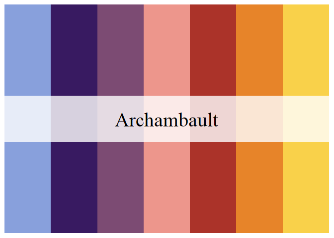
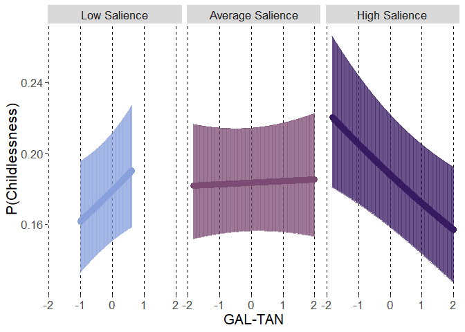

Preregistration available From: https://osf.io/er4v5?view_only=edf4718aa62947dc9277c4a4749e4628

RQ1. Is childlessness associated with the three Chapel Hill rated political ideology (Left-Right, Economic Left-Right, GAL-TAN) positions of the party for which one has voted? 

H1. Regarding GAL-TAN, we expect childless people to have voted closer to the GAL pole of the dimension.

RQ2. If, as expected (H1), childlessness is associated with the GAL-TAN ideology position of the party for which one has voted, are those associations stronger if this dimension is salient in the party’s public stance (i.e., is there a boundary condition to these associations, such that the ideology needs to be salient in order for the association to exist)?

H2. We expect the association between childlessness and the GAL-TAN political ideology of the party for which one has voted to be stronger if this dimension is salient in the party’s public stance.


# Preparations

## Packages


```r
library(lme4)
library(emmeans)
library(rio)
library(dplyr)
library(vjihelpers)
library(ggplot2)
library(MetBrewer)
library(tibble)
library(Hmisc)
```

## Custom functions


```r
source("../custom_functions.R")
```

## Data


```r
fdat<-import("../../data/processed/fdat.xlsx")
```

## Data exclusions


```r
exdat<-fdat %>%
  dplyr::select(childlessness,
                gndr.f,agea,minority,
                gndr.c,age10.c,minority.c,
                lrgen,
                lrecon,galtan,
                lrecon_salience,galtan_salience,
                cntry,
                anweight) %>%
  na.omit()
```

## Variable centering


```r
exdat<-
  group_mean_center(
    data=exdat,group.var="cntry",
    vars=c("lrgen","lrecon","galtan",
           "lrecon_salience","galtan_salience"),
    grand.init = F)
```

## Variable scaling


```r
CHES<-
  import("../../data/raw/2014_CHES_dataset_means.csv")

(sd.lrgen<-sd(CHES$lrgen,na.rm=T))
```

```
## [1] 2.302111
```

```r
(sd.lrecon<-sd(CHES$lrecon,na.rm=T))
```

```
## [1] 2.210724
```

```r
(sd.galtan<-sd(CHES$galtan,na.rm=T))
```

```
## [1] 2.627548
```

```r
(sd.galtan_salience<-sd(CHES$galtan_salience,na.rm=T))
```

```
## [1] 1.551972
```

```r
(sd.lrecon_salience<-sd(CHES$lrecon_salience,na.rm=T))
```

```
## [1] 1.468366
```

```r
exdat$lrgen.z.gmc<-exdat$lrgen.gmc/sd.lrgen
exdat$lrecon.z.gmc<-exdat$lrecon.gmc/sd.lrecon
exdat$galtan.z.gmc<-exdat$galtan.gmc/sd.galtan
exdat$galtan_salience.z.gmc<-
  exdat$galtan_salience.gmc/sd.galtan_salience
exdat$lrecon_salience.z.gmc<-
  exdat$lrecon_salience.gmc/sd.lrecon_salience
```

# RQ1 Analysis 


RQ1. Is childlessness associated with the three Chapel Hill rated political ideology (Left-Right, Economic Left-Right, GAL-TAN) positions of the party for which one has voted? 

H1. Regarding GAL-TAN, we expect childless people to have voted closer to the GAL pole of the dimension.

## Baserate only


```r
mod0<-
  glmer(childlessness~(1|cntry),
        data=exdat,
        family=binomial(link="logit"),weights = anweight)
```

```
## Warning in eval(family$initialize, rho): non-integer #successes in a binomial glm!
```

```r
summary(mod0)
```

```
## Generalized linear mixed model fit by maximum likelihood (Laplace  Approximation)
##  [glmerMod]
##  Family: binomial  ( logit )
## Formula: childlessness ~ (1 | cntry)
##    Data: exdat
## Weights: anweight
## 
##      AIC      BIC   logLik deviance df.resid 
##  17219.9  17235.9  -8608.0  17215.9    21372 
## 
## Scaled residuals: 
##     Min      1Q  Median      3Q     Max 
## -1.9067 -0.4931 -0.3113  0.3660  7.8186 
## 
## Random effects:
##  Groups Name        Variance Std.Dev.
##  cntry  (Intercept) 0.1046   0.3234  
## Number of obs: 21374, groups:  cntry, 20
## 
## Fixed effects:
##             Estimate Std. Error z value Pr(>|z|)    
## (Intercept) -1.07113    0.08228  -13.02   <2e-16 ***
## ---
## Signif. codes:  0 '***' 0.001 '**' 0.01 '*' 0.05 '.' 0.1 ' ' 1
```

```r
export(rownames_to_column(
  getFE_glmer(mod0,round = 10,p.round=10)),
       "../../results/estimates/FE_mod0.xlsx",
       overwrite=T)

export(getVC(mod0,round = 10),
       "../../results/estimates/VC_mod0.xlsx",
       overwrite=T)
```

## Covariates


```r
mod1<-
  glmer(childlessness~gndr.c+age10.c+minority.c+(1|cntry),
        data=exdat,
        family=binomial(link="logit"),weights = anweight)
```

```
## Warning in eval(family$initialize, rho): non-integer #successes in a binomial glm!
```

```r
summary(mod1)
```

```
## Generalized linear mixed model fit by maximum likelihood (Laplace  Approximation)
##  [glmerMod]
##  Family: binomial  ( logit )
## Formula: childlessness ~ gndr.c + age10.c + minority.c + (1 | cntry)
##    Data: exdat
## Weights: anweight
## 
##      AIC      BIC   logLik deviance df.resid 
##  15072.4  15112.2  -7531.2  15062.4    21369 
## 
## Scaled residuals: 
##     Min      1Q  Median      3Q     Max 
## -3.7345 -0.4386 -0.2243  0.2395 12.9768 
## 
## Random effects:
##  Groups Name        Variance Std.Dev.
##  cntry  (Intercept) 0.116    0.3406  
## Number of obs: 21374, groups:  cntry, 20
## 
## Fixed effects:
##             Estimate Std. Error z value Pr(>|z|)    
## (Intercept) -1.28639    0.10000 -12.865  < 2e-16 ***
## gndr.c      -0.30943    0.04045  -7.650 2.01e-14 ***
## age10.c     -0.55489    0.01346 -41.234  < 2e-16 ***
## minority.c  -0.28000    0.10387  -2.696  0.00703 ** 
## ---
## Signif. codes:  0 '***' 0.001 '**' 0.01 '*' 0.05 '.' 0.1 ' ' 1
## 
## Correlation of Fixed Effects:
##            (Intr) gndr.c ag10.c
## gndr.c     0.015               
## age10.c    0.106  0.010        
## minority.c 0.489  0.002  0.093
```

```r
export(rownames_to_column(
  getFE_glmer(mod1,round = 10,p.round=10)),
       "../../results/estimates/FE_mod1.xlsx",
       overwrite=T)

export(getVC(mod1,round = 10),
       "../../results/estimates/VC_mod1.xlsx",
       overwrite=T)
```

## lrgen

### Fixed


```r
mod2.lrgen<-
  glmer(childlessness~gndr.c+age10.c+minority.c+
          lrgen.z.gmc+
          (1|cntry),
        data=exdat,
        family=binomial(link="logit"),weights = anweight)
```

```
## Warning in eval(family$initialize, rho): non-integer #successes in a binomial glm!
```

```r
summary(mod2.lrgen)
```

```
## Generalized linear mixed model fit by maximum likelihood (Laplace  Approximation)
##  [glmerMod]
##  Family: binomial  ( logit )
## Formula: childlessness ~ gndr.c + age10.c + minority.c + lrgen.z.gmc +  
##     (1 | cntry)
##    Data: exdat
## Weights: anweight
## 
##      AIC      BIC   logLik deviance df.resid 
##  15074.2  15122.0  -7531.1  15062.2    21368 
## 
## Scaled residuals: 
##     Min      1Q  Median      3Q     Max 
## -3.7200 -0.4387 -0.2245  0.2403 12.9067 
## 
## Random effects:
##  Groups Name        Variance Std.Dev.
##  cntry  (Intercept) 0.1158   0.3404  
## Number of obs: 21374, groups:  cntry, 20
## 
## Fixed effects:
##             Estimate Std. Error z value Pr(>|z|)    
## (Intercept) -1.28811    0.10002 -12.878  < 2e-16 ***
## gndr.c      -0.30981    0.04046  -7.657  1.9e-14 ***
## age10.c     -0.55477    0.01346 -41.215  < 2e-16 ***
## minority.c  -0.28373    0.10420  -2.723  0.00647 ** 
## lrgen.z.gmc -0.01075    0.02345  -0.458  0.64671    
## ---
## Signif. codes:  0 '***' 0.001 '**' 0.01 '*' 0.05 '.' 0.1 ' ' 1
## 
## Correlation of Fixed Effects:
##             (Intr) gndr.c ag10.c mnrty.
## gndr.c       0.016                     
## age10.c      0.106  0.009              
## minority.c   0.490  0.003  0.091       
## lrgen.z.gmc  0.038  0.020 -0.018  0.078
```

```r
export(rownames_to_column(
  getFE_glmer(mod2.lrgen,round = 10,p.round=10)),
       "../../results/estimates/FE_mod2.lrgen.xlsx",
       overwrite=T)

export(getVC(mod2.lrgen,round = 10),
       "../../results/estimates/VC_mod2.lrgen.xlsx",
       overwrite=T)
```

### Random


```r
mod3.lrgen<-
  glmer(childlessness~gndr.c+age10.c+minority.c+
          lrgen.z.gmc+
          (lrgen.z.gmc|cntry),
        data=exdat,
        family=binomial(link="logit"),weights = anweight,
        control = glmerControl(optimizer="bobyqa",
                               optCtrl=list(maxfun=2e6)))
```

```
## Warning in eval(family$initialize, rho): non-integer #successes in a binomial glm!
```

```
## boundary (singular) fit: see help('isSingular')
```

```r
summary(mod3.lrgen)
```

```
## Generalized linear mixed model fit by maximum likelihood (Laplace  Approximation)
##  [glmerMod]
##  Family: binomial  ( logit )
## Formula: childlessness ~ gndr.c + age10.c + minority.c + lrgen.z.gmc +  
##     (lrgen.z.gmc | cntry)
##    Data: exdat
## Weights: anweight
## Control: glmerControl(optimizer = "bobyqa", optCtrl = list(maxfun = 2e+06))
## 
##      AIC      BIC   logLik deviance df.resid 
##  15077.8  15141.5  -7530.9  15061.8    21366 
## 
## Scaled residuals: 
##     Min      1Q  Median      3Q     Max 
## -3.7199 -0.4388 -0.2245  0.2393 13.0740 
## 
## Random effects:
##  Groups Name        Variance  Std.Dev. Corr 
##  cntry  (Intercept) 0.1151096 0.33928       
##         lrgen.z.gmc 0.0001529 0.01236  -1.00
## Number of obs: 21374, groups:  cntry, 20
## 
## Fixed effects:
##             Estimate Std. Error z value Pr(>|z|)    
## (Intercept) -1.28748    0.09984 -12.896  < 2e-16 ***
## gndr.c      -0.30926    0.04047  -7.642 2.14e-14 ***
## age10.c     -0.55458    0.01346 -41.197  < 2e-16 ***
## minority.c  -0.28414    0.10425  -2.725  0.00642 ** 
## lrgen.z.gmc -0.00907    0.02378  -0.381  0.70295    
## ---
## Signif. codes:  0 '***' 0.001 '**' 0.01 '*' 0.05 '.' 0.1 ' ' 1
## 
## Correlation of Fixed Effects:
##             (Intr) gndr.c ag10.c mnrty.
## gndr.c       0.016                     
## age10.c      0.106  0.009              
## minority.c   0.491  0.003  0.091       
## lrgen.z.gmc -0.071  0.023 -0.017  0.075
## optimizer (bobyqa) convergence code: 0 (OK)
## boundary (singular) fit: see help('isSingular')
```

```r
anova(mod2.lrgen,mod3.lrgen)
```

```
## Data: exdat
## Models:
## mod2.lrgen: childlessness ~ gndr.c + age10.c + minority.c + lrgen.z.gmc + (1 | cntry)
## mod3.lrgen: childlessness ~ gndr.c + age10.c + minority.c + lrgen.z.gmc + (lrgen.z.gmc | cntry)
##            npar   AIC   BIC  logLik deviance  Chisq Df Pr(>Chisq)
## mod2.lrgen    6 15074 15122 -7531.1    15062                     
## mod3.lrgen    8 15078 15142 -7530.9    15062 0.3852  2     0.8248
```

```r
export(rownames_to_column(
  getFE_glmer(mod3.lrgen,round = 10,p.round=10)),
       "../../results/estimates/FE_mod3.lrgen.xlsx",
       overwrite=T)

export(getVC(mod3.lrgen,round = 10),
       "../../results/estimates/VC_mod3.lrgen.xlsx",
       overwrite=T)
```


### Random without random effect correlation


```r
mod4.lrgen<-
  glmer(childlessness~gndr.c+age10.c+minority.c+
          lrgen.z.gmc+
          (lrgen.z.gmc||cntry),
        data=exdat,
        family=binomial(link="logit"),weights = anweight,
        control = glmerControl(optimizer="bobyqa",
                               optCtrl=list(maxfun=2e6)))
```

```
## Warning in eval(family$initialize, rho): non-integer #successes in a binomial glm!
```

```
## boundary (singular) fit: see help('isSingular')
```

```r
summary(mod4.lrgen)
```

```
## Generalized linear mixed model fit by maximum likelihood (Laplace  Approximation)
##  [glmerMod]
##  Family: binomial  ( logit )
## Formula: childlessness ~ gndr.c + age10.c + minority.c + lrgen.z.gmc +  
##     (lrgen.z.gmc || cntry)
##    Data: exdat
## Weights: anweight
## Control: glmerControl(optimizer = "bobyqa", optCtrl = list(maxfun = 2e+06))
## 
##      AIC      BIC   logLik deviance df.resid 
##  15076.2  15131.9  -7531.1  15062.2    21367 
## 
## Scaled residuals: 
##     Min      1Q  Median      3Q     Max 
## -3.7200 -0.4387 -0.2245  0.2403 12.9067 
## 
## Random effects:
##  Groups  Name        Variance Std.Dev.
##  cntry   (Intercept) 0.1158   0.3404  
##  cntry.1 lrgen.z.gmc 0.0000   0.0000  
## Number of obs: 21374, groups:  cntry, 20
## 
## Fixed effects:
##             Estimate Std. Error z value Pr(>|z|)    
## (Intercept) -1.28810    0.10002 -12.878  < 2e-16 ***
## gndr.c      -0.30981    0.04046  -7.657  1.9e-14 ***
## age10.c     -0.55477    0.01346 -41.215  < 2e-16 ***
## minority.c  -0.28372    0.10419  -2.723  0.00647 ** 
## lrgen.z.gmc -0.01075    0.02345  -0.458  0.64673    
## ---
## Signif. codes:  0 '***' 0.001 '**' 0.01 '*' 0.05 '.' 0.1 ' ' 1
## 
## Correlation of Fixed Effects:
##             (Intr) gndr.c ag10.c mnrty.
## gndr.c       0.016                     
## age10.c      0.106  0.009              
## minority.c   0.490  0.003  0.091       
## lrgen.z.gmc  0.038  0.020 -0.018  0.078
## optimizer (bobyqa) convergence code: 0 (OK)
## boundary (singular) fit: see help('isSingular')
```

```r
anova(mod2.lrgen,mod4.lrgen)
```

```
## Data: exdat
## Models:
## mod2.lrgen: childlessness ~ gndr.c + age10.c + minority.c + lrgen.z.gmc + (1 | cntry)
## mod4.lrgen: childlessness ~ gndr.c + age10.c + minority.c + lrgen.z.gmc + (lrgen.z.gmc || cntry)
##            npar   AIC   BIC  logLik deviance Chisq Df Pr(>Chisq)
## mod2.lrgen    6 15074 15122 -7531.1    15062                    
## mod4.lrgen    7 15076 15132 -7531.1    15062     0  1     0.9999
```

```r
anova(mod4.lrgen,mod3.lrgen)
```

```
## Data: exdat
## Models:
## mod4.lrgen: childlessness ~ gndr.c + age10.c + minority.c + lrgen.z.gmc + (lrgen.z.gmc || cntry)
## mod3.lrgen: childlessness ~ gndr.c + age10.c + minority.c + lrgen.z.gmc + (lrgen.z.gmc | cntry)
##            npar   AIC   BIC  logLik deviance  Chisq Df Pr(>Chisq)
## mod4.lrgen    7 15076 15132 -7531.1    15062                     
## mod3.lrgen    8 15078 15142 -7530.9    15062 0.3852  1     0.5348
```

```r
export(rownames_to_column(
  getFE_glmer(mod4.lrgen,round = 10,p.round=10)),
       "../../results/estimates/FE_mod4.lrgen.xlsx",
       overwrite=T)

export(getVC(mod4.lrgen,round = 10),
       "../../results/estimates/VC_mod4.lrgen.xlsx",
       overwrite=T)
```


## lrecon

### Fixed


```r
mod2.lrecon<-
  glmer(childlessness~gndr.c+age10.c+minority.c+
          lrecon.z.gmc+
          (1|cntry),
        data=exdat,
        family=binomial(link="logit"),weights = anweight)
```

```
## Warning in eval(family$initialize, rho): non-integer #successes in a binomial glm!
```

```r
summary(mod2.lrecon)
```

```
## Generalized linear mixed model fit by maximum likelihood (Laplace  Approximation)
##  [glmerMod]
##  Family: binomial  ( logit )
## Formula: childlessness ~ gndr.c + age10.c + minority.c + lrecon.z.gmc +  
##     (1 | cntry)
##    Data: exdat
## Weights: anweight
## 
##      AIC      BIC   logLik deviance df.resid 
##  15074.0  15121.8  -7531.0  15062.0    21368 
## 
## Scaled residuals: 
##     Min      1Q  Median      3Q     Max 
## -3.7079 -0.4382 -0.2246  0.2410 12.9028 
## 
## Random effects:
##  Groups Name        Variance Std.Dev.
##  cntry  (Intercept) 0.1158   0.3403  
## Number of obs: 21374, groups:  cntry, 20
## 
## Fixed effects:
##              Estimate Std. Error z value Pr(>|z|)    
## (Intercept)  -1.28878    0.10002 -12.885  < 2e-16 ***
## gndr.c       -0.30994    0.04046  -7.661 1.85e-14 ***
## age10.c      -0.55466    0.01346 -41.200  < 2e-16 ***
## minority.c   -0.28506    0.10419  -2.736  0.00622 ** 
## lrecon.z.gmc -0.01474    0.02332  -0.632  0.52736    
## ---
## Signif. codes:  0 '***' 0.001 '**' 0.01 '*' 0.05 '.' 0.1 ' ' 1
## 
## Correlation of Fixed Effects:
##             (Intr) gndr.c ag10.c mnrty.
## gndr.c       0.016                     
## age10.c      0.105  0.009              
## minority.c   0.490  0.003  0.090       
## lrecn.z.gmc  0.039  0.020 -0.025  0.077
```

```r
export(rownames_to_column(
  getFE_glmer(mod2.lrecon,round = 10,p.round=10)),
       "../../results/estimates/FE_mod2.lrecon.xlsx",
       overwrite=T)

export(getVC(mod2.lrecon,round = 10),
       "../../results/estimates/VC_mod2.lrecon.xlsx",
       overwrite=T)
```

### Random


```r
mod3.lrecon<-
  glmer(childlessness~gndr.c+age10.c+minority.c+
          lrecon.z.gmc+
          (lrecon.z.gmc|cntry),
        data=exdat,
        family=binomial(link="logit"),weights = anweight,
        control = glmerControl(optimizer="bobyqa",
                               optCtrl=list(maxfun=2e6)))
```

```
## Warning in eval(family$initialize, rho): non-integer #successes in a binomial glm!
```

```
## boundary (singular) fit: see help('isSingular')
```

```r
summary(mod3.lrecon)
```

```
## Generalized linear mixed model fit by maximum likelihood (Laplace  Approximation)
##  [glmerMod]
##  Family: binomial  ( logit )
## Formula: childlessness ~ gndr.c + age10.c + minority.c + lrecon.z.gmc +  
##     (lrecon.z.gmc | cntry)
##    Data: exdat
## Weights: anweight
## Control: glmerControl(optimizer = "bobyqa", optCtrl = list(maxfun = 2e+06))
## 
##      AIC      BIC   logLik deviance df.resid 
##  15074.4  15138.2  -7529.2  15058.4    21366 
## 
## Scaled residuals: 
##     Min      1Q  Median      3Q     Max 
## -3.7112 -0.4395 -0.2254  0.2382 13.3925 
## 
## Random effects:
##  Groups Name         Variance Std.Dev. Corr 
##  cntry  (Intercept)  0.113286 0.33658       
##         lrecon.z.gmc 0.001825 0.04272  -1.00
## Number of obs: 21374, groups:  cntry, 20
## 
## Fixed effects:
##               Estimate Std. Error z value Pr(>|z|)    
## (Intercept)  -1.283323   0.099335 -12.919  < 2e-16 ***
## gndr.c       -0.308097   0.040478  -7.612 2.71e-14 ***
## age10.c      -0.553815   0.013465 -41.131  < 2e-16 ***
## minority.c   -0.284340   0.104376  -2.724  0.00645 ** 
## lrecon.z.gmc -0.006025   0.025959  -0.232  0.81647    
## ---
## Signif. codes:  0 '***' 0.001 '**' 0.01 '*' 0.05 '.' 0.1 ' ' 1
## 
## Correlation of Fixed Effects:
##             (Intr) gndr.c ag10.c mnrty.
## gndr.c       0.016                     
## age10.c      0.106  0.010              
## minority.c   0.495  0.003  0.090       
## lrecn.z.gmc -0.304  0.022 -0.021  0.065
## optimizer (bobyqa) convergence code: 0 (OK)
## boundary (singular) fit: see help('isSingular')
```

```r
anova(mod2.lrecon,mod3.lrecon)
```

```
## Data: exdat
## Models:
## mod2.lrecon: childlessness ~ gndr.c + age10.c + minority.c + lrecon.z.gmc + (1 | cntry)
## mod3.lrecon: childlessness ~ gndr.c + age10.c + minority.c + lrecon.z.gmc + (lrecon.z.gmc | cntry)
##             npar   AIC   BIC  logLik deviance  Chisq Df Pr(>Chisq)
## mod2.lrecon    6 15074 15122 -7531.0    15062                     
## mod3.lrecon    8 15074 15138 -7529.2    15058 3.5463  2     0.1698
```

```r
export(rownames_to_column(
  getFE_glmer(mod3.lrecon,round = 10,p.round=10)),
       "../../results/estimates/FE_mod3.lrecon.xlsx",
       overwrite=T)

export(getVC(mod3.lrecon,round = 10),
       "../../results/estimates/VC_mod3.lrecon.xlsx",
       overwrite=T)
```


### Random without random effect correlation


```r
mod4.lrecon<-
  glmer(childlessness~gndr.c+age10.c+minority.c+
          lrecon.z.gmc+
          (lrecon.z.gmc||cntry),
        data=exdat,
        family=binomial(link="logit"),weights = anweight,
        control = glmerControl(optimizer="bobyqa",
                               optCtrl=list(maxfun=2e6)))
```

```
## Warning in eval(family$initialize, rho): non-integer #successes in a binomial glm!
```

```
## boundary (singular) fit: see help('isSingular')
```

```r
summary(mod4.lrecon)
```

```
## Generalized linear mixed model fit by maximum likelihood (Laplace  Approximation)
##  [glmerMod]
##  Family: binomial  ( logit )
## Formula: childlessness ~ gndr.c + age10.c + minority.c + lrecon.z.gmc +  
##     (lrecon.z.gmc || cntry)
##    Data: exdat
## Weights: anweight
## Control: glmerControl(optimizer = "bobyqa", optCtrl = list(maxfun = 2e+06))
## 
##      AIC      BIC   logLik deviance df.resid 
##  15076.0  15131.8  -7531.0  15062.0    21367 
## 
## Scaled residuals: 
##     Min      1Q  Median      3Q     Max 
## -3.7079 -0.4382 -0.2246  0.2410 12.9028 
## 
## Random effects:
##  Groups  Name         Variance Std.Dev.
##  cntry   (Intercept)  0.1158   0.3403  
##  cntry.1 lrecon.z.gmc 0.0000   0.0000  
## Number of obs: 21374, groups:  cntry, 20
## 
## Fixed effects:
##              Estimate Std. Error z value Pr(>|z|)    
## (Intercept)  -1.28879    0.10002 -12.886  < 2e-16 ***
## gndr.c       -0.30994    0.04046  -7.661 1.85e-14 ***
## age10.c      -0.55466    0.01346 -41.200  < 2e-16 ***
## minority.c   -0.28506    0.10419  -2.736  0.00622 ** 
## lrecon.z.gmc -0.01473    0.02332  -0.632  0.52744    
## ---
## Signif. codes:  0 '***' 0.001 '**' 0.01 '*' 0.05 '.' 0.1 ' ' 1
## 
## Correlation of Fixed Effects:
##             (Intr) gndr.c ag10.c mnrty.
## gndr.c       0.016                     
## age10.c      0.105  0.009              
## minority.c   0.490  0.003  0.090       
## lrecn.z.gmc  0.039  0.020 -0.025  0.077
## optimizer (bobyqa) convergence code: 0 (OK)
## boundary (singular) fit: see help('isSingular')
```

```r
anova(mod2.lrecon,mod4.lrecon)
```

```
## Data: exdat
## Models:
## mod2.lrecon: childlessness ~ gndr.c + age10.c + minority.c + lrecon.z.gmc + (1 | cntry)
## mod4.lrecon: childlessness ~ gndr.c + age10.c + minority.c + lrecon.z.gmc + (lrecon.z.gmc || cntry)
##             npar   AIC   BIC logLik deviance Chisq Df Pr(>Chisq)
## mod2.lrecon    6 15074 15122  -7531    15062                    
## mod4.lrecon    7 15076 15132  -7531    15062     0  1     0.9998
```

```r
anova(mod4.lrecon,mod3.lrecon)
```

```
## Data: exdat
## Models:
## mod4.lrecon: childlessness ~ gndr.c + age10.c + minority.c + lrecon.z.gmc + (lrecon.z.gmc || cntry)
## mod3.lrecon: childlessness ~ gndr.c + age10.c + minority.c + lrecon.z.gmc + (lrecon.z.gmc | cntry)
##             npar   AIC   BIC  logLik deviance  Chisq Df Pr(>Chisq)  
## mod4.lrecon    7 15076 15132 -7531.0    15062                       
## mod3.lrecon    8 15074 15138 -7529.2    15058 3.5463  1    0.05968 .
## ---
## Signif. codes:  0 '***' 0.001 '**' 0.01 '*' 0.05 '.' 0.1 ' ' 1
```

```r
export(rownames_to_column(
  getFE_glmer(mod4.lrecon,round = 10,p.round=10)),
       "../../results/estimates/FE_mod4.lrecon.xlsx",
       overwrite=T)

export(getVC(mod4.lrecon,round = 10),
       "../../results/estimates/VC_mod4.lrecon.xlsx",
       overwrite=T)
```


## galtan

### Fixed


```r
mod2.galtan<-
  glmer(childlessness~gndr.c+age10.c+minority.c+
          galtan.z.gmc+
          (1|cntry),
        data=exdat,
        family=binomial(link="logit"),weights = anweight)
```

```
## Warning in eval(family$initialize, rho): non-integer #successes in a binomial glm!
```

```r
summary(mod2.galtan)
```

```
## Generalized linear mixed model fit by maximum likelihood (Laplace  Approximation)
##  [glmerMod]
##  Family: binomial  ( logit )
## Formula: childlessness ~ gndr.c + age10.c + minority.c + galtan.z.gmc +  
##     (1 | cntry)
##    Data: exdat
## Weights: anweight
## 
##      AIC      BIC   logLik deviance df.resid 
##  15072.0  15119.8  -7530.0  15060.0    21368 
## 
## Scaled residuals: 
##     Min      1Q  Median      3Q     Max 
## -3.7183 -0.4386 -0.2245  0.2419 12.7554 
## 
## Random effects:
##  Groups Name        Variance Std.Dev.
##  cntry  (Intercept) 0.1151   0.3393  
## Number of obs: 21374, groups:  cntry, 20
## 
## Fixed effects:
##              Estimate Std. Error z value Pr(>|z|)    
## (Intercept)  -1.29045    0.09981 -12.929  < 2e-16 ***
## gndr.c       -0.31057    0.04046  -7.676 1.64e-14 ***
## age10.c      -0.55355    0.01348 -41.050  < 2e-16 ***
## minority.c   -0.28771    0.10398  -2.767  0.00566 ** 
## galtan.z.gmc -0.03717    0.02421  -1.535  0.12468    
## ---
## Signif. codes:  0 '***' 0.001 '**' 0.01 '*' 0.05 '.' 0.1 ' ' 1
## 
## Correlation of Fixed Effects:
##             (Intr) gndr.c ag10.c mnrty.
## gndr.c       0.015                     
## age10.c      0.105  0.008              
## minority.c   0.490  0.003  0.089       
## galtn.z.gmc  0.028  0.019 -0.061  0.048
```

```r
export(rownames_to_column(
  getFE_glmer(mod2.galtan,round = 10,p.round=10)),
       "../../results/estimates/FE_mod2.galtan.xlsx",
       overwrite=T)

export(getVC(mod2.galtan,round = 10),
       "../../results/estimates/VC_mod2.galtan.xlsx",
       overwrite=T)
```

### Random


```r
mod3.galtan<-
  glmer(childlessness~gndr.c+age10.c+minority.c+
          galtan.z.gmc+
          (galtan.z.gmc|cntry),
        data=exdat,
        family=binomial(link="logit"),weights = anweight,
        control = glmerControl(optimizer="bobyqa",
                               optCtrl=list(maxfun=2e6)))
```

```
## Warning in eval(family$initialize, rho): non-integer #successes in a binomial glm!
```

```
## boundary (singular) fit: see help('isSingular')
```

```r
summary(mod3.galtan)
```

```
## Generalized linear mixed model fit by maximum likelihood (Laplace  Approximation)
##  [glmerMod]
##  Family: binomial  ( logit )
## Formula: childlessness ~ gndr.c + age10.c + minority.c + galtan.z.gmc +  
##     (galtan.z.gmc | cntry)
##    Data: exdat
## Weights: anweight
## Control: glmerControl(optimizer = "bobyqa", optCtrl = list(maxfun = 2e+06))
## 
##      AIC      BIC   logLik deviance df.resid 
##  15075.8  15139.5  -7529.9  15059.8    21366 
## 
## Scaled residuals: 
##     Min      1Q  Median      3Q     Max 
## -3.7418 -0.4384 -0.2246  0.2421 12.8668 
## 
## Random effects:
##  Groups Name         Variance  Std.Dev. Corr 
##  cntry  (Intercept)  1.143e-01 0.338016      
##         galtan.z.gmc 9.991e-05 0.009995 -1.00
## Number of obs: 21374, groups:  cntry, 20
## 
## Fixed effects:
##              Estimate Std. Error z value Pr(>|z|)    
## (Intercept)  -1.28982    0.09957 -12.954  < 2e-16 ***
## gndr.c       -0.31048    0.04046  -7.673 1.68e-14 ***
## age10.c      -0.55332    0.01349 -41.012  < 2e-16 ***
## minority.c   -0.28781    0.10402  -2.767  0.00566 ** 
## galtan.z.gmc -0.03534    0.02464  -1.434  0.15153    
## ---
## Signif. codes:  0 '***' 0.001 '**' 0.01 '*' 0.05 '.' 0.1 ' ' 1
## 
## Correlation of Fixed Effects:
##             (Intr) gndr.c ag10.c mnrty.
## gndr.c       0.015                     
## age10.c      0.105  0.008              
## minority.c   0.492  0.003  0.089       
## galtn.z.gmc -0.056  0.020 -0.055  0.047
## optimizer (bobyqa) convergence code: 0 (OK)
## boundary (singular) fit: see help('isSingular')
```

```r
anova(mod2.galtan,mod3.galtan)
```

```
## Data: exdat
## Models:
## mod2.galtan: childlessness ~ gndr.c + age10.c + minority.c + galtan.z.gmc + (1 | cntry)
## mod3.galtan: childlessness ~ gndr.c + age10.c + minority.c + galtan.z.gmc + (galtan.z.gmc | cntry)
##             npar   AIC   BIC  logLik deviance  Chisq Df Pr(>Chisq)
## mod2.galtan    6 15072 15120 -7530.0    15060                     
## mod3.galtan    8 15076 15140 -7529.9    15060 0.2211  2     0.8953
```

```r
export(rownames_to_column(
  getFE_glmer(mod3.galtan,round = 10,p.round=10)),
       "../../results/estimates/FE_mod3.galtan.xlsx",
       overwrite=T)

export(getVC(mod3.galtan,round = 10),
       "../../results/estimates/VC_mod3.galtan.xlsx",
       overwrite=T)
```


### Random without random effect correlation


```r
mod4.galtan<-
  glmer(childlessness~gndr.c+age10.c+minority.c+
          galtan.z.gmc+
          (galtan.z.gmc||cntry),
        data=exdat,
        family=binomial(link="logit"),weights = anweight,
        control = glmerControl(optimizer="bobyqa",
                               optCtrl=list(maxfun=2e6)))
```

```
## Warning in eval(family$initialize, rho): non-integer #successes in a binomial glm!
```

```
## boundary (singular) fit: see help('isSingular')
```

```r
summary(mod4.galtan)
```

```
## Generalized linear mixed model fit by maximum likelihood (Laplace  Approximation)
##  [glmerMod]
##  Family: binomial  ( logit )
## Formula: childlessness ~ gndr.c + age10.c + minority.c + galtan.z.gmc +  
##     (galtan.z.gmc || cntry)
##    Data: exdat
## Weights: anweight
## Control: glmerControl(optimizer = "bobyqa", optCtrl = list(maxfun = 2e+06))
## 
##      AIC      BIC   logLik deviance df.resid 
##  15074.0  15129.8  -7530.0  15060.0    21367 
## 
## Scaled residuals: 
##     Min      1Q  Median      3Q     Max 
## -3.7183 -0.4386 -0.2245  0.2419 12.7554 
## 
## Random effects:
##  Groups  Name         Variance Std.Dev.
##  cntry   (Intercept)  0.1151   0.3393  
##  cntry.1 galtan.z.gmc 0.0000   0.0000  
## Number of obs: 21374, groups:  cntry, 20
## 
## Fixed effects:
##              Estimate Std. Error z value Pr(>|z|)    
## (Intercept)  -1.29044    0.09981 -12.930  < 2e-16 ***
## gndr.c       -0.31057    0.04046  -7.676 1.64e-14 ***
## age10.c      -0.55355    0.01348 -41.050  < 2e-16 ***
## minority.c   -0.28769    0.10399  -2.767  0.00566 ** 
## galtan.z.gmc -0.03717    0.02421  -1.535  0.12468    
## ---
## Signif. codes:  0 '***' 0.001 '**' 0.01 '*' 0.05 '.' 0.1 ' ' 1
## 
## Correlation of Fixed Effects:
##             (Intr) gndr.c ag10.c mnrty.
## gndr.c       0.015                     
## age10.c      0.105  0.008              
## minority.c   0.490  0.003  0.089       
## galtn.z.gmc  0.028  0.019 -0.061  0.048
## optimizer (bobyqa) convergence code: 0 (OK)
## boundary (singular) fit: see help('isSingular')
```

```r
anova(mod2.galtan,mod4.galtan)
```

```
## Data: exdat
## Models:
## mod2.galtan: childlessness ~ gndr.c + age10.c + minority.c + galtan.z.gmc + (1 | cntry)
## mod4.galtan: childlessness ~ gndr.c + age10.c + minority.c + galtan.z.gmc + (galtan.z.gmc || cntry)
##             npar   AIC   BIC logLik deviance Chisq Df Pr(>Chisq)
## mod2.galtan    6 15072 15120  -7530    15060                    
## mod4.galtan    7 15074 15130  -7530    15060     0  1     0.9999
```

```r
anova(mod4.galtan,mod3.galtan)
```

```
## Data: exdat
## Models:
## mod4.galtan: childlessness ~ gndr.c + age10.c + minority.c + galtan.z.gmc + (galtan.z.gmc || cntry)
## mod3.galtan: childlessness ~ gndr.c + age10.c + minority.c + galtan.z.gmc + (galtan.z.gmc | cntry)
##             npar   AIC   BIC  logLik deviance  Chisq Df Pr(>Chisq)
## mod4.galtan    7 15074 15130 -7530.0    15060                     
## mod3.galtan    8 15076 15140 -7529.9    15060 0.2211  1     0.6382
```

```r
export(rownames_to_column(
  getFE_glmer(mod4.galtan,round = 10,p.round=10)),
       "../../results/estimates/FE_mod4.galtan.xlsx",
       overwrite=T)

export(getVC(mod4.galtan,round = 10),
       "../../results/estimates/VC_mod4.galtan.xlsx",
       overwrite=T)
```


# RQ2 Analysis 

RQ2. If, as expected (H1), childlessness is associated with the GAL-TAN ideology position of the party for which one has voted, are those associations stronger if this dimension is salient in the party’s public stance (i.e., is there a boundary condition to these associations, such that the ideology needs to be salient in order for the association to exist)?

H2. We expect the association between childlessness and the GAL-TAN political ideology of the party for which one has voted to be stronger if this dimension is salient in the party’s public stance.

## galtan salience fixed main effect


```r
mod5.galtan<-
  glmer(childlessness~gndr.c+age10.c+minority.c+
          galtan.z.gmc+galtan_salience.z.gmc+
          (1|cntry),
        data=exdat,
        family=binomial(link="logit"),weights = anweight,
        control = glmerControl(optimizer="bobyqa"))
```

```
## Warning in eval(family$initialize, rho): non-integer #successes in a binomial glm!
```

```r
summary(mod5.galtan)
```

```
## Generalized linear mixed model fit by maximum likelihood (Laplace  Approximation)
##  [glmerMod]
##  Family: binomial  ( logit )
## Formula: childlessness ~ gndr.c + age10.c + minority.c + galtan.z.gmc +  
##     galtan_salience.z.gmc + (1 | cntry)
##    Data: exdat
## Weights: anweight
## Control: glmerControl(optimizer = "bobyqa")
## 
##      AIC      BIC   logLik deviance df.resid 
##  15073.2  15129.0  -7529.6  15059.2    21367 
## 
## Scaled residuals: 
##     Min      1Q  Median      3Q     Max 
## -3.7931 -0.4381 -0.2244  0.2411 12.7627 
## 
## Random effects:
##  Groups Name        Variance Std.Dev.
##  cntry  (Intercept) 0.1146   0.3385  
## Number of obs: 21374, groups:  cntry, 20
## 
## Fixed effects:
##                       Estimate Std. Error z value Pr(>|z|)    
## (Intercept)           -1.28945    0.09967 -12.937  < 2e-16 ***
## gndr.c                -0.31103    0.04047  -7.686 1.52e-14 ***
## age10.c               -0.55274    0.01351 -40.909  < 2e-16 ***
## minority.c            -0.28428    0.10405  -2.732  0.00629 ** 
## galtan.z.gmc          -0.04012    0.02437  -1.646  0.09970 .  
## galtan_salience.z.gmc  0.03033    0.03317   0.914  0.36055    
## ---
## Signif. codes:  0 '***' 0.001 '**' 0.01 '*' 0.05 '.' 0.1 ' ' 1
## 
## Correlation of Fixed Effects:
##             (Intr) gndr.c ag10.c mnrty. gltn..
## gndr.c       0.015                            
## age10.c      0.105  0.007                     
## minority.c   0.491  0.002  0.091              
## galtn.z.gmc  0.026  0.021 -0.069  0.043       
## gltn_slnc..  0.010 -0.013  0.063  0.036 -0.134
```

```r
export(rownames_to_column(
  getFE_glmer(mod5.galtan,round = 10,p.round=10)),
       "../../results/estimates/FE_mod5.galtan.xlsx",
       overwrite=T)

export(getVC(mod5.galtan,round = 10),
       "../../results/estimates/VC_mod5.galtan.xlsx",
       overwrite=T)
```

## galtan salience random main effect


```r
mod6.galtan<-
  glmer(childlessness~gndr.c+age10.c+minority.c+
          galtan.z.gmc+galtan_salience.z.gmc+
          (galtan_salience.z.gmc|cntry),
        data=exdat,
        family=binomial(link="logit"),weights = anweight,
        control = glmerControl(optimizer="bobyqa"))
```

```
## Warning in eval(family$initialize, rho): non-integer #successes in a binomial glm!
```

```
## boundary (singular) fit: see help('isSingular')
```

```r
summary(mod6.galtan)
```

```
## Generalized linear mixed model fit by maximum likelihood (Laplace  Approximation)
##  [glmerMod]
##  Family: binomial  ( logit )
## Formula: childlessness ~ gndr.c + age10.c + minority.c + galtan.z.gmc +  
##     galtan_salience.z.gmc + (galtan_salience.z.gmc | cntry)
##    Data: exdat
## Weights: anweight
## Control: glmerControl(optimizer = "bobyqa")
## 
##      AIC      BIC   logLik deviance df.resid 
##  15072.9  15144.6  -7527.5  15054.9    21365 
## 
## Scaled residuals: 
##     Min      1Q  Median      3Q     Max 
## -3.6812 -0.4380 -0.2244  0.2381 12.8887 
## 
## Random effects:
##  Groups Name                  Variance Std.Dev. Corr 
##  cntry  (Intercept)           0.114741 0.33874       
##         galtan_salience.z.gmc 0.004498 0.06707  -1.00
## Number of obs: 21374, groups:  cntry, 20
## 
## Fixed effects:
##                       Estimate Std. Error z value Pr(>|z|)    
## (Intercept)           -1.29691    0.09983 -12.991  < 2e-16 ***
## gndr.c                -0.30766    0.04050  -7.597 3.03e-14 ***
## age10.c               -0.55372    0.01352 -40.947  < 2e-16 ***
## minority.c            -0.29182    0.10425  -2.799  0.00512 ** 
## galtan.z.gmc          -0.05366    0.02521  -2.128  0.03331 *  
## galtan_salience.z.gmc  0.03637    0.03727   0.976  0.32907    
## ---
## Signif. codes:  0 '***' 0.001 '**' 0.01 '*' 0.05 '.' 0.1 ' ' 1
## 
## Correlation of Fixed Effects:
##             (Intr) gndr.c ag10.c mnrty. gltn..
## gndr.c       0.013                            
## age10.c      0.106  0.005                     
## minority.c   0.492  0.001  0.092              
## galtn.z.gmc  0.032  0.010 -0.056  0.047       
## gltn_slnc.. -0.371 -0.008  0.050  0.023 -0.136
## optimizer (bobyqa) convergence code: 0 (OK)
## boundary (singular) fit: see help('isSingular')
```

```r
anova(mod5.galtan,mod6.galtan)
```

```
## Data: exdat
## Models:
## mod5.galtan: childlessness ~ gndr.c + age10.c + minority.c + galtan.z.gmc + galtan_salience.z.gmc + (1 | cntry)
## mod6.galtan: childlessness ~ gndr.c + age10.c + minority.c + galtan.z.gmc + galtan_salience.z.gmc + (galtan_salience.z.gmc | cntry)
##             npar   AIC   BIC  logLik deviance  Chisq Df Pr(>Chisq)
## mod5.galtan    7 15073 15129 -7529.6    15059                     
## mod6.galtan    9 15073 15145 -7527.5    15055 4.2644  2     0.1186
```

```r
export(rownames_to_column(
  getFE_glmer(mod6.galtan,round = 10,p.round=10)),
       "../../results/estimates/FE_mod6.galtan.xlsx",
       overwrite=T)

export(getVC(mod6.galtan,round = 10),
       "../../results/estimates/VC_mod6.galtan.xlsx",
       overwrite=T)
```

## galtan salience random main effect without random effect correlation


```r
mod7.galtan<-
  glmer(childlessness~gndr.c+age10.c+minority.c+
          galtan.z.gmc+galtan_salience.z.gmc+
          (galtan_salience.z.gmc||cntry),
        data=exdat,
        family=binomial(link="logit"),weights = anweight,
        control = glmerControl(optimizer="bobyqa"))
```

```
## Warning in eval(family$initialize, rho): non-integer #successes in a binomial glm!
```

```r
summary(mod7.galtan)
```

```
## Generalized linear mixed model fit by maximum likelihood (Laplace  Approximation)
##  [glmerMod]
##  Family: binomial  ( logit )
## Formula: childlessness ~ gndr.c + age10.c + minority.c + galtan.z.gmc +  
##     galtan_salience.z.gmc + (galtan_salience.z.gmc || cntry)
##    Data: exdat
## Weights: anweight
## Control: glmerControl(optimizer = "bobyqa")
## 
##      AIC      BIC   logLik deviance df.resid 
##  15075.0  15138.8  -7529.5  15059.0    21366 
## 
## Scaled residuals: 
##     Min      1Q  Median      3Q     Max 
## -3.7704 -0.4383 -0.2243  0.2409 12.7582 
## 
## Random effects:
##  Groups  Name                  Variance Std.Dev.
##  cntry   (Intercept)           0.114632 0.33857 
##  cntry.1 galtan_salience.z.gmc 0.001105 0.03325 
## Number of obs: 21374, groups:  cntry, 20
## 
## Fixed effects:
##                       Estimate Std. Error z value Pr(>|z|)    
## (Intercept)           -1.29034    0.09971 -12.941  < 2e-16 ***
## gndr.c                -0.31008    0.04054  -7.649 2.02e-14 ***
## age10.c               -0.55282    0.01352 -40.897  < 2e-16 ***
## minority.c            -0.28570    0.10413  -2.744  0.00608 ** 
## galtan.z.gmc          -0.04191    0.02495  -1.680  0.09305 .  
## galtan_salience.z.gmc  0.03240    0.03600   0.900  0.36817    
## ---
## Signif. codes:  0 '***' 0.001 '**' 0.01 '*' 0.05 '.' 0.1 ' ' 1
## 
## Correlation of Fixed Effects:
##             (Intr) gndr.c ag10.c mnrty. gltn..
## gndr.c       0.014                            
## age10.c      0.105  0.006                     
## minority.c   0.492  0.000  0.092              
## galtn.z.gmc  0.029  0.009 -0.062  0.047       
## gltn_slnc..  0.003 -0.003  0.056  0.026 -0.143
```

```r
anova(mod5.galtan,mod7.galtan)
```

```
## Data: exdat
## Models:
## mod5.galtan: childlessness ~ gndr.c + age10.c + minority.c + galtan.z.gmc + galtan_salience.z.gmc + (1 | cntry)
## mod7.galtan: childlessness ~ gndr.c + age10.c + minority.c + galtan.z.gmc + galtan_salience.z.gmc + (galtan_salience.z.gmc || cntry)
##             npar   AIC   BIC  logLik deviance  Chisq Df Pr(>Chisq)
## mod5.galtan    7 15073 15129 -7529.6    15059                     
## mod7.galtan    8 15075 15139 -7529.5    15059 0.1623  1     0.6871
```

```r
anova(mod7.galtan,mod6.galtan)
```

```
## Data: exdat
## Models:
## mod7.galtan: childlessness ~ gndr.c + age10.c + minority.c + galtan.z.gmc + galtan_salience.z.gmc + (galtan_salience.z.gmc || cntry)
## mod6.galtan: childlessness ~ gndr.c + age10.c + minority.c + galtan.z.gmc + galtan_salience.z.gmc + (galtan_salience.z.gmc | cntry)
##             npar   AIC   BIC  logLik deviance  Chisq Df Pr(>Chisq)  
## mod7.galtan    8 15075 15139 -7529.5    15059                       
## mod6.galtan    9 15073 15145 -7527.5    15055 4.1021  1    0.04283 *
## ---
## Signif. codes:  0 '***' 0.001 '**' 0.01 '*' 0.05 '.' 0.1 ' ' 1
```

```r
export(rownames_to_column(
  getFE_glmer(mod7.galtan,round = 10,p.round=10)),
       "../../results/estimates/FE_mod7.galtan.xlsx",
       overwrite=T)

export(getVC(mod7.galtan,round = 10),
       "../../results/estimates/VC_mod7.galtan.xlsx",
       overwrite=T)
```

## fixed interaction between galtan and galtan salience


```r
mod8.galtan<-
  glmer(childlessness~gndr.c+age10.c+minority.c+
          galtan.z.gmc+galtan_salience.z.gmc+
          galtan.z.gmc:galtan_salience.z.gmc+
          (galtan_salience.z.gmc||cntry),
        data=exdat,
        family=binomial(link="logit"),weights = anweight,
        control = glmerControl(optimizer="bobyqa",
                               optCtrl=list(maxfun=2e6)))
```

```
## Warning in eval(family$initialize, rho): non-integer #successes in a binomial glm!
```

```r
summary(mod8.galtan)
```

```
## Generalized linear mixed model fit by maximum likelihood (Laplace  Approximation)
##  [glmerMod]
##  Family: binomial  ( logit )
## Formula: childlessness ~ gndr.c + age10.c + minority.c + galtan.z.gmc +  
##     galtan_salience.z.gmc + galtan.z.gmc:galtan_salience.z.gmc +  
##     (galtan_salience.z.gmc || cntry)
##    Data: exdat
## Weights: anweight
## Control: glmerControl(optimizer = "bobyqa", optCtrl = list(maxfun = 2e+06))
## 
##      AIC      BIC   logLik deviance df.resid 
##  15067.4  15139.1  -7524.7  15049.4    21365 
## 
## Scaled residuals: 
##     Min      1Q  Median      3Q     Max 
## -3.9013 -0.4388 -0.2244  0.2404 12.9714 
## 
## Random effects:
##  Groups  Name                  Variance Std.Dev.
##  cntry   (Intercept)           0.108199 0.32894 
##  cntry.1 galtan_salience.z.gmc 0.001882 0.04339 
## Number of obs: 21374, groups:  cntry, 20
## 
## Fixed effects:
##                                     Estimate Std. Error z value Pr(>|z|)    
## (Intercept)                        -1.279440   0.098059 -13.048  < 2e-16 ***
## gndr.c                             -0.308859   0.040574  -7.612 2.69e-14 ***
## age10.c                            -0.551562   0.013528 -40.772  < 2e-16 ***
## minority.c                         -0.281065   0.104245  -2.696  0.00701 ** 
## galtan.z.gmc                        0.006075   0.029571   0.205  0.83724    
## galtan_salience.z.gmc               0.030059   0.037990   0.791  0.42880    
## galtan.z.gmc:galtan_salience.z.gmc -0.115439   0.038348  -3.010  0.00261 ** 
## ---
## Signif. codes:  0 '***' 0.001 '**' 0.01 '*' 0.05 '.' 0.1 ' ' 1
## 
## Correlation of Fixed Effects:
##             (Intr) gndr.c ag10.c mnrty. gltn.. glt_..
## gndr.c       0.015                                   
## age10.c      0.108  0.005                            
## minority.c   0.501  0.001  0.092                     
## galtn.z.gmc  0.042  0.008 -0.038  0.046              
## gltn_slnc..  0.003  0.000  0.049  0.024 -0.127       
## gltn.z.:_.. -0.032 -0.018 -0.016 -0.013 -0.486  0.004
```

```r
export(rownames_to_column(
  getFE_glmer(mod8.galtan,round = 10,p.round=10)),
       "../../results/estimates/FE_mod8.galtan.xlsx",
       overwrite=T)

export(getVC(mod8.galtan,round = 10),
       "../../results/estimates/VC_mod8.galtan.xlsx",
       overwrite=T)
```

### marginal effects


```r
emtrends(mod8.galtan,
         var="galtan.z.gmc",
         specs="galtan_salience.z.gmc",
         at=list(galtan_salience.z.gmc=c(-1,0,1)),
         infer=c(T,T))
```

```
##  galtan_salience.z.gmc galtan.z.gmc.trend     SE  df asymp.LCL asymp.UCL z.ratio
##                     -1            0.12151 0.0587 Inf   0.00645    0.2366   2.070
##                      0            0.00607 0.0296 Inf  -0.05188    0.0640   0.205
##                      1           -0.10936 0.0353 Inf  -0.17848   -0.0402  -3.101
##  p.value
##   0.0385
##   0.8372
##   0.0019
## 
## Results are averaged over the levels of: gndr.c, minority.c 
## Confidence level used: 0.95
```

```r
round(exp(c(0.12151,0.00645,0.2366)),2)
```

```
## [1] 1.13 1.01 1.27
```

```r
round(exp(c(0.00607,-0.05188,0.0640)),2)
```

```
## [1] 1.01 0.95 1.07
```

```r
round(exp(c(-0.10936,-0.17848,-0.0402)),2)
```

```
## [1] 0.90 0.84 0.96
```


## random interaction between galtan and galtan salience


```r
mod9.galtan<-
  glmer(childlessness~gndr.c+age10.c+minority.c+
          galtan.z.gmc+galtan_salience.z.gmc+
          galtan.z.gmc:galtan_salience.z.gmc+
          (galtan_salience.z.gmc+
             galtan.z.gmc:galtan_salience.z.gmc||cntry),
        data=exdat,
        family=binomial(link="logit"),weights = anweight,
        control = glmerControl(optimizer="bobyqa",
                               optCtrl=list(maxfun=2e6)))
```

```
## Warning in eval(family$initialize, rho): non-integer #successes in a binomial glm!
```

```
## boundary (singular) fit: see help('isSingular')
```

```r
summary(mod9.galtan)
```

```
## Generalized linear mixed model fit by maximum likelihood (Laplace  Approximation)
##  [glmerMod]
##  Family: binomial  ( logit )
## Formula: childlessness ~ gndr.c + age10.c + minority.c + galtan.z.gmc +  
##     galtan_salience.z.gmc + galtan.z.gmc:galtan_salience.z.gmc +  
##     (galtan_salience.z.gmc + galtan.z.gmc:galtan_salience.z.gmc ||  
##         cntry)
##    Data: exdat
## Weights: anweight
## Control: glmerControl(optimizer = "bobyqa", optCtrl = list(maxfun = 2e+06))
## 
##      AIC      BIC   logLik deviance df.resid 
##  15069.4  15149.1  -7524.7  15049.4    21364 
## 
## Scaled residuals: 
##     Min      1Q  Median      3Q     Max 
## -3.9013 -0.4388 -0.2244  0.2404 12.9714 
## 
## Random effects:
##  Groups  Name                               Variance Std.Dev.
##  cntry   (Intercept)                        0.108197 0.32893 
##  cntry.1 galtan_salience.z.gmc              0.001882 0.04339 
##  cntry.2 galtan_salience.z.gmc:galtan.z.gmc 0.000000 0.00000 
## Number of obs: 21374, groups:  cntry, 20
## 
## Fixed effects:
##                                     Estimate Std. Error z value Pr(>|z|)    
## (Intercept)                        -1.279440   0.098060 -13.048  < 2e-16 ***
## gndr.c                             -0.308859   0.040574  -7.612 2.69e-14 ***
## age10.c                            -0.551562   0.013528 -40.772  < 2e-16 ***
## minority.c                         -0.281062   0.104247  -2.696  0.00702 ** 
## galtan.z.gmc                        0.006076   0.029571   0.205  0.83722    
## galtan_salience.z.gmc               0.030059   0.037990   0.791  0.42881    
## galtan.z.gmc:galtan_salience.z.gmc -0.115440   0.038348  -3.010  0.00261 ** 
## ---
## Signif. codes:  0 '***' 0.001 '**' 0.01 '*' 0.05 '.' 0.1 ' ' 1
## 
## Correlation of Fixed Effects:
##             (Intr) gndr.c ag10.c mnrty. gltn.. glt_..
## gndr.c       0.015                                   
## age10.c      0.108  0.005                            
## minority.c   0.501  0.001  0.092                     
## galtn.z.gmc  0.042  0.008 -0.038  0.046              
## gltn_slnc..  0.003  0.000  0.049  0.024 -0.127       
## gltn.z.:_.. -0.032 -0.018 -0.016 -0.013 -0.486  0.004
## optimizer (bobyqa) convergence code: 0 (OK)
## boundary (singular) fit: see help('isSingular')
```

```r
anova(mod8.galtan,mod9.galtan)
```

```
## Data: exdat
## Models:
## mod8.galtan: childlessness ~ gndr.c + age10.c + minority.c + galtan.z.gmc + galtan_salience.z.gmc + galtan.z.gmc:galtan_salience.z.gmc + (galtan_salience.z.gmc || cntry)
## mod9.galtan: childlessness ~ gndr.c + age10.c + minority.c + galtan.z.gmc + galtan_salience.z.gmc + galtan.z.gmc:galtan_salience.z.gmc + (galtan_salience.z.gmc + galtan.z.gmc:galtan_salience.z.gmc || cntry)
##             npar   AIC   BIC  logLik deviance Chisq Df Pr(>Chisq)
## mod8.galtan    9 15067 15139 -7524.7    15049                    
## mod9.galtan   10 15069 15149 -7524.7    15049     0  1          1
```

```r
export(rownames_to_column(
  getFE_glmer(mod9.galtan,round = 10,p.round=10)),
       "../../results/estimates/FE_mod9.galtan.xlsx",
       overwrite=T)

export(getVC(mod9.galtan,round = 10),
       "../../results/estimates/VC_mod9.galtan.xlsx",
       overwrite=T)
```


### Plot


```r
p<-
  emmip(mod8.galtan, galtan_salience.z.gmc ~ galtan.z.gmc,
        at=list(galtan_salience.z.gmc = c(-1,0,1),
                #minority.c = c(-0.5,0.5),
                galtan.z.gmc=seq(from=-2,to=2,by=0.01)),
        plotit=F,CIs=TRUE,type="response")

head(p)
```

```
##   galtan_salience.z.gmc galtan.z.gmc      yvar         SE  df       LCL       UCL
## 1                    -1        -2.00 0.1459656 0.01906731 Inf 0.1124071 0.1874273
## 2                     0        -2.00 0.1815825 0.01680794 Inf 0.1509286 0.2168720
## 3                     1        -2.00 0.2236146 0.02249761 Inf 0.1826181 0.2707658
## 4                    -1        -1.99 0.1461172 0.01903070 Inf 0.1126116 0.1874856
## 5                     0        -1.99 0.1815915 0.01678716 Inf 0.1509726 0.2168343
## 6                     1        -1.99 0.2234248 0.02244883 Inf 0.1825142 0.2704715
##   tvar  xvar
## 1   -1 -2.00
## 2    0 -2.00
## 3    1 -2.00
## 4   -1 -1.99
## 5    0 -1.99
## 6    1 -1.99
```

```r
#p$ethnic_minority=
#  ifelse(p$minority.c==(-0.5),
#         "Ethnic majority","Ethnic minority")
p$galtan_salience<-p$tvar
levels(p$galtan_salience)<-c("Low Salience","Average Salience","High Salience")


min.low<-
  min(exdat[exdat$galtan_salience.z.gmc<=(-1),
            "galtan.z.gmc"])
max.low<-
  max(exdat[exdat$galtan_salience.z.gmc<=(-1),
            "galtan.z.gmc"])


p$filter.low<-
  ifelse(p$galtan_salience.z.gmc==(-1) &
           (p$galtan.z.gmc<min.low | 
              p$galtan.z.gmc>max.low),0,1)

table(p$filter.low)
```

```
## 
##   0   1 
## 237 966
```

```r
min.mid<-
  min(exdat[exdat$galtan_salience.z.gmc>(-1) |
              exdat$galtan_salience.z.gmc<(1),
            "galtan.z.gmc"])
max.mid<-
  max(exdat[exdat$galtan_salience.z.gmc>(-1) |
              exdat$galtan_salience.z.gmc<(1),
            "galtan.z.gmc"])


p$filter.mid<-
  ifelse(p$galtan_salience.z.gmc==(0) &
           (p$galtan.z.gmc<min.mid | 
              p$galtan.z.gmc>max.mid),0,1)

table(p$filter.mid)
```

```
## 
##    0    1 
##   17 1186
```

```r
min.high<-
  min(exdat[exdat$galtan_salience.z.gmc>=(1) ,
            "galtan.z.gmc"])
max.high<-
  max(exdat[exdat$galtan_salience.z.gmc>=(1) ,
            "galtan.z.gmc"])


p$filter.high<-
  ifelse(p$galtan_salience.z.gmc==(1) &
           (p$galtan.z.gmc<min.high | 
              p$galtan.z.gmc>max.high),0,1)

table(p$filter.high)
```

```
## 
##    0    1 
##   17 1186
```

```r
p.ex<-p[p$filter.low!=0 & p$filter.mid!=0 & p$filter.high!=0,]

met.brewer("Archambault")
```

<!-- -->

```r
met.brewer("Archambault")[c(1,3,2)]
```

```
## [1] "#88a0dc" "#7c4b73" "#381a61"
```

```r
p1<-ggplot(p.ex,aes(y=yvar,x=xvar,color=galtan_salience))+
  geom_point(size=3)+
  geom_errorbar(aes(ymin=LCL, ymax=UCL),alpha=0.5)+
  xlab("GAL-TAN")+
  ylab("P(Childlessness)")+
  scale_color_manual(values=met.brewer("Archambault")[c(1,3,2)])+
  facet_wrap(~galtan_salience,ncol=3)+
  theme(legend.position = "none",
        text=element_text(size=16,  family="sans"),
        panel.background = element_rect(fill = "white",
                                        #colour = "black",
                                        #size = 0.5, linetype = "solid"
                                        ),
        panel.grid.major.x = element_line(size = 0.5, linetype = 2,
                                        colour = "black"))
p1
```

<!-- -->

```r
png(filename = 
      "../../results/figures/galtan_galtan_salience_nonextrp.png",
    units = "cm",
    width = 29.7,height=21.0,res = 600)
p1
dev.off()
```

```
## png 
##   2
```


### marginal effects


```r
emtrends(mod6.galtan,
         var="galtan.z.gmc",
         specs="galtan_salience.z.gmc",
         at=list(galtan_salience.z.gmc=c(-1,0,1)),infer=c(T,T))
```

```
##  galtan_salience.z.gmc galtan.z.gmc.trend     SE  df asymp.LCL asymp.UCL z.ratio
##                     -1            -0.0537 0.0252 Inf    -0.103  -0.00425  -2.128
##                      0            -0.0537 0.0252 Inf    -0.103  -0.00425  -2.128
##                      1            -0.0537 0.0252 Inf    -0.103  -0.00425  -2.128
##  p.value
##   0.0333
##   0.0333
##   0.0333
## 
## Results are averaged over the levels of: gndr.c, minority.c 
## Confidence level used: 0.95
```


# Session Information


```r
sinf<-sessionInfo()
print(sinf,locale=F)
```

```
## R version 4.2.0 (2022-04-22 ucrt)
## Platform: x86_64-w64-mingw32/x64 (64-bit)
## Running under: Windows 10 x64 (build 19043)
## 
## Matrix products: default
## 
## attached base packages:
## [1] stats     graphics  grDevices utils     datasets  methods   base     
## 
## other attached packages:
##  [1] Hmisc_4.7-0           Formula_1.2-4         survival_3.3-1       
##  [4] lattice_0.20-45       tibble_3.1.6          MetBrewer_0.2.0      
##  [7] ggplot2_3.3.5         vjihelpers_0.0.0.9000 dplyr_1.0.9          
## [10] rio_0.5.29            emmeans_1.7.3         lme4_1.1-29          
## [13] Matrix_1.4-1          knitr_1.39            rmarkdown_2.14       
## 
## loaded via a namespace (and not attached):
##  [1] sass_0.4.1          jsonlite_1.8.0      splines_4.2.0      
##  [4] bslib_0.3.1         highr_0.9           latticeExtra_0.6-29
##  [7] cellranger_1.1.0    yaml_2.3.5          pillar_1.7.0       
## [10] backports_1.4.1     glue_1.6.2          digest_0.6.29      
## [13] RColorBrewer_1.1-3  checkmate_2.1.0     minqa_1.2.4        
## [16] colorspace_2.0-3    htmltools_0.5.2     pkgconfig_2.0.3    
## [19] haven_2.5.0         purrr_0.3.4         xtable_1.8-4       
## [22] mvtnorm_1.1-3       scales_1.2.0        jpeg_0.1-9         
## [25] openxlsx_4.2.5      htmlTable_2.4.0     farver_2.1.0       
## [28] generics_0.1.2      ellipsis_0.3.2      withr_2.5.0        
## [31] nnet_7.3-17         cli_3.3.0           magrittr_2.0.3     
## [34] crayon_1.5.1        readxl_1.4.0        estimability_1.3   
## [37] evaluate_0.15       fansi_1.0.3         nlme_3.1-157       
## [40] MASS_7.3-56         forcats_0.5.1       foreign_0.8-82     
## [43] tools_4.2.0         data.table_1.14.2   hms_1.1.1          
## [46] lifecycle_1.0.1     stringr_1.4.0       munsell_0.5.0      
## [49] cluster_2.1.3       zip_2.2.0           compiler_4.2.0     
## [52] jquerylib_0.1.4     rlang_1.0.2         grid_4.2.0         
## [55] nloptr_2.0.0        rstudioapi_0.13     htmlwidgets_1.5.4  
## [58] labeling_0.4.2      base64enc_0.1-3     boot_1.3-28        
## [61] gtable_0.3.0        curl_4.3.2          R6_2.5.1           
## [64] gridExtra_2.3       fastmap_1.1.0       utf8_1.2.2         
## [67] stringi_1.7.6       Rcpp_1.0.8.3        vctrs_0.4.1        
## [70] rpart_4.1.16        png_0.1-7           tidyselect_1.1.2   
## [73] xfun_0.30           coda_0.19-4
```
