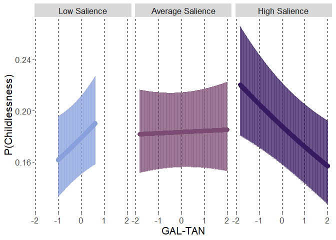
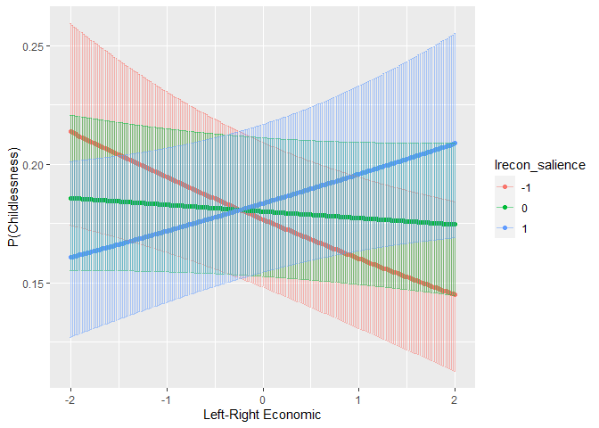
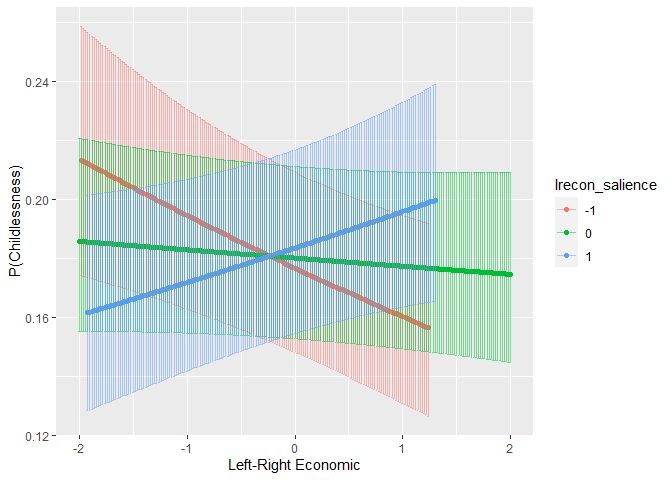

From: https://osf.io/er4v5 

RQ1. Is childlessness associated with the three Chapel Hill rated political ideology (Left-Right, Economic Left-Right, GAL-TAN) positions of the party for which one has voted? 

H1. Regarding GAL-TAN, we expect childless people to have voted closer to the GAL pole of the dimension.

RQ2. If, as expected (H1), childlessness is associated with the GAL-TAN ideology position of the party for which one has voted, are those associations stronger if this dimension is salient in the party’s public stance (i.e., is there a boundary condition to these associations, such that the ideology needs to be salient in order for the association to exist)?

H2. We expect the association between childlessness and the GAL-TAN political ideology of the party for which one has voted to be stronger if this dimension is salient in the party’s public stance.

Exploratory research questions

ERQ1. If childlessness is associated with the economic left-right position of the party for which one has voted, are those associations stronger if this dimension is salient in the party’s public stance (i.e., is there a boundary condition to these associations, such that the ideology needs to be salient in order for the association to exist)?

ERQ2. Is childlessness associated with any of the 15 Chapel Hill rated policy positions of the party for which one has voted, or with the salience of anti-elitism or anti-corruption in the party agenda?


# Preparations

## Packages


```r
library(lme4)
```

```
## Loading required package: Matrix
```

```r
library(emmeans)
library(rio)
```

```
## 
## Attaching package: 'rio'
```

```
## The following object is masked from 'package:lme4':
## 
##     factorize
```

```r
library(dplyr)
```

```
## 
## Attaching package: 'dplyr'
```

```
## The following objects are masked from 'package:stats':
## 
##     filter, lag
```

```
## The following objects are masked from 'package:base':
## 
##     intersect, setdiff, setequal, union
```

```r
library(vjihelpers)
library(ggplot2)
library(MetBrewer)
library(tibble)
library(Hmisc)
```

```
## Loading required package: lattice
```

```
## Loading required package: survival
```

```
## Loading required package: Formula
```

```
## 
## Attaching package: 'Hmisc'
```

```
## The following objects are masked from 'package:dplyr':
## 
##     src, summarize
```

```
## The following objects are masked from 'package:base':
## 
##     format.pval, units
```

## Custom functions


```r
source("../custom_functions.R")
```

## Data


```r
fdat<-import("../../data/processed/fdat.xlsx")
```

## Data exclusions


```r
exdat<-fdat %>%
  dplyr::select(childlessness,
                gndr.f,agea,minority,
                gndr.c,age10.c,minority.c,
                lrgen,
                lrecon,galtan,
                lrecon_salience,galtan_salience,
                cntry,anweight) %>%
  na.omit()
```

## Variable centering


```r
exdat<-
  group_mean_center(
    data=exdat,group.var="cntry",
    vars=c("lrgen","lrecon","galtan",
           "lrecon_salience","galtan_salience"),
    grand.init = F)
```

## Variable scaling


```r
CHES<-
  import("../../data/raw/2014_CHES_dataset_means.csv")

(sd.lrgen<-sd(CHES$lrgen,na.rm=T))
```

```
## [1] 2.302111
```

```r
(sd.lrecon<-sd(CHES$lrecon,na.rm=T))
```

```
## [1] 2.210724
```

```r
(sd.galtan<-sd(CHES$galtan,na.rm=T))
```

```
## [1] 2.627548
```

```r
(sd.galtan_salience<-sd(CHES$galtan_salience,na.rm=T))
```

```
## [1] 1.551972
```

```r
(sd.lrecon_salience<-sd(CHES$lrecon_salience,na.rm=T))
```

```
## [1] 1.468366
```

```r
exdat$lrgen.z.gmc<-exdat$lrgen.gmc/sd.lrgen
exdat$lrecon.z.gmc<-exdat$lrecon.gmc/sd.lrecon
exdat$galtan.z.gmc<-exdat$galtan.gmc/sd.galtan
exdat$galtan_salience.z.gmc<-
  exdat$galtan_salience.gmc/sd.galtan_salience
exdat$lrecon_salience.z.gmc<-
  exdat$lrecon_salience.gmc/sd.lrecon_salience
```

# Descriptive statistics

## Sample 


```r
# n countries
length(unique(exdat$cntry))
```

```
## [1] 20
```

```r
# n initial observations
nrow(fdat[fdat$cntry!="IL",])
```

```
## [1] 37623
```

```r
# n who reported voting
table(fdat[fdat$cntry!="IL","vote"],useNA="always")
```

```
## 
##     1     2     3  <NA> 
## 25738  8187  3394   304
```

```r
# n for whom CHES was available

table(rowSums(is.na(fdat[fdat$cntry!="IL",
                   c("galtan","lrgen","lrecon")])),
              useNA="always")
```

```
## 
##     0     3  <NA> 
## 21684 15939     0
```

```r
21684/37623
```

```
## [1] 0.5763496
```

```r
21684-21374
```

```
## [1] 310
```

```r
#range between countries
range(table(exdat$cntry))
```

```
## [1]  541 2043
```

## Childlessness

### Unweighted


```r
table(exdat$cntry,exdat$childlessness)
```

```
##     
##         0    1
##   AT  690  367
##   BE  881  354
##   CH  427  213
##   CZ  791  218
##   DE 1438  605
##   DK  909  241
##   EE  778  175
##   ES  716  274
##   FI  958  364
##   FR  757  176
##   GB 1022  309
##   HU  624  221
##   IE  883  384
##   LT  831  117
##   NL  972  367
##   NO  791  263
##   PL  605  149
##   PT  436  118
##   SE 1034  375
##   SI  431  110
```

```r
round(100*prop.table(table(exdat$cntry,
                           exdat$childlessness),1),1)
```

```
##     
##         0    1
##   AT 65.3 34.7
##   BE 71.3 28.7
##   CH 66.7 33.3
##   CZ 78.4 21.6
##   DE 70.4 29.6
##   DK 79.0 21.0
##   EE 81.6 18.4
##   ES 72.3 27.7
##   FI 72.5 27.5
##   FR 81.1 18.9
##   GB 76.8 23.2
##   HU 73.8 26.2
##   IE 69.7 30.3
##   LT 87.7 12.3
##   NL 72.6 27.4
##   NO 75.0 25.0
##   PL 80.2 19.8
##   PT 78.7 21.3
##   SE 73.4 26.6
##   SI 79.7 20.3
```

```r
prop.table(table(exdat$childlessness))
```

```
## 
##         0         1 
## 0.7473566 0.2526434
```

### Weighted


```r
exdat %>%
  group_by(cntry) %>%
  count(childlessness,wt=anweight) %>%
  ungroup() %>%
  group_by(cntry) %>%
  mutate(total=sum(n),percentage=round(100*n/total,1)) %>%
  filter(childlessness==1) %>%
  dplyr::select(cntry,percentage)
```

```
## # A tibble: 20 × 2
## # Groups:   cntry [20]
##    cntry percentage
##    <chr>      <dbl>
##  1 AT          38.8
##  2 BE          28  
##  3 CH          33.7
##  4 CZ          21.3
##  5 DE          32  
##  6 DK          22.1
##  7 EE          19.2
##  8 ES          29.4
##  9 FI          28.5
## 10 FR          13.2
## 11 GB          23.6
## 12 HU          30  
## 13 IE          28  
## 14 LT          11.8
## 15 NL          25.4
## 16 NO          24.1
## 17 PL          20.4
## 18 PT          21.4
## 19 SE          28.1
## 20 SI          22.2
```

```r
exdat %>%
  count(childlessness,wt=anweight) %>%
  mutate(total=sum(n),percentage=round(100*n/total,1))
```

```
##   childlessness         n    total percentage
## 1             0 13960.839 18758.81       74.4
## 2             1  4797.975 18758.81       25.6
```

```r
round(weighted.mean(exdat$childlessness,w=exdat$anweight),2)
```

```
## [1] 0.26
```

```r
round(sqrt(wtd.var(exdat$childlessness,w=exdat$anweight)),2)
```

```
## [1] 0.44
```

## Covariates

### Age


```r
round(weighted.mean(exdat$agea,w=exdat$anweight),2)
```

```
## [1] 52.52
```

```r
round(sqrt(wtd.var(exdat$agea,w=exdat$anweight)),2)
```

```
## [1] 17.13
```

### Gender


```r
exdat %>%
  count(gndr.f,wt=anweight) %>%
  mutate(total=sum(n),percentage=round(100*n/total,1))
```

```
##   gndr.f        n    total percentage
## 1 Female 9436.640 18758.81       50.3
## 2   Male 9322.174 18758.81       49.7
```

```r
round(weighted.mean(exdat$gndr.c,w=exdat$anweight),2)
```

```
## [1] 0
```

```r
round(sqrt(wtd.var(exdat$gndr.c,w=exdat$anweight)),2)
```

```
## [1] 0.5
```

### Minority ethnic group status


```r
exdat %>%
  count(minority,wt=anweight) %>%
  mutate(total=sum(n),percentage=round(100*n/total,1))
```

```
##   minority          n    total percentage
## 1        0 18096.2317 18758.81       96.5
## 2        1   662.5816 18758.81        3.5
```

```r
round(weighted.mean(exdat$minority.c,w=exdat$anweight),2)
```

```
## [1] -0.46
```

```r
round(sqrt(wtd.var(exdat$minority.c,w=exdat$anweight)),2)
```

```
## [1] 0.18
```

## Independent variables

### lrgen


```r
round(weighted.mean(exdat$lrgen,w=exdat$anweight),2)
```

```
## [1] 5.47
```

```r
round(sqrt(wtd.var(exdat$lrgen,w=exdat$anweight)),2)
```

```
## [1] 2.05
```

### lrecon


```r
round(weighted.mean(exdat$lrecon,w=exdat$anweight),2)
```

```
## [1] 5.19
```

```r
round(sqrt(wtd.var(exdat$lrecon,w=exdat$anweight)),2)
```

```
## [1] 1.99
```

### galtan


```r
round(weighted.mean(exdat$galtan,w=exdat$anweight),2)
```

```
## [1] 5.1
```

```r
round(sqrt(wtd.var(exdat$galtan,w=exdat$anweight)),2)
```

```
## [1] 2.24
```

### galtan salience


```r
round(weighted.mean(exdat$galtan_salience,w=exdat$anweight),2)
```

```
## [1] 5.77
```

```r
round(sqrt(wtd.var(exdat$galtan_salience,w=exdat$anweight)),2)
```

```
## [1] 1.36
```

## Correlation table


```r
cor.vars<-c("gndr.c","age10.c","minority.c",
            "lrgen.z.gmc","lrecon.z.gmc",
            "galtan.z.gmc","galtan_salience.z.gmc",
            "childlessness")

weighted_corr <- 
  cov.wt(exdat[,cor.vars],
         wt = exdat[,"anweight"], cor = TRUE)

corr_matrix <- weighted_corr$cor
round(corr_matrix,2)
```

```
##                       gndr.c age10.c minority.c lrgen.z.gmc lrecon.z.gmc
## gndr.c                  1.00    0.04      -0.01       -0.03        -0.02
## age10.c                 0.04    1.00      -0.08        0.03         0.04
## minority.c             -0.01   -0.08       1.00       -0.07        -0.07
## lrgen.z.gmc            -0.03    0.03      -0.07        1.00         0.84
## lrecon.z.gmc           -0.02    0.04      -0.07        0.84         1.00
## galtan.z.gmc           -0.03    0.09      -0.05        0.82         0.57
## galtan_salience.z.gmc   0.00   -0.06      -0.04        0.23        -0.01
## childlessness          -0.07   -0.36       0.01       -0.01        -0.02
##                       galtan.z.gmc galtan_salience.z.gmc childlessness
## gndr.c                       -0.03                  0.00         -0.07
## age10.c                       0.09                 -0.06         -0.36
## minority.c                   -0.05                 -0.04          0.01
## lrgen.z.gmc                   0.82                  0.23         -0.01
## lrecon.z.gmc                  0.57                 -0.01         -0.02
## galtan.z.gmc                  1.00                  0.18         -0.04
## galtan_salience.z.gmc         0.18                  1.00          0.04
## childlessness                -0.04                  0.04          1.00
```

```r
export(corr_matrix,
       "../../results/cors.weighted.pearson.r.xlsx",
       overwrite=T)

corr_matrix.t<-
  (corr_matrix*sqrt(weighted_corr$n.obs-2))/sqrt(1-corr_matrix^2)
```

```
## Warning in sqrt(1 - corr_matrix^2): NaNs produced
```

```r
## Warning in sqrt(1 - corr_matrix^2): NaNs produced

corr_matrix.p<-
  2*(1-pt(abs(corr_matrix.t),df=weighted_corr$n.obs-2))
round(corr_matrix.p,3)
```

```
##                       gndr.c age10.c minority.c lrgen.z.gmc lrecon.z.gmc
## gndr.c                 0.000       0      0.294        0.00        0.000
## age10.c                0.000     NaN      0.000        0.00        0.000
## minority.c             0.294       0      0.000        0.00        0.000
## lrgen.z.gmc            0.000       0      0.000         NaN        0.000
## lrecon.z.gmc           0.000       0      0.000        0.00        0.000
## galtan.z.gmc           0.000       0      0.000        0.00        0.000
## galtan_salience.z.gmc  0.667       0      0.000        0.00        0.032
## childlessness          0.000       0      0.293        0.04        0.009
##                       galtan.z.gmc galtan_salience.z.gmc childlessness
## gndr.c                           0                 0.667         0.000
## age10.c                          0                 0.000         0.000
## minority.c                       0                 0.000         0.293
## lrgen.z.gmc                      0                 0.000         0.040
## lrecon.z.gmc                     0                 0.032         0.009
## galtan.z.gmc                     0                 0.000         0.000
## galtan_salience.z.gmc            0                 0.000         0.000
## childlessness                    0                 0.000         0.000
```

```r
export(corr_matrix.p,
       "../../results/cors.weighted.pearson.r.p.xlsx",
       overwrite=T)
```

# RQ1 Analysis 


RQ1. Is childlessness associated with the three Chapel Hill rated political ideology (Left-Right, Economic Left-Right, GAL-TAN) positions of the party for which one has voted? 

H1. Regarding GAL-TAN, we expect childless people to have voted closer to the GAL pole of the dimension.

## Baserate only


```r
mod0<-
  glmer(childlessness~(1|cntry),
        data=exdat,
        family=binomial(link="logit"),weights = anweight)
```

```
## Warning in eval(family$initialize, rho): non-integer #successes in a binomial
## glm!
```

```r
summary(mod0)
```

```
## Generalized linear mixed model fit by maximum likelihood (Laplace
##   Approximation) [glmerMod]
##  Family: binomial  ( logit )
## Formula: childlessness ~ (1 | cntry)
##    Data: exdat
## Weights: anweight
## 
##      AIC      BIC   logLik deviance df.resid 
##  17219.9  17235.9  -8608.0  17215.9    21372 
## 
## Scaled residuals: 
##     Min      1Q  Median      3Q     Max 
## -1.9067 -0.4931 -0.3113  0.3660  7.8186 
## 
## Random effects:
##  Groups Name        Variance Std.Dev.
##  cntry  (Intercept) 0.1046   0.3234  
## Number of obs: 21374, groups:  cntry, 20
## 
## Fixed effects:
##             Estimate Std. Error z value Pr(>|z|)    
## (Intercept) -1.07113    0.08228  -13.02   <2e-16 ***
## ---
## Signif. codes:  0 '***' 0.001 '**' 0.01 '*' 0.05 '.' 0.1 ' ' 1
```

```r
export(rownames_to_column(
  getFE_glmer(mod0,round = 10,p.round=10)),
       "../../results/estimates/FE_mod0.xlsx",
       overwrite=T)

export(getVC(mod0,round = 10),
       "../../results/estimates/VC_mod0.xlsx",
       overwrite=T)
```

## Covariates


```r
mod1<-
  glmer(childlessness~gndr.c+age10.c+minority.c+(1|cntry),
        data=exdat,
        family=binomial(link="logit"),weights = anweight)
```

```
## Warning in eval(family$initialize, rho): non-integer #successes in a binomial
## glm!
```

```r
summary(mod1)
```

```
## Generalized linear mixed model fit by maximum likelihood (Laplace
##   Approximation) [glmerMod]
##  Family: binomial  ( logit )
## Formula: childlessness ~ gndr.c + age10.c + minority.c + (1 | cntry)
##    Data: exdat
## Weights: anweight
## 
##      AIC      BIC   logLik deviance df.resid 
##  15072.4  15112.2  -7531.2  15062.4    21369 
## 
## Scaled residuals: 
##     Min      1Q  Median      3Q     Max 
## -3.7345 -0.4386 -0.2243  0.2395 12.9768 
## 
## Random effects:
##  Groups Name        Variance Std.Dev.
##  cntry  (Intercept) 0.116    0.3406  
## Number of obs: 21374, groups:  cntry, 20
## 
## Fixed effects:
##             Estimate Std. Error z value Pr(>|z|)    
## (Intercept) -1.28639    0.10000 -12.865  < 2e-16 ***
## gndr.c      -0.30943    0.04045  -7.650 2.01e-14 ***
## age10.c     -0.55489    0.01346 -41.234  < 2e-16 ***
## minority.c  -0.28000    0.10387  -2.696  0.00703 ** 
## ---
## Signif. codes:  0 '***' 0.001 '**' 0.01 '*' 0.05 '.' 0.1 ' ' 1
## 
## Correlation of Fixed Effects:
##            (Intr) gndr.c ag10.c
## gndr.c     0.015               
## age10.c    0.106  0.010        
## minority.c 0.489  0.002  0.093
```

```r
export(rownames_to_column(
  getFE_glmer(mod1,round = 10,p.round=10)),
       "../../results/estimates/FE_mod1.xlsx",
       overwrite=T)

export(getVC(mod1,round = 10),
       "../../results/estimates/VC_mod1.xlsx",
       overwrite=T)
```

## lrgen

### Fixed


```r
mod2.lrgen<-
  glmer(childlessness~gndr.c+age10.c+minority.c+
          lrgen.z.gmc+
          (1|cntry),
        data=exdat,
        family=binomial(link="logit"),weights = anweight)
```

```
## Warning in eval(family$initialize, rho): non-integer #successes in a binomial
## glm!
```

```r
summary(mod2.lrgen)
```

```
## Generalized linear mixed model fit by maximum likelihood (Laplace
##   Approximation) [glmerMod]
##  Family: binomial  ( logit )
## Formula: childlessness ~ gndr.c + age10.c + minority.c + lrgen.z.gmc +  
##     (1 | cntry)
##    Data: exdat
## Weights: anweight
## 
##      AIC      BIC   logLik deviance df.resid 
##  15074.2  15122.0  -7531.1  15062.2    21368 
## 
## Scaled residuals: 
##     Min      1Q  Median      3Q     Max 
## -3.7200 -0.4387 -0.2245  0.2403 12.9067 
## 
## Random effects:
##  Groups Name        Variance Std.Dev.
##  cntry  (Intercept) 0.1158   0.3404  
## Number of obs: 21374, groups:  cntry, 20
## 
## Fixed effects:
##             Estimate Std. Error z value Pr(>|z|)    
## (Intercept) -1.28811    0.10002 -12.878  < 2e-16 ***
## gndr.c      -0.30981    0.04046  -7.657  1.9e-14 ***
## age10.c     -0.55477    0.01346 -41.215  < 2e-16 ***
## minority.c  -0.28373    0.10420  -2.723  0.00647 ** 
## lrgen.z.gmc -0.01075    0.02345  -0.458  0.64671    
## ---
## Signif. codes:  0 '***' 0.001 '**' 0.01 '*' 0.05 '.' 0.1 ' ' 1
## 
## Correlation of Fixed Effects:
##             (Intr) gndr.c ag10.c mnrty.
## gndr.c       0.016                     
## age10.c      0.106  0.009              
## minority.c   0.490  0.003  0.091       
## lrgen.z.gmc  0.038  0.020 -0.018  0.078
```

```r
export(rownames_to_column(
  getFE_glmer(mod2.lrgen,round = 10,p.round=10)),
       "../../results/estimates/FE_mod2.lrgen.xlsx",
       overwrite=T)

export(getVC(mod2.lrgen,round = 10),
       "../../results/estimates/VC_mod2.lrgen.xlsx",
       overwrite=T)
```

### Random


```r
mod3.lrgen<-
  glmer(childlessness~gndr.c+age10.c+minority.c+
          lrgen.z.gmc+
          (lrgen.z.gmc|cntry),
        data=exdat,
        family=binomial(link="logit"),weights = anweight,
        control = glmerControl(optimizer="bobyqa",
                               optCtrl=list(maxfun=2e6)))
```

```
## Warning in eval(family$initialize, rho): non-integer #successes in a binomial
## glm!
```

```
## boundary (singular) fit: see help('isSingular')
```

```r
summary(mod3.lrgen)
```

```
## Generalized linear mixed model fit by maximum likelihood (Laplace
##   Approximation) [glmerMod]
##  Family: binomial  ( logit )
## Formula: childlessness ~ gndr.c + age10.c + minority.c + lrgen.z.gmc +  
##     (lrgen.z.gmc | cntry)
##    Data: exdat
## Weights: anweight
## Control: glmerControl(optimizer = "bobyqa", optCtrl = list(maxfun = 2e+06))
## 
##      AIC      BIC   logLik deviance df.resid 
##  15077.8  15141.5  -7530.9  15061.8    21366 
## 
## Scaled residuals: 
##     Min      1Q  Median      3Q     Max 
## -3.7199 -0.4388 -0.2245  0.2393 13.0740 
## 
## Random effects:
##  Groups Name        Variance  Std.Dev. Corr 
##  cntry  (Intercept) 0.1151096 0.33928       
##         lrgen.z.gmc 0.0001529 0.01236  -1.00
## Number of obs: 21374, groups:  cntry, 20
## 
## Fixed effects:
##             Estimate Std. Error z value Pr(>|z|)    
## (Intercept) -1.28748    0.09984 -12.896  < 2e-16 ***
## gndr.c      -0.30926    0.04047  -7.642 2.14e-14 ***
## age10.c     -0.55458    0.01346 -41.197  < 2e-16 ***
## minority.c  -0.28414    0.10425  -2.725  0.00642 ** 
## lrgen.z.gmc -0.00907    0.02378  -0.381  0.70295    
## ---
## Signif. codes:  0 '***' 0.001 '**' 0.01 '*' 0.05 '.' 0.1 ' ' 1
## 
## Correlation of Fixed Effects:
##             (Intr) gndr.c ag10.c mnrty.
## gndr.c       0.016                     
## age10.c      0.106  0.009              
## minority.c   0.491  0.003  0.091       
## lrgen.z.gmc -0.071  0.023 -0.017  0.075
## optimizer (bobyqa) convergence code: 0 (OK)
## boundary (singular) fit: see help('isSingular')
```

```r
anova(mod2.lrgen,mod3.lrgen)
```

```
## Data: exdat
## Models:
## mod2.lrgen: childlessness ~ gndr.c + age10.c + minority.c + lrgen.z.gmc + (1 | cntry)
## mod3.lrgen: childlessness ~ gndr.c + age10.c + minority.c + lrgen.z.gmc + (lrgen.z.gmc | cntry)
##            npar   AIC   BIC  logLik deviance  Chisq Df Pr(>Chisq)
## mod2.lrgen    6 15074 15122 -7531.1    15062                     
## mod3.lrgen    8 15078 15142 -7530.9    15062 0.3852  2     0.8248
```

```r
export(rownames_to_column(
  getFE_glmer(mod3.lrgen,round = 10,p.round=10)),
       "../../results/estimates/FE_mod3.lrgen.xlsx",
       overwrite=T)

export(getVC(mod3.lrgen,round = 10),
       "../../results/estimates/VC_mod3.lrgen.xlsx",
       overwrite=T)
```


### Random without random effect correlation


```r
mod4.lrgen<-
  glmer(childlessness~gndr.c+age10.c+minority.c+
          lrgen.z.gmc+
          (lrgen.z.gmc||cntry),
        data=exdat,
        family=binomial(link="logit"),weights = anweight,
        control = glmerControl(optimizer="bobyqa",
                               optCtrl=list(maxfun=2e6)))
```

```
## Warning in eval(family$initialize, rho): non-integer #successes in a binomial
## glm!
```

```
## boundary (singular) fit: see help('isSingular')
```

```r
summary(mod4.lrgen)
```

```
## Generalized linear mixed model fit by maximum likelihood (Laplace
##   Approximation) [glmerMod]
##  Family: binomial  ( logit )
## Formula: childlessness ~ gndr.c + age10.c + minority.c + lrgen.z.gmc +  
##     (lrgen.z.gmc || cntry)
##    Data: exdat
## Weights: anweight
## Control: glmerControl(optimizer = "bobyqa", optCtrl = list(maxfun = 2e+06))
## 
##      AIC      BIC   logLik deviance df.resid 
##  15076.2  15131.9  -7531.1  15062.2    21367 
## 
## Scaled residuals: 
##     Min      1Q  Median      3Q     Max 
## -3.7200 -0.4387 -0.2245  0.2403 12.9067 
## 
## Random effects:
##  Groups  Name        Variance Std.Dev.
##  cntry   (Intercept) 0.1158   0.3404  
##  cntry.1 lrgen.z.gmc 0.0000   0.0000  
## Number of obs: 21374, groups:  cntry, 20
## 
## Fixed effects:
##             Estimate Std. Error z value Pr(>|z|)    
## (Intercept) -1.28810    0.10002 -12.878  < 2e-16 ***
## gndr.c      -0.30981    0.04046  -7.657  1.9e-14 ***
## age10.c     -0.55477    0.01346 -41.215  < 2e-16 ***
## minority.c  -0.28372    0.10419  -2.723  0.00647 ** 
## lrgen.z.gmc -0.01075    0.02345  -0.458  0.64673    
## ---
## Signif. codes:  0 '***' 0.001 '**' 0.01 '*' 0.05 '.' 0.1 ' ' 1
## 
## Correlation of Fixed Effects:
##             (Intr) gndr.c ag10.c mnrty.
## gndr.c       0.016                     
## age10.c      0.106  0.009              
## minority.c   0.490  0.003  0.091       
## lrgen.z.gmc  0.038  0.020 -0.018  0.078
## optimizer (bobyqa) convergence code: 0 (OK)
## boundary (singular) fit: see help('isSingular')
```

```r
anova(mod2.lrgen,mod4.lrgen)
```

```
## Data: exdat
## Models:
## mod2.lrgen: childlessness ~ gndr.c + age10.c + minority.c + lrgen.z.gmc + (1 | cntry)
## mod4.lrgen: childlessness ~ gndr.c + age10.c + minority.c + lrgen.z.gmc + (lrgen.z.gmc || cntry)
##            npar   AIC   BIC  logLik deviance Chisq Df Pr(>Chisq)
## mod2.lrgen    6 15074 15122 -7531.1    15062                    
## mod4.lrgen    7 15076 15132 -7531.1    15062     0  1     0.9999
```

```r
anova(mod4.lrgen,mod3.lrgen)
```

```
## Data: exdat
## Models:
## mod4.lrgen: childlessness ~ gndr.c + age10.c + minority.c + lrgen.z.gmc + (lrgen.z.gmc || cntry)
## mod3.lrgen: childlessness ~ gndr.c + age10.c + minority.c + lrgen.z.gmc + (lrgen.z.gmc | cntry)
##            npar   AIC   BIC  logLik deviance  Chisq Df Pr(>Chisq)
## mod4.lrgen    7 15076 15132 -7531.1    15062                     
## mod3.lrgen    8 15078 15142 -7530.9    15062 0.3852  1     0.5348
```

```r
export(rownames_to_column(
  getFE_glmer(mod4.lrgen,round = 10,p.round=10)),
       "../../results/estimates/FE_mod4.lrgen.xlsx",
       overwrite=T)

export(getVC(mod4.lrgen,round = 10),
       "../../results/estimates/VC_mod4.lrgen.xlsx",
       overwrite=T)
```


## lrecon

### Fixed


```r
mod2.lrecon<-
  glmer(childlessness~gndr.c+age10.c+minority.c+
          lrecon.z.gmc+
          (1|cntry),
        data=exdat,
        family=binomial(link="logit"),weights = anweight)
```

```
## Warning in eval(family$initialize, rho): non-integer #successes in a binomial
## glm!
```

```r
summary(mod2.lrecon)
```

```
## Generalized linear mixed model fit by maximum likelihood (Laplace
##   Approximation) [glmerMod]
##  Family: binomial  ( logit )
## Formula: childlessness ~ gndr.c + age10.c + minority.c + lrecon.z.gmc +  
##     (1 | cntry)
##    Data: exdat
## Weights: anweight
## 
##      AIC      BIC   logLik deviance df.resid 
##  15074.0  15121.8  -7531.0  15062.0    21368 
## 
## Scaled residuals: 
##     Min      1Q  Median      3Q     Max 
## -3.7079 -0.4382 -0.2246  0.2410 12.9028 
## 
## Random effects:
##  Groups Name        Variance Std.Dev.
##  cntry  (Intercept) 0.1158   0.3403  
## Number of obs: 21374, groups:  cntry, 20
## 
## Fixed effects:
##              Estimate Std. Error z value Pr(>|z|)    
## (Intercept)  -1.28878    0.10002 -12.885  < 2e-16 ***
## gndr.c       -0.30994    0.04046  -7.661 1.85e-14 ***
## age10.c      -0.55466    0.01346 -41.200  < 2e-16 ***
## minority.c   -0.28506    0.10419  -2.736  0.00622 ** 
## lrecon.z.gmc -0.01474    0.02332  -0.632  0.52736    
## ---
## Signif. codes:  0 '***' 0.001 '**' 0.01 '*' 0.05 '.' 0.1 ' ' 1
## 
## Correlation of Fixed Effects:
##             (Intr) gndr.c ag10.c mnrty.
## gndr.c       0.016                     
## age10.c      0.105  0.009              
## minority.c   0.490  0.003  0.090       
## lrecn.z.gmc  0.039  0.020 -0.025  0.077
```

```r
export(rownames_to_column(
  getFE_glmer(mod2.lrecon,round = 10,p.round=10)),
       "../../results/estimates/FE_mod2.lrecon.xlsx",
       overwrite=T)

export(getVC(mod2.lrecon,round = 10),
       "../../results/estimates/VC_mod2.lrecon.xlsx",
       overwrite=T)
```

### Random


```r
mod3.lrecon<-
  glmer(childlessness~gndr.c+age10.c+minority.c+
          lrecon.z.gmc+
          (lrecon.z.gmc|cntry),
        data=exdat,
        family=binomial(link="logit"),weights = anweight,
        control = glmerControl(optimizer="bobyqa",
                               optCtrl=list(maxfun=2e6)))
```

```
## Warning in eval(family$initialize, rho): non-integer #successes in a binomial
## glm!
```

```
## boundary (singular) fit: see help('isSingular')
```

```r
summary(mod3.lrecon)
```

```
## Generalized linear mixed model fit by maximum likelihood (Laplace
##   Approximation) [glmerMod]
##  Family: binomial  ( logit )
## Formula: childlessness ~ gndr.c + age10.c + minority.c + lrecon.z.gmc +  
##     (lrecon.z.gmc | cntry)
##    Data: exdat
## Weights: anweight
## Control: glmerControl(optimizer = "bobyqa", optCtrl = list(maxfun = 2e+06))
## 
##      AIC      BIC   logLik deviance df.resid 
##  15074.4  15138.2  -7529.2  15058.4    21366 
## 
## Scaled residuals: 
##     Min      1Q  Median      3Q     Max 
## -3.7112 -0.4395 -0.2254  0.2382 13.3925 
## 
## Random effects:
##  Groups Name         Variance Std.Dev. Corr 
##  cntry  (Intercept)  0.113286 0.33658       
##         lrecon.z.gmc 0.001825 0.04272  -1.00
## Number of obs: 21374, groups:  cntry, 20
## 
## Fixed effects:
##               Estimate Std. Error z value Pr(>|z|)    
## (Intercept)  -1.283323   0.099335 -12.919  < 2e-16 ***
## gndr.c       -0.308097   0.040478  -7.612 2.71e-14 ***
## age10.c      -0.553815   0.013465 -41.131  < 2e-16 ***
## minority.c   -0.284340   0.104376  -2.724  0.00645 ** 
## lrecon.z.gmc -0.006025   0.025959  -0.232  0.81647    
## ---
## Signif. codes:  0 '***' 0.001 '**' 0.01 '*' 0.05 '.' 0.1 ' ' 1
## 
## Correlation of Fixed Effects:
##             (Intr) gndr.c ag10.c mnrty.
## gndr.c       0.016                     
## age10.c      0.106  0.010              
## minority.c   0.495  0.003  0.090       
## lrecn.z.gmc -0.304  0.022 -0.021  0.065
## optimizer (bobyqa) convergence code: 0 (OK)
## boundary (singular) fit: see help('isSingular')
```

```r
anova(mod2.lrecon,mod3.lrecon)
```

```
## Data: exdat
## Models:
## mod2.lrecon: childlessness ~ gndr.c + age10.c + minority.c + lrecon.z.gmc + (1 | cntry)
## mod3.lrecon: childlessness ~ gndr.c + age10.c + minority.c + lrecon.z.gmc + (lrecon.z.gmc | cntry)
##             npar   AIC   BIC  logLik deviance  Chisq Df Pr(>Chisq)
## mod2.lrecon    6 15074 15122 -7531.0    15062                     
## mod3.lrecon    8 15074 15138 -7529.2    15058 3.5463  2     0.1698
```

```r
export(rownames_to_column(
  getFE_glmer(mod3.lrecon,round = 10,p.round=10)),
       "../../results/estimates/FE_mod3.lrecon.xlsx",
       overwrite=T)

export(getVC(mod3.lrecon,round = 10),
       "../../results/estimates/VC_mod3.lrecon.xlsx",
       overwrite=T)
```


### Random without random effect correlation


```r
mod4.lrecon<-
  glmer(childlessness~gndr.c+age10.c+minority.c+
          lrecon.z.gmc+
          (lrecon.z.gmc||cntry),
        data=exdat,
        family=binomial(link="logit"),weights = anweight,
        control = glmerControl(optimizer="bobyqa",
                               optCtrl=list(maxfun=2e6)))
```

```
## Warning in eval(family$initialize, rho): non-integer #successes in a binomial
## glm!
```

```
## boundary (singular) fit: see help('isSingular')
```

```r
summary(mod4.lrecon)
```

```
## Generalized linear mixed model fit by maximum likelihood (Laplace
##   Approximation) [glmerMod]
##  Family: binomial  ( logit )
## Formula: childlessness ~ gndr.c + age10.c + minority.c + lrecon.z.gmc +  
##     (lrecon.z.gmc || cntry)
##    Data: exdat
## Weights: anweight
## Control: glmerControl(optimizer = "bobyqa", optCtrl = list(maxfun = 2e+06))
## 
##      AIC      BIC   logLik deviance df.resid 
##  15076.0  15131.8  -7531.0  15062.0    21367 
## 
## Scaled residuals: 
##     Min      1Q  Median      3Q     Max 
## -3.7079 -0.4382 -0.2246  0.2410 12.9028 
## 
## Random effects:
##  Groups  Name         Variance Std.Dev.
##  cntry   (Intercept)  0.1158   0.3403  
##  cntry.1 lrecon.z.gmc 0.0000   0.0000  
## Number of obs: 21374, groups:  cntry, 20
## 
## Fixed effects:
##              Estimate Std. Error z value Pr(>|z|)    
## (Intercept)  -1.28879    0.10002 -12.886  < 2e-16 ***
## gndr.c       -0.30994    0.04046  -7.661 1.85e-14 ***
## age10.c      -0.55466    0.01346 -41.200  < 2e-16 ***
## minority.c   -0.28506    0.10419  -2.736  0.00622 ** 
## lrecon.z.gmc -0.01473    0.02332  -0.632  0.52744    
## ---
## Signif. codes:  0 '***' 0.001 '**' 0.01 '*' 0.05 '.' 0.1 ' ' 1
## 
## Correlation of Fixed Effects:
##             (Intr) gndr.c ag10.c mnrty.
## gndr.c       0.016                     
## age10.c      0.105  0.009              
## minority.c   0.490  0.003  0.090       
## lrecn.z.gmc  0.039  0.020 -0.025  0.077
## optimizer (bobyqa) convergence code: 0 (OK)
## boundary (singular) fit: see help('isSingular')
```

```r
anova(mod2.lrecon,mod4.lrecon)
```

```
## Data: exdat
## Models:
## mod2.lrecon: childlessness ~ gndr.c + age10.c + minority.c + lrecon.z.gmc + (1 | cntry)
## mod4.lrecon: childlessness ~ gndr.c + age10.c + minority.c + lrecon.z.gmc + (lrecon.z.gmc || cntry)
##             npar   AIC   BIC logLik deviance Chisq Df Pr(>Chisq)
## mod2.lrecon    6 15074 15122  -7531    15062                    
## mod4.lrecon    7 15076 15132  -7531    15062     0  1     0.9998
```

```r
anova(mod4.lrecon,mod3.lrecon)
```

```
## Data: exdat
## Models:
## mod4.lrecon: childlessness ~ gndr.c + age10.c + minority.c + lrecon.z.gmc + (lrecon.z.gmc || cntry)
## mod3.lrecon: childlessness ~ gndr.c + age10.c + minority.c + lrecon.z.gmc + (lrecon.z.gmc | cntry)
##             npar   AIC   BIC  logLik deviance  Chisq Df Pr(>Chisq)  
## mod4.lrecon    7 15076 15132 -7531.0    15062                       
## mod3.lrecon    8 15074 15138 -7529.2    15058 3.5463  1    0.05968 .
## ---
## Signif. codes:  0 '***' 0.001 '**' 0.01 '*' 0.05 '.' 0.1 ' ' 1
```

```r
export(rownames_to_column(
  getFE_glmer(mod4.lrecon,round = 10,p.round=10)),
       "../../results/estimates/FE_mod4.lrecon.xlsx",
       overwrite=T)

export(getVC(mod4.lrecon,round = 10),
       "../../results/estimates/VC_mod4.lrecon.xlsx",
       overwrite=T)
```


## galtan

### Fixed


```r
mod2.galtan<-
  glmer(childlessness~gndr.c+age10.c+minority.c+
          galtan.z.gmc+
          (1|cntry),
        data=exdat,
        family=binomial(link="logit"),weights = anweight)
```

```
## Warning in eval(family$initialize, rho): non-integer #successes in a binomial
## glm!
```

```r
summary(mod2.galtan)
```

```
## Generalized linear mixed model fit by maximum likelihood (Laplace
##   Approximation) [glmerMod]
##  Family: binomial  ( logit )
## Formula: childlessness ~ gndr.c + age10.c + minority.c + galtan.z.gmc +  
##     (1 | cntry)
##    Data: exdat
## Weights: anweight
## 
##      AIC      BIC   logLik deviance df.resid 
##  15072.0  15119.8  -7530.0  15060.0    21368 
## 
## Scaled residuals: 
##     Min      1Q  Median      3Q     Max 
## -3.7183 -0.4386 -0.2245  0.2419 12.7554 
## 
## Random effects:
##  Groups Name        Variance Std.Dev.
##  cntry  (Intercept) 0.1151   0.3393  
## Number of obs: 21374, groups:  cntry, 20
## 
## Fixed effects:
##              Estimate Std. Error z value Pr(>|z|)    
## (Intercept)  -1.29045    0.09981 -12.929  < 2e-16 ***
## gndr.c       -0.31057    0.04046  -7.676 1.64e-14 ***
## age10.c      -0.55355    0.01348 -41.050  < 2e-16 ***
## minority.c   -0.28771    0.10398  -2.767  0.00566 ** 
## galtan.z.gmc -0.03717    0.02421  -1.535  0.12468    
## ---
## Signif. codes:  0 '***' 0.001 '**' 0.01 '*' 0.05 '.' 0.1 ' ' 1
## 
## Correlation of Fixed Effects:
##             (Intr) gndr.c ag10.c mnrty.
## gndr.c       0.015                     
## age10.c      0.105  0.008              
## minority.c   0.490  0.003  0.089       
## galtn.z.gmc  0.028  0.019 -0.061  0.048
```

```r
export(rownames_to_column(
  getFE_glmer(mod2.galtan,round = 10,p.round=10)),
       "../../results/estimates/FE_mod2.galtan.xlsx",
       overwrite=T)

export(getVC(mod2.galtan,round = 10),
       "../../results/estimates/VC_mod2.galtan.xlsx",
       overwrite=T)
```

### Random


```r
mod3.galtan<-
  glmer(childlessness~gndr.c+age10.c+minority.c+
          galtan.z.gmc+
          (galtan.z.gmc|cntry),
        data=exdat,
        family=binomial(link="logit"),weights = anweight,
        control = glmerControl(optimizer="bobyqa",
                               optCtrl=list(maxfun=2e6)))
```

```
## Warning in eval(family$initialize, rho): non-integer #successes in a binomial
## glm!
```

```
## boundary (singular) fit: see help('isSingular')
```

```r
summary(mod3.galtan)
```

```
## Generalized linear mixed model fit by maximum likelihood (Laplace
##   Approximation) [glmerMod]
##  Family: binomial  ( logit )
## Formula: childlessness ~ gndr.c + age10.c + minority.c + galtan.z.gmc +  
##     (galtan.z.gmc | cntry)
##    Data: exdat
## Weights: anweight
## Control: glmerControl(optimizer = "bobyqa", optCtrl = list(maxfun = 2e+06))
## 
##      AIC      BIC   logLik deviance df.resid 
##  15075.8  15139.5  -7529.9  15059.8    21366 
## 
## Scaled residuals: 
##     Min      1Q  Median      3Q     Max 
## -3.7418 -0.4384 -0.2246  0.2421 12.8668 
## 
## Random effects:
##  Groups Name         Variance  Std.Dev. Corr 
##  cntry  (Intercept)  1.143e-01 0.338016      
##         galtan.z.gmc 9.991e-05 0.009995 -1.00
## Number of obs: 21374, groups:  cntry, 20
## 
## Fixed effects:
##              Estimate Std. Error z value Pr(>|z|)    
## (Intercept)  -1.28982    0.09957 -12.954  < 2e-16 ***
## gndr.c       -0.31048    0.04046  -7.673 1.68e-14 ***
## age10.c      -0.55332    0.01349 -41.012  < 2e-16 ***
## minority.c   -0.28781    0.10402  -2.767  0.00566 ** 
## galtan.z.gmc -0.03534    0.02464  -1.434  0.15153    
## ---
## Signif. codes:  0 '***' 0.001 '**' 0.01 '*' 0.05 '.' 0.1 ' ' 1
## 
## Correlation of Fixed Effects:
##             (Intr) gndr.c ag10.c mnrty.
## gndr.c       0.015                     
## age10.c      0.105  0.008              
## minority.c   0.492  0.003  0.089       
## galtn.z.gmc -0.056  0.020 -0.055  0.047
## optimizer (bobyqa) convergence code: 0 (OK)
## boundary (singular) fit: see help('isSingular')
```

```r
anova(mod2.galtan,mod3.galtan)
```

```
## Data: exdat
## Models:
## mod2.galtan: childlessness ~ gndr.c + age10.c + minority.c + galtan.z.gmc + (1 | cntry)
## mod3.galtan: childlessness ~ gndr.c + age10.c + minority.c + galtan.z.gmc + (galtan.z.gmc | cntry)
##             npar   AIC   BIC  logLik deviance  Chisq Df Pr(>Chisq)
## mod2.galtan    6 15072 15120 -7530.0    15060                     
## mod3.galtan    8 15076 15140 -7529.9    15060 0.2211  2     0.8953
```

```r
export(rownames_to_column(
  getFE_glmer(mod3.galtan,round = 10,p.round=10)),
       "../../results/estimates/FE_mod3.galtan.xlsx",
       overwrite=T)

export(getVC(mod3.galtan,round = 10),
       "../../results/estimates/VC_mod3.galtan.xlsx",
       overwrite=T)
```


### Random without random effect correlation


```r
mod4.galtan<-
  glmer(childlessness~gndr.c+age10.c+minority.c+
          galtan.z.gmc+
          (galtan.z.gmc||cntry),
        data=exdat,
        family=binomial(link="logit"),weights = anweight,
        control = glmerControl(optimizer="bobyqa",
                               optCtrl=list(maxfun=2e6)))
```

```
## Warning in eval(family$initialize, rho): non-integer #successes in a binomial
## glm!
```

```
## boundary (singular) fit: see help('isSingular')
```

```r
summary(mod4.galtan)
```

```
## Generalized linear mixed model fit by maximum likelihood (Laplace
##   Approximation) [glmerMod]
##  Family: binomial  ( logit )
## Formula: childlessness ~ gndr.c + age10.c + minority.c + galtan.z.gmc +  
##     (galtan.z.gmc || cntry)
##    Data: exdat
## Weights: anweight
## Control: glmerControl(optimizer = "bobyqa", optCtrl = list(maxfun = 2e+06))
## 
##      AIC      BIC   logLik deviance df.resid 
##  15074.0  15129.8  -7530.0  15060.0    21367 
## 
## Scaled residuals: 
##     Min      1Q  Median      3Q     Max 
## -3.7183 -0.4386 -0.2245  0.2419 12.7554 
## 
## Random effects:
##  Groups  Name         Variance Std.Dev.
##  cntry   (Intercept)  0.1151   0.3393  
##  cntry.1 galtan.z.gmc 0.0000   0.0000  
## Number of obs: 21374, groups:  cntry, 20
## 
## Fixed effects:
##              Estimate Std. Error z value Pr(>|z|)    
## (Intercept)  -1.29044    0.09981 -12.930  < 2e-16 ***
## gndr.c       -0.31057    0.04046  -7.676 1.64e-14 ***
## age10.c      -0.55355    0.01348 -41.050  < 2e-16 ***
## minority.c   -0.28769    0.10399  -2.767  0.00566 ** 
## galtan.z.gmc -0.03717    0.02421  -1.535  0.12468    
## ---
## Signif. codes:  0 '***' 0.001 '**' 0.01 '*' 0.05 '.' 0.1 ' ' 1
## 
## Correlation of Fixed Effects:
##             (Intr) gndr.c ag10.c mnrty.
## gndr.c       0.015                     
## age10.c      0.105  0.008              
## minority.c   0.490  0.003  0.089       
## galtn.z.gmc  0.028  0.019 -0.061  0.048
## optimizer (bobyqa) convergence code: 0 (OK)
## boundary (singular) fit: see help('isSingular')
```

```r
anova(mod2.galtan,mod4.galtan)
```

```
## Data: exdat
## Models:
## mod2.galtan: childlessness ~ gndr.c + age10.c + minority.c + galtan.z.gmc + (1 | cntry)
## mod4.galtan: childlessness ~ gndr.c + age10.c + minority.c + galtan.z.gmc + (galtan.z.gmc || cntry)
##             npar   AIC   BIC logLik deviance Chisq Df Pr(>Chisq)
## mod2.galtan    6 15072 15120  -7530    15060                    
## mod4.galtan    7 15074 15130  -7530    15060     0  1     0.9999
```

```r
anova(mod4.galtan,mod3.galtan)
```

```
## Data: exdat
## Models:
## mod4.galtan: childlessness ~ gndr.c + age10.c + minority.c + galtan.z.gmc + (galtan.z.gmc || cntry)
## mod3.galtan: childlessness ~ gndr.c + age10.c + minority.c + galtan.z.gmc + (galtan.z.gmc | cntry)
##             npar   AIC   BIC  logLik deviance  Chisq Df Pr(>Chisq)
## mod4.galtan    7 15074 15130 -7530.0    15060                     
## mod3.galtan    8 15076 15140 -7529.9    15060 0.2211  1     0.6382
```

```r
export(rownames_to_column(
  getFE_glmer(mod4.galtan,round = 10,p.round=10)),
       "../../results/estimates/FE_mod4.galtan.xlsx",
       overwrite=T)

export(getVC(mod4.galtan,round = 10),
       "../../results/estimates/VC_mod4.galtan.xlsx",
       overwrite=T)
```


# RQ2 Analysis 

RQ2. If, as expected (H1), childlessness is associated with the GAL-TAN ideology position of the party for which one has voted, are those associations stronger if this dimension is salient in the party’s public stance (i.e., is there a boundary condition to these associations, such that the ideology needs to be salient in order for the association to exist)?

H2. We expect the association between childlessness and the GAL-TAN political ideology of the party for which one has voted to be stronger if this dimension is salient in the party’s public stance.

## galtan salience fixed main effect


```r
mod5.galtan<-
  glmer(childlessness~gndr.c+age10.c+minority.c+
          galtan.z.gmc+galtan_salience.z.gmc+
          (1|cntry),
        data=exdat,
        family=binomial(link="logit"),weights = anweight,
        control = glmerControl(optimizer="bobyqa"))
```

```
## Warning in eval(family$initialize, rho): non-integer #successes in a binomial
## glm!
```

```r
summary(mod5.galtan)
```

```
## Generalized linear mixed model fit by maximum likelihood (Laplace
##   Approximation) [glmerMod]
##  Family: binomial  ( logit )
## Formula: childlessness ~ gndr.c + age10.c + minority.c + galtan.z.gmc +  
##     galtan_salience.z.gmc + (1 | cntry)
##    Data: exdat
## Weights: anweight
## Control: glmerControl(optimizer = "bobyqa")
## 
##      AIC      BIC   logLik deviance df.resid 
##  15073.2  15129.0  -7529.6  15059.2    21367 
## 
## Scaled residuals: 
##     Min      1Q  Median      3Q     Max 
## -3.7931 -0.4381 -0.2244  0.2411 12.7627 
## 
## Random effects:
##  Groups Name        Variance Std.Dev.
##  cntry  (Intercept) 0.1146   0.3385  
## Number of obs: 21374, groups:  cntry, 20
## 
## Fixed effects:
##                       Estimate Std. Error z value Pr(>|z|)    
## (Intercept)           -1.28945    0.09967 -12.937  < 2e-16 ***
## gndr.c                -0.31103    0.04047  -7.686 1.52e-14 ***
## age10.c               -0.55274    0.01351 -40.909  < 2e-16 ***
## minority.c            -0.28428    0.10405  -2.732  0.00629 ** 
## galtan.z.gmc          -0.04012    0.02437  -1.646  0.09970 .  
## galtan_salience.z.gmc  0.03033    0.03317   0.914  0.36055    
## ---
## Signif. codes:  0 '***' 0.001 '**' 0.01 '*' 0.05 '.' 0.1 ' ' 1
## 
## Correlation of Fixed Effects:
##             (Intr) gndr.c ag10.c mnrty. gltn..
## gndr.c       0.015                            
## age10.c      0.105  0.007                     
## minority.c   0.491  0.002  0.091              
## galtn.z.gmc  0.026  0.021 -0.069  0.043       
## gltn_slnc..  0.010 -0.013  0.063  0.036 -0.134
```

```r
export(rownames_to_column(
  getFE_glmer(mod5.galtan,round = 10,p.round=10)),
       "../../results/estimates/FE_mod5.galtan.xlsx",
       overwrite=T)

export(getVC(mod5.galtan,round = 10),
       "../../results/estimates/VC_mod5.galtan.xlsx",
       overwrite=T)
```

## galtan salience random main effect


```r
mod6.galtan<-
  glmer(childlessness~gndr.c+age10.c+minority.c+
          galtan.z.gmc+galtan_salience.z.gmc+
          (galtan_salience.z.gmc|cntry),
        data=exdat,
        family=binomial(link="logit"),weights = anweight,
        control = glmerControl(optimizer="bobyqa"))
```

```
## Warning in eval(family$initialize, rho): non-integer #successes in a binomial
## glm!
```

```
## boundary (singular) fit: see help('isSingular')
```

```r
summary(mod6.galtan)
```

```
## Generalized linear mixed model fit by maximum likelihood (Laplace
##   Approximation) [glmerMod]
##  Family: binomial  ( logit )
## Formula: childlessness ~ gndr.c + age10.c + minority.c + galtan.z.gmc +  
##     galtan_salience.z.gmc + (galtan_salience.z.gmc | cntry)
##    Data: exdat
## Weights: anweight
## Control: glmerControl(optimizer = "bobyqa")
## 
##      AIC      BIC   logLik deviance df.resid 
##  15072.9  15144.6  -7527.5  15054.9    21365 
## 
## Scaled residuals: 
##     Min      1Q  Median      3Q     Max 
## -3.6812 -0.4380 -0.2244  0.2381 12.8887 
## 
## Random effects:
##  Groups Name                  Variance Std.Dev. Corr 
##  cntry  (Intercept)           0.114741 0.33874       
##         galtan_salience.z.gmc 0.004498 0.06707  -1.00
## Number of obs: 21374, groups:  cntry, 20
## 
## Fixed effects:
##                       Estimate Std. Error z value Pr(>|z|)    
## (Intercept)           -1.29691    0.09983 -12.991  < 2e-16 ***
## gndr.c                -0.30766    0.04050  -7.597 3.03e-14 ***
## age10.c               -0.55372    0.01352 -40.947  < 2e-16 ***
## minority.c            -0.29182    0.10425  -2.799  0.00512 ** 
## galtan.z.gmc          -0.05366    0.02521  -2.128  0.03331 *  
## galtan_salience.z.gmc  0.03637    0.03727   0.976  0.32907    
## ---
## Signif. codes:  0 '***' 0.001 '**' 0.01 '*' 0.05 '.' 0.1 ' ' 1
## 
## Correlation of Fixed Effects:
##             (Intr) gndr.c ag10.c mnrty. gltn..
## gndr.c       0.013                            
## age10.c      0.106  0.005                     
## minority.c   0.492  0.001  0.092              
## galtn.z.gmc  0.032  0.010 -0.056  0.047       
## gltn_slnc.. -0.371 -0.008  0.050  0.023 -0.136
## optimizer (bobyqa) convergence code: 0 (OK)
## boundary (singular) fit: see help('isSingular')
```

```r
anova(mod5.galtan,mod6.galtan)
```

```
## Data: exdat
## Models:
## mod5.galtan: childlessness ~ gndr.c + age10.c + minority.c + galtan.z.gmc + galtan_salience.z.gmc + (1 | cntry)
## mod6.galtan: childlessness ~ gndr.c + age10.c + minority.c + galtan.z.gmc + galtan_salience.z.gmc + (galtan_salience.z.gmc | cntry)
##             npar   AIC   BIC  logLik deviance  Chisq Df Pr(>Chisq)
## mod5.galtan    7 15073 15129 -7529.6    15059                     
## mod6.galtan    9 15073 15145 -7527.5    15055 4.2644  2     0.1186
```

```r
export(rownames_to_column(
  getFE_glmer(mod6.galtan,round = 10,p.round=10)),
       "../../results/estimates/FE_mod6.galtan.xlsx",
       overwrite=T)

export(getVC(mod6.galtan,round = 10),
       "../../results/estimates/VC_mod6.galtan.xlsx",
       overwrite=T)
```

## galtan salience random main effect without random effect correlation


```r
mod7.galtan<-
  glmer(childlessness~gndr.c+age10.c+minority.c+
          galtan.z.gmc+galtan_salience.z.gmc+
          (galtan_salience.z.gmc||cntry),
        data=exdat,
        family=binomial(link="logit"),weights = anweight,
        control = glmerControl(optimizer="bobyqa"))
```

```
## Warning in eval(family$initialize, rho): non-integer #successes in a binomial
## glm!
```

```r
summary(mod7.galtan)
```

```
## Generalized linear mixed model fit by maximum likelihood (Laplace
##   Approximation) [glmerMod]
##  Family: binomial  ( logit )
## Formula: childlessness ~ gndr.c + age10.c + minority.c + galtan.z.gmc +  
##     galtan_salience.z.gmc + (galtan_salience.z.gmc || cntry)
##    Data: exdat
## Weights: anweight
## Control: glmerControl(optimizer = "bobyqa")
## 
##      AIC      BIC   logLik deviance df.resid 
##  15075.0  15138.8  -7529.5  15059.0    21366 
## 
## Scaled residuals: 
##     Min      1Q  Median      3Q     Max 
## -3.7704 -0.4383 -0.2243  0.2409 12.7582 
## 
## Random effects:
##  Groups  Name                  Variance Std.Dev.
##  cntry   (Intercept)           0.114632 0.33857 
##  cntry.1 galtan_salience.z.gmc 0.001105 0.03325 
## Number of obs: 21374, groups:  cntry, 20
## 
## Fixed effects:
##                       Estimate Std. Error z value Pr(>|z|)    
## (Intercept)           -1.29034    0.09971 -12.941  < 2e-16 ***
## gndr.c                -0.31008    0.04054  -7.649 2.02e-14 ***
## age10.c               -0.55282    0.01352 -40.897  < 2e-16 ***
## minority.c            -0.28570    0.10413  -2.744  0.00608 ** 
## galtan.z.gmc          -0.04191    0.02495  -1.680  0.09305 .  
## galtan_salience.z.gmc  0.03240    0.03600   0.900  0.36817    
## ---
## Signif. codes:  0 '***' 0.001 '**' 0.01 '*' 0.05 '.' 0.1 ' ' 1
## 
## Correlation of Fixed Effects:
##             (Intr) gndr.c ag10.c mnrty. gltn..
## gndr.c       0.014                            
## age10.c      0.105  0.006                     
## minority.c   0.492  0.000  0.092              
## galtn.z.gmc  0.029  0.009 -0.062  0.047       
## gltn_slnc..  0.003 -0.003  0.056  0.026 -0.143
```

```r
anova(mod5.galtan,mod7.galtan)
```

```
## Data: exdat
## Models:
## mod5.galtan: childlessness ~ gndr.c + age10.c + minority.c + galtan.z.gmc + galtan_salience.z.gmc + (1 | cntry)
## mod7.galtan: childlessness ~ gndr.c + age10.c + minority.c + galtan.z.gmc + galtan_salience.z.gmc + (galtan_salience.z.gmc || cntry)
##             npar   AIC   BIC  logLik deviance  Chisq Df Pr(>Chisq)
## mod5.galtan    7 15073 15129 -7529.6    15059                     
## mod7.galtan    8 15075 15139 -7529.5    15059 0.1623  1     0.6871
```

```r
anova(mod7.galtan,mod6.galtan)
```

```
## Data: exdat
## Models:
## mod7.galtan: childlessness ~ gndr.c + age10.c + minority.c + galtan.z.gmc + galtan_salience.z.gmc + (galtan_salience.z.gmc || cntry)
## mod6.galtan: childlessness ~ gndr.c + age10.c + minority.c + galtan.z.gmc + galtan_salience.z.gmc + (galtan_salience.z.gmc | cntry)
##             npar   AIC   BIC  logLik deviance  Chisq Df Pr(>Chisq)  
## mod7.galtan    8 15075 15139 -7529.5    15059                       
## mod6.galtan    9 15073 15145 -7527.5    15055 4.1021  1    0.04283 *
## ---
## Signif. codes:  0 '***' 0.001 '**' 0.01 '*' 0.05 '.' 0.1 ' ' 1
```

```r
export(rownames_to_column(
  getFE_glmer(mod7.galtan,round = 10,p.round=10)),
       "../../results/estimates/FE_mod7.galtan.xlsx",
       overwrite=T)

export(getVC(mod7.galtan,round = 10),
       "../../results/estimates/VC_mod7.galtan.xlsx",
       overwrite=T)
```

## fixed interaction between galtan and galtan salience


```r
mod8.galtan<-
  glmer(childlessness~gndr.c+age10.c+minority.c+
          galtan.z.gmc+galtan_salience.z.gmc+
          galtan.z.gmc:galtan_salience.z.gmc+
          (galtan_salience.z.gmc||cntry),
        data=exdat,
        family=binomial(link="logit"),weights = anweight,
        control = glmerControl(optimizer="bobyqa",
                               optCtrl=list(maxfun=2e6)))
```

```
## Warning in eval(family$initialize, rho): non-integer #successes in a binomial
## glm!
```

```r
summary(mod8.galtan)
```

```
## Generalized linear mixed model fit by maximum likelihood (Laplace
##   Approximation) [glmerMod]
##  Family: binomial  ( logit )
## Formula: childlessness ~ gndr.c + age10.c + minority.c + galtan.z.gmc +  
##     galtan_salience.z.gmc + galtan.z.gmc:galtan_salience.z.gmc +  
##     (galtan_salience.z.gmc || cntry)
##    Data: exdat
## Weights: anweight
## Control: glmerControl(optimizer = "bobyqa", optCtrl = list(maxfun = 2e+06))
## 
##      AIC      BIC   logLik deviance df.resid 
##  15067.4  15139.1  -7524.7  15049.4    21365 
## 
## Scaled residuals: 
##     Min      1Q  Median      3Q     Max 
## -3.9013 -0.4388 -0.2244  0.2404 12.9714 
## 
## Random effects:
##  Groups  Name                  Variance Std.Dev.
##  cntry   (Intercept)           0.108199 0.32894 
##  cntry.1 galtan_salience.z.gmc 0.001882 0.04339 
## Number of obs: 21374, groups:  cntry, 20
## 
## Fixed effects:
##                                     Estimate Std. Error z value Pr(>|z|)    
## (Intercept)                        -1.279440   0.098059 -13.048  < 2e-16 ***
## gndr.c                             -0.308859   0.040574  -7.612 2.69e-14 ***
## age10.c                            -0.551562   0.013528 -40.772  < 2e-16 ***
## minority.c                         -0.281065   0.104245  -2.696  0.00701 ** 
## galtan.z.gmc                        0.006075   0.029571   0.205  0.83724    
## galtan_salience.z.gmc               0.030059   0.037990   0.791  0.42880    
## galtan.z.gmc:galtan_salience.z.gmc -0.115439   0.038348  -3.010  0.00261 ** 
## ---
## Signif. codes:  0 '***' 0.001 '**' 0.01 '*' 0.05 '.' 0.1 ' ' 1
## 
## Correlation of Fixed Effects:
##             (Intr) gndr.c ag10.c mnrty. gltn.. glt_..
## gndr.c       0.015                                   
## age10.c      0.108  0.005                            
## minority.c   0.501  0.001  0.092                     
## galtn.z.gmc  0.042  0.008 -0.038  0.046              
## gltn_slnc..  0.003  0.000  0.049  0.024 -0.127       
## gltn.z.:_.. -0.032 -0.018 -0.016 -0.013 -0.486  0.004
```

```r
export(rownames_to_column(
  getFE_glmer(mod8.galtan,round = 10,p.round=10)),
       "../../results/estimates/FE_mod8.galtan.xlsx",
       overwrite=T)

export(getVC(mod8.galtan,round = 10),
       "../../results/estimates/VC_mod8.galtan.xlsx",
       overwrite=T)
```

### marginal effects


```r
emtrends(mod8.galtan,
         var="galtan.z.gmc",
         specs="galtan_salience.z.gmc",
         at=list(galtan_salience.z.gmc=c(-1,0,1)),
         infer=c(T,T))
```

```
##  galtan_salience.z.gmc galtan.z.gmc.trend     SE  df asymp.LCL asymp.UCL
##                     -1            0.12151 0.0587 Inf   0.00645    0.2366
##                      0            0.00607 0.0296 Inf  -0.05188    0.0640
##                      1           -0.10936 0.0353 Inf  -0.17848   -0.0402
##  z.ratio p.value
##    2.070  0.0385
##    0.205  0.8372
##   -3.101  0.0019
## 
## Results are averaged over the levels of: gndr.c, minority.c 
## Confidence level used: 0.95
```

```r
round(exp(c(0.12151,0.00645,0.2366)),2)
```

```
## [1] 1.13 1.01 1.27
```

```r
round(exp(c(0.00607,-0.05188,0.0640)),2)
```

```
## [1] 1.01 0.95 1.07
```

```r
round(exp(c(-0.10936,-0.17848,-0.0402)),2)
```

```
## [1] 0.90 0.84 0.96
```


## random interaction between galtan and galtan salience


```r
mod9.galtan<-
  glmer(childlessness~gndr.c+age10.c+minority.c+
          galtan.z.gmc+galtan_salience.z.gmc+
          galtan.z.gmc:galtan_salience.z.gmc+
          (galtan_salience.z.gmc+
             galtan.z.gmc:galtan_salience.z.gmc||cntry),
        data=exdat,
        family=binomial(link="logit"),weights = anweight,
        control = glmerControl(optimizer="bobyqa",
                               optCtrl=list(maxfun=2e6)))
```

```
## Warning in eval(family$initialize, rho): non-integer #successes in a binomial
## glm!
```

```
## boundary (singular) fit: see help('isSingular')
```

```r
summary(mod9.galtan)
```

```
## Generalized linear mixed model fit by maximum likelihood (Laplace
##   Approximation) [glmerMod]
##  Family: binomial  ( logit )
## Formula: childlessness ~ gndr.c + age10.c + minority.c + galtan.z.gmc +  
##     galtan_salience.z.gmc + galtan.z.gmc:galtan_salience.z.gmc +  
##     (galtan_salience.z.gmc + galtan.z.gmc:galtan_salience.z.gmc ||  
##         cntry)
##    Data: exdat
## Weights: anweight
## Control: glmerControl(optimizer = "bobyqa", optCtrl = list(maxfun = 2e+06))
## 
##      AIC      BIC   logLik deviance df.resid 
##  15069.4  15149.1  -7524.7  15049.4    21364 
## 
## Scaled residuals: 
##     Min      1Q  Median      3Q     Max 
## -3.9013 -0.4388 -0.2244  0.2404 12.9714 
## 
## Random effects:
##  Groups  Name                               Variance Std.Dev.
##  cntry   (Intercept)                        0.108197 0.32893 
##  cntry.1 galtan_salience.z.gmc              0.001882 0.04339 
##  cntry.2 galtan_salience.z.gmc:galtan.z.gmc 0.000000 0.00000 
## Number of obs: 21374, groups:  cntry, 20
## 
## Fixed effects:
##                                     Estimate Std. Error z value Pr(>|z|)    
## (Intercept)                        -1.279440   0.098060 -13.048  < 2e-16 ***
## gndr.c                             -0.308859   0.040574  -7.612 2.69e-14 ***
## age10.c                            -0.551562   0.013528 -40.772  < 2e-16 ***
## minority.c                         -0.281062   0.104247  -2.696  0.00702 ** 
## galtan.z.gmc                        0.006076   0.029571   0.205  0.83722    
## galtan_salience.z.gmc               0.030059   0.037990   0.791  0.42881    
## galtan.z.gmc:galtan_salience.z.gmc -0.115440   0.038348  -3.010  0.00261 ** 
## ---
## Signif. codes:  0 '***' 0.001 '**' 0.01 '*' 0.05 '.' 0.1 ' ' 1
## 
## Correlation of Fixed Effects:
##             (Intr) gndr.c ag10.c mnrty. gltn.. glt_..
## gndr.c       0.015                                   
## age10.c      0.108  0.005                            
## minority.c   0.501  0.001  0.092                     
## galtn.z.gmc  0.042  0.008 -0.038  0.046              
## gltn_slnc..  0.003  0.000  0.049  0.024 -0.127       
## gltn.z.:_.. -0.032 -0.018 -0.016 -0.013 -0.486  0.004
## optimizer (bobyqa) convergence code: 0 (OK)
## boundary (singular) fit: see help('isSingular')
```

```r
anova(mod8.galtan,mod9.galtan)
```

```
## Data: exdat
## Models:
## mod8.galtan: childlessness ~ gndr.c + age10.c + minority.c + galtan.z.gmc + galtan_salience.z.gmc + galtan.z.gmc:galtan_salience.z.gmc + (galtan_salience.z.gmc || cntry)
## mod9.galtan: childlessness ~ gndr.c + age10.c + minority.c + galtan.z.gmc + galtan_salience.z.gmc + galtan.z.gmc:galtan_salience.z.gmc + (galtan_salience.z.gmc + galtan.z.gmc:galtan_salience.z.gmc || cntry)
##             npar   AIC   BIC  logLik deviance Chisq Df Pr(>Chisq)
## mod8.galtan    9 15067 15139 -7524.7    15049                    
## mod9.galtan   10 15069 15149 -7524.7    15049     0  1          1
```

```r
export(rownames_to_column(
  getFE_glmer(mod9.galtan,round = 10,p.round=10)),
       "../../results/estimates/FE_mod9.galtan.xlsx",
       overwrite=T)

export(getVC(mod9.galtan,round = 10),
       "../../results/estimates/VC_mod9.galtan.xlsx",
       overwrite=T)
```


### Plot


```r
p<-
  emmip(mod8.galtan, galtan_salience.z.gmc ~ galtan.z.gmc,
        at=list(galtan_salience.z.gmc = c(-1,0,1),
                #minority.c = c(-0.5,0.5),
                galtan.z.gmc=seq(from=-2,to=2,by=0.01)),
        plotit=F,CIs=TRUE,type="response")

head(p)
```

```
##   galtan_salience.z.gmc galtan.z.gmc      yvar         SE  df       LCL
## 1                    -1        -2.00 0.1459656 0.01906731 Inf 0.1124071
## 2                     0        -2.00 0.1815825 0.01680794 Inf 0.1509286
## 3                     1        -2.00 0.2236146 0.02249761 Inf 0.1826181
## 4                    -1        -1.99 0.1461172 0.01903070 Inf 0.1126116
## 5                     0        -1.99 0.1815915 0.01678716 Inf 0.1509726
## 6                     1        -1.99 0.2234248 0.02244883 Inf 0.1825142
##         UCL tvar  xvar
## 1 0.1874273   -1 -2.00
## 2 0.2168720    0 -2.00
## 3 0.2707658    1 -2.00
## 4 0.1874856   -1 -1.99
## 5 0.2168343    0 -1.99
## 6 0.2704715    1 -1.99
```

```r
#p$ethnic_minority=
#  ifelse(p$minority.c==(-0.5),
#         "Ethnic majority","Ethnic minority")
p$galtan_salience<-p$tvar
levels(p$galtan_salience)<-c("Low Salience","Average Salience","High Salience")


min.low<-
  min(exdat[exdat$galtan_salience.z.gmc<=(-1),
            "galtan.z.gmc"])
max.low<-
  max(exdat[exdat$galtan_salience.z.gmc<=(-1),
            "galtan.z.gmc"])


p$filter.low<-
  ifelse(p$galtan_salience.z.gmc==(-1) &
           (p$galtan.z.gmc<min.low | 
              p$galtan.z.gmc>max.low),0,1)

table(p$filter.low)
```

```
## 
##   0   1 
## 237 966
```

```r
min.mid<-
  min(exdat[exdat$galtan_salience.z.gmc>(-1) |
              exdat$galtan_salience.z.gmc<(1),
            "galtan.z.gmc"])
max.mid<-
  max(exdat[exdat$galtan_salience.z.gmc>(-1) |
              exdat$galtan_salience.z.gmc<(1),
            "galtan.z.gmc"])


p$filter.mid<-
  ifelse(p$galtan_salience.z.gmc==(0) &
           (p$galtan.z.gmc<min.mid | 
              p$galtan.z.gmc>max.mid),0,1)

table(p$filter.mid)
```

```
## 
##    0    1 
##   17 1186
```

```r
min.high<-
  min(exdat[exdat$galtan_salience.z.gmc>=(1) ,
            "galtan.z.gmc"])
max.high<-
  max(exdat[exdat$galtan_salience.z.gmc>=(1) ,
            "galtan.z.gmc"])


p$filter.high<-
  ifelse(p$galtan_salience.z.gmc==(1) &
           (p$galtan.z.gmc<min.high | 
              p$galtan.z.gmc>max.high),0,1)

table(p$filter.high)
```

```
## 
##    0    1 
##   17 1186
```

```r
p.ex<-p[p$filter.low!=0 & p$filter.mid!=0 & p$filter.high!=0,]

met.brewer("Archambault")
```

<!-- -->

```r
met.brewer("Archambault")[c(1,3,2)]
```

```
## [1] "#88a0dc" "#7c4b73" "#381a61"
```

```r
p1<-ggplot(p.ex,aes(y=yvar,x=xvar,color=galtan_salience))+
  geom_point(size=3)+
  geom_errorbar(aes(ymin=LCL, ymax=UCL),alpha=0.5)+
  xlab("GAL-TAN")+
  ylab("P(Childlessness)")+
  scale_color_manual(values=met.brewer("Archambault")[c(1,3,2)])+
  facet_wrap(~galtan_salience,ncol=3)+
  theme(legend.position = "none",
        text=element_text(size=16,  family="sans"),
        panel.background = element_rect(fill = "white",
                                        #colour = "black",
                                        #size = 0.5, linetype = "solid"
                                        ),
        panel.grid.major.x = element_line(size = 0.5, linetype = 2,
                                        colour = "black"))
p1
```

<!-- -->

```r
png(filename = 
      "../../results/figures/galtan_galtan_salience_nonextrp.png",
    units = "cm",
    width = 29.7,height=21.0,res = 600)
p1
dev.off()
```

```
## png 
##   2
```


### marginal effects


```r
emtrends(mod6.galtan,
         var="galtan.z.gmc",
         specs="galtan_salience.z.gmc",
         at=list(galtan_salience.z.gmc=c(-1,0,1)),infer=c(T,T))
```

```
##  galtan_salience.z.gmc galtan.z.gmc.trend     SE  df asymp.LCL asymp.UCL
##                     -1            -0.0537 0.0252 Inf    -0.103  -0.00425
##                      0            -0.0537 0.0252 Inf    -0.103  -0.00425
##                      1            -0.0537 0.0252 Inf    -0.103  -0.00425
##  z.ratio p.value
##   -2.128  0.0333
##   -2.128  0.0333
##   -2.128  0.0333
## 
## Results are averaged over the levels of: gndr.c, minority.c 
## Confidence level used: 0.95
```

# ERQ1 Analysis 

ERQ1. If childlessness is associated with the economic left-right position of the party for which one has voted, are those associations stronger if this dimension is salient in the party’s public stance (i.e., is there a boundary condition to these associations, such that the ideology needs to be salient in order for the association to exist)?


## lrecon salience fixed main effect


```r
mod4.lrecon<-
  glmer(childlessness~gndr.c+age10.c+minority.c+
          lrecon.z.gmc+lrecon_salience.z.gmc+
          (lrecon.z.gmc||cntry),
        data=exdat,
        family=binomial(link="logit"),weights = anweight,
        control = glmerControl(optimizer="bobyqa"))
```

```
## Warning in eval(family$initialize, rho): non-integer #successes in a binomial
## glm!
```

```
## boundary (singular) fit: see help('isSingular')
```

```r
summary(mod4.lrecon)
```

```
## Generalized linear mixed model fit by maximum likelihood (Laplace
##   Approximation) [glmerMod]
##  Family: binomial  ( logit )
## Formula: childlessness ~ gndr.c + age10.c + minority.c + lrecon.z.gmc +  
##     lrecon_salience.z.gmc + (lrecon.z.gmc || cntry)
##    Data: exdat
## Weights: anweight
## Control: glmerControl(optimizer = "bobyqa")
## 
##      AIC      BIC   logLik deviance df.resid 
##  15077.7  15141.4  -7530.8  15061.7    21366 
## 
## Scaled residuals: 
##     Min      1Q  Median      3Q     Max 
## -3.7291 -0.4382 -0.2246  0.2410 12.8622 
## 
## Random effects:
##  Groups  Name         Variance Std.Dev.
##  cntry   (Intercept)  0.1159   0.3404  
##  cntry.1 lrecon.z.gmc 0.0000   0.0000  
## Number of obs: 21374, groups:  cntry, 20
## 
## Fixed effects:
##                       Estimate Std. Error z value Pr(>|z|)    
## (Intercept)           -1.28921    0.10004 -12.886  < 2e-16 ***
## gndr.c                -0.31017    0.04046  -7.666 1.78e-14 ***
## age10.c               -0.55518    0.01350 -41.127  < 2e-16 ***
## minority.c            -0.28605    0.10420  -2.745  0.00605 ** 
## lrecon.z.gmc          -0.01847    0.02437  -0.758  0.44852    
## lrecon_salience.z.gmc  0.01774    0.03369   0.527  0.59838    
## ---
## Signif. codes:  0 '***' 0.001 '**' 0.01 '*' 0.05 '.' 0.1 ' ' 1
## 
## Correlation of Fixed Effects:
##             (Intr) gndr.c ag10.c mnrty. lrcn..
## gndr.c       0.016                            
## age10.c      0.106  0.010                     
## minority.c   0.490  0.003  0.092              
## lrecn.z.gmc  0.040  0.022 -0.002  0.079       
## lrcn_slnc.. -0.008 -0.011 -0.074 -0.018 -0.292
## optimizer (bobyqa) convergence code: 0 (OK)
## boundary (singular) fit: see help('isSingular')
```

## fixed interaction between lrecon and lrecon salience


```r
mod5.lrecon<-
  glmer(childlessness~gndr.c+age10.c+minority.c+
          lrecon.z.gmc+lrecon_salience.z.gmc+
          lrecon.z.gmc:lrecon_salience.z.gmc+
          (lrecon.z.gmc||cntry),
        data=exdat,
        family=binomial(link="logit"),weights = anweight,
        control = glmerControl(optimizer="bobyqa",
                               optCtrl=list(maxfun=2e6)))
```

```
## Warning in eval(family$initialize, rho): non-integer #successes in a binomial
## glm!
```

```r
summary(mod5.lrecon)
```

```
## Generalized linear mixed model fit by maximum likelihood (Laplace
##   Approximation) [glmerMod]
##  Family: binomial  ( logit )
## Formula: childlessness ~ gndr.c + age10.c + minority.c + lrecon.z.gmc +  
##     lrecon_salience.z.gmc + lrecon.z.gmc:lrecon_salience.z.gmc +  
##     (lrecon.z.gmc || cntry)
##    Data: exdat
## Weights: anweight
## Control: glmerControl(optimizer = "bobyqa", optCtrl = list(maxfun = 2e+06))
## 
##      AIC      BIC   logLik deviance df.resid 
##  15071.8  15143.5  -7526.9  15053.8    21365 
## 
## Scaled residuals: 
##     Min      1Q  Median      3Q     Max 
## -3.8049 -0.4402 -0.2246  0.2408 12.9459 
## 
## Random effects:
##  Groups  Name         Variance  Std.Dev.
##  cntry   (Intercept)  0.1158762 0.34041 
##  cntry.1 lrecon.z.gmc 0.0001862 0.01365 
## Number of obs: 21374, groups:  cntry, 20
## 
## Fixed effects:
##                                    Estimate Std. Error z value Pr(>|z|)    
## (Intercept)                        -1.30105    0.10020 -12.984  < 2e-16 ***
## gndr.c                             -0.30729    0.04050  -7.588 3.25e-14 ***
## age10.c                            -0.55290    0.01352 -40.887  < 2e-16 ***
## minority.c                         -0.28235    0.10462  -2.699  0.00696 ** 
## lrecon.z.gmc                       -0.01891    0.02512  -0.753  0.45155    
## lrecon_salience.z.gmc               0.02266    0.03446   0.658  0.51082    
## lrecon.z.gmc:lrecon_salience.z.gmc  0.09939    0.03564   2.788  0.00530 ** 
## ---
## Signif. codes:  0 '***' 0.001 '**' 0.01 '*' 0.05 '.' 0.1 ' ' 1
## 
## Correlation of Fixed Effects:
##             (Intr) gndr.c ag10.c mnrty. lrcn.. lrc_..
## gndr.c       0.015                                   
## age10.c      0.103  0.011                            
## minority.c   0.490  0.005  0.093                     
## lrecn.z.gmc  0.038  0.022 -0.001  0.074              
## lrcn_slnc.. -0.014 -0.011 -0.075 -0.024 -0.304       
## lrcn.z.:_.. -0.043  0.024  0.053  0.017 -0.018  0.063
```

### marginal effects


```r
emtrends(mod5.lrecon,
         var="lrecon.z.gmc",
         specs="lrecon_salience.z.gmc",
         at=list(lrecon_salience.z.gmc=c(-1,0,1)),infer=c(T,T))
```

```
##  lrecon_salience.z.gmc lrecon.z.gmc.trend     SE  df asymp.LCL asymp.UCL
##                     -1            -0.1183 0.0440 Inf  -0.20449   -0.0321
##                      0            -0.0189 0.0251 Inf  -0.06815    0.0303
##                      1             0.0805 0.0432 Inf  -0.00427    0.1652
##  z.ratio p.value
##   -2.690  0.0071
##   -0.753  0.4516
##    1.861  0.0627
## 
## Results are averaged over the levels of: gndr.c, minority.c 
## Confidence level used: 0.95
```


## random interaction between lrecon and lrecon salience


```r
mod6.lrecon<-
  glmer(childlessness~gndr.c+age10.c+minority.c+
          lrecon.z.gmc+lrecon_salience.z.gmc+
          lrecon.z.gmc:lrecon_salience.z.gmc+
          (lrecon.z.gmc+lrecon_salience.z.gmc+
             lrecon.z.gmc:lrecon_salience.z.gmc||cntry),
        data=exdat,
        family=binomial(link="logit"),weights = anweight,
        control = glmerControl(optimizer="bobyqa",
                               optCtrl=list(maxfun=2e6)))
```

```
## Warning in eval(family$initialize, rho): non-integer #successes in a binomial
## glm!
```

```
## boundary (singular) fit: see help('isSingular')
```

```r
summary(mod6.lrecon)
```

```
## Generalized linear mixed model fit by maximum likelihood (Laplace
##   Approximation) [glmerMod]
##  Family: binomial  ( logit )
## Formula: childlessness ~ gndr.c + age10.c + minority.c + lrecon.z.gmc +  
##     lrecon_salience.z.gmc + lrecon.z.gmc:lrecon_salience.z.gmc +  
##     (lrecon.z.gmc + lrecon_salience.z.gmc + lrecon.z.gmc:lrecon_salience.z.gmc ||  
##         cntry)
##    Data: exdat
## Weights: anweight
## Control: glmerControl(optimizer = "bobyqa", optCtrl = list(maxfun = 2e+06))
## 
##      AIC      BIC   logLik deviance df.resid 
##  15075.5  15163.2  -7526.8  15053.5    21363 
## 
## Scaled residuals: 
##     Min      1Q  Median      3Q     Max 
## -3.8242 -0.4404 -0.2240  0.2408 12.9256 
## 
## Random effects:
##  Groups  Name                               Variance  Std.Dev.
##  cntry   (Intercept)                        0.1158174 0.34032 
##  cntry.1 lrecon.z.gmc                       0.0001314 0.01146 
##  cntry.2 lrecon_salience.z.gmc              0.0019122 0.04373 
##  cntry.3 lrecon.z.gmc:lrecon_salience.z.gmc 0.0000000 0.00000 
## Number of obs: 21374, groups:  cntry, 20
## 
## Fixed effects:
##                                    Estimate Std. Error z value Pr(>|z|)    
## (Intercept)                        -1.30063    0.10019 -12.981  < 2e-16 ***
## gndr.c                             -0.30632    0.04054  -7.555 4.19e-14 ***
## age10.c                            -0.55353    0.01358 -40.752  < 2e-16 ***
## minority.c                         -0.28080    0.10468  -2.682  0.00731 ** 
## lrecon.z.gmc                       -0.01867    0.02509  -0.744  0.45686    
## lrecon_salience.z.gmc               0.01445    0.04104   0.352  0.72472    
## lrecon.z.gmc:lrecon_salience.z.gmc  0.09707    0.03647   2.661  0.00778 ** 
## ---
## Signif. codes:  0 '***' 0.001 '**' 0.01 '*' 0.05 '.' 0.1 ' ' 1
## 
## Correlation of Fixed Effects:
##             (Intr) gndr.c ag10.c mnrty. lrcn.. lrc_..
## gndr.c       0.015                                   
## age10.c      0.102  0.007                            
## minority.c   0.490  0.006  0.090                     
## lrecn.z.gmc  0.040  0.024 -0.001  0.080              
## lrcn_slnc.. -0.015 -0.027 -0.030 -0.032 -0.261       
## lrcn.z.:_.. -0.043  0.019  0.061  0.015 -0.012  0.110
## optimizer (bobyqa) convergence code: 0 (OK)
## boundary (singular) fit: see help('isSingular')
```

### marginal effects


```r
emtrends(mod6.lrecon,
         var="lrecon.z.gmc",
         specs="lrecon_salience.z.gmc",
         at=list(lrecon_salience.z.gmc=c(-1,0,1)),infer=c(T,T))
```

```
##  lrecon_salience.z.gmc lrecon.z.gmc.trend     SE  df asymp.LCL asymp.UCL
##                     -1            -0.1157 0.0445 Inf  -0.20299   -0.0285
##                      0            -0.0187 0.0251 Inf  -0.06785    0.0305
##                      1             0.0784 0.0440 Inf  -0.00789    0.1647
##  z.ratio p.value
##   -2.600  0.0093
##   -0.744  0.4569
##    1.781  0.0750
## 
## Results are averaged over the levels of: gndr.c, minority.c 
## Confidence level used: 0.95
```

## exclude all random slopes


```r
mod7.lrecon<-
  glmer(childlessness~gndr.c+age10.c+minority.c+
          lrecon.z.gmc+lrecon_salience.z.gmc+
          lrecon.z.gmc:lrecon_salience.z.gmc+
          (1|cntry),
        data=exdat,
        family=binomial(link="logit"),weights = anweight,
        control = glmerControl(optimizer="bobyqa",
                               optCtrl=list(maxfun=2e6)))
```

```
## Warning in eval(family$initialize, rho): non-integer #successes in a binomial
## glm!
```

```r
summary(mod7.lrecon)
```

```
## Generalized linear mixed model fit by maximum likelihood (Laplace
##   Approximation) [glmerMod]
##  Family: binomial  ( logit )
## Formula: childlessness ~ gndr.c + age10.c + minority.c + lrecon.z.gmc +  
##     lrecon_salience.z.gmc + lrecon.z.gmc:lrecon_salience.z.gmc +  
##     (1 | cntry)
##    Data: exdat
## Weights: anweight
## Control: glmerControl(optimizer = "bobyqa", optCtrl = list(maxfun = 2e+06))
## 
##      AIC      BIC   logLik deviance df.resid 
##  15069.8  15133.6  -7526.9  15053.8    21366 
## 
## Scaled residuals: 
##     Min      1Q  Median      3Q     Max 
## -3.7978 -0.4402 -0.2246  0.2407 12.9224 
## 
## Random effects:
##  Groups Name        Variance Std.Dev.
##  cntry  (Intercept) 0.1159   0.3404  
## Number of obs: 21374, groups:  cntry, 20
## 
## Fixed effects:
##                                    Estimate Std. Error z value Pr(>|z|)    
## (Intercept)                        -1.30136    0.10017 -12.992  < 2e-16 ***
## gndr.c                             -0.30738    0.04049  -7.592 3.14e-14 ***
## age10.c                            -0.55294    0.01352 -40.912  < 2e-16 ***
## minority.c                         -0.28317    0.10434  -2.714  0.00665 ** 
## lrecon.z.gmc                       -0.01890    0.02456  -0.770  0.44153    
## lrecon_salience.z.gmc               0.02303    0.03427   0.672  0.50159    
## lrecon.z.gmc:lrecon_salience.z.gmc  0.09907    0.03549   2.792  0.00525 ** 
## ---
## Signif. codes:  0 '***' 0.001 '**' 0.01 '*' 0.05 '.' 0.1 ' ' 1
## 
## Correlation of Fixed Effects:
##             (Intr) gndr.c ag10.c mnrty. lrcn.. lrc_..
## gndr.c       0.014                                   
## age10.c      0.103  0.011                            
## minority.c   0.490  0.003  0.092                     
## lrecn.z.gmc  0.039  0.022 -0.002  0.077              
## lrcn_slnc.. -0.011 -0.009 -0.072 -0.017 -0.314       
## lrcn.z.:_.. -0.045  0.022  0.051  0.011 -0.014  0.073
```

```r
anova(mod7.lrecon,mod6.lrecon)
```

```
## Data: exdat
## Models:
## mod7.lrecon: childlessness ~ gndr.c + age10.c + minority.c + lrecon.z.gmc + lrecon_salience.z.gmc + lrecon.z.gmc:lrecon_salience.z.gmc + (1 | cntry)
## mod6.lrecon: childlessness ~ gndr.c + age10.c + minority.c + lrecon.z.gmc + lrecon_salience.z.gmc + lrecon.z.gmc:lrecon_salience.z.gmc + (lrecon.z.gmc + lrecon_salience.z.gmc + lrecon.z.gmc:lrecon_salience.z.gmc || cntry)
##             npar   AIC   BIC  logLik deviance  Chisq Df Pr(>Chisq)
## mod7.lrecon    8 15070 15134 -7526.9    15054                     
## mod6.lrecon   11 15076 15163 -7526.8    15054 0.2503  3     0.9691
```

### Plot


```r
p<-
  emmip(mod7.lrecon, lrecon_salience.z.gmc ~ lrecon.z.gmc,
        at=list(lrecon_salience.z.gmc = c(-1,0,1),
                #minority.c = c(-0.5,0.5),
                lrecon.z.gmc=seq(from=-2,to=2,by=0.02)),
        plotit=F,CIs=TRUE,type="response")

head(p)
```

```
##   lrecon_salience.z.gmc lrecon.z.gmc      yvar         SE  df       LCL
## 1                    -1        -2.00 0.2136533 0.02164808 Inf 0.1742802
## 2                     0        -2.00 0.1857051 0.01670396 Inf 0.1551634
## 3                     1        -2.00 0.1606659 0.01883926 Inf 0.1270726
## 4                    -1        -1.98 0.2132571 0.02153643 Inf 0.1740792
## 5                     0        -1.98 0.1856480 0.01666970 Inf 0.1551653
## 6                     1        -1.98 0.1608823 0.01878446 Inf 0.1273720
##         UCL tvar  xvar
## 1 0.2591300   -1 -2.00
## 2 0.2206882    0 -2.00
## 3 0.2010943    1 -2.00
## 4 0.2584927   -1 -1.98
## 5 0.2205557    0 -1.98
## 6 0.2011763    1 -1.98
```

```r
#p$ethnic_minority=
#  ifelse(p$minority.c==(-0.5),
#         "Ethnic majority","Ethnic minority")
p$lrecon_salience<-p$tvar
levels(p$lrecon_salience)
```

```
## [1] "-1" "0"  "1"
```

```r
p2<-ggplot(p,aes(y=yvar,x=xvar,color=lrecon_salience))+
  geom_point()+
  geom_errorbar(aes(ymin=LCL, ymax=UCL),alpha=0.5)+
  xlab("Left-Right Economic")+
  ylab("P(Childlessness)")
p2
```

<!-- -->

```r
png(filename = 
      "../../results/figures/lrecon_lrecon_salience.png",
    units = "cm",
    width = 20.0,height=10.0,res = 300)
p2
dev.off()
```

```
## png 
##   2
```

### Non-extrapolated plot


```r
quantile(exdat$lrecon_salience.z.gmc,
         seq(0,1,0.10))
```

```
##           0%          10%          20%          30%          40%          50% 
## -3.057393414 -0.841349439 -0.474049770 -0.094938253 -0.009809614  0.116376710 
##          60%          70%          80%          90%         100% 
##  0.229073588  0.304743209  0.511737146  0.665036770  1.155400162
```

```r
prop.table(table(exdat$lrecon_salience.z.gmc>1))
```

```
## 
##       FALSE        TRUE 
## 0.993075699 0.006924301
```

```r
prop.table(table(exdat$galtan_salience.z.gmc>1))
```

```
## 
##    FALSE     TRUE 
## 0.899083 0.100917
```

```r
min.low<-
  min(exdat[exdat$lrecon_salience.z.gmc<=(-0.8),
            "lrecon.z.gmc"])
max.low<-
  max(exdat[exdat$lrecon_salience.z.gmc<=(-0.8),
            "lrecon.z.gmc"])


p$filter.low<-
  ifelse(p$lrecon_salience.z.gmc==(-1) &
           (p$lrecon.z.gmc<min.low | 
              p$lrecon.z.gmc>max.low),0,1)

table(p$filter.low)
```

```
## 
##   0   1 
##  39 564
```

```r
min.mid<-
  min(exdat[exdat$lrecon_salience.z.gmc>(-0.8) |
              exdat$lrecon_salience.z.gmc<(0.8),
            "lrecon.z.gmc"])
max.mid<-
  max(exdat[exdat$lrecon_salience.z.gmc>(-0.8) |
              exdat$lrecon_salience.z.gmc<(0.8),
            "lrecon.z.gmc"])


p$filter.mid<-
  ifelse(p$lrecon_salience.z.gmc==(0) &
           (p$lrecon.z.gmc<min.mid | 
              p$lrecon.z.gmc>max.mid),0,1)

table(p$filter.mid)
```

```
## 
##   1 
## 603
```

```r
min.high<-
  min(exdat[exdat$lrecon_salience.z.gmc>=(0.8) ,
            "lrecon.z.gmc"])
max.high<-
  max(exdat[exdat$lrecon_salience.z.gmc>=(0.8) ,
            "lrecon.z.gmc"])


p$filter.high<-
  ifelse(p$lrecon_salience.z.gmc==(1) &
           (p$lrecon.z.gmc<min.high | 
              p$lrecon.z.gmc>max.high),0,1)

table(p$filter.high)
```

```
## 
##   0   1 
##  39 564
```

```r
p.ex<-p[p$filter.low!=0 & p$filter.mid!=0 & p$filter.high!=0,]


p1<-ggplot(p.ex,aes(y=yvar,x=xvar,color=lrecon_salience))+
  geom_point()+
  geom_errorbar(aes(ymin=LCL, ymax=UCL),alpha=0.5)+
  xlab("Left-Right Economic")+
  ylab("P(Childlessness)")
p1
```

<!-- -->

```r
png(filename = 
      "../../results/figures/lrecon_lrecon_salience_nonextrp.png",
    units = "cm",
    width = 20.0,height=10.0,res = 300)
p1
dev.off()
```

```
## png 
##   2
```

# ERQ2 Analysis

## Data exclusions


```r
PP.vars<-
  names(fdat)[which(names(fdat)=="spendvtax.z"):
                which(names(fdat)=="corrupt_salience.z")]

exdat<-fdat %>%
  dplyr::select(childlessness,
                gndr.c,age10.c,
                minority.c,all_of(PP.vars),
                cntry,anweight) %>%
  na.omit()
```

## Variable centering


```r
exdat<-
  group_mean_center(data=exdat,
                    group.var="cntry",
                    vars=PP.vars,
                    grand.init = F)
names(exdat)
```

```
##  [1] "childlessness"                "gndr.c"                      
##  [3] "age10.c"                      "minority.c"                  
##  [5] "spendvtax.z"                  "deregulation.z"              
##  [7] "redistribution.z"             "econ_interven.z"             
##  [9] "civlib_laworder.z"            "sociallifestyle.z"           
## [11] "religious_principle.z"        "immigrate_policy.z"          
## [13] "multiculturalism.z"           "urban_rural.z"               
## [15] "environment.z"                "regions.z"                   
## [17] "international_security.z"     "ethnic_minorities.z"         
## [19] "nationalism.z"                "lrecon_salience.z"           
## [21] "galtan_salience.z"            "antielite_salience.z"        
## [23] "corrupt_salience.z"           "cntry"                       
## [25] "anweight"                     "spendvtax.z.gm"              
## [27] "deregulation.z.gm"            "redistribution.z.gm"         
## [29] "econ_interven.z.gm"           "civlib_laworder.z.gm"        
## [31] "sociallifestyle.z.gm"         "religious_principle.z.gm"    
## [33] "immigrate_policy.z.gm"        "multiculturalism.z.gm"       
## [35] "urban_rural.z.gm"             "environment.z.gm"            
## [37] "regions.z.gm"                 "international_security.z.gm" 
## [39] "ethnic_minorities.z.gm"       "nationalism.z.gm"            
## [41] "lrecon_salience.z.gm"         "galtan_salience.z.gm"        
## [43] "antielite_salience.z.gm"      "corrupt_salience.z.gm"       
## [45] "spendvtax.z.gmc"              "deregulation.z.gmc"          
## [47] "redistribution.z.gmc"         "econ_interven.z.gmc"         
## [49] "civlib_laworder.z.gmc"        "sociallifestyle.z.gmc"       
## [51] "religious_principle.z.gmc"    "immigrate_policy.z.gmc"      
## [53] "multiculturalism.z.gmc"       "urban_rural.z.gmc"           
## [55] "environment.z.gmc"            "regions.z.gmc"               
## [57] "international_security.z.gmc" "ethnic_minorities.z.gmc"     
## [59] "nationalism.z.gmc"            "lrecon_salience.z.gmc"       
## [61] "galtan_salience.z.gmc"        "antielite_salience.z.gmc"    
## [63] "corrupt_salience.z.gmc"
```

## spendvtax

### Fixed


```r
mod2.spendvtax<-
  glmer(childlessness~gndr.c+age10.c+minority.c+
          spendvtax.z.gmc+
          (1|cntry),
        data=exdat,
        family=binomial(link="logit"),weights = anweight)
```

```
## Warning in eval(family$initialize, rho): non-integer #successes in a binomial
## glm!
```

```r
summary(mod2.spendvtax)
```

```
## Generalized linear mixed model fit by maximum likelihood (Laplace
##   Approximation) [glmerMod]
##  Family: binomial  ( logit )
## Formula: childlessness ~ gndr.c + age10.c + minority.c + spendvtax.z.gmc +  
##     (1 | cntry)
##    Data: exdat
## Weights: anweight
## 
##      AIC      BIC   logLik deviance df.resid 
##  15056.7  15104.5  -7522.4  15044.7    21328 
## 
## Scaled residuals: 
##     Min      1Q  Median      3Q     Max 
## -3.7104 -0.4386 -0.2245  0.2393 12.9138 
## 
## Random effects:
##  Groups Name        Variance Std.Dev.
##  cntry  (Intercept) 0.117    0.3421  
## Number of obs: 21334, groups:  cntry, 20
## 
## Fixed effects:
##                 Estimate Std. Error z value Pr(>|z|)    
## (Intercept)     -1.28891    0.10035 -12.845  < 2e-16 ***
## gndr.c          -0.30833    0.04048  -7.617 2.59e-14 ***
## age10.c         -0.55399    0.01347 -41.142  < 2e-16 ***
## minority.c      -0.28267    0.10411  -2.715  0.00663 ** 
## spendvtax.z.gmc -0.00859    0.02060  -0.417  0.67677    
## ---
## Signif. codes:  0 '***' 0.001 '**' 0.01 '*' 0.05 '.' 0.1 ' ' 1
## 
## Correlation of Fixed Effects:
##             (Intr) gndr.c ag10.c mnrty.
## gndr.c       0.015                     
## age10.c      0.105  0.008              
## minority.c   0.488  0.003  0.090       
## spndvtx.z.g  0.033  0.021 -0.035  0.068
```

### Random


```r
mod3.spendvtax<-
  glmer(childlessness~gndr.c+age10.c+minority.c+
          spendvtax.z.gmc+
          (spendvtax.z.gmc|cntry),
        data=exdat,
        family=binomial(link="logit"),weights = anweight,
        control = glmerControl(optimizer="bobyqa"))
```

```
## Warning in eval(family$initialize, rho): non-integer #successes in a binomial
## glm!
```

```
## boundary (singular) fit: see help('isSingular')
```

```r
summary(mod3.spendvtax)
```

```
## Generalized linear mixed model fit by maximum likelihood (Laplace
##   Approximation) [glmerMod]
##  Family: binomial  ( logit )
## Formula: childlessness ~ gndr.c + age10.c + minority.c + spendvtax.z.gmc +  
##     (spendvtax.z.gmc | cntry)
##    Data: exdat
## Weights: anweight
## Control: glmerControl(optimizer = "bobyqa")
## 
##      AIC      BIC   logLik deviance df.resid 
##  15058.4  15122.2  -7521.2  15042.4    21326 
## 
## Scaled residuals: 
##     Min      1Q  Median      3Q     Max 
## -3.7267 -0.4393 -0.2248  0.2347 13.2591 
## 
## Random effects:
##  Groups Name            Variance  Std.Dev. Corr 
##  cntry  (Intercept)     0.1155960 0.33999       
##         spendvtax.z.gmc 0.0009884 0.03144  -1.00
## Number of obs: 21334, groups:  cntry, 20
## 
## Fixed effects:
##                  Estimate Std. Error z value Pr(>|z|)    
## (Intercept)     -1.285196   0.099979 -12.855  < 2e-16 ***
## gndr.c          -0.306864   0.040496  -7.578 3.52e-14 ***
## age10.c         -0.553446   0.013465 -41.101  < 2e-16 ***
## minority.c      -0.282034   0.104227  -2.706  0.00681 ** 
## spendvtax.z.gmc  0.001851   0.023077   0.080  0.93608    
## ---
## Signif. codes:  0 '***' 0.001 '**' 0.01 '*' 0.05 '.' 0.1 ' ' 1
## 
## Correlation of Fixed Effects:
##             (Intr) gndr.c ag10.c mnrty.
## gndr.c       0.015                     
## age10.c      0.105  0.009              
## minority.c   0.491  0.003  0.089       
## spndvtx.z.g -0.252  0.026 -0.028  0.058
## optimizer (bobyqa) convergence code: 0 (OK)
## boundary (singular) fit: see help('isSingular')
```

```r
anova(mod2.spendvtax,mod3.spendvtax)
```

```
## Data: exdat
## Models:
## mod2.spendvtax: childlessness ~ gndr.c + age10.c + minority.c + spendvtax.z.gmc + (1 | cntry)
## mod3.spendvtax: childlessness ~ gndr.c + age10.c + minority.c + spendvtax.z.gmc + (spendvtax.z.gmc | cntry)
##                npar   AIC   BIC  logLik deviance  Chisq Df Pr(>Chisq)
## mod2.spendvtax    6 15057 15104 -7522.4    15045                     
## mod3.spendvtax    8 15058 15122 -7521.2    15042 2.2965  2     0.3172
```

## deregulation

### Fixed


```r
mod2.deregulation<-
  glmer(childlessness~gndr.c+age10.c+minority.c+
          deregulation.z.gmc+
          (1|cntry),
        data=exdat,
        family=binomial(link="logit"),weights = anweight)
```

```
## Warning in eval(family$initialize, rho): non-integer #successes in a binomial
## glm!
```

```r
summary(mod2.deregulation)
```

```
## Generalized linear mixed model fit by maximum likelihood (Laplace
##   Approximation) [glmerMod]
##  Family: binomial  ( logit )
## Formula: childlessness ~ gndr.c + age10.c + minority.c + deregulation.z.gmc +  
##     (1 | cntry)
##    Data: exdat
## Weights: anweight
## 
##      AIC      BIC   logLik deviance df.resid 
##  15056.9  15104.7  -7522.4  15044.9    21328 
## 
## Scaled residuals: 
##     Min      1Q  Median      3Q     Max 
## -3.7291 -0.4390 -0.2243  0.2383 12.9556 
## 
## Random effects:
##  Groups Name        Variance Std.Dev.
##  cntry  (Intercept) 0.1171   0.3423  
## Number of obs: 21334, groups:  cntry, 20
## 
## Fixed effects:
##                      Estimate Std. Error z value Pr(>|z|)    
## (Intercept)        -1.2875431  0.1003931 -12.825  < 2e-16 ***
## gndr.c             -0.3079811  0.0404771  -7.609 2.77e-14 ***
## age10.c            -0.5541985  0.0134683 -41.148  < 2e-16 ***
## minority.c         -0.2797154  0.1041356  -2.686  0.00723 ** 
## deregulation.z.gmc -0.0000191  0.0237880  -0.001  0.99936    
## ---
## Signif. codes:  0 '***' 0.001 '**' 0.01 '*' 0.05 '.' 0.1 ' ' 1
## 
## Correlation of Fixed Effects:
##             (Intr) gndr.c ag10.c mnrty.
## gndr.c       0.015                     
## age10.c      0.104  0.008              
## minority.c   0.488  0.003  0.089       
## drgltn.z.gm  0.036  0.019 -0.043  0.072
```

### Random


```r
mod3.deregulation<-
  glmer(childlessness~gndr.c+age10.c+minority.c+
          deregulation.z.gmc+
          (deregulation.z.gmc|cntry),
        data=exdat,
        family=binomial(link="logit"),weights = anweight,
        control = glmerControl(optimizer="bobyqa"))
```

```
## Warning in eval(family$initialize, rho): non-integer #successes in a binomial
## glm!
```

```r
summary(mod3.deregulation)
```

```
## Generalized linear mixed model fit by maximum likelihood (Laplace
##   Approximation) [glmerMod]
##  Family: binomial  ( logit )
## Formula: childlessness ~ gndr.c + age10.c + minority.c + deregulation.z.gmc +  
##     (deregulation.z.gmc | cntry)
##    Data: exdat
## Weights: anweight
## Control: glmerControl(optimizer = "bobyqa")
## 
##      AIC      BIC   logLik deviance df.resid 
##  15053.7  15117.5  -7518.9  15037.7    21326 
## 
## Scaled residuals: 
##     Min      1Q  Median      3Q     Max 
## -3.7323 -0.4404 -0.2258  0.2323 13.3916 
## 
## Random effects:
##  Groups Name               Variance Std.Dev. Corr 
##  cntry  (Intercept)        0.113275 0.33656       
##         deregulation.z.gmc 0.003899 0.06244  -0.98
## Number of obs: 21334, groups:  cntry, 20
## 
## Fixed effects:
##                    Estimate Std. Error z value Pr(>|z|)    
## (Intercept)        -1.27788    0.09934 -12.863  < 2e-16 ***
## gndr.c             -0.30598    0.04050  -7.555  4.2e-14 ***
## age10.c            -0.55293    0.01347 -41.060  < 2e-16 ***
## minority.c         -0.27710    0.10449  -2.652    0.008 ** 
## deregulation.z.gmc  0.01124    0.02897   0.388    0.698    
## ---
## Signif. codes:  0 '***' 0.001 '**' 0.01 '*' 0.05 '.' 0.1 ' ' 1
## 
## Correlation of Fixed Effects:
##             (Intr) gndr.c ag10.c mnrty.
## gndr.c       0.015                     
## age10.c      0.104  0.009              
## minority.c   0.495  0.003  0.088       
## drgltn.z.gm -0.404  0.020 -0.034  0.056
```

```r
anova(mod2.deregulation,mod3.deregulation)
```

```
## Data: exdat
## Models:
## mod2.deregulation: childlessness ~ gndr.c + age10.c + minority.c + deregulation.z.gmc + (1 | cntry)
## mod3.deregulation: childlessness ~ gndr.c + age10.c + minority.c + deregulation.z.gmc + (deregulation.z.gmc | cntry)
##                   npar   AIC   BIC  logLik deviance  Chisq Df Pr(>Chisq)  
## mod2.deregulation    6 15057 15105 -7522.4    15045                       
## mod3.deregulation    8 15054 15118 -7518.9    15038 7.1652  2     0.0278 *
## ---
## Signif. codes:  0 '***' 0.001 '**' 0.01 '*' 0.05 '.' 0.1 ' ' 1
```

## redistribution

### Fixed


```r
mod2.redistribution<-
  glmer(childlessness~gndr.c+age10.c+minority.c+
          redistribution.z.gmc+
          (1|cntry),
        data=exdat,
        family=binomial(link="logit"),weights = anweight)
```

```
## Warning in eval(family$initialize, rho): non-integer #successes in a binomial
## glm!
```

```r
summary(mod2.redistribution)
```

```
## Generalized linear mixed model fit by maximum likelihood (Laplace
##   Approximation) [glmerMod]
##  Family: binomial  ( logit )
## Formula: 
## childlessness ~ gndr.c + age10.c + minority.c + redistribution.z.gmc +  
##     (1 | cntry)
##    Data: exdat
## Weights: anweight
## 
##      AIC      BIC   logLik deviance df.resid 
##  15056.8  15104.7  -7522.4  15044.8    21328 
## 
## Scaled residuals: 
##     Min      1Q  Median      3Q     Max 
## -3.7211 -0.4386 -0.2243  0.2388 12.9273 
## 
## Random effects:
##  Groups Name        Variance Std.Dev.
##  cntry  (Intercept) 0.1171   0.3422  
## Number of obs: 21334, groups:  cntry, 20
## 
## Fixed effects:
##                      Estimate Std. Error z value Pr(>|z|)    
## (Intercept)          -1.28826    0.10036 -12.836  < 2e-16 ***
## gndr.c               -0.30810    0.04047  -7.612 2.69e-14 ***
## age10.c              -0.55411    0.01346 -41.161  < 2e-16 ***
## minority.c           -0.28120    0.10408  -2.702   0.0069 ** 
## redistribution.z.gmc -0.00475    0.02149  -0.221   0.8250    
## ---
## Signif. codes:  0 '***' 0.001 '**' 0.01 '*' 0.05 '.' 0.1 ' ' 1
## 
## Correlation of Fixed Effects:
##             (Intr) gndr.c ag10.c mnrty.
## gndr.c       0.015                     
## age10.c      0.105  0.009              
## minority.c   0.488  0.002  0.091       
## rdstrbtn.z.  0.032  0.014 -0.028  0.065
```

### Random


```r
mod3.redistribution<-
  glmer(childlessness~gndr.c+age10.c+minority.c+
          redistribution.z.gmc+
          (redistribution.z.gmc|cntry),
        data=exdat,
        family=binomial(link="logit"),weights = anweight,
        control = glmerControl(optimizer="bobyqa"))
```

```
## Warning in eval(family$initialize, rho): non-integer #successes in a binomial
## glm!
```

```
## boundary (singular) fit: see help('isSingular')
```

```r
summary(mod3.redistribution)
```

```
## Generalized linear mixed model fit by maximum likelihood (Laplace
##   Approximation) [glmerMod]
##  Family: binomial  ( logit )
## Formula: 
## childlessness ~ gndr.c + age10.c + minority.c + redistribution.z.gmc +  
##     (redistribution.z.gmc | cntry)
##    Data: exdat
## Weights: anweight
## Control: glmerControl(optimizer = "bobyqa")
## 
##      AIC      BIC   logLik deviance df.resid 
##  15054.7  15118.5  -7519.4  15038.7    21326 
## 
## Scaled residuals: 
##     Min      1Q  Median      3Q     Max 
## -3.7341 -0.4394 -0.2252  0.2327 13.6144 
## 
## Random effects:
##  Groups Name                 Variance Std.Dev. Corr 
##  cntry  (Intercept)          0.113497 0.33689       
##         redistribution.z.gmc 0.002276 0.04771  -1.00
## Number of obs: 21334, groups:  cntry, 20
## 
## Fixed effects:
##                       Estimate Std. Error z value Pr(>|z|)    
## (Intercept)          -1.283947   0.099360 -12.922  < 2e-16 ***
## gndr.c               -0.305994   0.040498  -7.556 4.17e-14 ***
## age10.c              -0.553308   0.013459 -41.112  < 2e-16 ***
## minority.c           -0.280202   0.104300  -2.687  0.00722 ** 
## redistribution.z.gmc  0.009242   0.025147   0.367  0.71325    
## ---
## Signif. codes:  0 '***' 0.001 '**' 0.01 '*' 0.05 '.' 0.1 ' ' 1
## 
## Correlation of Fixed Effects:
##             (Intr) gndr.c ag10.c mnrty.
## gndr.c       0.015                     
## age10.c      0.105  0.009              
## minority.c   0.494  0.003  0.090       
## rdstrbtn.z. -0.367  0.017 -0.024  0.055
## optimizer (bobyqa) convergence code: 0 (OK)
## boundary (singular) fit: see help('isSingular')
```

```r
anova(mod2.redistribution,mod3.redistribution)
```

```
## Data: exdat
## Models:
## mod2.redistribution: childlessness ~ gndr.c + age10.c + minority.c + redistribution.z.gmc + (1 | cntry)
## mod3.redistribution: childlessness ~ gndr.c + age10.c + minority.c + redistribution.z.gmc + (redistribution.z.gmc | cntry)
##                     npar   AIC   BIC  logLik deviance  Chisq Df Pr(>Chisq)  
## mod2.redistribution    6 15057 15105 -7522.4    15045                       
## mod3.redistribution    8 15055 15118 -7519.4    15039 6.1051  2    0.04724 *
## ---
## Signif. codes:  0 '***' 0.001 '**' 0.01 '*' 0.05 '.' 0.1 ' ' 1
```

## econ_interven

### Fixed


```r
mod2.econ_interven<-
  glmer(childlessness~gndr.c+age10.c+minority.c+
          econ_interven.z.gmc+
          (1|cntry),
        data=exdat,
        family=binomial(link="logit"),weights = anweight)
```

```
## Warning in eval(family$initialize, rho): non-integer #successes in a binomial
## glm!
```

```r
summary(mod2.econ_interven)
```

```
## Generalized linear mixed model fit by maximum likelihood (Laplace
##   Approximation) [glmerMod]
##  Family: binomial  ( logit )
## Formula: childlessness ~ gndr.c + age10.c + minority.c + econ_interven.z.gmc +  
##     (1 | cntry)
##    Data: exdat
## Weights: anweight
## 
##      AIC      BIC   logLik deviance df.resid 
##  15056.3  15104.2  -7522.2  15044.3    21328 
## 
## Scaled residuals: 
##     Min      1Q  Median      3Q     Max 
## -3.6989 -0.4381 -0.2246  0.2397 12.9022 
## 
## Random effects:
##  Groups Name        Variance Std.Dev.
##  cntry  (Intercept) 0.117    0.342   
## Number of obs: 21334, groups:  cntry, 20
## 
## Fixed effects:
##                     Estimate Std. Error z value Pr(>|z|)    
## (Intercept)         -1.29047    0.10036 -12.859  < 2e-16 ***
## gndr.c              -0.30854    0.04048  -7.623 2.49e-14 ***
## age10.c             -0.55387    0.01346 -41.137  < 2e-16 ***
## minority.c          -0.28575    0.10419  -2.743   0.0061 ** 
## econ_interven.z.gmc -0.01733    0.02342  -0.740   0.4594    
## ---
## Signif. codes:  0 '***' 0.001 '**' 0.01 '*' 0.05 '.' 0.1 ' ' 1
## 
## Correlation of Fixed Effects:
##             (Intr) gndr.c ag10.c mnrty.
## gndr.c       0.015                     
## age10.c      0.105  0.009              
## minority.c   0.489  0.003  0.090       
## ecn_ntrvn..  0.040  0.019 -0.030  0.078
```

### Random


```r
mod3.econ_interven<-
  glmer(childlessness~gndr.c+age10.c+minority.c+
          econ_interven.z.gmc+
          (econ_interven.z.gmc|cntry),
        data=exdat,
        family=binomial(link="logit"),weights = anweight,
        control = glmerControl(optimizer="bobyqa"))
```

```
## Warning in eval(family$initialize, rho): non-integer #successes in a binomial
## glm!
```

```
## boundary (singular) fit: see help('isSingular')
```

```r
summary(mod3.econ_interven)
```

```
## Generalized linear mixed model fit by maximum likelihood (Laplace
##   Approximation) [glmerMod]
##  Family: binomial  ( logit )
## Formula: childlessness ~ gndr.c + age10.c + minority.c + econ_interven.z.gmc +  
##     (econ_interven.z.gmc | cntry)
##    Data: exdat
## Weights: anweight
## Control: glmerControl(optimizer = "bobyqa")
## 
##      AIC      BIC   logLik deviance df.resid 
##  15054.9  15118.6  -7519.4  15038.9    21326 
## 
## Scaled residuals: 
##     Min      1Q  Median      3Q     Max 
## -3.7150 -0.4402 -0.2256  0.2333 13.2922 
## 
## Random effects:
##  Groups Name                Variance Std.Dev. Corr 
##  cntry  (Intercept)         0.11407  0.33774       
##         econ_interven.z.gmc 0.00315  0.05612  -1.00
## Number of obs: 21334, groups:  cntry, 20
## 
## Fixed effects:
##                      Estimate Std. Error z value Pr(>|z|)    
## (Intercept)         -1.282541   0.099578 -12.880  < 2e-16 ***
## gndr.c              -0.306321   0.040501  -7.563 3.93e-14 ***
## age10.c             -0.553072   0.013463 -41.081  < 2e-16 ***
## minority.c          -0.283337   0.104433  -2.713  0.00667 ** 
## econ_interven.z.gmc -0.001114   0.028026  -0.040  0.96830    
## ---
## Signif. codes:  0 '***' 0.001 '**' 0.01 '*' 0.05 '.' 0.1 ' ' 1
## 
## Correlation of Fixed Effects:
##             (Intr) gndr.c ag10.c mnrty.
## gndr.c       0.015                     
## age10.c      0.105  0.009              
## minority.c   0.494  0.003  0.089       
## ecn_ntrvn.. -0.379  0.022 -0.024  0.062
## optimizer (bobyqa) convergence code: 0 (OK)
## boundary (singular) fit: see help('isSingular')
```

```r
anova(mod2.econ_interven,mod3.econ_interven)
```

```
## Data: exdat
## Models:
## mod2.econ_interven: childlessness ~ gndr.c + age10.c + minority.c + econ_interven.z.gmc + (1 | cntry)
## mod3.econ_interven: childlessness ~ gndr.c + age10.c + minority.c + econ_interven.z.gmc + (econ_interven.z.gmc | cntry)
##                    npar   AIC   BIC  logLik deviance  Chisq Df Pr(>Chisq)  
## mod2.econ_interven    6 15056 15104 -7522.2    15044                       
## mod3.econ_interven    8 15055 15119 -7519.4    15039 5.4714  2    0.06485 .
## ---
## Signif. codes:  0 '***' 0.001 '**' 0.01 '*' 0.05 '.' 0.1 ' ' 1
```


## civlib_laworder

### Fixed


```r
mod2.civlib_laworder<-
  glmer(childlessness~gndr.c+age10.c+minority.c+
          civlib_laworder.z.gmc+
          (1|cntry),
        data=exdat,
        family=binomial(link="logit"),weights = anweight)
```

```
## Warning in eval(family$initialize, rho): non-integer #successes in a binomial
## glm!
```

```r
summary(mod2.civlib_laworder)
```

```
## Generalized linear mixed model fit by maximum likelihood (Laplace
##   Approximation) [glmerMod]
##  Family: binomial  ( logit )
## Formula: 
## childlessness ~ gndr.c + age10.c + minority.c + civlib_laworder.z.gmc +  
##     (1 | cntry)
##    Data: exdat
## Weights: anweight
## 
##      AIC      BIC   logLik deviance df.resid 
##  15055.5  15103.3  -7521.8  15043.5    21328 
## 
## Scaled residuals: 
##     Min      1Q  Median      3Q     Max 
## -3.6948 -0.4384 -0.2244  0.2390 12.7996 
## 
## Random effects:
##  Groups Name        Variance Std.Dev.
##  cntry  (Intercept) 0.1166   0.3415  
## Number of obs: 21334, groups:  cntry, 20
## 
## Fixed effects:
##                       Estimate Std. Error z value Pr(>|z|)    
## (Intercept)           -1.29046    0.10023 -12.875  < 2e-16 ***
## gndr.c                -0.30900    0.04048  -7.633 2.29e-14 ***
## age10.c               -0.55326    0.01348 -41.044  < 2e-16 ***
## minority.c            -0.28540    0.10398  -2.745  0.00606 ** 
## civlib_laworder.z.gmc -0.02637    0.02244  -1.175  0.23987    
## ---
## Signif. codes:  0 '***' 0.001 '**' 0.01 '*' 0.05 '.' 0.1 ' ' 1
## 
## Correlation of Fixed Effects:
##             (Intr) gndr.c ag10.c mnrty.
## gndr.c       0.015                     
## age10.c      0.104  0.008              
## minority.c   0.488  0.003  0.090       
## cvlb_lwrd..  0.026  0.022 -0.056  0.047
```

### Random


```r
mod3.civlib_laworder<-
  glmer(childlessness~gndr.c+age10.c+minority.c+
          civlib_laworder.z.gmc+
          (civlib_laworder.z.gmc|cntry),
        data=exdat,
        family=binomial(link="logit"),weights = anweight,
        control = glmerControl(optimizer="bobyqa"))
```

```
## Warning in eval(family$initialize, rho): non-integer #successes in a binomial
## glm!
```

```
## boundary (singular) fit: see help('isSingular')
```

```r
summary(mod3.civlib_laworder)
```

```
## Generalized linear mixed model fit by maximum likelihood (Laplace
##   Approximation) [glmerMod]
##  Family: binomial  ( logit )
## Formula: 
## childlessness ~ gndr.c + age10.c + minority.c + civlib_laworder.z.gmc +  
##     (civlib_laworder.z.gmc | cntry)
##    Data: exdat
## Weights: anweight
## Control: glmerControl(optimizer = "bobyqa")
## 
##      AIC      BIC   logLik deviance df.resid 
##  15059.5  15123.3  -7521.8  15043.5    21326 
## 
## Scaled residuals: 
##     Min      1Q  Median      3Q     Max 
## -3.6911 -0.4385 -0.2244  0.2390 12.7829 
## 
## Random effects:
##  Groups Name                  Variance  Std.Dev. Corr
##  cntry  (Intercept)           1.168e-01 0.341726     
##         civlib_laworder.z.gmc 2.326e-06 0.001525 1.00
## Number of obs: 21334, groups:  cntry, 20
## 
## Fixed effects:
##                       Estimate Std. Error z value Pr(>|z|)    
## (Intercept)           -1.29054    0.10027 -12.870  < 2e-16 ***
## gndr.c                -0.30903    0.04048  -7.634 2.28e-14 ***
## age10.c               -0.55330    0.01349 -41.022  < 2e-16 ***
## minority.c            -0.28532    0.10398  -2.744  0.00607 ** 
## civlib_laworder.z.gmc -0.02663    0.02269  -1.173  0.24063    
## ---
## Signif. codes:  0 '***' 0.001 '**' 0.01 '*' 0.05 '.' 0.1 ' ' 1
## 
## Correlation of Fixed Effects:
##             (Intr) gndr.c ag10.c mnrty.
## gndr.c       0.015                     
## age10.c      0.105  0.008              
## minority.c   0.488  0.002  0.089       
## cvlb_lwrd..  0.041  0.023 -0.050  0.045
## optimizer (bobyqa) convergence code: 0 (OK)
## boundary (singular) fit: see help('isSingular')
```

```r
anova(mod2.civlib_laworder,mod3.civlib_laworder)
```

```
## Data: exdat
## Models:
## mod2.civlib_laworder: childlessness ~ gndr.c + age10.c + minority.c + civlib_laworder.z.gmc + (1 | cntry)
## mod3.civlib_laworder: childlessness ~ gndr.c + age10.c + minority.c + civlib_laworder.z.gmc + (civlib_laworder.z.gmc | cntry)
##                      npar   AIC   BIC  logLik deviance  Chisq Df Pr(>Chisq)
## mod2.civlib_laworder    6 15056 15103 -7521.8    15044                     
## mod3.civlib_laworder    8 15060 15123 -7521.8    15044 0.0058  2     0.9971
```

## sociallifestyle

### Fixed


```r
mod2.sociallifestyle<-
  glmer(childlessness~gndr.c+age10.c+minority.c+
          sociallifestyle.z.gmc+
          (1|cntry),
        data=exdat,
        family=binomial(link="logit"),weights = anweight)
```

```
## Warning in eval(family$initialize, rho): non-integer #successes in a binomial
## glm!
```

```r
summary(mod2.sociallifestyle)
```

```
## Generalized linear mixed model fit by maximum likelihood (Laplace
##   Approximation) [glmerMod]
##  Family: binomial  ( logit )
## Formula: 
## childlessness ~ gndr.c + age10.c + minority.c + sociallifestyle.z.gmc +  
##     (1 | cntry)
##    Data: exdat
## Weights: anweight
## 
##      AIC      BIC   logLik deviance df.resid 
##  15055.5  15103.3  -7521.8  15043.5    21328 
## 
## Scaled residuals: 
##     Min      1Q  Median      3Q     Max 
## -3.6940 -0.4388 -0.2246  0.2373 12.7554 
## 
## Random effects:
##  Groups Name        Variance Std.Dev.
##  cntry  (Intercept) 0.1165   0.3413  
## Number of obs: 21334, groups:  cntry, 20
## 
## Fixed effects:
##                       Estimate Std. Error z value Pr(>|z|)    
## (Intercept)           -1.29062    0.10019 -12.882  < 2e-16 ***
## gndr.c                -0.30868    0.04048  -7.626 2.41e-14 ***
## age10.c               -0.55332    0.01348 -41.056  < 2e-16 ***
## minority.c            -0.28565    0.10398  -2.747  0.00601 ** 
## sociallifestyle.z.gmc -0.02990    0.02569  -1.164  0.24449    
## ---
## Signif. codes:  0 '***' 0.001 '**' 0.01 '*' 0.05 '.' 0.1 ' ' 1
## 
## Correlation of Fixed Effects:
##             (Intr) gndr.c ag10.c mnrty.
## gndr.c       0.015                     
## age10.c      0.104  0.008              
## minority.c   0.489  0.002  0.090       
## scllfstyl..  0.027  0.016 -0.053  0.049
```

### Random


```r
mod3.sociallifestyle<-
  glmer(childlessness~gndr.c+age10.c+minority.c+
          sociallifestyle.z.gmc+
          (sociallifestyle.z.gmc|cntry),
        data=exdat,
        family=binomial(link="logit"),weights = anweight,
        control = glmerControl(optimizer="bobyqa"))
```

```
## Warning in eval(family$initialize, rho): non-integer #successes in a binomial
## glm!
```

```
## boundary (singular) fit: see help('isSingular')
```

```r
summary(mod3.sociallifestyle)
```

```
## Generalized linear mixed model fit by maximum likelihood (Laplace
##   Approximation) [glmerMod]
##  Family: binomial  ( logit )
## Formula: 
## childlessness ~ gndr.c + age10.c + minority.c + sociallifestyle.z.gmc +  
##     (sociallifestyle.z.gmc | cntry)
##    Data: exdat
## Weights: anweight
## Control: glmerControl(optimizer = "bobyqa")
## 
##      AIC      BIC   logLik deviance df.resid 
##  15059.1  15122.9  -7521.6  15043.1    21326 
## 
## Scaled residuals: 
##     Min      1Q  Median      3Q     Max 
## -3.7182 -0.4386 -0.2246  0.2381 12.9402 
## 
## Random effects:
##  Groups Name                  Variance  Std.Dev. Corr 
##  cntry  (Intercept)           0.1154999 0.33985       
##         sociallifestyle.z.gmc 0.0001957 0.01399  -1.00
## Number of obs: 21334, groups:  cntry, 20
## 
## Fixed effects:
##                       Estimate Std. Error z value Pr(>|z|)    
## (Intercept)           -1.29062    0.09992 -12.916  < 2e-16 ***
## gndr.c                -0.30861    0.04048  -7.624 2.46e-14 ***
## age10.c               -0.55306    0.01348 -41.025  < 2e-16 ***
## minority.c            -0.28655    0.10403  -2.754  0.00588 ** 
## sociallifestyle.z.gmc -0.02800    0.02609  -1.073  0.28329    
## ---
## Signif. codes:  0 '***' 0.001 '**' 0.01 '*' 0.05 '.' 0.1 ' ' 1
## 
## Correlation of Fixed Effects:
##             (Intr) gndr.c ag10.c mnrty.
## gndr.c       0.015                     
## age10.c      0.105  0.008              
## minority.c   0.490  0.002  0.089       
## scllfstyl.. -0.087  0.017 -0.050  0.046
## optimizer (bobyqa) convergence code: 0 (OK)
## boundary (singular) fit: see help('isSingular')
```

```r
anova(mod2.sociallifestyle,mod3.sociallifestyle)
```

```
## Data: exdat
## Models:
## mod2.sociallifestyle: childlessness ~ gndr.c + age10.c + minority.c + sociallifestyle.z.gmc + (1 | cntry)
## mod3.sociallifestyle: childlessness ~ gndr.c + age10.c + minority.c + sociallifestyle.z.gmc + (sociallifestyle.z.gmc | cntry)
##                      npar   AIC   BIC  logLik deviance  Chisq Df Pr(>Chisq)
## mod2.sociallifestyle    6 15056 15103 -7521.8    15044                     
## mod3.sociallifestyle    8 15059 15123 -7521.6    15043 0.4268  2     0.8078
```

## religious_principle

### Fixed


```r
mod2.religious_principle<-
  glmer(childlessness~gndr.c+age10.c+minority.c+
          religious_principle.z.gmc+
          (1|cntry),
        data=exdat,
        family=binomial(link="logit"),weights = anweight)
```

```
## Warning in eval(family$initialize, rho): non-integer #successes in a binomial
## glm!
```

```r
summary(mod2.religious_principle)
```

```
## Generalized linear mixed model fit by maximum likelihood (Laplace
##   Approximation) [glmerMod]
##  Family: binomial  ( logit )
## Formula: 
## childlessness ~ gndr.c + age10.c + minority.c + religious_principle.z.gmc +  
##     (1 | cntry)
##    Data: exdat
## Weights: anweight
## 
##      AIC      BIC   logLik deviance df.resid 
##  15056.5  15104.3  -7522.3  15044.5    21328 
## 
## Scaled residuals: 
##     Min      1Q  Median      3Q     Max 
## -3.7126 -0.4381 -0.2244  0.2391 12.8751 
## 
## Random effects:
##  Groups Name        Variance Std.Dev.
##  cntry  (Intercept) 0.1169   0.342   
## Number of obs: 21334, groups:  cntry, 20
## 
## Fixed effects:
##                           Estimate Std. Error z value Pr(>|z|)    
## (Intercept)               -1.28867    0.10029 -12.849  < 2e-16 ***
## gndr.c                    -0.30796    0.04047  -7.610 2.75e-14 ***
## age10.c                   -0.55367    0.01348 -41.059  < 2e-16 ***
## minority.c                -0.28181    0.10392  -2.712  0.00669 ** 
## religious_principle.z.gmc -0.01505    0.02494  -0.603  0.54632    
## ---
## Signif. codes:  0 '***' 0.001 '**' 0.01 '*' 0.05 '.' 0.1 ' ' 1
## 
## Correlation of Fixed Effects:
##             (Intr) gndr.c ag10.c mnrty.
## gndr.c       0.015                     
## age10.c      0.104  0.009              
## minority.c   0.488  0.002  0.090       
## rlgs_prnc..  0.019  0.000 -0.064  0.034
```

### Random


```r
mod3.religious_principle<-
  glmer(childlessness~gndr.c+age10.c+minority.c+
          religious_principle.z.gmc+
          (religious_principle.z.gmc|cntry),
        data=exdat,
        family=binomial(link="logit"),weights = anweight,
        control = glmerControl(optimizer="bobyqa"))
```

```
## Warning in eval(family$initialize, rho): non-integer #successes in a binomial
## glm!
```

```r
summary(mod3.religious_principle)
```

```
## Generalized linear mixed model fit by maximum likelihood (Laplace
##   Approximation) [glmerMod]
##  Family: binomial  ( logit )
## Formula: 
## childlessness ~ gndr.c + age10.c + minority.c + religious_principle.z.gmc +  
##     (religious_principle.z.gmc | cntry)
##    Data: exdat
## Weights: anweight
## Control: glmerControl(optimizer = "bobyqa")
## 
##      AIC      BIC   logLik deviance df.resid 
##  15059.8  15123.5  -7521.9  15043.8    21326 
## 
## Scaled residuals: 
##     Min      1Q  Median      3Q     Max 
## -3.7189 -0.4390 -0.2244  0.2382 13.1751 
## 
## Random effects:
##  Groups Name                      Variance  Std.Dev. Corr 
##  cntry  (Intercept)               0.1157173 0.34017       
##         religious_principle.z.gmc 0.0008717 0.02953  -0.70
## Number of obs: 21334, groups:  cntry, 20
## 
## Fixed effects:
##                            Estimate Std. Error z value Pr(>|z|)    
## (Intercept)               -1.287254   0.099961 -12.878  < 2e-16 ***
## gndr.c                    -0.307957   0.040477  -7.608 2.78e-14 ***
## age10.c                   -0.553488   0.013489 -41.033  < 2e-16 ***
## minority.c                -0.281060   0.103970  -2.703  0.00687 ** 
## religious_principle.z.gmc -0.005159   0.029222  -0.177  0.85987    
## ---
## Signif. codes:  0 '***' 0.001 '**' 0.01 '*' 0.05 '.' 0.1 ' ' 1
## 
## Correlation of Fixed Effects:
##             (Intr) gndr.c ag10.c mnrty.
## gndr.c       0.015                     
## age10.c      0.105  0.009              
## minority.c   0.490  0.002  0.091       
## rlgs_prnc.. -0.125  0.000 -0.053  0.031
```

```r
anova(mod2.religious_principle,mod3.religious_principle)
```

```
## Data: exdat
## Models:
## mod2.religious_principle: childlessness ~ gndr.c + age10.c + minority.c + religious_principle.z.gmc + (1 | cntry)
## mod3.religious_principle: childlessness ~ gndr.c + age10.c + minority.c + religious_principle.z.gmc + (religious_principle.z.gmc | cntry)
##                          npar   AIC   BIC  logLik deviance  Chisq Df Pr(>Chisq)
## mod2.religious_principle    6 15056 15104 -7522.3    15044                     
## mod3.religious_principle    8 15060 15124 -7521.9    15044 0.7476  2     0.6881
```

## immigrate_policy

### Fixed


```r
mod2.immigrate_policy<-
  glmer(childlessness~gndr.c+age10.c+minority.c+
          immigrate_policy.z.gmc+
          (1|cntry),
        data=exdat,
        family=binomial(link="logit"),weights = anweight)
```

```
## Warning in eval(family$initialize, rho): non-integer #successes in a binomial
## glm!
```

```r
summary(mod2.immigrate_policy)
```

```
## Generalized linear mixed model fit by maximum likelihood (Laplace
##   Approximation) [glmerMod]
##  Family: binomial  ( logit )
## Formula: 
## childlessness ~ gndr.c + age10.c + minority.c + immigrate_policy.z.gmc +  
##     (1 | cntry)
##    Data: exdat
## Weights: anweight
## 
##      AIC      BIC   logLik deviance df.resid 
##  15054.8  15102.6  -7521.4  15042.8    21328 
## 
## Scaled residuals: 
##     Min      1Q  Median      3Q     Max 
## -3.7120 -0.4381 -0.2246  0.2388 12.7798 
## 
## Random effects:
##  Groups Name        Variance Std.Dev.
##  cntry  (Intercept) 0.1163   0.3411  
## Number of obs: 21334, groups:  cntry, 20
## 
## Fixed effects:
##                        Estimate Std. Error z value Pr(>|z|)    
## (Intercept)            -1.29099    0.10015 -12.891  < 2e-16 ***
## gndr.c                 -0.30947    0.04049  -7.644 2.11e-14 ***
## age10.c                -0.55316    0.01348 -41.049  < 2e-16 ***
## minority.c             -0.28673    0.10398  -2.757  0.00583 ** 
## immigrate_policy.z.gmc -0.03476    0.02395  -1.451  0.14671    
## ---
## Signif. codes:  0 '***' 0.001 '**' 0.01 '*' 0.05 '.' 0.1 ' ' 1
## 
## Correlation of Fixed Effects:
##             (Intr) gndr.c ag10.c mnrty.
## gndr.c       0.015                     
## age10.c      0.105  0.008              
## minority.c   0.489  0.003  0.090       
## immgrt_pl..  0.025  0.026 -0.050  0.046
```

### Random


```r
mod3.immigrate_policy<-
  glmer(childlessness~gndr.c+age10.c+minority.c+
          immigrate_policy.z.gmc+
          (immigrate_policy.z.gmc|cntry),
        data=exdat,
        family=binomial(link="logit"),weights = anweight,
        control = glmerControl(optimizer="bobyqa"))
```

```
## Warning in eval(family$initialize, rho): non-integer #successes in a binomial
## glm!
```

```
## boundary (singular) fit: see help('isSingular')
```

```r
summary(mod3.immigrate_policy)
```

```
## Generalized linear mixed model fit by maximum likelihood (Laplace
##   Approximation) [glmerMod]
##  Family: binomial  ( logit )
## Formula: 
## childlessness ~ gndr.c + age10.c + minority.c + immigrate_policy.z.gmc +  
##     (immigrate_policy.z.gmc | cntry)
##    Data: exdat
## Weights: anweight
## Control: glmerControl(optimizer = "bobyqa")
## 
##      AIC      BIC   logLik deviance df.resid 
##  15058.8  15122.5  -7521.4  15042.8    21326 
## 
## Scaled residuals: 
##     Min      1Q  Median      3Q     Max 
## -3.7096 -0.4381 -0.2246  0.2388 12.7701 
## 
## Random effects:
##  Groups Name                   Variance  Std.Dev. Corr
##  cntry  (Intercept)            1.164e-01 0.341227     
##         immigrate_policy.z.gmc 1.084e-06 0.001041 1.00
## Number of obs: 21334, groups:  cntry, 20
## 
## Fixed effects:
##                        Estimate Std. Error z value Pr(>|z|)    
## (Intercept)            -1.29106    0.10018 -12.887  < 2e-16 ***
## gndr.c                 -0.30949    0.04049  -7.644 2.11e-14 ***
## age10.c                -0.55318    0.01348 -41.030  < 2e-16 ***
## minority.c             -0.28669    0.10398  -2.757  0.00583 ** 
## immigrate_policy.z.gmc -0.03500    0.02443  -1.433  0.15194    
## ---
## Signif. codes:  0 '***' 0.001 '**' 0.01 '*' 0.05 '.' 0.1 ' ' 1
## 
## Correlation of Fixed Effects:
##             (Intr) gndr.c ag10.c mnrty.
## gndr.c       0.015                     
## age10.c      0.105  0.008              
## minority.c   0.488  0.003  0.090       
## immgrt_pl..  0.036  0.028 -0.042  0.044
## optimizer (bobyqa) convergence code: 0 (OK)
## boundary (singular) fit: see help('isSingular')
```

```r
anova(mod2.immigrate_policy,mod3.immigrate_policy)
```

```
## Data: exdat
## Models:
## mod2.immigrate_policy: childlessness ~ gndr.c + age10.c + minority.c + immigrate_policy.z.gmc + (1 | cntry)
## mod3.immigrate_policy: childlessness ~ gndr.c + age10.c + minority.c + immigrate_policy.z.gmc + (immigrate_policy.z.gmc | cntry)
##                       npar   AIC   BIC  logLik deviance  Chisq Df Pr(>Chisq)
## mod2.immigrate_policy    6 15055 15103 -7521.4    15043                     
## mod3.immigrate_policy    8 15059 15122 -7521.4    15043 0.0024  2     0.9988
```

## multiculturalism

### Fixed


```r
mod2.multiculturalism<-
  glmer(childlessness~gndr.c+age10.c+minority.c+
          multiculturalism.z.gmc+
          (1|cntry),
        data=exdat,
        family=binomial(link="logit"),weights = anweight)
```

```
## Warning in eval(family$initialize, rho): non-integer #successes in a binomial
## glm!
```

```r
summary(mod2.multiculturalism)
```

```
## Generalized linear mixed model fit by maximum likelihood (Laplace
##   Approximation) [glmerMod]
##  Family: binomial  ( logit )
## Formula: 
## childlessness ~ gndr.c + age10.c + minority.c + multiculturalism.z.gmc +  
##     (1 | cntry)
##    Data: exdat
## Weights: anweight
## 
##      AIC      BIC   logLik deviance df.resid 
##  15056.3  15104.1  -7522.2  15044.3    21328 
## 
## Scaled residuals: 
##     Min      1Q  Median      3Q     Max 
## -3.7032 -0.4385 -0.2245  0.2394 12.8617 
## 
## Random effects:
##  Groups Name        Variance Std.Dev.
##  cntry  (Intercept) 0.1167   0.3417  
## Number of obs: 21334, groups:  cntry, 20
## 
## Fixed effects:
##                        Estimate Std. Error z value Pr(>|z|)    
## (Intercept)            -1.28980    0.10027 -12.864  < 2e-16 ***
## gndr.c                 -0.30871    0.04048  -7.626 2.42e-14 ***
## age10.c                -0.55364    0.01348 -41.084  < 2e-16 ***
## minority.c             -0.28432    0.10403  -2.733  0.00628 ** 
## multiculturalism.z.gmc -0.01675    0.02199  -0.762  0.44614    
## ---
## Signif. codes:  0 '***' 0.001 '**' 0.01 '*' 0.05 '.' 0.1 ' ' 1
## 
## Correlation of Fixed Effects:
##             (Intr) gndr.c ag10.c mnrty.
## gndr.c       0.015                     
## age10.c      0.104  0.008              
## minority.c   0.488  0.003  0.089       
## mltcltrls..  0.030  0.024 -0.052  0.058
```

### Random


```r
mod3.multiculturalism<-
  glmer(childlessness~gndr.c+age10.c+minority.c+
          multiculturalism.z.gmc+
          (multiculturalism.z.gmc|cntry),
        data=exdat,
        family=binomial(link="logit"),weights = anweight,
        control = glmerControl(optimizer="bobyqa"))
```

```
## Warning in eval(family$initialize, rho): non-integer #successes in a binomial
## glm!
```

```
## boundary (singular) fit: see help('isSingular')
```

```r
summary(mod3.multiculturalism)
```

```
## Generalized linear mixed model fit by maximum likelihood (Laplace
##   Approximation) [glmerMod]
##  Family: binomial  ( logit )
## Formula: 
## childlessness ~ gndr.c + age10.c + minority.c + multiculturalism.z.gmc +  
##     (multiculturalism.z.gmc | cntry)
##    Data: exdat
## Weights: anweight
## Control: glmerControl(optimizer = "bobyqa")
## 
##      AIC      BIC   logLik deviance df.resid 
##  15059.8  15123.6  -7521.9  15043.8    21326 
## 
## Scaled residuals: 
##     Min      1Q  Median      3Q     Max 
## -3.7230 -0.4385 -0.2246  0.2385 13.0035 
## 
## Random effects:
##  Groups Name                   Variance  Std.Dev. Corr 
##  cntry  (Intercept)            0.1156178 0.34003       
##         multiculturalism.z.gmc 0.0001706 0.01306  -1.00
## Number of obs: 21334, groups:  cntry, 20
## 
## Fixed effects:
##                        Estimate Std. Error z value Pr(>|z|)    
## (Intercept)            -1.28857    0.09997 -12.890  < 2e-16 ***
## gndr.c                 -0.30840    0.04049  -7.618 2.58e-14 ***
## age10.c                -0.55336    0.01348 -41.050  < 2e-16 ***
## minority.c             -0.28451    0.10408  -2.734  0.00626 ** 
## multiculturalism.z.gmc -0.01328    0.02277  -0.583  0.55990    
## ---
## Signif. codes:  0 '***' 0.001 '**' 0.01 '*' 0.05 '.' 0.1 ' ' 1
## 
## Correlation of Fixed Effects:
##             (Intr) gndr.c ag10.c mnrty.
## gndr.c       0.015                     
## age10.c      0.105  0.008              
## minority.c   0.490  0.003  0.089       
## mltcltrls.. -0.089  0.026 -0.046  0.055
## optimizer (bobyqa) convergence code: 0 (OK)
## boundary (singular) fit: see help('isSingular')
```

```r
anova(mod2.multiculturalism,mod3.multiculturalism)
```

```
## Data: exdat
## Models:
## mod2.multiculturalism: childlessness ~ gndr.c + age10.c + minority.c + multiculturalism.z.gmc + (1 | cntry)
## mod3.multiculturalism: childlessness ~ gndr.c + age10.c + minority.c + multiculturalism.z.gmc + (multiculturalism.z.gmc | cntry)
##                       npar   AIC   BIC  logLik deviance  Chisq Df Pr(>Chisq)
## mod2.multiculturalism    6 15056 15104 -7522.2    15044                     
## mod3.multiculturalism    8 15060 15124 -7521.9    15044 0.4872  2     0.7838
```

## urban_rural

### Fixed


```r
mod2.urban_rural<-
  glmer(childlessness~gndr.c+age10.c+minority.c+
          urban_rural.z.gmc+
          (1|cntry),
        data=exdat,
        family=binomial(link="logit"),weights = anweight)
```

```
## Warning in eval(family$initialize, rho): non-integer #successes in a binomial
## glm!
```

```r
summary(mod2.urban_rural)
```

```
## Generalized linear mixed model fit by maximum likelihood (Laplace
##   Approximation) [glmerMod]
##  Family: binomial  ( logit )
## Formula: childlessness ~ gndr.c + age10.c + minority.c + urban_rural.z.gmc +  
##     (1 | cntry)
##    Data: exdat
## Weights: anweight
## 
##      AIC      BIC   logLik deviance df.resid 
##  15056.7  15104.5  -7522.4  15044.7    21328 
## 
## Scaled residuals: 
##     Min      1Q  Median      3Q     Max 
## -3.7446 -0.4391 -0.2244  0.2381 13.0245 
## 
## Random effects:
##  Groups Name        Variance Std.Dev.
##  cntry  (Intercept) 0.1173   0.3425  
## Number of obs: 21334, groups:  cntry, 20
## 
## Fixed effects:
##                   Estimate Std. Error z value Pr(>|z|)    
## (Intercept)       -1.28609    0.10043 -12.806  < 2e-16 ***
## gndr.c            -0.30797    0.04047  -7.610 2.74e-14 ***
## age10.c           -0.55447    0.01347 -41.160  < 2e-16 ***
## minority.c        -0.27694    0.10408  -2.661  0.00779 ** 
## urban_rural.z.gmc  0.01065    0.02470   0.431  0.66635    
## ---
## Signif. codes:  0 '***' 0.001 '**' 0.01 '*' 0.05 '.' 0.1 ' ' 1
## 
## Correlation of Fixed Effects:
##             (Intr) gndr.c ag10.c mnrty.
## gndr.c       0.015                     
## age10.c      0.104  0.009              
## minority.c   0.488  0.002  0.090       
## urbn_rrl.z.  0.033  0.000 -0.048  0.062
```

### Random


```r
mod3.urban_rural<-
  glmer(childlessness~gndr.c+age10.c+minority.c+
          urban_rural.z.gmc+
          (urban_rural.z.gmc|cntry),
        data=exdat,
        family=binomial(link="logit"),weights = anweight,
        control = glmerControl(optimizer="bobyqa"))
```

```
## Warning in eval(family$initialize, rho): non-integer #successes in a binomial
## glm!
```

```
## boundary (singular) fit: see help('isSingular')
```

```r
summary(mod3.urban_rural)
```

```
## Generalized linear mixed model fit by maximum likelihood (Laplace
##   Approximation) [glmerMod]
##  Family: binomial  ( logit )
## Formula: childlessness ~ gndr.c + age10.c + minority.c + urban_rural.z.gmc +  
##     (urban_rural.z.gmc | cntry)
##    Data: exdat
## Weights: anweight
## Control: glmerControl(optimizer = "bobyqa")
## 
##      AIC      BIC   logLik deviance df.resid 
##  15060.1  15123.8  -7522.0  15044.1    21326 
## 
## Scaled residuals: 
##     Min      1Q  Median      3Q     Max 
## -3.7453 -0.4391 -0.2242  0.2380 13.2251 
## 
## Random effects:
##  Groups Name              Variance  Std.Dev. Corr 
##  cntry  (Intercept)       0.1162147 0.34090       
##         urban_rural.z.gmc 0.0002351 0.01533  -1.00
## Number of obs: 21334, groups:  cntry, 20
## 
## Fixed effects:
##                   Estimate Std. Error z value Pr(>|z|)    
## (Intercept)       -1.28582    0.10014 -12.840  < 2e-16 ***
## gndr.c            -0.30763    0.04047  -7.601 2.94e-14 ***
## age10.c           -0.55447    0.01347 -41.158  < 2e-16 ***
## minority.c        -0.27720    0.10414  -2.662  0.00777 ** 
## urban_rural.z.gmc  0.01286    0.02511   0.512  0.60844    
## ---
## Signif. codes:  0 '***' 0.001 '**' 0.01 '*' 0.05 '.' 0.1 ' ' 1
## 
## Correlation of Fixed Effects:
##             (Intr) gndr.c ag10.c mnrty.
## gndr.c       0.015                     
## age10.c      0.105  0.009              
## minority.c   0.490  0.002  0.090       
## urbn_rrl.z. -0.094  0.002 -0.048  0.060
## optimizer (bobyqa) convergence code: 0 (OK)
## boundary (singular) fit: see help('isSingular')
```

```r
anova(mod2.urban_rural,mod3.urban_rural)
```

```
## Data: exdat
## Models:
## mod2.urban_rural: childlessness ~ gndr.c + age10.c + minority.c + urban_rural.z.gmc + (1 | cntry)
## mod3.urban_rural: childlessness ~ gndr.c + age10.c + minority.c + urban_rural.z.gmc + (urban_rural.z.gmc | cntry)
##                  npar   AIC   BIC  logLik deviance  Chisq Df Pr(>Chisq)
## mod2.urban_rural    6 15057 15104 -7522.4    15045                     
## mod3.urban_rural    8 15060 15124 -7522.0    15044 0.6263  2     0.7312
```

## environment

### Fixed


```r
mod2.environment<-
  glmer(childlessness~gndr.c+age10.c+minority.c+
          environment.z.gmc+
          (1|cntry),
        data=exdat,
        family=binomial(link="logit"),weights = anweight)
```

```
## Warning in eval(family$initialize, rho): non-integer #successes in a binomial
## glm!
```

```r
summary(mod2.environment)
```

```
## Generalized linear mixed model fit by maximum likelihood (Laplace
##   Approximation) [glmerMod]
##  Family: binomial  ( logit )
## Formula: childlessness ~ gndr.c + age10.c + minority.c + environment.z.gmc +  
##     (1 | cntry)
##    Data: exdat
## Weights: anweight
## 
##      AIC      BIC   logLik deviance df.resid 
##  15054.5  15102.3  -7521.3  15042.5    21328 
## 
## Scaled residuals: 
##     Min      1Q  Median      3Q     Max 
## -3.7455 -0.4389 -0.2244  0.2395 12.8351 
## 
## Random effects:
##  Groups Name        Variance Std.Dev.
##  cntry  (Intercept) 0.1161   0.3408  
## Number of obs: 21334, groups:  cntry, 20
## 
## Fixed effects:
##                   Estimate Std. Error z value Pr(>|z|)    
## (Intercept)       -1.29177    0.10010 -12.905  < 2e-16 ***
## gndr.c            -0.31003    0.04050  -7.656 1.92e-14 ***
## age10.c           -0.55245    0.01350 -40.914  < 2e-16 ***
## minority.c        -0.28723    0.10400  -2.762  0.00575 ** 
## environment.z.gmc -0.03790    0.02453  -1.545  0.12238    
## ---
## Signif. codes:  0 '***' 0.001 '**' 0.01 '*' 0.05 '.' 0.1 ' ' 1
## 
## Correlation of Fixed Effects:
##             (Intr) gndr.c ag10.c mnrty.
## gndr.c       0.016                     
## age10.c      0.103  0.006              
## minority.c   0.489  0.003  0.088       
## envrnmnt.z.  0.029  0.034 -0.080  0.047
```

### Random


```r
mod3.environment<-
  glmer(childlessness~gndr.c+age10.c+minority.c+
          environment.z.gmc+
          (environment.z.gmc|cntry),
        data=exdat,
        family=binomial(link="logit"),weights = anweight,
        control = glmerControl(optimizer="bobyqa"))
```

```
## Warning in eval(family$initialize, rho): non-integer #successes in a binomial
## glm!
```

```
## boundary (singular) fit: see help('isSingular')
```

```r
summary(mod3.environment)
```

```
## Generalized linear mixed model fit by maximum likelihood (Laplace
##   Approximation) [glmerMod]
##  Family: binomial  ( logit )
## Formula: childlessness ~ gndr.c + age10.c + minority.c + environment.z.gmc +  
##     (environment.z.gmc | cntry)
##    Data: exdat
## Weights: anweight
## Control: glmerControl(optimizer = "bobyqa")
## 
##      AIC      BIC   logLik deviance df.resid 
##  15058.5  15122.3  -7521.3  15042.5    21326 
## 
## Scaled residuals: 
##     Min      1Q  Median      3Q     Max 
## -3.7475 -0.4389 -0.2245  0.2394 12.8381 
## 
## Random effects:
##  Groups Name              Variance  Std.Dev.  Corr 
##  cntry  (Intercept)       1.161e-01 0.3406716      
##         environment.z.gmc 4.176e-07 0.0006462 -1.00
## Number of obs: 21334, groups:  cntry, 20
## 
## Fixed effects:
##                   Estimate Std. Error z value Pr(>|z|)    
## (Intercept)       -1.29170    0.10011 -12.902  < 2e-16 ***
## gndr.c            -0.31003    0.04050  -7.656 1.92e-14 ***
## age10.c           -0.55243    0.01351 -40.882  < 2e-16 ***
## minority.c        -0.28721    0.10399  -2.762  0.00575 ** 
## environment.z.gmc -0.03775    0.02503  -1.508  0.13149    
## ---
## Signif. codes:  0 '***' 0.001 '**' 0.01 '*' 0.05 '.' 0.1 ' ' 1
## 
## Correlation of Fixed Effects:
##             (Intr) gndr.c ag10.c mnrty.
## gndr.c       0.016                     
## age10.c      0.104  0.006              
## minority.c   0.489  0.003  0.088       
## envrnmnt.z.  0.027  0.033 -0.071  0.047
## optimizer (bobyqa) convergence code: 0 (OK)
## boundary (singular) fit: see help('isSingular')
```

```r
anova(mod2.environment,mod3.environment)
```

```
## Data: exdat
## Models:
## mod2.environment: childlessness ~ gndr.c + age10.c + minority.c + environment.z.gmc + (1 | cntry)
## mod3.environment: childlessness ~ gndr.c + age10.c + minority.c + environment.z.gmc + (environment.z.gmc | cntry)
##                  npar   AIC   BIC  logLik deviance Chisq Df Pr(>Chisq)
## mod2.environment    6 15054 15102 -7521.3    15042                    
## mod3.environment    8 15058 15122 -7521.3    15042 9e-04  2     0.9996
```

## regions

### Fixed


```r
mod2.regions<-
  glmer(childlessness~gndr.c+age10.c+minority.c+
          regions.z.gmc+
          (1|cntry),
        data=exdat,
        family=binomial(link="logit"),weights = anweight)
```

```
## Warning in eval(family$initialize, rho): non-integer #successes in a binomial
## glm!
```

```r
summary(mod2.regions)
```

```
## Generalized linear mixed model fit by maximum likelihood (Laplace
##   Approximation) [glmerMod]
##  Family: binomial  ( logit )
## Formula: childlessness ~ gndr.c + age10.c + minority.c + regions.z.gmc +  
##     (1 | cntry)
##    Data: exdat
## Weights: anweight
## 
##      AIC      BIC   logLik deviance df.resid 
##  15053.7  15101.5  -7520.8  15041.7    21328 
## 
## Scaled residuals: 
##     Min      1Q  Median      3Q     Max 
## -3.6842 -0.4396 -0.2245  0.2393 12.6991 
## 
## Random effects:
##  Groups Name        Variance Std.Dev.
##  cntry  (Intercept) 0.1173   0.3425  
## Number of obs: 21334, groups:  cntry, 20
## 
## Fixed effects:
##               Estimate Std. Error z value Pr(>|z|)    
## (Intercept)   -1.28769    0.10038 -12.828  < 2e-16 ***
## gndr.c        -0.30831    0.04048  -7.617 2.59e-14 ***
## age10.c       -0.55322    0.01347 -41.081  < 2e-16 ***
## minority.c    -0.27967    0.10391  -2.691  0.00711 ** 
## regions.z.gmc -0.04299    0.02392  -1.798  0.07223 .  
## ---
## Signif. codes:  0 '***' 0.001 '**' 0.01 '*' 0.05 '.' 0.1 ' ' 1
## 
## Correlation of Fixed Effects:
##             (Intr) gndr.c ag10.c mnrty.
## gndr.c       0.015                     
## age10.c      0.106  0.009              
## minority.c   0.487  0.001  0.092       
## regns.z.gmc  0.002  0.005 -0.036  0.000
```

### Random


```r
mod3.regions<-
  glmer(childlessness~gndr.c+age10.c+minority.c+
          regions.z.gmc+
          (regions.z.gmc|cntry),
        data=exdat,
        family=binomial(link="logit"),weights = anweight,
        control = glmerControl(optimizer="bobyqa"))
```

```
## Warning in eval(family$initialize, rho): non-integer #successes in a binomial
## glm!
```

```
## boundary (singular) fit: see help('isSingular')
```

```r
summary(mod3.regions)
```

```
## Generalized linear mixed model fit by maximum likelihood (Laplace
##   Approximation) [glmerMod]
##  Family: binomial  ( logit )
## Formula: childlessness ~ gndr.c + age10.c + minority.c + regions.z.gmc +  
##     (regions.z.gmc | cntry)
##    Data: exdat
## Weights: anweight
## Control: glmerControl(optimizer = "bobyqa")
## 
##      AIC      BIC   logLik deviance df.resid 
##  15057.6  15121.3  -7520.8  15041.6    21326 
## 
## Scaled residuals: 
##     Min      1Q  Median      3Q     Max 
## -3.6848 -0.4394 -0.2245  0.2395 12.7675 
## 
## Random effects:
##  Groups Name          Variance  Std.Dev. Corr 
##  cntry  (Intercept)   1.171e-01 0.342189      
##         regions.z.gmc 4.139e-05 0.006433 -1.00
## Number of obs: 21334, groups:  cntry, 20
## 
## Fixed effects:
##               Estimate Std. Error z value Pr(>|z|)    
## (Intercept)   -1.28774    0.10032 -12.837  < 2e-16 ***
## gndr.c        -0.30803    0.04049  -7.608 2.78e-14 ***
## age10.c       -0.55313    0.01347 -41.069  < 2e-16 ***
## minority.c    -0.27989    0.10392  -2.693  0.00707 ** 
## regions.z.gmc -0.04273    0.02399  -1.781  0.07494 .  
## ---
## Signif. codes:  0 '***' 0.001 '**' 0.01 '*' 0.05 '.' 0.1 ' ' 1
## 
## Correlation of Fixed Effects:
##             (Intr) gndr.c ag10.c mnrty.
## gndr.c       0.015                     
## age10.c      0.105  0.009              
## minority.c   0.487  0.001  0.092       
## regns.z.gmc -0.054  0.006 -0.036  0.000
## optimizer (bobyqa) convergence code: 0 (OK)
## boundary (singular) fit: see help('isSingular')
```

```r
anova(mod2.regions,mod3.regions)
```

```
## Data: exdat
## Models:
## mod2.regions: childlessness ~ gndr.c + age10.c + minority.c + regions.z.gmc + (1 | cntry)
## mod3.regions: childlessness ~ gndr.c + age10.c + minority.c + regions.z.gmc + (regions.z.gmc | cntry)
##              npar   AIC   BIC  logLik deviance  Chisq Df Pr(>Chisq)
## mod2.regions    6 15054 15102 -7520.8    15042                     
## mod3.regions    8 15058 15121 -7520.8    15042 0.0951  2     0.9536
```

## international_security

### Fixed


```r
mod2.international_security<-
  glmer(childlessness~gndr.c+age10.c+minority.c+
          international_security.z.gmc+
          (1|cntry),
        data=exdat,
        family=binomial(link="logit"),weights = anweight)
```

```
## Warning in eval(family$initialize, rho): non-integer #successes in a binomial
## glm!
```

```r
summary(mod2.international_security)
```

```
## Generalized linear mixed model fit by maximum likelihood (Laplace
##   Approximation) [glmerMod]
##  Family: binomial  ( logit )
## Formula: 
## childlessness ~ gndr.c + age10.c + minority.c + international_security.z.gmc +  
##     (1 | cntry)
##    Data: exdat
## Weights: anweight
## 
##      AIC      BIC   logLik deviance df.resid 
##  15055.1  15102.9  -7521.6  15043.1    21328 
## 
## Scaled residuals: 
##     Min      1Q  Median      3Q     Max 
## -3.6960 -0.4387 -0.2243  0.2403 12.9747 
## 
## Random effects:
##  Groups Name        Variance Std.Dev.
##  cntry  (Intercept) 0.1175   0.3428  
## Number of obs: 21334, groups:  cntry, 20
## 
## Fixed effects:
##                              Estimate Std. Error z value Pr(>|z|)    
## (Intercept)                  -1.28935    0.10043 -12.838  < 2e-16 ***
## gndr.c                       -0.30636    0.04049  -7.566 3.84e-14 ***
## age10.c                      -0.55283    0.01349 -40.970  < 2e-16 ***
## minority.c                   -0.28205    0.10389  -2.715  0.00663 ** 
## international_security.z.gmc  0.03885    0.02903   1.338  0.18078    
## ---
## Signif. codes:  0 '***' 0.001 '**' 0.01 '*' 0.05 '.' 0.1 ' ' 1
## 
## Correlation of Fixed Effects:
##             (Intr) gndr.c ag10.c mnrty.
## gndr.c       0.014                     
## age10.c      0.104  0.011              
## minority.c   0.487  0.001  0.091       
## intrntnl_.. -0.015  0.029  0.072 -0.017
```

### Random


```r
mod3.international_security<-
  glmer(childlessness~gndr.c+age10.c+minority.c+
          international_security.z.gmc+
          (international_security.z.gmc|cntry),
        data=exdat,
        family=binomial(link="logit"),weights = anweight,
        control = glmerControl(optimizer="bobyqa"))
```

```
## Warning in eval(family$initialize, rho): non-integer #successes in a binomial
## glm!
```

```r
summary(mod3.international_security)
```

```
## Generalized linear mixed model fit by maximum likelihood (Laplace
##   Approximation) [glmerMod]
##  Family: binomial  ( logit )
## Formula: 
## childlessness ~ gndr.c + age10.c + minority.c + international_security.z.gmc +  
##     (international_security.z.gmc | cntry)
##    Data: exdat
## Weights: anweight
## Control: glmerControl(optimizer = "bobyqa")
## 
##      AIC      BIC   logLik deviance df.resid 
##  15053.6  15117.4  -7518.8  15037.6    21326 
## 
## Scaled residuals: 
##     Min      1Q  Median      3Q     Max 
## -3.6845 -0.4391 -0.2238  0.2381 12.8357 
## 
## Random effects:
##  Groups Name                         Variance Std.Dev. Corr 
##  cntry  (Intercept)                  0.117648 0.343         
##         international_security.z.gmc 0.008835 0.094    -0.18
## Number of obs: 21334, groups:  cntry, 20
## 
## Fixed effects:
##                              Estimate Std. Error z value Pr(>|z|)    
## (Intercept)                  -1.28959    0.10052 -12.829  < 2e-16 ***
## gndr.c                       -0.30379    0.04057  -7.489 6.97e-14 ***
## age10.c                      -0.55212    0.01351 -40.882  < 2e-16 ***
## minority.c                   -0.27440    0.10398  -2.639  0.00832 ** 
## international_security.z.gmc  0.06334    0.04307   1.471  0.14138    
## ---
## Signif. codes:  0 '***' 0.001 '**' 0.01 '*' 0.05 '.' 0.1 ' ' 1
## 
## Correlation of Fixed Effects:
##             (Intr) gndr.c ag10.c mnrty.
## gndr.c       0.015                     
## age10.c      0.105  0.012              
## minority.c   0.487  0.003  0.092       
## intrntnl_.. -0.096  0.016  0.048 -0.008
```

```r
anova(mod2.international_security,mod3.international_security)
```

```
## Data: exdat
## Models:
## mod2.international_security: childlessness ~ gndr.c + age10.c + minority.c + international_security.z.gmc + (1 | cntry)
## mod3.international_security: childlessness ~ gndr.c + age10.c + minority.c + international_security.z.gmc + (international_security.z.gmc | cntry)
##                             npar   AIC   BIC  logLik deviance Chisq Df
## mod2.international_security    6 15055 15103 -7521.6    15043         
## mod3.international_security    8 15054 15117 -7518.8    15038 5.494  2
##                             Pr(>Chisq)  
## mod2.international_security             
## mod3.international_security    0.06412 .
## ---
## Signif. codes:  0 '***' 0.001 '**' 0.01 '*' 0.05 '.' 0.1 ' ' 1
```

## ethnic_minorities

### Fixed


```r
mod2.ethnic_minorities<-
  glmer(childlessness~gndr.c+age10.c+minority.c+
          ethnic_minorities.z.gmc+
          (1|cntry),
        data=exdat,
        family=binomial(link="logit"),weights = anweight)
```

```
## Warning in eval(family$initialize, rho): non-integer #successes in a binomial
## glm!
```

```r
summary(mod2.ethnic_minorities)
```

```
## Generalized linear mixed model fit by maximum likelihood (Laplace
##   Approximation) [glmerMod]
##  Family: binomial  ( logit )
## Formula: 
## childlessness ~ gndr.c + age10.c + minority.c + ethnic_minorities.z.gmc +  
##     (1 | cntry)
##    Data: exdat
## Weights: anweight
## 
##      AIC      BIC   logLik deviance df.resid 
##  15055.3  15103.1  -7521.6  15043.3    21328 
## 
## Scaled residuals: 
##     Min      1Q  Median      3Q     Max 
## -3.6937 -0.4388 -0.2244  0.2403 12.7617 
## 
## Random effects:
##  Groups Name        Variance Std.Dev.
##  cntry  (Intercept) 0.1164   0.3412  
## Number of obs: 21334, groups:  cntry, 20
## 
## Fixed effects:
##                         Estimate Std. Error z value Pr(>|z|)    
## (Intercept)             -1.29128    0.10019 -12.889  < 2e-16 ***
## gndr.c                  -0.30900    0.04048  -7.633 2.29e-14 ***
## age10.c                 -0.55342    0.01347 -41.083  < 2e-16 ***
## minority.c              -0.28697    0.10403  -2.759   0.0058 ** 
## ethnic_minorities.z.gmc -0.03374    0.02645  -1.276   0.2020    
## ---
## Signif. codes:  0 '***' 0.001 '**' 0.01 '*' 0.05 '.' 0.1 ' ' 1
## 
## Correlation of Fixed Effects:
##             (Intr) gndr.c ag10.c mnrty.
## gndr.c       0.015                     
## age10.c      0.105  0.008              
## minority.c   0.489  0.003  0.090       
## ethnc_mnr..  0.030  0.020 -0.042  0.055
```

### Random


```r
mod3.ethnic_minorities<-
  glmer(childlessness~gndr.c+age10.c+minority.c+
          ethnic_minorities.z.gmc+
          (ethnic_minorities.z.gmc|cntry),
        data=exdat,
        family=binomial(link="logit"),weights = anweight,
        control = glmerControl(optimizer="bobyqa"))
```

```
## Warning in eval(family$initialize, rho): non-integer #successes in a binomial
## glm!
```

```
## boundary (singular) fit: see help('isSingular')
```

```r
summary(mod3.ethnic_minorities)
```

```
## Generalized linear mixed model fit by maximum likelihood (Laplace
##   Approximation) [glmerMod]
##  Family: binomial  ( logit )
## Formula: 
## childlessness ~ gndr.c + age10.c + minority.c + ethnic_minorities.z.gmc +  
##     (ethnic_minorities.z.gmc | cntry)
##    Data: exdat
## Weights: anweight
## Control: glmerControl(optimizer = "bobyqa")
## 
##      AIC      BIC   logLik deviance df.resid 
##  15058.9  15122.7  -7521.5  15042.9    21326 
## 
## Scaled residuals: 
##     Min      1Q  Median      3Q     Max 
## -3.7184 -0.4387 -0.2246  0.2398 12.8917 
## 
## Random effects:
##  Groups Name                    Variance  Std.Dev. Corr 
##  cntry  (Intercept)             0.1153846 0.33968       
##         ethnic_minorities.z.gmc 0.0001544 0.01242  -1.00
## Number of obs: 21334, groups:  cntry, 20
## 
## Fixed effects:
##                         Estimate Std. Error z value Pr(>|z|)    
## (Intercept)             -1.29131    0.09989 -12.928  < 2e-16 ***
## gndr.c                  -0.30866    0.04049  -7.624 2.46e-14 ***
## age10.c                 -0.55319    0.01348 -41.052  < 2e-16 ***
## minority.c              -0.28809    0.10407  -2.768  0.00564 ** 
## ethnic_minorities.z.gmc -0.03267    0.02668  -1.225  0.22074    
## ---
## Signif. codes:  0 '***' 0.001 '**' 0.01 '*' 0.05 '.' 0.1 ' ' 1
## 
## Correlation of Fixed Effects:
##             (Intr) gndr.c ag10.c mnrty.
## gndr.c       0.015                     
## age10.c      0.105  0.009              
## minority.c   0.490  0.002  0.089       
## ethnc_mnr.. -0.068  0.022 -0.041  0.052
## optimizer (bobyqa) convergence code: 0 (OK)
## boundary (singular) fit: see help('isSingular')
```

```r
anova(mod2.ethnic_minorities,mod3.ethnic_minorities)
```

```
## Data: exdat
## Models:
## mod2.ethnic_minorities: childlessness ~ gndr.c + age10.c + minority.c + ethnic_minorities.z.gmc + (1 | cntry)
## mod3.ethnic_minorities: childlessness ~ gndr.c + age10.c + minority.c + ethnic_minorities.z.gmc + (ethnic_minorities.z.gmc | cntry)
##                        npar   AIC   BIC  logLik deviance  Chisq Df Pr(>Chisq)
## mod2.ethnic_minorities    6 15055 15103 -7521.6    15043                     
## mod3.ethnic_minorities    8 15059 15123 -7521.5    15043 0.3479  2     0.8403
```

## nationalism

### Fixed


```r
mod2.nationalism<-
  glmer(childlessness~gndr.c+age10.c+minority.c+
          nationalism.z.gmc+
          (1|cntry),
        data=exdat,
        family=binomial(link="logit"),weights = anweight)
```

```
## Warning in eval(family$initialize, rho): non-integer #successes in a binomial
## glm!
```

```r
summary(mod2.nationalism)
```

```
## Generalized linear mixed model fit by maximum likelihood (Laplace
##   Approximation) [glmerMod]
##  Family: binomial  ( logit )
## Formula: childlessness ~ gndr.c + age10.c + minority.c + nationalism.z.gmc +  
##     (1 | cntry)
##    Data: exdat
## Weights: anweight
## 
##      AIC      BIC   logLik deviance df.resid 
##  15056.8  15104.6  -7522.4  15044.8    21328 
## 
## Scaled residuals: 
##     Min      1Q  Median      3Q     Max 
## -3.7197 -0.4388 -0.2244  0.2387 12.9261 
## 
## Random effects:
##  Groups Name        Variance Std.Dev.
##  cntry  (Intercept) 0.117    0.3421  
## Number of obs: 21334, groups:  cntry, 20
## 
## Fixed effects:
##                    Estimate Std. Error z value Pr(>|z|)    
## (Intercept)       -1.288330   0.100350 -12.838  < 2e-16 ***
## gndr.c            -0.308250   0.040484  -7.614 2.65e-14 ***
## age10.c           -0.554035   0.013472 -41.125  < 2e-16 ***
## minority.c        -0.281301   0.104060  -2.703  0.00687 ** 
## nationalism.z.gmc -0.006398   0.025516  -0.251  0.80200    
## ---
## Signif. codes:  0 '***' 0.001 '**' 0.01 '*' 0.05 '.' 0.1 ' ' 1
## 
## Correlation of Fixed Effects:
##             (Intr) gndr.c ag10.c mnrty.
## gndr.c       0.015                     
## age10.c      0.104  0.008              
## minority.c   0.488  0.003  0.089       
## ntnlsm.z.gm  0.032  0.027 -0.048  0.061
```

### Random


```r
mod3.nationalism<-
  glmer(childlessness~gndr.c+age10.c+minority.c+
          nationalism.z.gmc+
          (nationalism.z.gmc|cntry),
        data=exdat,
        family=binomial(link="logit"),weights = anweight,
        control = glmerControl(optimizer="bobyqa"))
```

```
## Warning in eval(family$initialize, rho): non-integer #successes in a binomial
## glm!
```

```
## boundary (singular) fit: see help('isSingular')
```

```r
summary(mod3.nationalism)
```

```
## Generalized linear mixed model fit by maximum likelihood (Laplace
##   Approximation) [glmerMod]
##  Family: binomial  ( logit )
## Formula: childlessness ~ gndr.c + age10.c + minority.c + nationalism.z.gmc +  
##     (nationalism.z.gmc | cntry)
##    Data: exdat
## Weights: anweight
## Control: glmerControl(optimizer = "bobyqa")
## 
##      AIC      BIC   logLik deviance df.resid 
##  15060.8  15124.5  -7522.4  15044.8    21326 
## 
## Scaled residuals: 
##     Min      1Q  Median      3Q     Max 
## -3.7199 -0.4389 -0.2244  0.2386 12.9577 
## 
## Random effects:
##  Groups Name              Variance  Std.Dev. Corr 
##  cntry  (Intercept)       1.167e-01 0.341639      
##         nationalism.z.gmc 1.439e-05 0.003793 -1.00
## Number of obs: 21334, groups:  cntry, 20
## 
## Fixed effects:
##                    Estimate Std. Error z value Pr(>|z|)    
## (Intercept)       -1.288087   0.100272 -12.846  < 2e-16 ***
## gndr.c            -0.308268   0.040484  -7.615 2.65e-14 ***
## age10.c           -0.553982   0.013475 -41.112  < 2e-16 ***
## minority.c        -0.281491   0.104069  -2.705  0.00683 ** 
## nationalism.z.gmc -0.006082   0.025601  -0.238  0.81223    
## ---
## Signif. codes:  0 '***' 0.001 '**' 0.01 '*' 0.05 '.' 0.1 ' ' 1
## 
## Correlation of Fixed Effects:
##             (Intr) gndr.c ag10.c mnrty.
## gndr.c       0.015                     
## age10.c      0.105  0.008              
## minority.c   0.488  0.003  0.089       
## ntnlsm.z.gm  0.001  0.027 -0.047  0.060
## optimizer (bobyqa) convergence code: 0 (OK)
## boundary (singular) fit: see help('isSingular')
```

```r
anova(mod2.nationalism,mod3.nationalism)
```

```
## Data: exdat
## Models:
## mod2.nationalism: childlessness ~ gndr.c + age10.c + minority.c + nationalism.z.gmc + (1 | cntry)
## mod3.nationalism: childlessness ~ gndr.c + age10.c + minority.c + nationalism.z.gmc + (nationalism.z.gmc | cntry)
##                  npar   AIC   BIC  logLik deviance  Chisq Df Pr(>Chisq)
## mod2.nationalism    6 15057 15105 -7522.4    15045                     
## mod3.nationalism    8 15061 15124 -7522.4    15045 0.0289  2     0.9857
```
## antielite_salience

### Fixed


```r
mod2.antielite_salience<-
  glmer(childlessness~gndr.c+age10.c+minority.c+
          antielite_salience.z.gmc+
          (1|cntry),
        data=exdat,
        family=binomial(link="logit"),weights = anweight)
```

```
## Warning in eval(family$initialize, rho): non-integer #successes in a binomial
## glm!
```

```r
summary(mod2.antielite_salience)
```

```
## Generalized linear mixed model fit by maximum likelihood (Laplace
##   Approximation) [glmerMod]
##  Family: binomial  ( logit )
## Formula: 
## childlessness ~ gndr.c + age10.c + minority.c + antielite_salience.z.gmc +  
##     (1 | cntry)
##    Data: exdat
## Weights: anweight
## 
##      AIC      BIC   logLik deviance df.resid 
##  15056.9  15104.7  -7522.4  15044.9    21328 
## 
## Scaled residuals: 
##     Min      1Q  Median      3Q     Max 
## -3.7285 -0.4389 -0.2243  0.2383 12.9565 
## 
## Random effects:
##  Groups Name        Variance Std.Dev.
##  cntry  (Intercept) 0.1171   0.3423  
## Number of obs: 21334, groups:  cntry, 20
## 
## Fixed effects:
##                            Estimate Std. Error z value Pr(>|z|)    
## (Intercept)              -1.2875513  0.1003295 -12.833  < 2e-16 ***
## gndr.c                   -0.3079600  0.0404904  -7.606 2.83e-14 ***
## age10.c                  -0.5541838  0.0134927 -41.073  < 2e-16 ***
## minority.c               -0.2797120  0.1038651  -2.693  0.00708 ** 
## antielite_salience.z.gmc  0.0003864  0.0251921   0.015  0.98776    
## ---
## Signif. codes:  0 '***' 0.001 '**' 0.01 '*' 0.05 '.' 0.1 ' ' 1
## 
## Correlation of Fixed Effects:
##             (Intr) gndr.c ag10.c mnrty.
## gndr.c       0.014                     
## age10.c      0.105  0.012              
## minority.c   0.487  0.002  0.093       
## antlt_sln.. -0.005  0.032  0.074  0.003
```

### Random


```r
mod3.antielite_salience<-
  glmer(childlessness~gndr.c+age10.c+minority.c+
          antielite_salience.z.gmc+
          (antielite_salience.z.gmc|cntry),
        data=exdat,
        family=binomial(link="logit"),weights = anweight,
        control = glmerControl(optimizer="bobyqa"))
```

```
## Warning in eval(family$initialize, rho): non-integer #successes in a binomial
## glm!
```

```r
summary(mod3.antielite_salience)
```

```
## Generalized linear mixed model fit by maximum likelihood (Laplace
##   Approximation) [glmerMod]
##  Family: binomial  ( logit )
## Formula: 
## childlessness ~ gndr.c + age10.c + minority.c + antielite_salience.z.gmc +  
##     (antielite_salience.z.gmc | cntry)
##    Data: exdat
## Weights: anweight
## Control: glmerControl(optimizer = "bobyqa")
## 
##      AIC      BIC   logLik deviance df.resid 
##  15055.3  15119.1  -7519.7  15039.3    21326 
## 
## Scaled residuals: 
##     Min      1Q  Median      3Q     Max 
## -3.8018 -0.4390 -0.2243  0.2387 12.6276 
## 
## Random effects:
##  Groups Name                     Variance Std.Dev. Corr
##  cntry  (Intercept)              0.116056 0.34067      
##         antielite_salience.z.gmc 0.005871 0.07662  0.19
## Number of obs: 21334, groups:  cntry, 20
## 
## Fixed effects:
##                          Estimate Std. Error z value Pr(>|z|)    
## (Intercept)              -1.28357    0.10006 -12.827  < 2e-16 ***
## gndr.c                   -0.30598    0.04053  -7.549 4.38e-14 ***
## age10.c                  -0.55376    0.01351 -40.983  < 2e-16 ***
## minority.c               -0.26917    0.10398  -2.589  0.00964 ** 
## antielite_salience.z.gmc  0.01107    0.03627   0.305  0.76018    
## ---
## Signif. codes:  0 '***' 0.001 '**' 0.01 '*' 0.05 '.' 0.1 ' ' 1
## 
## Correlation of Fixed Effects:
##             (Intr) gndr.c ag10.c mnrty.
## gndr.c      0.014                      
## age10.c     0.106  0.012               
## minority.c  0.489  0.002  0.093        
## antlt_sln.. 0.074  0.022  0.059  0.010
```

```r
anova(mod2.antielite_salience,mod3.antielite_salience)
```

```
## Data: exdat
## Models:
## mod2.antielite_salience: childlessness ~ gndr.c + age10.c + minority.c + antielite_salience.z.gmc + (1 | cntry)
## mod3.antielite_salience: childlessness ~ gndr.c + age10.c + minority.c + antielite_salience.z.gmc + (antielite_salience.z.gmc | cntry)
##                         npar   AIC   BIC  logLik deviance  Chisq Df Pr(>Chisq)
## mod2.antielite_salience    6 15057 15105 -7522.4    15045                     
## mod3.antielite_salience    8 15055 15119 -7519.7    15039 5.5775  2     0.0615
##                          
## mod2.antielite_salience  
## mod3.antielite_salience .
## ---
## Signif. codes:  0 '***' 0.001 '**' 0.01 '*' 0.05 '.' 0.1 ' ' 1
```


## corrupt_salience

### Fixed


```r
mod2.corrupt_salience<-
  glmer(childlessness~gndr.c+age10.c+minority.c+
          corrupt_salience.z.gmc+
          (1|cntry),
        data=exdat,
        family=binomial(link="logit"),weights = anweight)
```

```
## Warning in eval(family$initialize, rho): non-integer #successes in a binomial
## glm!
```

```r
summary(mod2.corrupt_salience)
```

```
## Generalized linear mixed model fit by maximum likelihood (Laplace
##   Approximation) [glmerMod]
##  Family: binomial  ( logit )
## Formula: 
## childlessness ~ gndr.c + age10.c + minority.c + corrupt_salience.z.gmc +  
##     (1 | cntry)
##    Data: exdat
## Weights: anweight
## 
##      AIC      BIC   logLik deviance df.resid 
##  15056.8  15104.6  -7522.4  15044.8    21328 
## 
## Scaled residuals: 
##     Min      1Q  Median      3Q     Max 
## -3.7200 -0.4389 -0.2242  0.2382 12.9759 
## 
## Random effects:
##  Groups Name        Variance Std.Dev.
##  cntry  (Intercept) 0.117    0.342   
## Number of obs: 21334, groups:  cntry, 20
## 
## Fixed effects:
##                        Estimate Std. Error z value Pr(>|z|)    
## (Intercept)            -1.28753    0.10029 -12.839  < 2e-16 ***
## gndr.c                 -0.30768    0.04048  -7.601 2.94e-14 ***
## age10.c                -0.55376    0.01351 -40.992  < 2e-16 ***
## minority.c             -0.27913    0.10387  -2.687   0.0072 ** 
## corrupt_salience.z.gmc  0.01299    0.03544   0.366   0.7140    
## ---
## Signif. codes:  0 '***' 0.001 '**' 0.01 '*' 0.05 '.' 0.1 ' ' 1
## 
## Correlation of Fixed Effects:
##             (Intr) gndr.c ag10.c mnrty.
## gndr.c      0.015                      
## age10.c     0.106  0.011               
## minority.c  0.487  0.002  0.094        
## crrpt_sln.. 0.000  0.020  0.088  0.015
```

### Random


```r
mod3.corrupt_salience<-
  glmer(childlessness~gndr.c+age10.c+minority.c+
          corrupt_salience.z.gmc+
          (corrupt_salience.z.gmc|cntry),
        data=exdat,
        family=binomial(link="logit"),weights = anweight,
        control = glmerControl(optimizer="bobyqa"))
```

```
## Warning in eval(family$initialize, rho): non-integer #successes in a binomial
## glm!
```

```r
summary(mod3.corrupt_salience)
```

```
## Generalized linear mixed model fit by maximum likelihood (Laplace
##   Approximation) [glmerMod]
##  Family: binomial  ( logit )
## Formula: 
## childlessness ~ gndr.c + age10.c + minority.c + corrupt_salience.z.gmc +  
##     (corrupt_salience.z.gmc | cntry)
##    Data: exdat
## Weights: anweight
## Control: glmerControl(optimizer = "bobyqa")
## 
##      AIC      BIC   logLik deviance df.resid 
##  15057.2  15121.0  -7520.6  15041.2    21326 
## 
## Scaled residuals: 
##     Min      1Q  Median      3Q     Max 
## -3.7784 -0.4390 -0.2247  0.2386 12.6569 
## 
## Random effects:
##  Groups Name                   Variance Std.Dev. Corr
##  cntry  (Intercept)            0.115729 0.34019      
##         corrupt_salience.z.gmc 0.009333 0.09661  0.18
## Number of obs: 21334, groups:  cntry, 20
## 
## Fixed effects:
##                          Estimate Std. Error z value Pr(>|z|)    
## (Intercept)            -1.285e+00  9.998e-02 -12.855  < 2e-16 ***
## gndr.c                 -3.075e-01  4.051e-02  -7.590  3.2e-14 ***
## age10.c                -5.536e-01  1.354e-02 -40.885  < 2e-16 ***
## minority.c             -2.751e-01  1.040e-01  -2.646  0.00814 ** 
## corrupt_salience.z.gmc  7.005e-05  4.966e-02   0.001  0.99887    
## ---
## Signif. codes:  0 '***' 0.001 '**' 0.01 '*' 0.05 '.' 0.1 ' ' 1
## 
## Correlation of Fixed Effects:
##             (Intr) gndr.c ag10.c mnrty.
## gndr.c      0.014                      
## age10.c     0.106  0.010               
## minority.c  0.489  0.001  0.094        
## crrpt_sln.. 0.071  0.009  0.071  0.012
```

```r
anova(mod2.corrupt_salience,mod3.corrupt_salience)
```

```
## Data: exdat
## Models:
## mod2.corrupt_salience: childlessness ~ gndr.c + age10.c + minority.c + corrupt_salience.z.gmc + (1 | cntry)
## mod3.corrupt_salience: childlessness ~ gndr.c + age10.c + minority.c + corrupt_salience.z.gmc + (corrupt_salience.z.gmc | cntry)
##                       npar   AIC   BIC  logLik deviance  Chisq Df Pr(>Chisq)
## mod2.corrupt_salience    6 15057 15105 -7522.4    15045                     
## mod3.corrupt_salience    8 15057 15121 -7520.6    15041 3.5338  2     0.1709
```


```r
sinf<-sessionInfo()
print(sinf,locale=F)
```

```
## R version 4.2.0 (2022-04-22 ucrt)
## Platform: x86_64-w64-mingw32/x64 (64-bit)
## Running under: Windows 10 x64 (build 19043)
## 
## Matrix products: default
## 
## attached base packages:
## [1] stats     graphics  grDevices utils     datasets  methods   base     
## 
## other attached packages:
##  [1] Hmisc_4.7-0           Formula_1.2-4         survival_3.3-1       
##  [4] lattice_0.20-45       tibble_3.1.6          MetBrewer_0.2.0      
##  [7] ggplot2_3.3.5         vjihelpers_0.0.0.9000 dplyr_1.0.9          
## [10] rio_0.5.29            emmeans_1.7.3         lme4_1.1-29          
## [13] Matrix_1.4-1         
## 
## loaded via a namespace (and not attached):
##  [1] sass_0.4.1          jsonlite_1.8.0      splines_4.2.0      
##  [4] bslib_0.3.1         highr_0.9           latticeExtra_0.6-29
##  [7] cellranger_1.1.0    yaml_2.3.5          pillar_1.7.0       
## [10] backports_1.4.1     glue_1.6.2          digest_0.6.29      
## [13] RColorBrewer_1.1-3  checkmate_2.1.0     minqa_1.2.4        
## [16] colorspace_2.0-3    htmltools_0.5.2     pkgconfig_2.0.3    
## [19] haven_2.5.0         purrr_0.3.4         xtable_1.8-4       
## [22] mvtnorm_1.1-3       scales_1.2.0        jpeg_0.1-9         
## [25] openxlsx_4.2.5      htmlTable_2.4.0     farver_2.1.0       
## [28] generics_0.1.2      ellipsis_0.3.2      withr_2.5.0        
## [31] nnet_7.3-17         cli_3.3.0           magrittr_2.0.3     
## [34] crayon_1.5.1        readxl_1.4.0        estimability_1.3   
## [37] evaluate_0.15       fansi_1.0.3         nlme_3.1-157       
## [40] MASS_7.3-56         forcats_0.5.1       foreign_0.8-82     
## [43] tools_4.2.0         data.table_1.14.2   hms_1.1.1          
## [46] lifecycle_1.0.1     stringr_1.4.0       munsell_0.5.0      
## [49] cluster_2.1.3       zip_2.2.0           compiler_4.2.0     
## [52] jquerylib_0.1.4     rlang_1.0.2         grid_4.2.0         
## [55] nloptr_2.0.0        rstudioapi_0.13     htmlwidgets_1.5.4  
## [58] labeling_0.4.2      base64enc_0.1-3     rmarkdown_2.14     
## [61] boot_1.3-28         gtable_0.3.0        curl_4.3.2         
## [64] R6_2.5.1            gridExtra_2.3       knitr_1.39         
## [67] fastmap_1.1.0       utf8_1.2.2          stringi_1.7.6      
## [70] Rcpp_1.0.8.3        vctrs_0.4.1         rpart_4.1.16       
## [73] png_0.1-7           tidyselect_1.1.2    xfun_0.30          
## [76] coda_0.19-4
```
